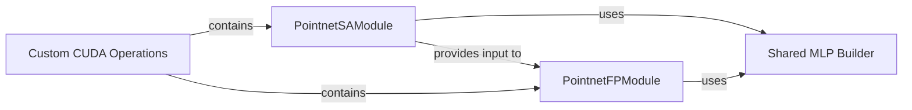

## Details

This subsystem provides highly optimized, low-level computational primitives essential for efficient point cloud processing within the PointNet++ Model Architecture. It encapsulates performance-critical operations that leverage CUDA for accelerated feature extraction and propagation.

### Custom CUDA Operations [[Expand]](./Custom_CUDA_Operations.md)
The overarching conceptual component representing the collection of highly optimized, low-level computational primitives for point cloud processing. These operations are critical for performance and are directly utilized by the PointNet++ Model Architecture for efficient feature extraction and manipulation.

**Related Classes/Methods**:

- <a href="https://github.com/erikwijmans/Pointnet2_PyTorch/blob/master/pointnet2_ops_lib/pointnet2_ops/pointnet2_modules.py#L118-L146" target="_blank" rel="noopener noreferrer">`pointnet2_ops_lib.pointnet2_ops.pointnet2_modules.PointnetSAModule`:118-146</a>
- <a href="https://github.com/erikwijmans/Pointnet2_PyTorch/blob/master/pointnet2_ops_lib/pointnet2_ops/pointnet2_modules.py#L149-L209" target="_blank" rel="noopener noreferrer">`pointnet2_ops_lib.pointnet2_ops.pointnet2_modules.PointnetFPModule`:149-209</a>
- <a href="https://github.com/erikwijmans/Pointnet2_PyTorch/blob/master/pointnet2_ops_lib/pointnet2_ops/pointnet2_modules.py#L9-L19" target="_blank" rel="noopener noreferrer">`pointnet2_ops_lib.pointnet2_ops.pointnet2_modules.build_shared_mlp`:9-19</a>

### PointnetSAModule
A core module responsible for Set Abstraction (SA) operations. This involves sampling points from a point cloud, grouping them based on proximity, and then abstracting features from these local groups. It is a fundamental step in hierarchical feature learning for point clouds, reducing point density while enriching features.

**Related Classes/Methods**:

- <a href="https://github.com/erikwijmans/Pointnet2_PyTorch/blob/master/pointnet2_ops_lib/pointnet2_ops/pointnet2_modules.py#L118-L146" target="_blank" rel="noopener noreferrer">`pointnet2_ops_lib.pointnet2_ops.pointnet2_modules.PointnetSAModule`:118-146</a>

### PointnetFPModule
A core module responsible for Feature Propagation (FP) operations. This module interpolates features from a coarser (downsampled) set of points to a finer (original or upsampled) set of points. It effectively propagates contextual information learned at higher levels of abstraction back to individual points, enabling dense predictions.

**Related Classes/Methods**:

- <a href="https://github.com/erikwijmans/Pointnet2_PyTorch/blob/master/pointnet2_ops_lib/pointnet2_ops/pointnet2_modules.py#L149-L209" target="_blank" rel="noopener noreferrer">`pointnet2_ops_lib.pointnet2_ops.pointnet2_modules.PointnetFPModule`:149-209</a>

### Shared MLP Builder
A utility function for constructing shared Multi-Layer Perceptron (MLP) blocks. These MLPs are common, reusable components for learning non-linear transformations of features within the PointNet++ architecture, used across various modules for feature processing.

**Related Classes/Methods**:

- <a href="https://github.com/erikwijmans/Pointnet2_PyTorch/blob/master/pointnet2_ops_lib/pointnet2_ops/pointnet2_modules.py#L9-L19" target="_blank" rel="noopener noreferrer">`pointnet2_ops_lib.pointnet2_ops.pointnet2_modules.build_shared_mlp`:9-19</a>

### [FAQ](https://github.com/CodeBoarding/GeneratedOnBoardings/tree/main?tab=readme-ov-file#faq)