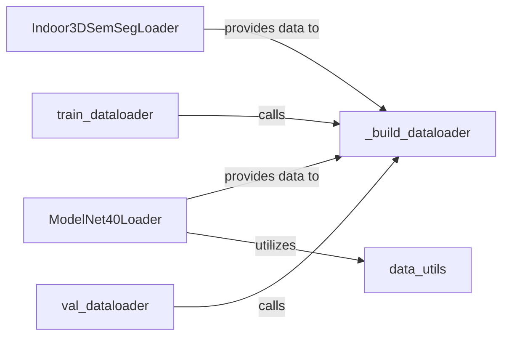

## Details

This subsystem is primarily responsible for efficient data loading and preprocessing for 3D point cloud datasets, specifically for the Indoor3D Semantic Segmentation and ModelNet40 datasets. The `Indoor3DSemSegLoader` and `ModelNet40Loader` components act as specialized data providers, each handling the unique aspects of their respective datasets. The `data_utils` component offers reusable data augmentation and normalization functionalities, which are leveraged by the dataset loaders. The central `_build_dataloader` function standardizes the creation of PyTorch `DataLoader` instances, ensuring consistent batching and shuffling. Finally, `train_dataloader` and `val_dataloader` serve as orchestrators, initiating the data pipelines for training and validation phases by utilizing `_build_dataloader`. This modular design ensures clear separation of concerns, allowing for easy integration of new datasets and flexible data processing workflows.

### Indoor3DSemSegLoader
Specializes in loading and initial processing of the Indoor3D Semantic Segmentation dataset. It handles dataset-specific file parsing and data retrieval, acting as a concrete implementation of a dataset interface.

**Related Classes/Methods**:

- <a href="https://github.com/erikwijmans/Pointnet2_PyTorch/blob/master/pointnet2/data/Indoor3DSemSegLoader.py" target="_blank" rel="noopener noreferrer">`pointnet2.data.Indoor3DSemSeg`</a>

### ModelNet40Loader
Specializes in loading and initial preprocessing of the ModelNet40 dataset. It includes methods for setting the number of points and performing point cloud normalization (`pc_normalize`), serving as another concrete dataset loader.

**Related Classes/Methods**:

- <a href="https://github.com/erikwijmans/Pointnet2_PyTorch/blob/master/pointnet2/data/ModelNet40Loader.py" target="_blank" rel="noopener noreferrer">`pointnet2.data.ModelNet40Cls`</a>

### data_utils
A utility module providing generic functions for common data augmentation (e.g., `_get_angles`, `angle_axis`) and normalization operations. These functions are designed to be reusable across different datasets and loaders.

**Related Classes/Methods**:

- <a href="https://github.com/erikwijmans/Pointnet2_PyTorch/blob/master/pointnet2/data/data_utils.py" target="_blank" rel="noopener noreferrer">`data_utils`</a>

### _build_dataloader
A core helper function that encapsulates the common logic for constructing PyTorch `DataLoader` instances. It takes processed datasets (from `Indoor3DSemSegLoader` or `ModelNet40Loader`) and configures batching, shuffling, and other DataLoader parameters, centralizing data batching logic.

**Related Classes/Methods**:

- <a href="https://github.com/erikwijmans/Pointnet2_PyTorch/blob/master/pointnet2/models/pointnet2_ssg_cls.py#L216-L224" target="_blank" rel="noopener noreferrer">`_build_dataloader`:216-224</a>

### train_dataloader
Orchestrates the creation of the training data pipeline. It configures and invokes `_build_dataloader` to produce the `DataLoader` for the training phase, potentially integrating data augmentation steps. This component acts as the entry point for training data access.

**Related Classes/Methods**:

- <a href="https://github.com/erikwijmans/Pointnet2_PyTorch/blob/master/pointnet2/models/pointnet2_ssg_cls.py#L226-L227" target="_blank" rel="noopener noreferrer">`train_dataloader`:226-227</a>

### val_dataloader
Orchestrates the creation of the validation data pipeline. Similar to `train_dataloader`, it configures and invokes `_build_dataloader` for the validation phase. This component acts as the entry point for validation data access.

**Related Classes/Methods**:

- <a href="https://github.com/erikwijmans/Pointnet2_PyTorch/blob/master/pointnet2/models/pointnet2_ssg_cls.py#L229-L230" target="_blank" rel="noopener noreferrer">`val_dataloader`:229-230</a>

### [FAQ](https://github.com/CodeBoarding/GeneratedOnBoardings/tree/main?tab=readme-ov-file#faq)