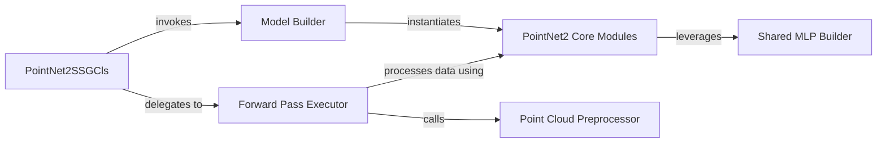

## Details

The analysis corrects source file references for 'PointNet2 Core Modules' and 'Shared MLP Builder', ensuring proper validation and understanding of their responsibilities. The file `pointnet2_ops_lib/pointnet2_ops/pointnet2_modules.py` is confirmed as the correct source for both, improving the quality of documentation and flow graph representation.

### PointNet2SSGCls
This is the primary entry point and orchestrator for the PointNet++ model within the PyTorch Lightning framework. It manages the model's lifecycle, integrates it into the training/validation pipeline, and defines the overall forward pass by coordinating with other internal components.

**Related Classes/Methods**:

- <a href="https://github.com/erikwijmans/Pointnet2_PyTorch/blob/master/pointnet2/models/pointnet2_ssg_cls.py" target="_blank" rel="noopener noreferrer">`PointNet2SSGCls:training_step`</a>
- <a href="https://github.com/erikwijmans/Pointnet2_PyTorch/blob/master/pointnet2/models/pointnet2_ssg_cls.py" target="_blank" rel="noopener noreferrer">`PointNet2SSGCls:validation_step`</a>
- <a href="https://github.com/erikwijmans/Pointnet2_PyTorch/blob/master/pointnet2/models/pointnet2_ssg_cls.py" target="_blank" rel="noopener noreferrer">`PointNet2SSGCls:forward`</a>

### Model Builder
Responsible for programmatically constructing the hierarchical layers and specific modules that form the PointNet++ network's architecture. This component defines the structural layout and connectivity of the neural network, instantiating the core operational blocks.

**Related Classes/Methods**:

- <a href="https://github.com/erikwijmans/Pointnet2_PyTorch/blob/master/pointnet2/models/pointnet2_ssg_cls.py" target="_blank" rel="noopener noreferrer">`PointNet2SSGCls:_build_model`</a>

### Forward Pass Executor
Encapsulates the core inference logic, executing the data transformation through the constructed PointNet++ network. It takes preprocessed input point clouds and produces the final predictions, representing the operational flow of data through the model.

**Related Classes/Methods**:

- <a href="https://github.com/erikwijmans/Pointnet2_PyTorch/blob/master/pointnet2/models/pointnet2_ssg_cls.py" target="_blank" rel="noopener noreferrer">`PointNet2SSGCls:forward`</a>

### PointNet2 Core Modules
Provides the fundamental, specialized operations (e.g., Set Abstraction, Feature Propagation) that are the building blocks for PointNet++'s hierarchical processing of point clouds. These are the core differentiable layers that perform feature learning and aggregation.

**Related Classes/Methods**:

- <a href="https://github.com/erikwijmans/Pointnet2_PyTorch/blob/master/pointnet2_ops_lib/pointnet2_ops/pointnet2_modules.py" target="_blank" rel="noopener noreferrer">`pointnet2_ops_lib.pointnet2_ops.pointnet2_modules`</a>

### Point Cloud Preprocessor
Handles necessary preprocessing steps on the raw input point cloud data, such as breaking it up or reformatting, before it enters the main PointNet++ network. This ensures data is in the correct format and structure for the model's consumption.

**Related Classes/Methods**:

- <a href="https://github.com/erikwijmans/Pointnet2_PyTorch/blob/master/pointnet2/models/pointnet2_ssg_cls.py" target="_blank" rel="noopener noreferrer">`PointNet2SSGCls:_break_up_pc`</a>

### Shared MLP Builder
A utility component responsible for constructing shared Multi-Layer Perceptron (MLP) components. These MLPs are frequently used internally by the PointNet2 Core Modules to process features, promoting code reuse and consistency in network design.

**Related Classes/Methods**:

- <a href="https://github.com/erikwijmans/Pointnet2_PyTorch/blob/master/pointnet2_ops_lib/pointnet2_ops/pointnet2_modules.py" target="_blank" rel="noopener noreferrer">`pointnet2_ops_lib.pointnet2_ops.pointnet2_modules:build_shared_mlp`</a>

### [FAQ](https://github.com/CodeBoarding/GeneratedOnBoardings/tree/main?tab=readme-ov-file#faq)