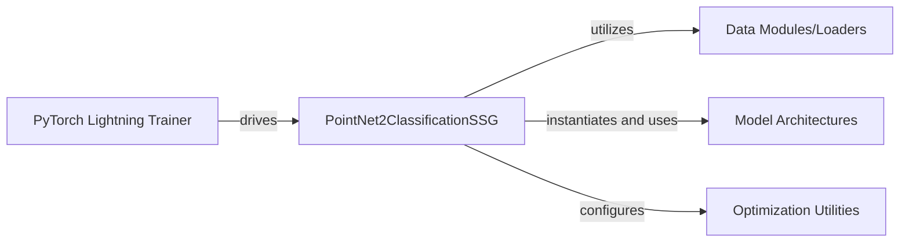

## Details

The PointNet2 classification subsystem is orchestrated by the `PointNet2ClassificationSSG` PyTorch LightningModule, which serves as the central hub for training and evaluation. This module interacts with the `PyTorch Lightning Trainer` to manage the overall training lifecycle, providing specific hooks for training and validation steps. Data flow is handled by `Data Modules/Loaders`, which prepare and deliver batches of point cloud data to `PointNet2ClassificationSSG`. The core neural network logic resides within `Model Architectures`, instantiated and utilized by `PointNet2ClassificationSSG` for forward passes. Finally, `Optimization Utilities` are configured by `PointNet2ClassificationSSG` to manage the learning process through optimizers and learning rate schedulers.

### PointNet2ClassificationSSG
This is the central PyTorch LightningModule that encapsulates the entire training and evaluation logic. It defines the neural network architecture, sets up data loaders, handles forward passes, calculates loss and metrics during training/validation steps, configures optimizers and learning rate schedulers, and aggregates/logs metrics. It acts as the primary interface between the custom model and the PyTorch Lightning Trainer.

**Related Classes/Methods**:

- <a href="https://github.com/erikwijmans/Pointnet2_PyTorch/blob/master/pointnet2/models/pointnet2_ssg_cls.py#L55-L230" target="_blank" rel="noopener noreferrer">`pointnet2.models.pointnet2_ssg_cls.PointNet2ClassificationSSG`:55-230</a>
- <a href="https://github.com/erikwijmans/Pointnet2_PyTorch/blob/master/pointnet2/models/pointnet2_ssg_cls.py#L100-L110" target="_blank" rel="noopener noreferrer">`pointnet2.models.pointnet2_ssg_cls.PointNet2ClassificationSSG:training_step`:100-110</a>
- <a href="https://github.com/erikwijmans/Pointnet2_PyTorch/blob/master/pointnet2/models/pointnet2_ssg_cls.py#L112-L118" target="_blank" rel="noopener noreferrer">`pointnet2.models.pointnet2_ssg_cls.PointNet2ClassificationSSG:validation_step`:112-118</a>
- <a href="https://github.com/erikwijmans/Pointnet2_PyTorch/blob/master/pointnet2/models/pointnet2_ssg_cls.py#L137-L169" target="_blank" rel="noopener noreferrer">`pointnet2.models.pointnet2_ssg_cls.PointNet2ClassificationSSG:configure_optimizers`:137-169</a>
- <a href="https://github.com/erikwijmans/Pointnet2_PyTorch/blob/master/pointnet2/models/pointnet2_ssg_cls.py#L120-L135" target="_blank" rel="noopener noreferrer">`pointnet2.models.pointnet2_ssg_cls.PointNet2ClassificationSSG:validation_end`:120-135</a>
- <a href="https://github.com/erikwijmans/Pointnet2_PyTorch/blob/master/pointnet2/models/pointnet2_ssg_cls.py#L60-L90" target="_blank" rel="noopener noreferrer">`pointnet2.models.pointnet2_ssg_cls.PointNet2ClassificationSSG:_build_model`:60-90</a>
- <a href="https://github.com/erikwijmans/Pointnet2_PyTorch/blob/master/pointnet2/models/pointnet2_ssg_cls.py#L190-L198" target="_blank" rel="noopener noreferrer">`pointnet2.models.pointnet2_ssg_cls.PointNet2ClassificationSSG:_build_dataloader`:190-198</a>

### PyTorch Lightning Trainer
An external component from the PyTorch Lightning framework that drives the training and validation loops. It interacts with the `PointNet2ClassificationSSG` module by calling its defined hooks (e.g., `training_step`, `validation_step`) to execute the training process.

**Related Classes/Methods**: _None_

### Data Modules/Loaders
Responsible for preparing and providing batches of data (point clouds and labels) for both training and validation. These modules abstract the data loading, preprocessing, and batching logic, ensuring efficient data flow to the `PointNet2ClassificationSSG` module.

**Related Classes/Methods**:

- <a href="https://github.com/erikwijmans/Pointnet2_PyTorch/blob/master/pointnet2/models/pointnet2_ssg_cls.py#L171-L188" target="_blank" rel="noopener noreferrer">`pointnet2.models.pointnet2_ssg_cls.PointNet2ClassificationSSG:prepare_data`:171-188</a>
- <a href="https://github.com/erikwijmans/Pointnet2_PyTorch/blob/master/pointnet2/models/pointnet2_ssg_cls.py#L200-L201" target="_blank" rel="noopener noreferrer">`pointnet2.models.pointnet2_ssg_cls.PointNet2ClassificationSSG:train_dataloader`:200-201</a>
- <a href="https://github.com/erikwijmans/Pointnet2_PyTorch/blob/master/pointnet2/models/pointnet2_ssg_cls.py#L203-L204" target="_blank" rel="noopener noreferrer">`pointnet2.models.pointnet2_ssg_cls.PointNet2ClassificationSSG:val_dataloader`:203-204</a>

### Model Architectures
Represents the actual PointNet2 neural network model. This component performs the forward pass, taking input point cloud data and producing predictions. It is instantiated and managed by the `PointNet2ClassificationSSG` module.

**Related Classes/Methods**:

- <a href="https://github.com/erikwijmans/Pointnet2_PyTorch/blob/master/pointnet2/models/pointnet2_ssg_cls.py#L60-L90" target="_blank" rel="noopener noreferrer">`pointnet2.models.pointnet2_ssg_cls.PointNet2ClassificationSSG:_build_model`:60-90</a>

### Optimization Utilities
This component (or set of utilities) handles the configuration and management of optimizers (e.g., Adam, SGD) and learning rate schedulers (e.g., BNMomentumScheduler). It is configured by the `PointNet2ClassificationSSG` module to control the model's learning process.

**Related Classes/Methods**:

- <a href="https://github.com/erikwijmans/Pointnet2_PyTorch/blob/master/pointnet2/models/pointnet2_ssg_cls.py#L137-L169" target="_blank" rel="noopener noreferrer">`pointnet2.models.pointnet2_ssg_cls.PointNet2ClassificationSSG:configure_optimizers`:137-169</a>

### [FAQ](https://github.com/CodeBoarding/GeneratedOnBoardings/tree/main?tab=readme-ov-file#faq)