```mermaid
graph LR
    Configuration_Management["Configuration Management"]
    Data_Loading_and_Preprocessing["Data Loading and Preprocessing"]
    PointNet_Model_Architecture["PointNet++ Model Architecture"]
    Training_and_Evaluation_Orchestration["Training and Evaluation Orchestration"]
    Custom_CUDA_Operations["Custom CUDA Operations"]
    Configuration_Management -- "Provides: Dataset paths, batch sizes, and other data-related configuration parameters." --> Data_Loading_and_Preprocessing
    Configuration_Management -- "Provides: Hyperparameters for optimizers, learning rate schedules, and training epochs." --> Training_and_Evaluation_Orchestration
    Data_Loading_and_Preprocessing -- "Supplies: Prepared batches of point cloud data and corresponding labels." --> Training_and_Evaluation_Orchestration
    Training_and_Evaluation_Orchestration -- "Feeds: Input data batches for forward passes and retrieves model predictions." --> PointNet_Model_Architecture
    Training_and_Evaluation_Orchestration -- "Manages: Model's parameters during optimization." --> PointNet_Model_Architecture
    PointNet_Model_Architecture -- "Utilizes: Specialized, optimized operations for efficient point cloud sampling and feature grouping." --> Custom_CUDA_Operations
    Custom_CUDA_Operations -- "Returns: Processed point cloud features and structures to the model." --> PointNet_Model_Architecture
    click Data_Loading_and_Preprocessing href "https://github.com/CodeBoarding/GeneratedOnBoardings/blob/main/Pointnet2_PyTorch/Data_Loading_and_Preprocessing.md" "Details"
    click PointNet_Model_Architecture href "https://github.com/CodeBoarding/GeneratedOnBoardings/blob/main/Pointnet2_PyTorch/PointNet_Model_Architecture.md" "Details"
    click Training_and_Evaluation_Orchestration href "https://github.com/CodeBoarding/GeneratedOnBoardings/blob/main/Pointnet2_PyTorch/Training_and_Evaluation_Orchestration.md" "Details"
    click Custom_CUDA_Operations href "https://github.com/CodeBoarding/GeneratedOnBoardings/blob/main/Pointnet2_PyTorch/Custom_CUDA_Operations.md" "Details"
```

## Details

The `Pointnet2_PyTorch` project is structured as a modular deep learning pipeline for 3D point cloud processing. The `Configuration Management` component initializes all operational parameters, which are then consumed by the `Data Loading and Preprocessing` module to prepare datasets. The core `Training and Evaluation Orchestration` component, built on PyTorch Lightning, drives the entire training and validation lifecycle, consuming data batches and interacting with the `PointNet++ Model Architecture`. The `PointNet++ Model Architecture` itself leverages highly optimized `Custom CUDA Operations` for performance-critical point cloud manipulations, ensuring efficient feature extraction and prediction generation. This architecture emphasizes a clear flow from configuration to data preparation, model execution, and training orchestration, with specialized low-level operations enhancing performance.

### Configuration Management
Responsible for loading, parsing, and providing application-wide configuration parameters, primarily using Hydra. It sets up essential settings for data handling, model parameters, and training hyperparameters.

**Related Classes/Methods**:

- <a href="https://github.com/erikwijmans/Pointnet2_PyTorch/blob/master/pointnet2/train.py" target="_blank" rel="noopener noreferrer">`pointnet2.train`</a>

### Data Loading and Preprocessing [[Expand]](./Data_Loading_and_Preprocessing.md)
Manages the entire data pipeline, from loading raw 3D point cloud datasets to applying necessary transformations and augmentations. It prepares data batches suitable for model input during training and evaluation.

**Related Classes/Methods**:

- <a href="https://github.com/erikwijmans/Pointnet2_PyTorch/blob/master/pointnet2/data/Indoor3DSemSegLoader.py" target="_blank" rel="noopener noreferrer">`pointnet2.data.Indoor3DSemSegLoader`</a>
- <a href="https://github.com/erikwijmans/Pointnet2_PyTorch/blob/master/pointnet2/data/ModelNet40Loader.py" target="_blank" rel="noopener noreferrer">`pointnet2.data.ModelNet40Loader`</a>
- <a href="https://github.com/erikwijmans/Pointnet2_PyTorch/blob/master/pointnet2/data/data_utils.py" target="_blank" rel="noopener noreferrer">`pointnet2.data.data_utils`</a>
- <a href="https://github.com/erikwijmans/Pointnet2_PyTorch/blob/master/pointnet2/models/pointnet2_ssg_cls.py" target="_blank" rel="noopener noreferrer">`pointnet2.models.pointnet2_ssg_cls:prepare_data`</a>
- <a href="https://github.com/erikwijmans/Pointnet2_PyTorch/blob/master/pointnet2/models/pointnet2_ssg_cls.py" target="_blank" rel="noopener noreferrer">`pointnet2.models.pointnet2_ssg_cls:train_dataloader`</a>
- <a href="https://github.com/erikwijmans/Pointnet2_PyTorch/blob/master/pointnet2/models/pointnet2_ssg_cls.py" target="_blank" rel="noopener noreferrer">`pointnet2.models.pointnet2_ssg_cls:val_dataloader`</a>

### PointNet++ Model Architecture [[Expand]](./PointNet_Model_Architecture.md)
Encapsulates the core neural network definition of PointNet++. This includes the hierarchical feature learning layers (Set Abstraction modules) and the final classification head. It defines how input point clouds are processed to generate predictions.

**Related Classes/Methods**:

- <a href="https://github.com/erikwijmans/Pointnet2_PyTorch/blob/master/pointnet2/models/pointnet2_ssg_cls.py" target="_blank" rel="noopener noreferrer">`pointnet2.models.pointnet2_ssg_cls:_build_model`</a>
- <a href="https://github.com/erikwijmans/Pointnet2_PyTorch/blob/master/pointnet2/models/pointnet2_ssg_cls.py" target="_blank" rel="noopener noreferrer">`pointnet2.models.pointnet2_ssg_cls:forward`</a>

### Training and Evaluation Orchestration [[Expand]](./Training_and_Evaluation_Orchestration.md)
Built upon PyTorch Lightning, this component orchestrates the entire machine learning lifecycle. It manages training and validation loops, calculates loss, computes metrics, handles optimizer configuration, and logs progress. It acts as the central control for the training process.

**Related Classes/Methods**:

- <a href="https://github.com/erikwijmans/Pointnet2_PyTorch/blob/master/pointnet2/models/pointnet2_ssg_cls.py" target="_blank" rel="noopener noreferrer">`pointnet2.models.pointnet2_ssg_cls:PointNet2ClassificationSSG`</a>
- <a href="https://github.com/erikwijmans/Pointnet2_PyTorch/blob/master/pointnet2/models/pointnet2_ssg_cls.py" target="_blank" rel="noopener noreferrer">`pointnet2.models.pointnet2_ssg_cls:training_step`</a>
- <a href="https://github.com/erikwijmans/Pointnet2_PyTorch/blob/master/pointnet2/models/pointnet2_ssg_cls.py" target="_blank" rel="noopener noreferrer">`pointnet2.models.pointnet2_ssg_cls:validation_step`</a>
- <a href="https://github.com/erikwijmans/Pointnet2_PyTorch/blob/master/pointnet2/models/pointnet2_ssg_cls.py" target="_blank" rel="noopener noreferrer">`pointnet2.models.pointnet2_ssg_cls:validation_end`</a>
- <a href="https://github.com/erikwijmans/Pointnet2_PyTorch/blob/master/pointnet2/models/pointnet2_ssg_cls.py" target="_blank" rel="noopener noreferrer">`pointnet2.models.pointnet2_ssg_cls:configure_optimizers`</a>

### Custom CUDA Operations [[Expand]](./Custom_CUDA_Operations.md)
Provides highly optimized, low-level computational primitives for point cloud processing. These operations are critical for performance and are directly utilized by the PointNet++ Model Architecture for efficient feature extraction.

**Related Classes/Methods**:

- <a href="https://github.com/erikwijmans/Pointnet2_PyTorch/blob/master/pointnet2_ops_lib/pointnet2_ops/pointnet2_modules.py" target="_blank" rel="noopener noreferrer">`pointnet2_ops_lib.pointnet2_ops.pointnet2_modules:PointnetSAModule`</a>
- <a href="https://github.com/erikwijmans/Pointnet2_PyTorch/blob/master/pointnet2_ops_lib/pointnet2_ops/pointnet2_modules.py" target="_blank" rel="noopener noreferrer">`pointnet2_ops_lib.pointnet2_ops.pointnet2_modules:PointnetFPModule`</a>

### [FAQ](https://github.com/CodeBoarding/GeneratedOnBoardings/tree/main?tab=readme-ov-file#faq)