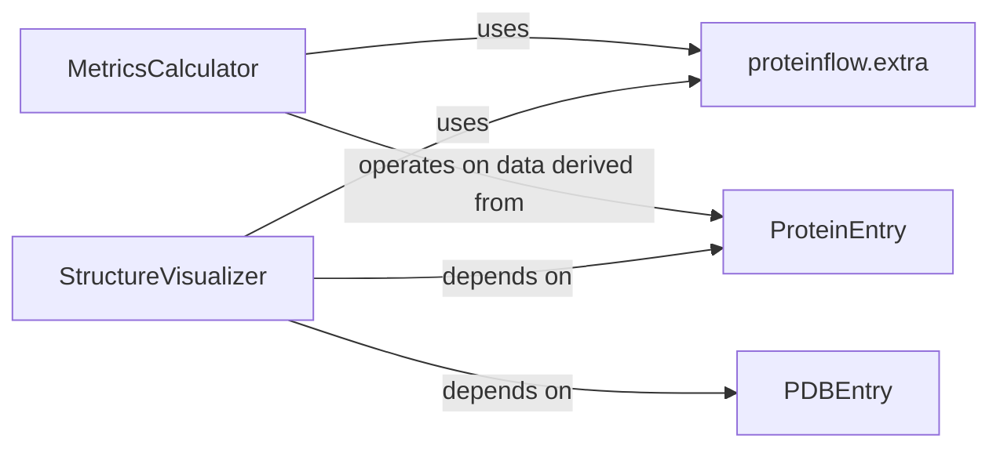

## Component Details

The Analysis & Visualization subsystem is primarily composed of two fundamental components: MetricsCalculator and StructureVisualizer. These components are crucial for evaluating the quality and characteristics of protein data and for providing intuitive visual representations of protein structures, respectively.

### MetricsCalculator
This component provides a suite of functions for quantitatively evaluating protein data, including sequence-based metrics (e.g., BLOSUM62 score, sequence similarity, pseudo log-likelihoods from ESM and AbLang models) and structural metrics (e.g., TM-score, RMSD, SASA). It integrates with external bioinformatics tools and models to perform comprehensive quality assessments.

**Related Classes/Methods**:

- `proteinflow.metrics` (0:0)

### StructureVisualizer
This component is responsible for generating interactive 3D visualizations and animations of protein structures. It can load protein data from various formats (PDB, ProteinFlow's pickle files) and allows for customization of rendering styles, highlighting specific regions, and merging multiple structures for comparative analysis.

**Related Classes/Methods**:

- <a href="https://github.com/adaptyvbio/ProteinFlow/blob/master/proteinflow/visualize.py#L0-L0" target="_blank" rel="noopener noreferrer">`proteinflow.visualize` (0:0)</a>

### proteinflow.extra

**Related Classes/Methods**: _None_

### ProteinEntry

**Related Classes/Methods**: _None_

### PDBEntry

**Related Classes/Methods**: _None_

### [FAQ](https://github.com/CodeBoarding/GeneratedOnBoardings/tree/main?tab=readme-ov-file#faq)