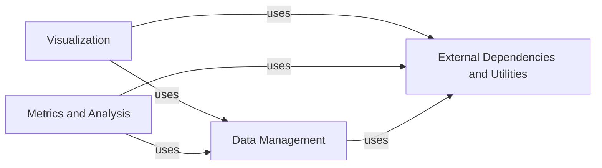

## Details

The `Analysis & Visualization` component, as described, serves as an umbrella for functionalities related to protein metrics, visualization, and the management of their underlying external dependencies. Based on the provided `Analysis summary` and the related classes/methods, this component can be broken down into four fundamental sub-components, each representing a distinct and crucial aspect of the `proteinflow` library. These components are: `Data Management`, `Visualization`, `Metrics and Analysis`, and `External Dependencies and Utilities`.

### Data Management [[Expand]](./Data_Management.md)
This component is responsible for defining and managing the core data structures that represent protein information. It handles the loading of protein entries from various formats, such as PDB files and serialized pickle files, and provides foundational data objects for the entire system. The class hierarchy shows `SAbDabEntry` inheriting from `PDBEntry`, indicating a structured approach to handling different protein data types.

**Related Classes/Methods**:

- `SAbDabEntry` (1:1)
- `PDBEntry` (1:1)

### Visualization [[Expand]](./Visualization.md)
This component focuses on the graphical representation and animation of protein structures. It takes processed protein data and renders it for user viewing, offering functionalities like showing animations from PDB or pickle files, and merging multiple protein structures for combined display.

**Related Classes/Methods**:

- <a href="https://github.com/adaptyvbio/ProteinFlow/proteinflow/visualize.py#L1-L1" target="_blank" rel="noopener noreferrer">`visualize` (1:1)</a>

### Metrics and Analysis
This component offers a comprehensive suite of computational tools for analyzing protein sequences and structures. It includes functions for calculating various biological and structural metrics (e.g., BLOSUM62 score, TM-score, language model perplexity) and integrating with external models for structure generation (e.g., ESMFold, IgFold).

**Related Classes/Methods**:

- `metrics` (1:1)

### External Dependencies and Utilities
This component manages optional external dependencies and provides general utility functions. Its primary roles include checking for the availability of required external packages (`requires_extra`) and facilitating the acquisition of visualization views (`_get_view`). It acts as an abstraction layer, ensuring that core functionalities can gracefully handle optional integrations.

**Related Classes/Methods**:

- `requires_extra` (1:1)
- `_get_view` (1:1)

### [FAQ](https://github.com/CodeBoarding/GeneratedOnBoardings/tree/main?tab=readme-ov-file#faq)