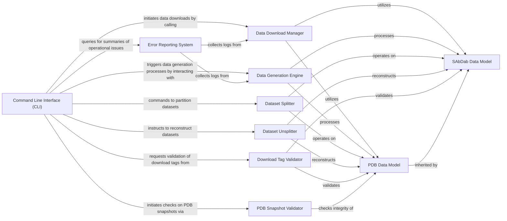

## Component Details

This section provides a detailed overview of the `Command Line Interface (CLI)` component within the `ProteinFlow` library, its structure, flow, purpose, and interactions with other fundamental components.

### Command Line Interface (CLI)
Serves as the primary user-facing component, providing a command-line interface for users to initiate and control various operations within the ProteinFlow library, such as data download, generation, splitting, and other processing tasks. It interprets user commands and orchestrates the execution of core ProteinFlow functionalities.

**Related Classes/Methods**:

- `Command Line Interface (CLI)` (0:0)

### Data Download Manager
Manages the process of fetching raw protein data from external sources (e.g., PDB, SAbDab), ensuring the initial dataset is acquired. It handles the logic for connecting to data repositories and retrieving files.

**Related Classes/Methods**:

- `Data Download Manager` (0:0)

### Data Generation Engine
Responsible for processing raw downloaded data into structured datasets suitable for analysis or model training. This involves parsing, cleaning, and transforming raw protein structures into a usable format.

**Related Classes/Methods**:

- `Data Generation Engine` (0:0)

### Dataset Splitter
Handles the partitioning of processed datasets into subsets (e.g., train, validation, test) crucial for machine learning workflows. It ensures proper data segregation for model development and evaluation.

**Related Classes/Methods**:

- `Dataset Splitter` (0:0)

### Dataset Unsplitter
Reconstructs a complete dataset from its previously split components, providing flexibility in data management and allowing for operations on the full dataset when needed.

**Related Classes/Methods**:

- `Dataset Unsplitter` (0:0)

### Download Tag Validator
Verifies the integrity and correctness of tags associated with downloaded data, ensuring data quality and consistency. This helps in identifying corrupted or incomplete downloads.

**Related Classes/Methods**:

- `Download Tag Validator` (0:0)

### PDB Snapshot Validator
Checks the status and integrity of Protein Data Bank (PDB) database snapshots, which are critical for data currency and reliability. It ensures that the local PDB data is up-to-date and consistent.

**Related Classes/Methods**:

- `PDB Snapshot Validator` (0:0)

### Error Reporting System
Aggregates and summarizes error logs from various operations, providing insights into system operational issues and aiding in debugging and maintenance.

**Related Classes/Methods**:

- `Error Reporting System` (0:0)

### PDB Data Model
Represents the fundamental data structure for Protein Data Bank (PDB) entries, defining how protein structural data (e.g., atoms, residues, chains) is organized and accessed within the library.

**Related Classes/Methods**:

- `PDB Data Model` (0:0)

### SAbDab Data Model
Represents the specialized data structure for SAbDab (Structural Antibody Database) entries, inheriting and extending attributes from the PDB Data Model to include antibody-specific information.

**Related Classes/Methods**:

- `SAbDab Data Model` (0:0)

### [FAQ](https://github.com/CodeBoarding/GeneratedOnBoardings/tree/main?tab=readme-ov-file#faq)