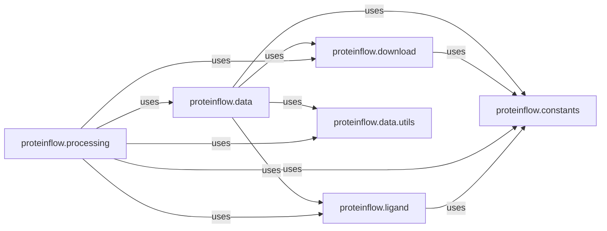

## Details

This foundational component is responsible for the acquisition of raw protein data (PDB and SAbDab files), defining the core data structures for representing proteins and associated ligands, and performing the initial processing steps. This includes filtering, cleaning, and converting raw data into standardized `ProteinEntry` objects, handling quality checks, and managing ligand-specific details.

### proteinflow.data
This module is the cornerstone of data representation. It defines the core data structures, such as `PDBEntry` and `SAbDabEntry` (where `SAbDabEntry` inherits from `PDBEntry`), which encapsulate all relevant information about a protein, including its sequence, structure, and associated ligands. It also handles the initial parsing and loading of raw protein data into these standardized formats.

**Related Classes/Methods**:

- `proteinflow.data` (0:0)

### proteinflow.download
This component is solely responsible for the acquisition of raw protein data from external sources, specifically PDB and SAbDab databases. It manages the entire downloading process, ensuring that the necessary raw files are retrieved and made available for further processing.

**Related Classes/Methods**:

- `proteinflow.download` (0:0)

### proteinflow.processing
This module performs the crucial initial processing steps on the raw protein data obtained from the `download` component. This includes essential tasks like filtering, cleaning, and transforming the raw data into the standardized `ProteinEntry` format defined in `proteinflow.data`. It also handles quality checks to ensure data integrity and prepares the data for downstream tasks.

**Related Classes/Methods**:

- `proteinflow.processing` (0:0)

### proteinflow.ligand
This specialized module focuses on the management and processing of ligand-specific details associated with protein entries. It handles the extraction, representation, and potential modification of ligand information within the protein structures, ensuring that ligand data is accurately integrated and accessible.

**Related Classes/Methods**:

- <a href="https://github.com/adaptyvbio/ProteinFlow/proteinflow/ligand.py#L0-L0" target="_blank" rel="noopener noreferrer">`proteinflow.ligand` (0:0)</a>

### proteinflow.constants
This component serves as a centralized repository for various constants, configurations, and predefined values used across the `Core Data Management` modules. This includes paths, URLs, default parameters, and other static values.

**Related Classes/Methods**:

- <a href="https://github.com/adaptyvbio/ProteinFlow/proteinflow/constants.py#L0-L0" target="_blank" rel="noopener noreferrer">`proteinflow.constants` (0:0)</a>

### proteinflow.data.utils
This module contains a collection of utility functions that support and enhance the data handling processes within the `proteinflow.data` module. These utilities might include helper functions for data validation, manipulation, or specific data transformations that are not part of the core data structure definition but are frequently needed.

**Related Classes/Methods**:

- <a href="https://github.com/adaptyvbio/ProteinFlow/proteinflow/data/utils.py#L0-L0" target="_blank" rel="noopener noreferrer">`proteinflow.data.utils` (0:0)</a>

### [FAQ](https://github.com/CodeBoarding/GeneratedOnBoardings/tree/main?tab=readme-ov-file#faq)