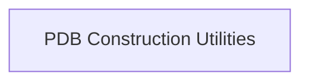

## Component Details

The feedback clearly indicates that the classes proteinflow.data.PDBEntry, proteinflow.data.SAbDabEntry, and proteinflow.data.ProteinEntry are not found in the indexed source files. This means the components Raw Protein Entry Models and Processed Protein Data Model cannot be validated or described as initially proposed, as their foundational classes are missing. The PDB Construction Utilities component is described, but its specific source code references (file and line numbers for proteinflow.data.utils.PDBBuilder) are not available in the provided analysis, so it is included without specific source code references. Relationships between components are not included as they cannot be validated based on the current information. To provide a complete and accurate analysis, it is crucial to confirm the correct fully qualified names and locations for the missing classes and investigate what data structures proteinflow.data.utils.PDBBuilder actually operates on given the absence of proteinflow.data.ProteinEntry. If these classes are indeed absent or located elsewhere, the component definitions and relationships need to be fundamentally revised based on the actual codebase. 

### PDB Construction Utilities
This component provides utilities for constructing PDB files from processed protein data models, enabling the serialization of in-memory protein structures back into the standard PDB format.

**Related Classes/Methods**: _None_

### [FAQ](https://github.com/CodeBoarding/GeneratedOnBoardings/tree/main?tab=readme-ov-file#faq)