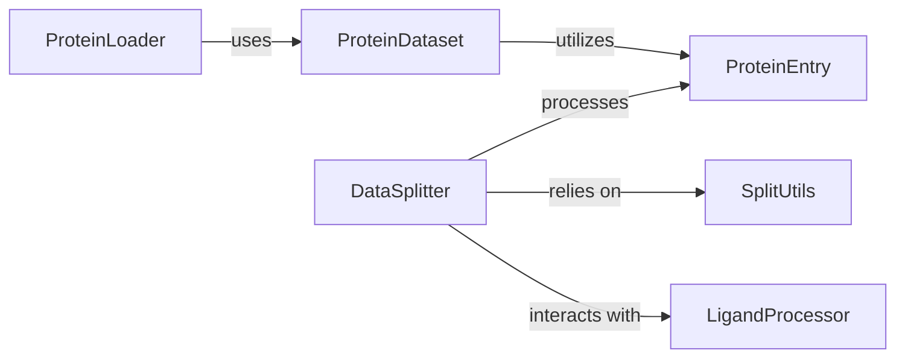

## Component Details

One paragraph explaining the functionality which is represented by this graph. What the main flow is and what is its purpose.

### ProteinEntry
This is the foundational conceptual component representing the fundamental data models for single protein structures or entries. It encapsulates all relevant information about a protein, including its sequence, coordinates, chain IDs, and potentially ligand features. Concrete implementations like `PDBEntry` and `SAbDabEntry` provide methods for extracting specific parts (e.g., CDRs), manipulating the structure (e.g., cutting missing edges, interpolating coordinates), and converting to/from various formats (e.g., pickle, PDB).

**Related Classes/Methods**:

- `proteinflow.processing.ProteinEntry` (1:1)
- `proteinflow.data.PDBEntry` (1:1)
- `proteinflow.data.SAbDabEntry` (1:1)

### ProteinDataset
This component handles the core data processing and transformation of individual protein entries. It performs tasks such as filtering based on various criteria (e.g., chain types, cluster exclusion), processing raw data into a usable format (e.g., PyTorch Geometric graphs), and extracting specific features like CDRs, sequences, and coordinates. It acts as an interface between raw protein data and the `ProteinLoader`.

**Related Classes/Methods**:

- <a href="https://github.com/adaptyvbio/ProteinFlow/blob/master/proteinflow/data/torch.py#L242-L1131" target="_blank" rel="noopener noreferrer">`proteinflow.data.torch.ProteinDataset` (242:1131)</a>

### ProteinLoader
This component is responsible for efficiently loading protein data, typically in batches, for use in deep learning models. It acts as an interface between the processed data from `ProteinDataset` and the model, ensuring data is delivered in a structured and optimized manner, often handling multiprocessing and shuffling.

**Related Classes/Methods**:

- <a href="https://github.com/adaptyvbio/ProteinFlow/blob/master/proteinflow/data/torch.py#L67-L239" target="_blank" rel="noopener noreferrer">`proteinflow.data.torch.ProteinLoader` (67:239)</a>

### DataSplitter
This complex component manages the partitioning of the entire protein dataset into training, validation, and test sets. It employs advanced strategies to ensure a robust split, often considering factors like sequence similarity (using external tools like MMseqs2 or Foldseek), chain interactions, and ligand information to prevent data leakage and ensure generalizability of trained models.

**Related Classes/Methods**:

- `proteinflow.split.DataSplitter` (1:1)

### SplitUtils
This component provides a collection of utility functions that support the `DataSplitter`. These functions handle common tasks required during the splitting process, such as merging protein chains, reading/writing FASTA files, loading PDB structures, and checking the availability of biounits within clusters.

**Related Classes/Methods**:

- <a href="https://github.com/adaptyvbio/ProteinFlow/blob/master/proteinflow/split/utils.py#L1-L1" target="_blank" rel="noopener noreferrer">`proteinflow.split.utils.SplitUtils` (1:1)</a>

### LigandProcessor
This component focuses on operations related to ligands associated with protein structures. It includes functionalities for loading SMILES strings, merging ligand information with protein chains, and performing clustering based on ligand similarity (e.g., Tanimoto clustering).

**Related Classes/Methods**:

- <a href="https://github.com/adaptyvbio/ProteinFlow/blob/master/proteinflow/ligand.py#L1-L1" target="_blank" rel="noopener noreferrer">`proteinflow.ligand.LigandProcessor` (1:1)</a>

### [FAQ](https://github.com/CodeBoarding/GeneratedOnBoardings/tree/main?tab=readme-ov-file#faq)