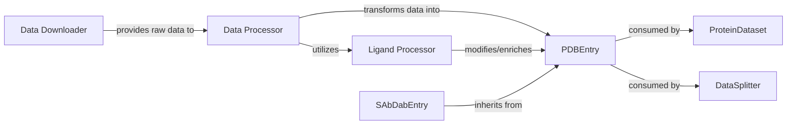

## Component Details

The `Data Pipeline` subsystem is responsible for the initial stages of data handling, from raw data acquisition to the creation of structured protein entries. It encompasses components for downloading, parsing, filtering, and transforming protein and ligand data into a standardized format for further use.

### Data Downloader
This component is solely responsible for retrieving raw protein data files, specifically PDB (Protein Data Bank) and SAbDab (Structural Antibody Database) files, from their respective external repositories. It ensures that the necessary raw input is available for the subsequent processing steps.

**Related Classes/Methods**:

- `Data Downloader` (1:1)

### Data Processor
This is the core processing engine of the pipeline. It takes the raw protein data provided by the `Data Downloader`, performs essential parsing to extract relevant information, applies filtering criteria (e.g., based on chain types or quality), and transforms this raw information into structured `PDBEntry` objects. It orchestrates the integration of ligand-specific data processing by utilizing the `Ligand Processor`.

**Related Classes/Methods**:

- `Data Processor` (1:1)

### Ligand Processor
This specialized component handles all operations related to ligands associated with protein structures. Its functionalities include loading SMILES strings, merging ligand information with protein chains, and performing clustering based on ligand similarity (e.g., Tanimoto clustering). It acts as a helper for the `Data Processor` when ligand data is present, enriching the `PDBEntry` objects with ligand-specific features.

**Related Classes/Methods**:

- `Ligand Processor` (1:1)

### PDBEntry
This is the fundamental `Core Data Model` representing a single protein structure or entry, primarily derived from PDB files. It encapsulates all relevant information about a protein, including its sequence, atomic coordinates, chain identifiers, and potentially integrated ligand features. It provides methods for accessing specific parts (e.g., CDRs) and manipulating the structure. `SAbDabEntry` inherits from this class, extending its functionality for antibody-specific data.

**Related Classes/Methods**:

- `PDBEntry` (1:1)

### SAbDabEntry
A specialized data model for antibody structures, inheriting directly from `PDBEntry`. It extends the base `PDBEntry` model with specific attributes and methods relevant to SAbDab data, such as detailed antibody chain definitions and numbering schemes. This allows for specialized handling of antibody structures while leveraging the common functionalities of `PDBEntry`.

**Related Classes/Methods**:

- `SAbDabEntry` (1:1)

### [FAQ](https://github.com/CodeBoarding/GeneratedOnBoardings/tree/main?tab=readme-ov-file#faq)