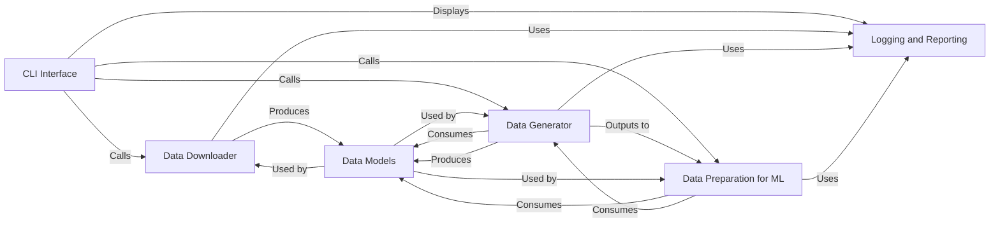

## Details

This section provides a comprehensive overview of the core components within the `ProteinFlow` system, detailing their purpose, key functionalities, and interrelationships. These components are fundamental to the system's operation, covering everything from data acquisition and processing to preparation for machine learning tasks.

### CLI Interface
This component serves as the primary user interface, providing command-line entry points for all major data management operations within the `ProteinFlow` system. It acts as a dispatcher, translating user commands into calls to the appropriate backend functions. It is fundamental as it provides the user-facing control for the entire data pipeline.

**Related Classes/Methods**:

- <a href="https://github.com/adaptyvbio/ProteinFlow/proteinflow/cli.py#L18-L20" target="_blank" rel="noopener noreferrer">`proteinflow.cli` (18:20)</a>

### Data Downloader
Responsible for fetching raw protein data from external sources and performing preliminary checks on the integrity and availability of data tags and PDB snapshots. It handles the low-level details of data retrieval and initial validation. This component is fundamental as it's the initial gateway for bringing external data into the system.

**Related Classes/Methods**:

- `proteinflow.download_data` (1:1)
- `proteinflow.check_download_tags` (1:1)
- `proteinflow.check_pdb_snapshots` (1:1)
- `proteinflow.download` (1:1)
- <a href="https://github.com/adaptyvbio/ProteinFlow/proteinflow/download/boto.py#L1-L1" target="_blank" rel="noopener noreferrer">`proteinflow.download.boto` (1:1)</a>

### Data Generator
Handles the creation or synthesis of protein datasets, involving complex processing or transformations of raw data into a usable format. This component encapsulates the core logic for transforming raw downloaded data into structured protein entries. It is fundamental because it performs the crucial step of converting raw, often heterogeneous, data into a standardized, usable format for downstream tasks.

**Related Classes/Methods**:

- `proteinflow.generate_data` (1:1)
- `proteinflow.processing` (1:1)

### Data Preparation for ML [[Expand]](./Data_Preparation_for_ML.md)
This component is central to preparing processed protein data for machine learning workflows. It focuses on organizing and partitioning the data into distinct train, validation, and test sets, often employing clustering techniques to ensure diverse and representative splits. Additionally, it provides PyTorch-compatible `Dataset` and `DataLoader` classes for efficient batching and preparation of data, making it directly consumable by ML models. This component is fundamental as it bridges the gap between raw/processed data and the requirements of machine learning models, ensuring data is correctly formatted and efficiently accessible for training and evaluation.

**Related Classes/Methods**:

- `proteinflow.split` (1:1)
- `proteinflow.split_data` (1:1)
- `proteinflow.unsplit_data` (1:1)
- <a href="https://github.com/adaptyvbio/ProteinFlow/proteinflow/split/utils.py#L1-L1" target="_blank" rel="noopener noreferrer">`proteinflow.split.utils` (1:1)</a>
- <a href="https://github.com/adaptyvbio/ProteinFlow/proteinflow/data/torch.py#L1-L1" target="_blank" rel="noopener noreferrer">`proteinflow.data.torch` (1:1)</a>

### Data Models
Defines the foundational data structures for representing protein entries throughout the `ProteinFlow` system. `PDBEntry` serves as a base, while `SAbDabEntry` extends it for specific antibody-related data, showcasing an inheritance relationship. These models ensure data consistency and interoperability across components. This component is fundamental because it provides the consistent schema and structure for all data processed and exchanged within the system, ensuring data integrity and facilitating seamless interaction between other components.

**Related Classes/Methods**:

- `proteinflow.data.PDBEntry` (1:1)
- `proteinflow.data.SAbDabEntry` (1:1)
- `proteinflow.data` (1:1)

### Logging and Reporting
Provides utilities for aggregating and summarizing operational logs, particularly focusing on errors encountered during data processing. This component is crucial for debugging, monitoring system health, and ensuring data quality throughout the pipeline. It is fundamental for system observability, allowing developers and users to track progress, identify issues, and understand the overall health of data processing operations.

**Related Classes/Methods**:

- `proteinflow.logging.get_error_summary` (1:1)
- `proteinflow.logging` (1:1)

### [FAQ](https://github.com/CodeBoarding/GeneratedOnBoardings/tree/main?tab=readme-ov-file#faq)