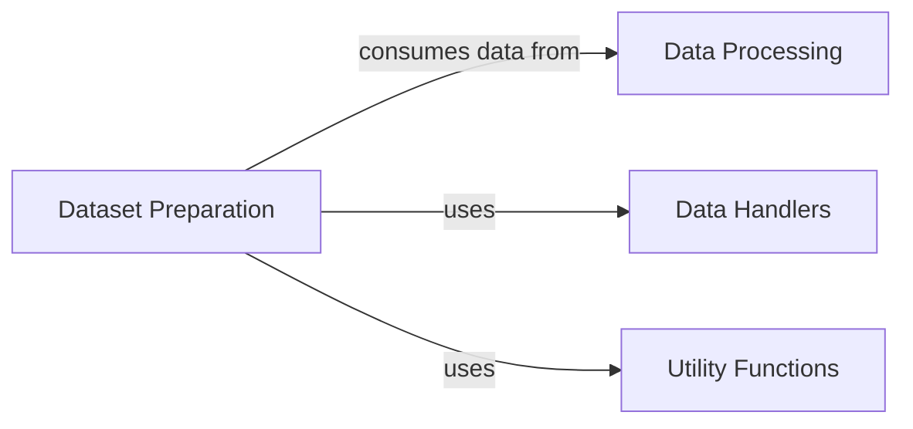

## Component Details

Analysis of the components and their relationships within a protein data processing and machine learning pipeline.

### Dataset Preparation
Manages the organization of processed protein data into machine learning-ready datasets. This includes splitting data into training, validation, and test sets using clustering algorithms (e.g., MMseqs2, Foldseek, Tanimoto) to ensure diversity and prevent data leakage, and providing PyTorch-compatible data loaders for efficient model training. It also handles ligand data during splitting.

**Related Classes/Methods**:

- `proteinflow.split` (1:1)
- <a href="https://github.com/adaptyvbio/ProteinFlow/blob/master/proteinflow/split/utils.py#L1-L1" target="_blank" rel="noopener noreferrer">`proteinflow.split.utils` (1:1)</a>
- <a href="https://github.com/adaptyvbio/ProteinFlow/blob/master/proteinflow/data/torch.py#L1-L1" target="_blank" rel="noopener noreferrer">`proteinflow.data.torch` (1:1)</a>

### Data Handlers
This component is responsible for the ingestion, parsing, and management of protein structural data from various file formats (e.g., PDB, pickle). It defines core data structures (PDBEntry, ProteinEntry, SAbDabEntry) and handles basic data utilities.

**Related Classes/Methods**:

- `proteinflow.data` (1:1)
- `proteinflow.data.PDBEntry` (1:1)
- `proteinflow.data.ProteinEntry` (1:1)
- `proteinflow.data.SAbDabEntry` (1:1)
- <a href="https://github.com/adaptyvbio/ProteinFlow/blob/master/proteinflow/data/utils.py#L1-L1" target="_blank" rel="noopener noreferrer">`proteinflow.data.utils` (1:1)</a>

### Data Processing
This component handles the initial processing of raw protein and ligand data, preparing it for further analysis or dataset creation. This might involve cleaning, feature extraction, or other transformations.

**Related Classes/Methods**:

- `proteinflow.processing` (1:1)
- <a href="https://github.com/adaptyvbio/ProteinFlow/blob/master/proteinflow/ligand.py#L1-L1" target="_blank" rel="noopener noreferrer">`proteinflow.ligand` (1:1)</a>

### Utility Functions
This component provides a set of general-purpose helper functions that support the operations of other components. This includes functionalities like managing external software dependencies, providing constants, and general data utilities (e.g., logging).

**Related Classes/Methods**:

- <a href="https://github.com/adaptyvbio/ProteinFlow/blob/master/proteinflow/extra.py#L1-L1" target="_blank" rel="noopener noreferrer">`proteinflow.extra` (1:1)</a>
- <a href="https://github.com/adaptyvbio/ProteinFlow/blob/master/proteinflow/constants.py#L1-L1" target="_blank" rel="noopener noreferrer">`proteinflow.constants` (1:1)</a>
- `proteinflow.logging` (1:1)

### [FAQ](https://github.com/CodeBoarding/GeneratedOnBoardings/tree/main?tab=readme-ov-file#faq)