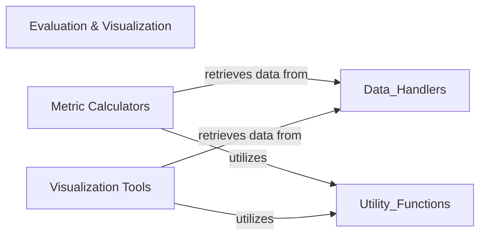

## Component Details

This overarching component provides a comprehensive suite of tools for both quantitative assessment and qualitative visualization of protein structures and sequences. It integrates functionalities for calculating various metrics and for rendering interactive protein models, facilitating in-depth analysis and interpretation of protein data.

### Evaluation & Visualization
This overarching component provides a comprehensive suite of tools for both quantitative assessment and qualitative visualization of protein structures and sequences. It integrates functionalities for calculating various metrics and for rendering interactive protein models, facilitating in-depth analysis and interpretation of protein data.

**Related Classes/Methods**:

- `proteinflow.metrics` (1:1)
- <a href="https://github.com/adaptyvbio/ProteinFlow/blob/master/proteinflow/visualize.py#L1-L1" target="_blank" rel="noopener noreferrer">`proteinflow.visualize` (1:1)</a>

### Metric Calculators
This sub-component focuses on the quantitative analysis of protein data. It encompasses algorithms and models for computing a diverse range of metrics, including sequence similarity scores (e.g., BLOSUM62), structural alignment scores (e.g., TM-score), and predictions from advanced deep learning models (e.g., ESMFold, IgFold). It processes protein data to derive numerical insights into their properties and relationships.

**Related Classes/Methods**:

- `proteinflow.metrics` (1:1)

### Visualization Tools
This sub-component is dedicated to the graphical representation of protein structures and their dynamic aspects. It takes processed protein data and renders them into interactive 3D models, animations, or other visual formats. This allows for intuitive exploration and qualitative understanding of complex protein geometries, interactions, and conformational changes.

**Related Classes/Methods**:

- <a href="https://github.com/adaptyvbio/ProteinFlow/blob/master/proteinflow/visualize.py#L1-L1" target="_blank" rel="noopener noreferrer">`proteinflow.visualize` (1:1)</a>

### [FAQ](https://github.com/CodeBoarding/GeneratedOnBoardings/tree/main?tab=readme-ov-file#faq)