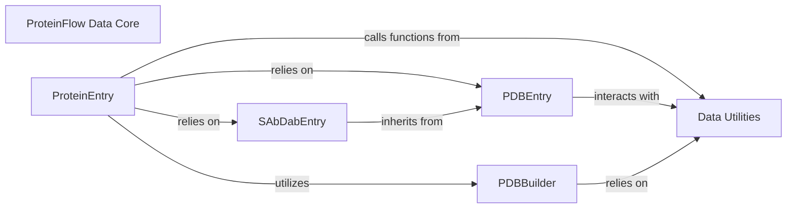

## Component Details

This foundational component defines the core data structures for representing protein and PDB entries, including their sequences, coordinates, and associated metadata. It serves as the central data representation for the entire library, ensuring consistent data handling across all modules.

### ProteinFlow Data Core
This foundational component defines the core data structures for representing protein and PDB entries, including their sequences, coordinates, and associated metadata. It serves as the central data representation for the entire library, ensuring consistent data handling across all modules.

**Related Classes/Methods**:

- `proteinflow.data` (1:1)
- <a href="https://github.com/adaptyvbio/ProteinFlow/blob/master/proteinflow/data/utils.py#L1-L1" target="_blank" rel="noopener noreferrer">`proteinflow.data.utils` (1:1)</a>

### ProteinEntry
This is the central data structure within the `proteinflow.data` module. It encapsulates all relevant information about a protein, including its sequence, atomic coordinates, masks, and CDR regions (if applicable). It provides a rich API for accessing, manipulating, and analyzing this data, supporting operations like interpolation, masking, chain renaming, and calculating structural and sequence-based metrics. It acts as the unified representation for protein data processed by the library.

**Related Classes/Methods**:

- `proteinflow.data.protein_entry.ProteinEntry` (1:1)

### PDBEntry
This class is responsible for parsing and extracting structural and sequence information from PDB (Protein Data Bank) files. It handles the low-level details of reading PDB and FASTA files and organizing the data into a usable format, serving as a foundational data parser for protein structures.

**Related Classes/Methods**:

- `proteinflow.data.pdb_entry.PDBEntry` (1:1)

### SAbDabEntry
A specialized subclass of `PDBEntry` designed specifically for handling antibody structures from the SAbDab database. It extends the functionality of `PDBEntry` to include antibody-specific features such as identifying heavy and light chains, antigen chains, and CDR (Complementarity Determining Region) loops, providing specialized parsing and data representation for antibodies.

**Related Classes/Methods**:

- `proteinflow.data.sabdab_entry.SAbDabEntry` (1:1)

### PDBBuilder
This utility class is dedicated to constructing a valid PDB formatted string from structured protein data. It handles the formatting of atom lines, header information, and sequence records to generate a complete PDB file content, enabling the serialization of `ProteinEntry` data back into PDB format.

**Related Classes/Methods**:

- <a href="https://github.com/adaptyvbio/ProteinFlow/blob/master/proteinflow/data/utils.py#L22-L260" target="_blank" rel="noopener noreferrer">`proteinflow.data.utils.PDBBuilder` (22:260)</a>

### Data Utilities
This module contains a collection of helper functions and smaller utility classes that support the core data structures and operations within the `proteinflow.data` subsystem. These utilities perform tasks such as splitting sequences, retrieving chain names, calculating dihedral angles, annotating secondary structures, and handling PDB-related errors, providing foundational support for data manipulation and processing.

**Related Classes/Methods**:

- <a href="https://github.com/adaptyvbio/ProteinFlow/blob/master/proteinflow/data/utils.py#L1-L1" target="_blank" rel="noopener noreferrer">`proteinflow.data.utils` (1:1)</a>

### [FAQ](https://github.com/CodeBoarding/GeneratedOnBoardings/tree/main?tab=readme-ov-file#faq)