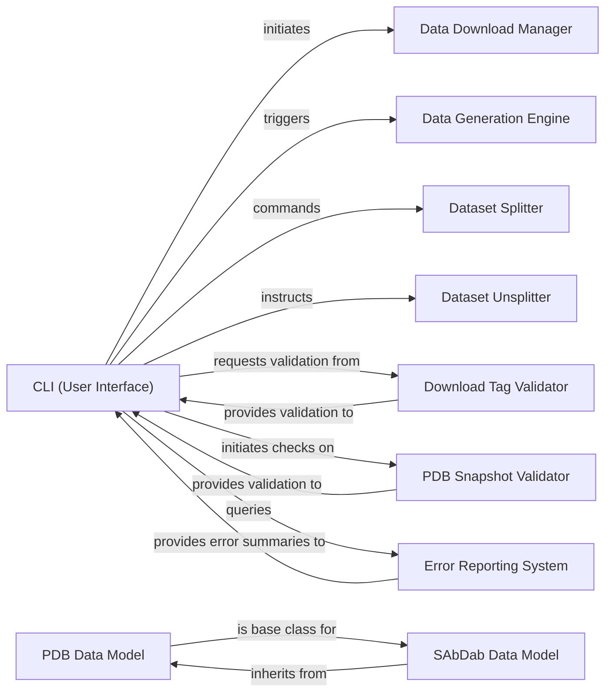

## Component Details

The `CLI (User Interface)` component serves as the primary command-line interface for users to interact with the ProteinFlow library. It acts as the central orchestrator, interpreting user commands and initiating various core operations such as data downloading, processing, generation, splitting, and retrieving summaries. It also enables users to trigger evaluation and visualization tasks, making it the gateway for all user-driven functionalities within ProteinFlow.

### CLI (User Interface)
The main command-line interface that parses user input and dispatches commands to the appropriate backend functionalities. It provides the user-facing entry point for all ProteinFlow operations.

**Related Classes/Methods**:

- <a href="https://github.com/adaptyvbio/ProteinFlow/blob/master/proteinflow/cli.py#L18-L20" target="_blank" rel="noopener noreferrer">`proteinflow.cli.cli` (18:20)</a>

### Data Download Manager
Manages the process of fetching raw protein data from external sources, ensuring the initial dataset is acquired and made available for further processing.

**Related Classes/Methods**:

- `proteinflow.download_data` (-1:-1)

### Data Generation Engine
Responsible for processing raw data into structured datasets suitable for analysis or model training, often involving complex transformations and feature engineering.

**Related Classes/Methods**:

- `proteinflow.generate_data` (-1:-1)

### Dataset Splitter
Handles the partitioning of datasets into subsets (e.g., train, validation, test) crucial for machine learning workflows, ensuring proper data segregation for model development and evaluation.

**Related Classes/Methods**:

- `proteinflow.split_data` (-1:-1)

### Dataset Unsplitter
Reconstructs a complete dataset from its previously split components, providing flexibility in data management and allowing for operations on the full dataset.

**Related Classes/Methods**:

- `proteinflow.unsplit_data` (-1:-1)

### Download Tag Validator
Verifies the integrity and correctness of tags associated with downloaded data, ensuring data quality and consistency across the dataset.

**Related Classes/Methods**:

- `proteinflow.check_download_tags` (-1:-1)

### PDB Snapshot Validator
Checks the status and integrity of Protein Data Bank (PDB) database snapshots, which are critical for data currency and reliability in protein structure analysis.

**Related Classes/Methods**:

- `proteinflow.check_pdb_snapshots` (-1:-1)

### Error Reporting System
Aggregates and summarizes error logs, providing insights into system operational issues and aiding in debugging and troubleshooting.

**Related Classes/Methods**:

- `proteinflow.logging.get_error_summary` (-1:-1)

### PDB Data Model
Represents the fundamental data structure for Protein Data Bank (PDB) entries, defining how protein structural data is organized and accessed within the library.

**Related Classes/Methods**:

- `proteinflow.data.PDBEntry` (-1:-1)

### SAbDab Data Model
Represents the data structure for SAbDab (Structural Antibody Database) entries, inheriting specialized attributes and functionalities from the PDB Data Model to handle antibody-specific data.

**Related Classes/Methods**:

- `proteinflow.data.SAbDabEntry` (-1:-1)

### [FAQ](https://github.com/CodeBoarding/GeneratedOnBoardings/tree/main?tab=readme-ov-file#faq)