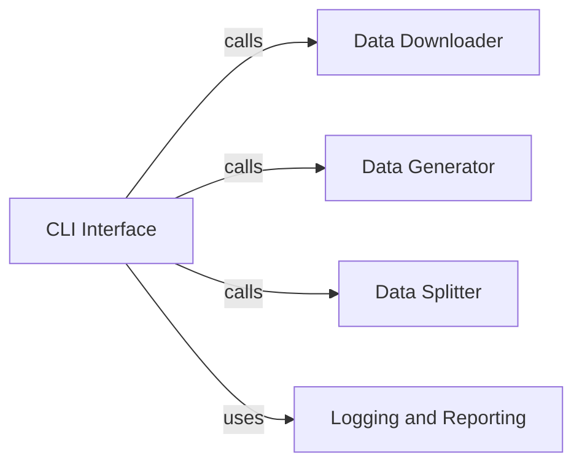

## Details

The CLI Interface is fundamental because it is the user's gateway to the entire ProteinFlow system. Without it, users would not be able to initiate or control any of the data pipeline operations. It abstracts away the underlying complexity of the data processing components, providing a simplified and unified command-line experience. Its role as an orchestrator and dispatcher is critical for coordinating the execution of various data-related tasks (downloading, generating, splitting) in a structured manner. The integration with Logging and Reporting is also vital, as it provides the necessary feedback loop for users to understand the status and outcomes of their initiated processes, making the system robust and user-friendly.

### CLI Interface
The CLI Interface serves as the primary command-line entry point for users to interact with the ProteinFlow data pipeline. Its fundamental role is to orchestrate the entire data processing workflow by translating user commands into specific actions. It acts as a dispatcher, invoking the appropriate backend functions from other core components such as the Data Downloader, Data Generator, and Data Splitter. Furthermore, it integrates with the Logging and Reporting component to provide operational feedback, status updates, and error summaries to the user, ensuring transparency and aiding in debugging. This component is crucial because it provides the user-facing control mechanism, making the complex data pipeline accessible and manageable.

**Related Classes/Methods**:

- <a href="https://github.com/adaptyvbio/ProteinFlow/proteinflow/cli.py#L18-L20" target="_blank" rel="noopener noreferrer">`proteinflow.cli` (18:20)</a>

### Data Downloader
Handles the acquisition of data.

**Related Classes/Methods**: _None_

### Data Generator
Manages the synthesis or transformation of data.

**Related Classes/Methods**: _None_

### Data Splitter
Manages dataset partitioning and re-consolidation.

**Related Classes/Methods**: _None_

### Logging and Reporting
Provides operational feedback, status updates, and error summaries.

**Related Classes/Methods**: _None_

### [FAQ](https://github.com/CodeBoarding/GeneratedOnBoardings/tree/main?tab=readme-ov-file#faq)