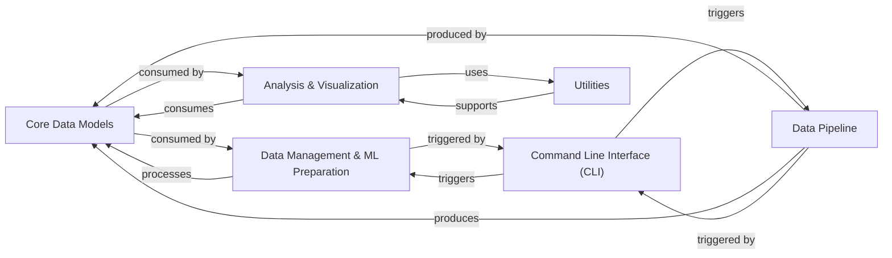

## Component Details

Final Architecture Analysis for `ProteinFlow`

### Core Data Models
This component defines the fundamental data structures for representing protein information within the library. It includes raw PDB entry parsing, the central `ProteinEntry` object which encapsulates processed protein data (sequences, coordinates, features), and utilities for constructing PDB files from these models.

**Related Classes/Methods**:

- `proteinflow.data.ProteinEntry` (0:0)
- `proteinflow.data.PDBEntry` (0:0)
- `proteinflow.data.SAbDabEntry` (0:0)
- <a href="https://github.com/adaptyvbio/ProteinFlow/blob/master/proteinflow/data/utils.py#L22-L260" target="_blank" rel="noopener noreferrer">`proteinflow.data.utils.PDBBuilder` (22:260)</a>

### Data Pipeline
Responsible for the initial stages of data handling, including downloading raw protein data (PDB and SAbDab files), performing essential parsing and filtering, and transforming this raw information into the structured `Core Data Models`. It also incorporates specialized functions for processing ligand-related data.

**Related Classes/Methods**:

- `proteinflow.download` (0:0)
- `proteinflow.processing` (0:0)
- <a href="https://github.com/adaptyvbio/ProteinFlow/blob/master/proteinflow/ligand.py#L0-L0" target="_blank" rel="noopener noreferrer">`proteinflow.ligand` (0:0)</a>

### Data Management & ML Preparation
This component manages the organization of processed protein data. It handles the splitting of data into distinct training, validation, and test sets, and provides PyTorch-compatible mechanisms (`ProteinLoader`, `ProteinDataset`) for efficient loading, batching, and preparing `Core Data Models` for machine learning model training and inference.

**Related Classes/Methods**:

- `proteinflow.split` (0:0)
- <a href="https://github.com/adaptyvbio/ProteinFlow/blob/master/proteinflow/data/torch.py#L67-L239" target="_blank" rel="noopener noreferrer">`proteinflow.data.torch.ProteinLoader` (67:239)</a>
- <a href="https://github.com/adaptyvbio/ProteinFlow/blob/master/proteinflow/data/torch.py#L242-L1131" target="_blank" rel="noopener noreferrer">`proteinflow.data.torch.ProteinDataset` (242:1131)</a>

### Analysis & Visualization
Focuses on the evaluation and visual representation of protein data. It implements various quantitative metrics for assessing the quality and characteristics of protein sequences and structures, and offers functionalities for generating visual representations and animations of protein structures.

**Related Classes/Methods**:

- `proteinflow.metrics` (0:0)
- <a href="https://github.com/adaptyvbio/ProteinFlow/blob/master/proteinflow/visualize.py#L0-L0" target="_blank" rel="noopener noreferrer">`proteinflow.visualize` (0:0)</a>

### Command Line Interface (CLI)
Serves as the primary user-facing component, providing a command-line interface for users to initiate and control various operations within the ProteinFlow library, such as data download, generation, splitting, and other processing tasks.

**Related Classes/Methods**:

- <a href="https://github.com/adaptyvbio/ProteinFlow/blob/master/proteinflow/cli.py#L18-L20" target="_blank" rel="noopener noreferrer">`proteinflow.cli` (18:20)</a>

### Utilities
A collection of supporting modules that centralize project-wide constants (e.g., S3 bucket information, amino acid mappings) and provide general utility functions, including those that might depend on optional external libraries.

**Related Classes/Methods**:

- <a href="https://github.com/adaptyvbio/ProteinFlow/blob/master/proteinflow/constants.py#L0-L0" target="_blank" rel="noopener noreferrer">`proteinflow.constants` (0:0)</a>
- <a href="https://github.com/adaptyvbio/ProteinFlow/blob/master/proteinflow/extra.py#L0-L0" target="_blank" rel="noopener noreferrer">`proteinflow.extra` (0:0)</a>

### [FAQ](https://github.com/CodeBoarding/GeneratedOnBoardings/tree/main?tab=readme-ov-file#faq)