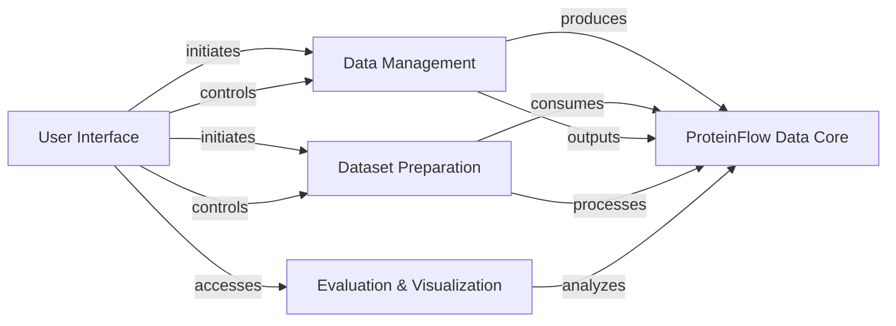

## Component Details

Final high-level architecture analysis for ProteinFlow

### ProteinFlow Data Core
This foundational component defines the core data structures for representing protein and PDB entries, including their sequences, coordinates, and associated metadata. It serves as the central data representation for the entire library, ensuring consistent data handling across all modules.

**Related Classes/Methods**:

- <a href="https://github.com/adaptyvbio/ProteinFlow/blob/master/proteinflow/data/__init__.py#L1-L1" target="_blank" rel="noopener noreferrer">`proteinflow.data.__init__` (1:1)</a>
- <a href="https://github.com/adaptyvbio/ProteinFlow/blob/master/proteinflow/data/utils.py#L1-L1" target="_blank" rel="noopener noreferrer">`proteinflow.data.utils` (1:1)</a>

### Data Management
Handles the entire lifecycle of raw protein data, from downloading and acquisition from external databases (PDB, SAbDab) to comprehensive processing, filtering, error handling, redundancy removal, and specialized ligand processing. It ensures data quality and readiness for subsequent steps.

**Related Classes/Methods**:

- <a href="https://github.com/adaptyvbio/ProteinFlow/blob/master/proteinflow/download/__init__.py#L1-L1" target="_blank" rel="noopener noreferrer">`proteinflow.download.__init__` (1:1)</a>
- <a href="https://github.com/adaptyvbio/ProteinFlow/blob/master/proteinflow/download/boto.py#L1-L1" target="_blank" rel="noopener noreferrer">`proteinflow.download.boto` (1:1)</a>
- <a href="https://github.com/adaptyvbio/ProteinFlow/blob/master/proteinflow/processing/__init__.py#L1-L1" target="_blank" rel="noopener noreferrer">`proteinflow.processing.__init__` (1:1)</a>
- <a href="https://github.com/adaptyvbio/ProteinFlow/blob/master/proteinflow/ligand.py#L1-L1" target="_blank" rel="noopener noreferrer">`proteinflow.ligand` (1:1)</a>

### Dataset Preparation
Manages the organization of processed protein data into machine learning-ready datasets. This includes splitting data into training, validation, and test sets using clustering algorithms (e.g., MMseqs2, Foldseek, Tanimoto) to ensure diversity and prevent data leakage, and providing PyTorch-compatible data loaders for efficient model training.

**Related Classes/Methods**:

- <a href="https://github.com/adaptyvbio/ProteinFlow/blob/master/proteinflow/split/__init__.py#L1-L1" target="_blank" rel="noopener noreferrer">`proteinflow.split.__init__` (1:1)</a>
- <a href="https://github.com/adaptyvbio/ProteinFlow/blob/master/proteinflow/split/utils.py#L1-L1" target="_blank" rel="noopener noreferrer">`proteinflow.split.utils` (1:1)</a>
- <a href="https://github.com/adaptyvbio/ProteinFlow/blob/master/proteinflow/data/torch.py#L1-L1" target="_blank" rel="noopener noreferrer">`proteinflow.data.torch` (1:1)</a>

### Evaluation & Visualization
Provides tools for evaluating protein structures and sequences using various metrics (e.g., BLOSUM62, TM-score, ESMFold) and for visualizing protein structures and animations from PDB files or ProteinEntry objects. It supports analysis and interpretation of protein data.

**Related Classes/Methods**:

- <a href="https://github.com/adaptyvbio/ProteinFlow/blob/master/proteinflow/metrics/__init__.py#L1-L1" target="_blank" rel="noopener noreferrer">`proteinflow.metrics.__init__` (1:1)</a>
- <a href="https://github.com/adaptyvbio/ProteinFlow/blob/master/proteinflow/visualize.py#L1-L1" target="_blank" rel="noopener noreferrer">`proteinflow.visualize` (1:1)</a>

### User Interface
Serves as the primary command-line interface for users to interact with the ProteinFlow library. It enables users to trigger core operations such as data downloading, processing, generation, splitting, and to retrieve summaries and initiate evaluation/visualization tasks.

**Related Classes/Methods**:

- <a href="https://github.com/adaptyvbio/ProteinFlow/blob/master/proteinflow/cli.py#L18-L20" target="_blank" rel="noopener noreferrer">`proteinflow.cli` (18:20)</a>

### [FAQ](https://github.com/CodeBoarding/GeneratedOnBoardings/tree/main?tab=readme-ov-file#faq)