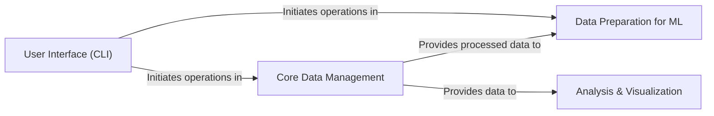

## Details

The `ProteinFlow` project is structured around a streamlined pipeline for acquiring, processing, organizing, and preparing protein data for machine learning tasks, complemented by analysis and visualization capabilities. The architecture is designed to facilitate efficient handling of large biological datasets.

### User Interface (CLI) [[Expand]](./User_Interface_CLI_.md)
The primary command-line interface that serves as the entry point for users to initiate and control the entire data pipeline. It orchestrates the execution of data acquisition, processing, and organization workflows.

**Related Classes/Methods**:

- <a href="https://github.com/adaptyvbio/ProteinFlow/proteinflow/cli.py#L18-L20" target="_blank" rel="noopener noreferrer">`proteinflow.cli` (18:20)</a>

### Core Data Management [[Expand]](./Core_Data_Management.md)
This foundational component is responsible for the acquisition of raw protein data (PDB and SAbDab files), defining the core data structures for representing proteins and associated ligands, and performing the initial processing steps. This includes filtering, cleaning, and converting raw data into standardized `ProteinEntry` objects, handling quality checks, and managing ligand-specific details.

**Related Classes/Methods**:

- `proteinflow.data` (1:1)
- `proteinflow.data.PDBEntry` (1:1)
- `proteinflow.data.SAbDabEntry` (1:1)
- `proteinflow.download` (1:1)
- `proteinflow.processing` (1:1)
- <a href="https://github.com/adaptyvbio/ProteinFlow/proteinflow/ligand.py#L1-L1" target="_blank" rel="noopener noreferrer">`proteinflow.ligand` (1:1)</a>

### Data Preparation for ML [[Expand]](./Data_Preparation_for_ML.md)
Focuses on organizing and partitioning the processed protein data into distinct train, validation, and test sets, often employing clustering techniques to ensure diverse and representative splits. It also provides PyTorch-compatible `Dataset` and `DataLoader` classes for efficient batching and preparation of data, making it ready for machine learning model training and evaluation.

**Related Classes/Methods**:

- `proteinflow.split` (1:1)
- <a href="https://github.com/adaptyvbio/ProteinFlow/proteinflow/data/torch.py#L1-L1" target="_blank" rel="noopener noreferrer">`proteinflow.data.torch` (1:1)</a>

### Analysis & Visualization [[Expand]](./Analysis_Visualization.md)
Offers a comprehensive suite of tools for calculating various protein-related metrics (e.g., sequence similarity, language model perplexity) and for visualizing protein structures and animations. This component also manages optional external dependencies required for its advanced functionalities.

**Related Classes/Methods**:

- `proteinflow.metrics` (1:1)
- <a href="https://github.com/adaptyvbio/ProteinFlow/proteinflow/visualize.py#L1-L1" target="_blank" rel="noopener noreferrer">`proteinflow.visualize` (1:1)</a>
- <a href="https://github.com/adaptyvbio/ProteinFlow/proteinflow/extra.py#L1-L1" target="_blank" rel="noopener noreferrer">`proteinflow.extra` (1:1)</a>

### [FAQ](https://github.com/CodeBoarding/GeneratedOnBoardings/tree/main?tab=readme-ov-file#faq)