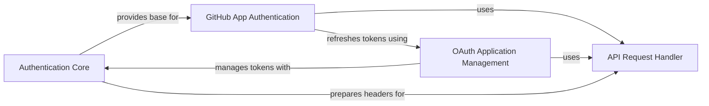

## Component Details

The 'Authentication & Authorization' subsystem is responsible for securing access to the GitHub API by managing various authentication methods and obtaining necessary authorization tokens. It encompasses foundational authentication strategies, specialized flows for GitHub Apps, and management of OAuth applications. This subsystem ensures that all interactions with the GitHub API are properly authenticated and authorized, handling sensitive information securely and providing mechanisms for token generation and refresh.

### Authentication Core
This component provides the foundational classes and methods for various authentication strategies, including basic authentication, token-based authentication, and JWT signing. It serves as the base for more specific authentication flows.

**Related Classes/Methods**:

- <a href="https://github.com/PyGithub/PyGithub/blob/master/github/Auth.py#L57-L96" target="_blank" rel="noopener noreferrer">`PyGithub.github.Auth.Auth` (57:96)</a>
- <a href="https://github.com/PyGithub/PyGithub/blob/master/github/Auth.py#L99-L124" target="_blank" rel="noopener noreferrer">`PyGithub.github.Auth.HTTPBasicAuth` (99:124)</a>
- <a href="https://github.com/PyGithub/PyGithub/blob/master/github/Auth.py#L127-L151" target="_blank" rel="noopener noreferrer">`PyGithub.github.Auth.Login` (127:151)</a>
- <a href="https://github.com/PyGithub/PyGithub/blob/master/github/Auth.py#L154-L174" target="_blank" rel="noopener noreferrer">`PyGithub.github.Auth.Token` (154:174)</a>
- <a href="https://github.com/PyGithub/PyGithub/blob/master/github/Auth.py#L177-L187" target="_blank" rel="noopener noreferrer">`PyGithub.github.Auth.JWT` (177:187)</a>
- <a href="https://github.com/PyGithub/PyGithub/blob/master/github/Auth.py#L190-L200" target="_blank" rel="noopener noreferrer">`PyGithub.github.Auth.JwtSigner` (190:200)</a>
- <a href="https://github.com/PyGithub/PyGithub/blob/master/github/Auth.py#L517-L552" target="_blank" rel="noopener noreferrer">`PyGithub.github.Auth.NetrcAuth` (517:552)</a>

### GitHub App Authentication
This component specializes in managing authentication and authorization for GitHub Apps. It handles the generation of app-specific tokens, installation-level authentication, and user-level authentication within the context of a GitHub App.

**Related Classes/Methods**:

- <a href="https://github.com/PyGithub/PyGithub/blob/master/github/Auth.py#L293-L308" target="_blank" rel="noopener noreferrer">`PyGithub.github.Auth.AppAuthToken` (293:308)</a>
- <a href="https://github.com/PyGithub/PyGithub/blob/master/github/Auth.py#L203-L290" target="_blank" rel="noopener noreferrer">`PyGithub.github.Auth.AppAuth` (203:290)</a>
- <a href="https://github.com/PyGithub/PyGithub/blob/master/github/Auth.py#L311-L392" target="_blank" rel="noopener noreferrer">`PyGithub.github.Auth.AppInstallationAuth` (311:392)</a>
- <a href="https://github.com/PyGithub/PyGithub/blob/master/github/Auth.py#L395-L514" target="_blank" rel="noopener noreferrer">`PyGithub.github.Auth.AppUserAuth` (395:514)</a>
- <a href="https://github.com/PyGithub/PyGithub/blob/master/github/GithubApp.py#L56-L218" target="_blank" rel="noopener noreferrer">`PyGithub.github.GithubApp.GithubApp` (56:218)</a>
- <a href="https://github.com/PyGithub/PyGithub/blob/master/github/GithubIntegration.py#L54-L342" target="_blank" rel="noopener noreferrer">`PyGithub.github.GithubIntegration.GithubIntegration` (54:342)</a>
- <a href="https://github.com/PyGithub/PyGithub/blob/master/github/Installation.py#L76-L280" target="_blank" rel="noopener noreferrer">`PyGithub.github.Installation.Installation` (76:280)</a>
- <a href="https://github.com/PyGithub/PyGithub/blob/master/github/InstallationAuthorization.py#L57-L136" target="_blank" rel="noopener noreferrer">`PyGithub.github.InstallationAuthorization.InstallationAuthorization` (57:136)</a>

### OAuth Application Management
This component is responsible for handling OAuth applications, including managing authorizations and access tokens. It provides functionalities to interact with GitHub's OAuth flow.

**Related Classes/Methods**:

- <a href="https://github.com/PyGithub/PyGithub/blob/master/github/Authorization.py#L53-L191" target="_blank" rel="noopener noreferrer">`PyGithub.github.Authorization.Authorization` (53:191)</a>
- <a href="https://github.com/PyGithub/PyGithub/blob/master/github/AuthorizationApplication.py#L44-L70" target="_blank" rel="noopener noreferrer">`PyGithub.github.AuthorizationApplication.AuthorizationApplication` (44:70)</a>
- <a href="https://github.com/PyGithub/PyGithub/blob/master/github/AccessToken.py#L49-L158" target="_blank" rel="noopener noreferrer">`PyGithub.github.AccessToken.AccessToken` (49:158)</a>
- <a href="https://github.com/PyGithub/PyGithub/blob/master/github/ApplicationOAuth.py#L48-L198" target="_blank" rel="noopener noreferrer">`PyGithub.github.ApplicationOAuth.ApplicationOAuth` (48:198)</a>

### API Request Handler
Responsible for executing HTTP requests to the GitHub API. It manages connection details, headers, and handles retries and error responses. This component is fundamental for all communication with the GitHub platform.

**Related Classes/Methods**:

- <a href="https://github.com/PyGithub/PyGithub/blob/master/github/Requester.py#L287-L1290" target="_blank" rel="noopener noreferrer">`github.Requester.Requester` (287:1290)</a>
- <a href="https://github.com/PyGithub/PyGithub/blob/master/github/Requester.py#L394-L454" target="_blank" rel="noopener noreferrer">`github.Requester.Requester.__init__` (394:454)</a>
- `github.Requester.Requester.request` (full file reference)

### [FAQ](https://github.com/CodeBoarding/GeneratedOnBoardings/tree/main?tab=readme-ov-file#faq)