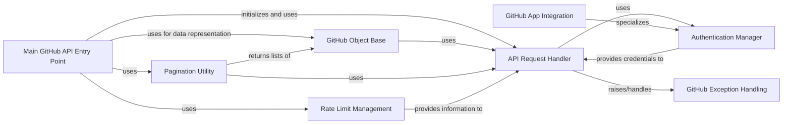

## Component Details

This component provides the foundational elements for interacting with the GitHub API. It includes the main `Github` object, responsible for orchestrating API calls, and the `Requester` which handles the low-level HTTP communication, rate limiting, and error handling. It also includes base classes for all GitHub objects and pagination utilities.

### Main GitHub API Entry Point
This component serves as the primary entry point for interacting with the GitHub API. It initializes the API client with authentication details and provides methods to access various GitHub resources such as users, repositories, organizations, and issues. It orchestrates the communication with the API Request Handler.

**Related Classes/Methods**:

- <a href="https://github.com/PyGithub/PyGithub/blob/master/github/MainClass.py#L157-L1060" target="_blank" rel="noopener noreferrer">`github.MainClass.Github` (157:1060)</a>
- <a href="https://github.com/PyGithub/PyGithub/blob/master/github/MainClass.py#L174-L269" target="_blank" rel="noopener noreferrer">`github.MainClass.Github.__init__` (174:269)</a>
- <a href="https://github.com/PyGithub/PyGithub/blob/master/github/MainClass.py#L393-L408" target="_blank" rel="noopener noreferrer">`github.MainClass.Github.get_user` (393:408)</a>
- <a href="https://github.com/PyGithub/PyGithub/blob/master/github/MainClass.py#L464-L474" target="_blank" rel="noopener noreferrer">`github.MainClass.Github.get_repo` (464:474)</a>
- <a href="https://github.com/PyGithub/PyGithub/blob/master/github/MainClass.py#L430-L437" target="_blank" rel="noopener noreferrer">`github.MainClass.Github.get_organization` (430:437)</a>
- `github.MainClass.Github.get_issue` (full file reference)
- <a href="https://github.com/PyGithub/PyGithub/blob/master/github/MainClass.py#L350-L358" target="_blank" rel="noopener noreferrer">`github.MainClass.Github.get_rate_limit` (350:358)</a>
- `github.MainClass.Github.get_current_user` (full file reference)

### GitHub Object Base
This component acts as the foundational base class for almost all objects retrieved from the GitHub API. It provides common functionalities like attribute access, data parsing, and error handling. It interacts closely with the API Request Handler to fetch and update object data. It also defines the hierarchy for completable and non-completable GitHub objects.

**Related Classes/Methods**:

- <a href="https://github.com/PyGithub/PyGithub/blob/master/github/GithubObject.py#L226-L457" target="_blank" rel="noopener noreferrer">`github.GithubObject.GithubObject` (226:457)</a>
- <a href="https://github.com/PyGithub/PyGithub/blob/master/github/GithubObject.py#L476-L594" target="_blank" rel="noopener noreferrer">`github.GithubObject.CompletableGithubObject` (476:594)</a>
- <a href="https://github.com/PyGithub/PyGithub/blob/master/github/GithubObject.py#L466-L473" target="_blank" rel="noopener noreferrer">`github.GithubObject.NonCompletableGithubObject` (466:473)</a>
- <a href="https://github.com/PyGithub/PyGithub/blob/master/github/GithubObject.py#L249-L262" target="_blank" rel="noopener noreferrer">`github.GithubObject.GithubObject.__init__` (249:262)</a>
- `github.GithubObject.GithubObject._requester` (full file reference)
- `github.GithubObject.GithubObject._url` (full file reference)
- `github.GithubObject.GithubObject._headers` (full file reference)
- `github.GithubObject.GithubObject._rawData` (full file reference)
- `github.GithubObject.GithubObject._identity` (full file reference)
- `github.GithubObject.GithubObject.update` (full file reference)
- <a href="https://github.com/PyGithub/PyGithub/blob/master/github/GithubObject.py#L434-L451" target="_blank" rel="noopener noreferrer">`github.GithubObject.GithubObject.get__repr__` (434:451)</a>

### API Request Handler
This component is responsible for making HTTP requests to the GitHub API. It handles authentication, retries, error responses, and rate limiting. It's a critical component for all communication with the GitHub API, ensuring reliable and authenticated interactions. It also manages the underlying HTTP/HTTPS connections.

**Related Classes/Methods**:

- <a href="https://github.com/PyGithub/PyGithub/blob/master/github/Requester.py#L287-L1290" target="_blank" rel="noopener noreferrer">`github.Requester.Requester` (287:1290)</a>
- <a href="https://github.com/PyGithub/PyGithub/blob/master/github/Requester.py#L150-L220" target="_blank" rel="noopener noreferrer">`github.Requester.HTTPSRequestsConnectionClass` (150:220)</a>
- <a href="https://github.com/PyGithub/PyGithub/blob/master/github/Requester.py#L223-L284" target="_blank" rel="noopener noreferrer">`github.Requester.HTTPRequestsConnectionClass` (223:284)</a>
- <a href="https://github.com/PyGithub/PyGithub/blob/master/github/Requester.py#L394-L454" target="_blank" rel="noopener noreferrer">`github.Requester.Requester.__init__` (394:454)</a>
- <a href="https://github.com/PyGithub/PyGithub/blob/master/github/Requester.py#L601-L629" target="_blank" rel="noopener noreferrer">`github.Requester.Requester.requestJsonAndCheck` (601:629)</a>
- <a href="https://github.com/PyGithub/PyGithub/blob/master/github/Requester.py#L931-L957" target="_blank" rel="noopener noreferrer">`github.Requester.Requester.requestJson` (931:957)</a>
- `github.Requester.Requester.request` (full file reference)
- `github.Requester.Requester.get_and_parse` (full file reference)
- `github.Requester.Requester.post_and_parse` (full file reference)
- `github.Requester.Requester.patch_and_parse` (full file reference)
- `github.Requester.Requester.put_and_parse` (full file reference)
- `github.Requester.Requester.delete_and_parse` (full file reference)

### Authentication Manager
This component manages different authentication methods for accessing the GitHub API, including username/password, OAuth tokens, and GitHub App authentication. It provides the necessary credentials to the API Request Handler for secure communication.

**Related Classes/Methods**:

- <a href="https://github.com/PyGithub/PyGithub/blob/master/github/Auth.py#L57-L96" target="_blank" rel="noopener noreferrer">`github.Auth.Auth` (57:96)</a>
- <a href="https://github.com/PyGithub/PyGithub/blob/master/github/Auth.py#L154-L174" target="_blank" rel="noopener noreferrer">`github.Auth.Token` (154:174)</a>
- <a href="https://github.com/PyGithub/PyGithub/blob/master/github/Auth.py#L203-L290" target="_blank" rel="noopener noreferrer">`github.Auth.AppAuth` (203:290)</a>
- <a href="https://github.com/PyGithub/PyGithub/blob/master/github/Auth.py#L311-L392" target="_blank" rel="noopener noreferrer">`github.Auth.AppInstallationAuth` (311:392)</a>
- `github.Auth.Auth.__init__` (full file reference)
- <a href="https://github.com/PyGithub/PyGithub/blob/master/github/Auth.py#L159-L162" target="_blank" rel="noopener noreferrer">`github.Auth.Token.__init__` (159:162)</a>
- <a href="https://github.com/PyGithub/PyGithub/blob/master/github/Auth.py#L216-L241" target="_blank" rel="noopener noreferrer">`github.Auth.AppAuth.__init__` (216:241)</a>
- <a href="https://github.com/PyGithub/PyGithub/blob/master/github/Auth.py#L323-L342" target="_blank" rel="noopener noreferrer">`github.Auth.AppInstallationAuth.__init__` (323:342)</a>
- <a href="https://github.com/PyGithub/PyGithub/blob/master/github/Auth.py#L99-L124" target="_blank" rel="noopener noreferrer">`github.Auth.HTTPBasicAuth` (99:124)</a>
- <a href="https://github.com/PyGithub/PyGithub/blob/master/github/Auth.py#L127-L151" target="_blank" rel="noopener noreferrer">`github.Auth.Login` (127:151)</a>
- <a href="https://github.com/PyGithub/PyGithub/blob/master/github/Auth.py#L517-L552" target="_blank" rel="noopener noreferrer">`github.Auth.NetrcAuth` (517:552)</a>
- <a href="https://github.com/PyGithub/PyGithub/blob/master/github/Auth.py#L177-L187" target="_blank" rel="noopener noreferrer">`github.Auth.JWT` (177:187)</a>
- <a href="https://github.com/PyGithub/PyGithub/blob/master/github/Auth.py#L293-L308" target="_blank" rel="noopener noreferrer">`github.Auth.AppAuthToken` (293:308)</a>
- <a href="https://github.com/PyGithub/PyGithub/blob/master/github/Auth.py#L395-L514" target="_blank" rel="noopener noreferrer">`github.Auth.AppUserAuth` (395:514)</a>

### GitHub App Integration
This component specifically handles interactions related to GitHub Apps, including generating installation tokens and managing app-specific authentication. It works in conjunction with the Authentication Manager to provide seamless GitHub App functionality.

**Related Classes/Methods**:

- <a href="https://github.com/PyGithub/PyGithub/blob/master/github/GithubIntegration.py#L54-L342" target="_blank" rel="noopener noreferrer">`github.GithubIntegration.GithubIntegration` (54:342)</a>
- <a href="https://github.com/PyGithub/PyGithub/blob/master/github/GithubIntegration.py#L69-L175" target="_blank" rel="noopener noreferrer">`github.GithubIntegration.GithubIntegration.__init__` (69:175)</a>
- <a href="https://github.com/PyGithub/PyGithub/blob/master/github/GithubIntegration.py#L281-L293" target="_blank" rel="noopener noreferrer">`github.GithubIntegration.GithubIntegration.get_installation` (281:293)</a>
- <a href="https://github.com/PyGithub/PyGithub/blob/master/github/GithubIntegration.py#L295-L306" target="_blank" rel="noopener noreferrer">`github.GithubIntegration.GithubIntegration.get_installations` (295:306)</a>
- <a href="https://github.com/PyGithub/PyGithub/blob/master/github/GithubIntegration.py#L254-L278" target="_blank" rel="noopener noreferrer">`github.GithubIntegration.GithubIntegration.get_access_token` (254:278)</a>

### Pagination Utility
This component provides utilities for handling paginated lists of GitHub API resources, allowing efficient retrieval of large datasets.

**Related Classes/Methods**:

- <a href="https://github.com/PyGithub/PyGithub/blob/master/github/PaginatedList.py#L128-L450" target="_blank" rel="noopener noreferrer">`github.PaginatedList.PaginatedList` (128:450)</a>
- <a href="https://github.com/PyGithub/PyGithub/blob/master/github/PaginatedList.py#L62-L125" target="_blank" rel="noopener noreferrer">`github.PaginatedList.PaginatedListBase` (62:125)</a>

### Rate Limit Management
This component is responsible for tracking and managing GitHub API rate limits, providing information about current limits and remaining requests to prevent API abuse.

**Related Classes/Methods**:

- <a href="https://github.com/PyGithub/PyGithub/blob/master/github/Rate.py#L49-L100" target="_blank" rel="noopener noreferrer">`github.Rate.Rate` (49:100)</a>
- <a href="https://github.com/PyGithub/PyGithub/blob/master/github/RateLimit.py#L53-L166" target="_blank" rel="noopener noreferrer">`github.RateLimit.RateLimit` (53:166)</a>
- <a href="https://github.com/PyGithub/PyGithub/blob/master/github/RateLimitOverview.py#L35-L66" target="_blank" rel="noopener noreferrer">`github.RateLimitOverview.RateLimitOverview` (35:66)</a>

### GitHub Exception Handling
This component defines custom exception classes for various GitHub API errors, providing structured error handling for API interactions.

**Related Classes/Methods**:

- <a href="https://github.com/PyGithub/PyGithub/blob/master/github/GithubException.py#L45-L105" target="_blank" rel="noopener noreferrer">`github.GithubException.GithubException` (45:105)</a>
- <a href="https://github.com/PyGithub/PyGithub/blob/master/github/GithubException.py#L108-L111" target="_blank" rel="noopener noreferrer">`github.GithubException.BadCredentialsException` (108:111)</a>
- <a href="https://github.com/PyGithub/PyGithub/blob/master/github/GithubException.py#L120-L124" target="_blank" rel="noopener noreferrer">`github.GithubException.BadUserAgentException` (120:124)</a>
- <a href="https://github.com/PyGithub/PyGithub/blob/master/github/GithubException.py#L189-L192" target="_blank" rel="noopener noreferrer">`github.GithubException.IncompletableObject` (189:192)</a>
- <a href="https://github.com/PyGithub/PyGithub/blob/master/github/GithubException.py#L127-L131" target="_blank" rel="noopener noreferrer">`github.GithubException.RateLimitExceededException` (127:131)</a>
- <a href="https://github.com/PyGithub/PyGithub/blob/master/github/GithubException.py#L183-L186" target="_blank" rel="noopener noreferrer">`github.GithubException.TwoFactorException` (183:186)</a>
- <a href="https://github.com/PyGithub/PyGithub/blob/master/github/GithubException.py#L114-L117" target="_blank" rel="noopener noreferrer">`github.GithubException.UnknownObjectException` (114:117)</a>

### [FAQ](https://github.com/CodeBoarding/GeneratedOnBoardings/tree/main?tab=readme-ov-file#faq)