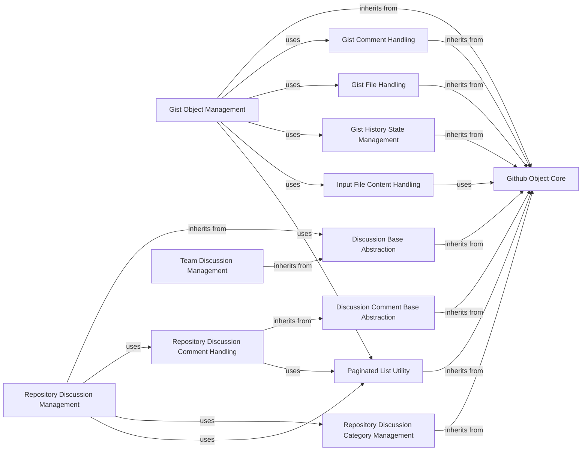

## Component Details

This component provides a comprehensive set of functionalities for managing GitHub Gists and various types of discussions, including those within repositories and teams. It allows for the creation, retrieval, and manipulation of Gists, their comments, files, and historical states. Additionally, it facilitates the management of repository discussions, their comments, and categories, as well as discussions specific to GitHub teams. The component leverages a foundational 'Github Object Core' for attribute handling and 'Paginated List Utility' for efficient data retrieval, building upon abstract base classes for discussions and discussion comments to ensure a consistent structure across different discussion types.

### Gist Object Management
This component provides comprehensive functionalities for creating, retrieving, managing, and interacting with GitHub Gists. It handles core Gist attributes, comments, files, and historical states, and supports operations like forking and editing.

**Related Classes/Methods**:

- <a href="https://github.com/PyGithub/PyGithub/blob/master/github/Gist.py#L67-L336" target="_blank" rel="noopener noreferrer">`PyGithub.github.Gist.Gist` (67:336)</a>
- <a href="https://github.com/PyGithub/PyGithub/blob/master/github/Gist.py#L213-L222" target="_blank" rel="noopener noreferrer">`PyGithub.github.Gist.Gist:create_comment` (213:222)</a>
- <a href="https://github.com/PyGithub/PyGithub/blob/master/github/Gist.py#L224-L229" target="_blank" rel="noopener noreferrer">`PyGithub.github.Gist.Gist:create_fork` (224:229)</a>
- <a href="https://github.com/PyGithub/PyGithub/blob/master/github/Gist.py#L237-L252" target="_blank" rel="noopener noreferrer">`PyGithub.github.Gist.Gist:edit` (237:252)</a>
- <a href="https://github.com/PyGithub/PyGithub/blob/master/github/Gist.py#L254-L260" target="_blank" rel="noopener noreferrer">`PyGithub.github.Gist.Gist:get_comment` (254:260)</a>
- <a href="https://github.com/PyGithub/PyGithub/blob/master/github/Gist.py#L262-L271" target="_blank" rel="noopener noreferrer">`PyGithub.github.Gist.Gist:get_comments` (262:271)</a>
- <a href="https://github.com/PyGithub/PyGithub/blob/master/github/Gist.py#L273-L278" target="_blank" rel="noopener noreferrer">`PyGithub.github.Gist.Gist:is_starred` (273:278)</a>
- <a href="https://github.com/PyGithub/PyGithub/blob/master/github/Gist.py#L280-L284" target="_blank" rel="noopener noreferrer">`PyGithub.github.Gist.Gist:reset_starred` (280:284)</a>
- <a href="https://github.com/PyGithub/PyGithub/blob/master/github/Gist.py#L286-L290" target="_blank" rel="noopener noreferrer">`PyGithub.github.Gist.Gist:set_starred` (286:290)</a>

### Gist Comment Handling
This component specifically manages comments associated with GitHub Gists, allowing for their creation, retrieval, and modification.

**Related Classes/Methods**:

- <a href="https://github.com/PyGithub/PyGithub/blob/master/github/GistComment.py#L53-L151" target="_blank" rel="noopener noreferrer">`PyGithub.github.GistComment.GistComment` (53:151)</a>
- <a href="https://github.com/PyGithub/PyGithub/blob/master/github/GistComment.py#L118-L122" target="_blank" rel="noopener noreferrer">`PyGithub.github.GistComment.GistComment:delete` (118:122)</a>
- <a href="https://github.com/PyGithub/PyGithub/blob/master/github/GistComment.py#L124-L133" target="_blank" rel="noopener noreferrer">`PyGithub.github.GistComment.GistComment:edit` (124:133)</a>

### Gist File Handling
This component represents and manages individual files within a GitHub Gist, providing access to file content, filename, language, raw URL, size, and type.

**Related Classes/Methods**:

- <a href="https://github.com/PyGithub/PyGithub/blob/master/github/GistFile.py#L45-L103" target="_blank" rel="noopener noreferrer">`PyGithub.github.GistFile.GistFile` (45:103)</a>

### Gist History State Management
This component deals with the historical states or versions of a GitHub Gist, including information about changes, comments, and the committed version.

**Related Classes/Methods**:

- <a href="https://github.com/PyGithub/PyGithub/blob/master/github/GistHistoryState.py#L53-L232" target="_blank" rel="noopener noreferrer">`PyGithub.github.GistHistoryState.GistHistoryState` (53:232)</a>

### Repository Discussion Management
This component manages discussions within a GitHub repository, providing functionalities to retrieve comments, labels, and reactions, as well as to add new comments. It extends the Discussion Base Abstraction.

**Related Classes/Methods**:

- <a href="https://github.com/PyGithub/PyGithub/blob/master/github/RepositoryDiscussion.py#L54-L213" target="_blank" rel="noopener noreferrer">`PyGithub.github.RepositoryDiscussion.RepositoryDiscussion` (54:213)</a>
- <a href="https://github.com/PyGithub/PyGithub/blob/master/github/RepositoryDiscussion.py#L108-L150" target="_blank" rel="noopener noreferrer">`PyGithub.github.RepositoryDiscussion.RepositoryDiscussion:get_comments` (108:150)</a>
- <a href="https://github.com/PyGithub/PyGithub/blob/master/github/RepositoryDiscussion.py#L152-L155" target="_blank" rel="noopener noreferrer">`PyGithub.github.RepositoryDiscussion.RepositoryDiscussion:get_labels` (152:155)</a>
- <a href="https://github.com/PyGithub/PyGithub/blob/master/github/RepositoryDiscussion.py#L157-L160" target="_blank" rel="noopener noreferrer">`PyGithub.github.RepositoryDiscussion.RepositoryDiscussion:get_reactions` (157:160)</a>
- <a href="https://github.com/PyGithub/PyGithub/blob/master/github/RepositoryDiscussion.py#L162-L180" target="_blank" rel="noopener noreferrer">`PyGithub.github.RepositoryDiscussion.RepositoryDiscussion:add_comment` (162:180)</a>

### Repository Discussion Comment Handling
This component specifically handles comments associated with repository discussions, offering methods to retrieve reactions and replies to those comments. It extends the Discussion Comment Base Abstraction.

**Related Classes/Methods**:

- <a href="https://github.com/PyGithub/PyGithub/blob/master/github/RepositoryDiscussionComment.py#L46-L149" target="_blank" rel="noopener noreferrer">`PyGithub.github.RepositoryDiscussionComment.RepositoryDiscussionComment` (46:149)</a>
- <a href="https://github.com/PyGithub/PyGithub/blob/master/github/RepositoryDiscussionComment.py#L91-L94" target="_blank" rel="noopener noreferrer">`PyGithub.github.RepositoryDiscussionComment.RepositoryDiscussionComment:get_reactions` (91:94)</a>
- <a href="https://github.com/PyGithub/PyGithub/blob/master/github/RepositoryDiscussionComment.py#L96-L101" target="_blank" rel="noopener noreferrer">`PyGithub.github.RepositoryDiscussionComment.RepositoryDiscussionComment:get_replies` (96:101)</a>
- <a href="https://github.com/PyGithub/PyGithub/blob/master/github/RepositoryDiscussionComment.py#L103-L112" target="_blank" rel="noopener noreferrer">`PyGithub.github.RepositoryDiscussionComment.RepositoryDiscussionComment:edit` (103:112)</a>
- <a href="https://github.com/PyGithub/PyGithub/blob/master/github/RepositoryDiscussionComment.py#L114-L123" target="_blank" rel="noopener noreferrer">`PyGithub.github.RepositoryDiscussionComment.RepositoryDiscussionComment:delete` (114:123)</a>

### Repository Discussion Category Management
This component is responsible for managing categories of discussions within a GitHub repository, including their attributes like creation date, description, emoji, and name.

**Related Classes/Methods**:

- <a href="https://github.com/PyGithub/PyGithub/blob/master/github/RepositoryDiscussionCategory.py#L54-L142" target="_blank" rel="noopener noreferrer">`PyGithub.github.RepositoryDiscussionCategory.RepositoryDiscussionCategory` (54:142)</a>

### Team Discussion Management
This component handles discussions specific to GitHub teams, managing attributes such as body version, comment counts, and various URLs. It extends the Discussion Base Abstraction.

**Related Classes/Methods**:

- <a href="https://github.com/PyGithub/PyGithub/blob/master/github/TeamDiscussion.py#L53-L130" target="_blank" rel="noopener noreferrer">`PyGithub.github.TeamDiscussion.TeamDiscussion` (53:130)</a>

### Input File Content Handling
This component is responsible for managing the content of input files, likely used for operations involving file uploads or content manipulation within Gists or other GitHub entities.

**Related Classes/Methods**:

- <a href="https://github.com/PyGithub/PyGithub/blob/master/github/InputFileContent.py#L44-L62" target="_blank" rel="noopener noreferrer">`PyGithub.github.InputFileContent.InputFileContent` (44:62)</a>

### Github Object Core
This foundational component provides core functionalities for all GitHub API objects, including attribute management (making various types of attributes like datetime, string, boolean, class, int, dict, list), handling optional and defined attributes, completing incomplete objects, and generating string representations. It serves as the base class for most other PyGithub objects.

**Related Classes/Methods**:

- <a href="https://github.com/PyGithub/PyGithub/blob/master/github/GithubObject.py#L226-L457" target="_blank" rel="noopener noreferrer">`github.GithubObject.GithubObject` (226:457)</a>

### Discussion Base Abstraction
This abstract component defines the common structure and basic attributes for various discussion-related entities within GitHub, such as author, body, timestamps, and URLs. It serves as a base for more specific discussion types.

**Related Classes/Methods**:

- <a href="https://github.com/PyGithub/PyGithub/blob/master/github/DiscussionBase.py#L51-L135" target="_blank" rel="noopener noreferrer">`github.DiscussionBase.DiscussionBase` (51:135)</a>

### Discussion Comment Base Abstraction
This abstract component extends the Discussion Base Abstraction to provide common attributes and behaviors specifically for comments on discussions, including author, body, and various timestamps.

**Related Classes/Methods**:

- <a href="https://github.com/PyGithub/PyGithub/blob/master/github/DiscussionCommentBase.py#L51-L135" target="_blank" rel="noopener noreferrer">`github.DiscussionCommentBase.DiscussionCommentBase` (51:135)</a>

### Paginated List Utility
This utility component provides functionality for handling and iterating over paginated lists of results returned from the GitHub API, ensuring efficient retrieval of large datasets.

**Related Classes/Methods**:

- <a href="https://github.com/PyGithub/PyGithub/blob/master/github/PaginatedList.py#L128-L450" target="_blank" rel="noopener noreferrer">`github.PaginatedList.PaginatedList` (128:450)</a>

### [FAQ](https://github.com/CodeBoarding/GeneratedOnBoardings/tree/main?tab=readme-ov-file#faq)