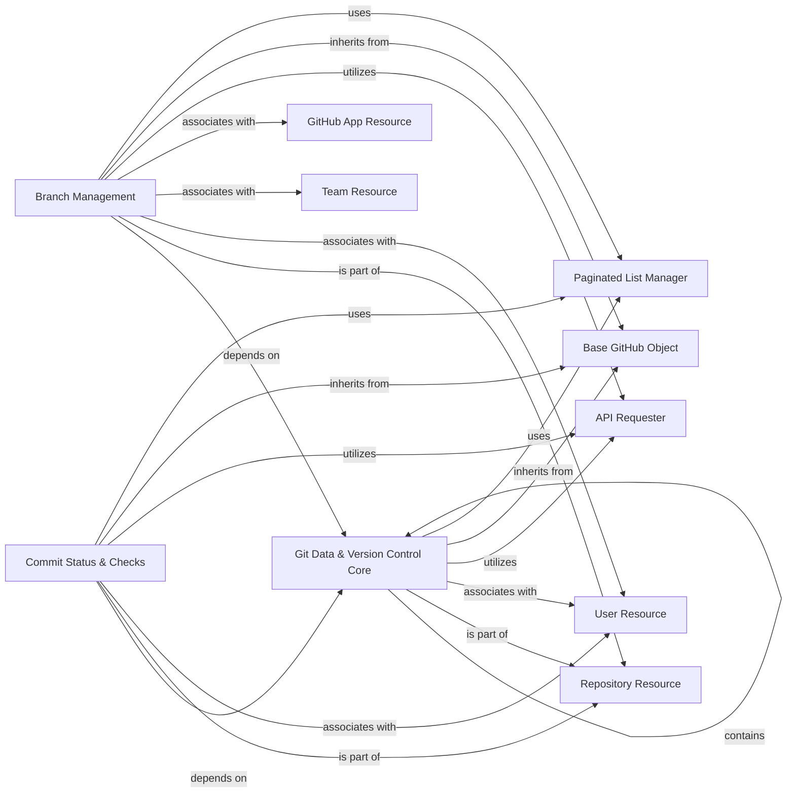

## Component Details

This graph illustrates the structure and interactions of the Git Data & Version Control subsystem within the PyGithub library. The core purpose of this subsystem is to manage various Git-specific objects such as commits, branches, tags, trees, and blobs, along with their associated metadata, statistics, and protection rules. The flow generally involves retrieving or manipulating these Git objects, often in the context of a specific repository, and applying or querying their statuses and protection settings. Interactions with other components facilitate data retrieval, user and team associations, and the underlying API communication.

### Git Data & Version Control Core
Manages the fundamental Git objects within a repository, including commits, blobs, trees, references, and tags, along with their associated metadata and statistics. It provides the basic building blocks for version control operations.

**Related Classes/Methods**:

- <a href="https://github.com/PyGithub/PyGithub/blob/master/github/Commit.py#L82-L361" target="_blank" rel="noopener noreferrer">`PyGithub.github.Commit.Commit` (82:361)</a>
- <a href="https://github.com/PyGithub/PyGithub/blob/master/github/GitCommit.py#L58-L206" target="_blank" rel="noopener noreferrer">`PyGithub.github.GitCommit.GitCommit` (58:206)</a>
- <a href="https://github.com/PyGithub/PyGithub/blob/master/github/GitBlob.py#L47-L104" target="_blank" rel="noopener noreferrer">`PyGithub.github.GitBlob.GitBlob` (47:104)</a>
- <a href="https://github.com/PyGithub/PyGithub/blob/master/github/GitTree.py#L52-L109" target="_blank" rel="noopener noreferrer">`PyGithub.github.GitTree.GitTree` (52:109)</a>
- <a href="https://github.com/PyGithub/PyGithub/blob/master/github/GitRef.py#L54-L119" target="_blank" rel="noopener noreferrer">`PyGithub.github.GitRef.GitRef` (54:119)</a>
- <a href="https://github.com/PyGithub/PyGithub/blob/master/github/Tag.py#L54-L106" target="_blank" rel="noopener noreferrer">`PyGithub.github.Tag.Tag` (54:106)</a>
- <a href="https://github.com/PyGithub/PyGithub/blob/master/github/GitAuthor.py#L46-L91" target="_blank" rel="noopener noreferrer">`PyGithub.github.GitAuthor.GitAuthor` (46:91)</a>
- <a href="https://github.com/PyGithub/PyGithub/blob/master/github/GitCommitVerification.py#L50-L101" target="_blank" rel="noopener noreferrer">`PyGithub.github.GitCommitVerification.GitCommitVerification` (50:101)</a>
- <a href="https://github.com/PyGithub/PyGithub/blob/master/github/GitTreeElement.py#L45-L101" target="_blank" rel="noopener noreferrer">`PyGithub.github.GitTreeElement.GitTreeElement` (45:101)</a>
- <a href="https://github.com/PyGithub/PyGithub/blob/master/github/InputGitTreeElement.py#L43-L78" target="_blank" rel="noopener noreferrer">`PyGithub.github.InputGitTreeElement.InputGitTreeElement` (43:78)</a>
- <a href="https://github.com/PyGithub/PyGithub/blob/master/github/InputGitAuthor.py#L45-L70" target="_blank" rel="noopener noreferrer">`PyGithub.github.InputGitAuthor.InputGitAuthor` (45:70)</a>
- <a href="https://github.com/PyGithub/PyGithub/blob/master/github/CommitStats.py#L42-L75" target="_blank" rel="noopener noreferrer">`PyGithub.github.CommitStats.CommitStats` (42:75)</a>
- <a href="https://github.com/PyGithub/PyGithub/blob/master/github/MergedUpstream.py#L33-L68" target="_blank" rel="noopener noreferrer">`PyGithub.github.MergedUpstream.MergedUpstream` (33:68)</a>

### Branch Management
Handles the representation and management of branches within a repository, including functionalities for branch protection rules, required status checks, and pull request review requirements.

**Related Classes/Methods**:

- <a href="https://github.com/PyGithub/PyGithub/blob/master/github/Branch.py#L83-L659" target="_blank" rel="noopener noreferrer">`PyGithub.github.Branch.Branch` (83:659)</a>
- <a href="https://github.com/PyGithub/PyGithub/blob/master/github/BranchProtection.py#L53-L219" target="_blank" rel="noopener noreferrer">`PyGithub.github.BranchProtection.BranchProtection` (53:219)</a>
- <a href="https://github.com/PyGithub/PyGithub/blob/master/github/RequiredStatusChecks.py#L84-L150" target="_blank" rel="noopener noreferrer">`PyGithub.github.RequiredStatusChecks.RequiredStatusChecks` (84:150)</a>
- <a href="https://github.com/PyGithub/PyGithub/blob/master/github/RequiredStatusChecks.py#L49-L81" target="_blank" rel="noopener noreferrer">`PyGithub.github.RequiredStatusChecks.Check` (49:81)</a>
- <a href="https://github.com/PyGithub/PyGithub/blob/master/github/RequiredPullRequestReviews.py#L167-L264" target="_blank" rel="noopener noreferrer">`PyGithub.github.RequiredPullRequestReviews.RequiredPullRequestReviews` (167:264)</a>
- <a href="https://github.com/PyGithub/PyGithub/blob/master/github/RequiredPullRequestReviews.py#L62-L101" target="_blank" rel="noopener noreferrer">`PyGithub.github.RequiredPullRequestReviews.BypassPullRequestAllowances` (62:101)</a>
- <a href="https://github.com/PyGithub/PyGithub/blob/master/github/RequiredPullRequestReviews.py#L104-L164" target="_blank" rel="noopener noreferrer">`PyGithub.github.RequiredPullRequestReviews.DismissalRestrictions` (104:164)</a>

### Commit Status & Checks
Provides mechanisms for setting and retrieving the status of a commit, including individual statuses and combined statuses from various checks.

**Related Classes/Methods**:

- <a href="https://github.com/PyGithub/PyGithub/blob/master/github/CommitCombinedStatus.py#L51-L114" target="_blank" rel="noopener noreferrer">`PyGithub.github.CommitCombinedStatus.CommitCombinedStatus` (51:114)</a>
- <a href="https://github.com/PyGithub/PyGithub/blob/master/github/CommitStatus.py#L52-L149" target="_blank" rel="noopener noreferrer">`PyGithub.github.CommitStatus.CommitStatus` (52:149)</a>

### Repository Resource
This component models a GitHub repository, providing an object-oriented interface to its properties and actions. It allows for fetching repository details, managing contents, and interacting with other repository-specific features.

**Related Classes/Methods**:

- <a href="https://github.com/PyGithub/PyGithub/blob/master/github/Repository.py#L328-L4656" target="_blank" rel="noopener noreferrer">`github.Repository.Repository` (328:4656)</a>

### User Resource
This component models a GitHub user, providing an object-oriented interface to user profiles, events, and other user-related information. It can represent both authenticated users and named users.

**Related Classes/Methods**:

- <a href="https://github.com/PyGithub/PyGithub/blob/master/github/NamedUser.py#L86-L686" target="_blank" rel="noopener noreferrer">`github.NamedUser.NamedUser` (86:686)</a>
- <a href="https://github.com/PyGithub/PyGithub/blob/master/github/AuthenticatedUser.py#L146-L1178" target="_blank" rel="noopener noreferrer">`github.AuthenticatedUser.AuthenticatedUser` (146:1178)</a>
- <a href="https://github.com/PyGithub/PyGithub/blob/master/github/NamedUser.py#L689-L715" target="_blank" rel="noopener noreferrer">`github.NamedUser.NamedUserSearchResult` (689:715)</a>

### Team Resource
This component models a GitHub team, providing an object-oriented interface to team properties, members, and repositories.

**Related Classes/Methods**:

- <a href="https://github.com/PyGithub/PyGithub/blob/master/github/Team.py#L92-L538" target="_blank" rel="noopener noreferrer">`github.Team.Team` (92:538)</a>

### GitHub App Resource
This component models a GitHub App, providing an object-oriented interface to its properties and functionalities, particularly in the context of permissions and installations.

**Related Classes/Methods**:

- <a href="https://github.com/PyGithub/PyGithub/blob/master/github/GithubApp.py#L56-L218" target="_blank" rel="noopener noreferrer">`github.GithubApp.GithubApp` (56:218)</a>

### API Requester
This component is responsible for handling the low-level HTTP communication with the GitHub API. It manages connection pooling, applies retry logic, handles timeouts, and incorporates authentication details provided by the Authentication Core. It processes requests and returns raw JSON data or headers to the higher-level components.

**Related Classes/Methods**:

- <a href="https://github.com/PyGithub/PyGithub/blob/master/github/Requester.py#L287-L1290" target="_blank" rel="noopener noreferrer">`github.Requester.Requester` (287:1290)</a>

### Base GitHub Object
The foundational class for most objects returned by the PyGithub library. It provides common attributes and methods for GitHub entities, such as access to raw data and headers, and mechanisms for completing lazily loaded object data.

**Related Classes/Methods**:

- <a href="https://github.com/PyGithub/PyGithub/blob/master/github/GithubObject.py#L226-L457" target="_blank" rel="noopener noreferrer">`github.GithubObject.GithubObject` (226:457)</a>
- <a href="https://github.com/PyGithub/PyGithub/blob/master/github/GithubObject.py#L476-L594" target="_blank" rel="noopener noreferrer">`github.GithubObject.CompletableGithubObject` (476:594)</a>
- <a href="https://github.com/PyGithub/PyGithub/blob/master/github/GithubObject.py#L466-L473" target="_blank" rel="noopener noreferrer">`github.GithubObject.NonCompletableGithubObject` (466:473)</a>

### Paginated List Manager
A utility component designed to simplify the handling of paginated responses from the GitHub API. It abstracts away the complexities of fetching subsequent pages of results, allowing other components to iterate over large collections of GitHub objects as if they were a single list.

**Related Classes/Methods**:

- <a href="https://github.com/PyGithub/PyGithub/blob/master/github/PaginatedList.py#L128-L450" target="_blank" rel="noopener noreferrer">`github.PaginatedList.PaginatedList` (128:450)</a>

### [FAQ](https://github.com/CodeBoarding/GeneratedOnBoardings/tree/main?tab=readme-ov-file#faq)