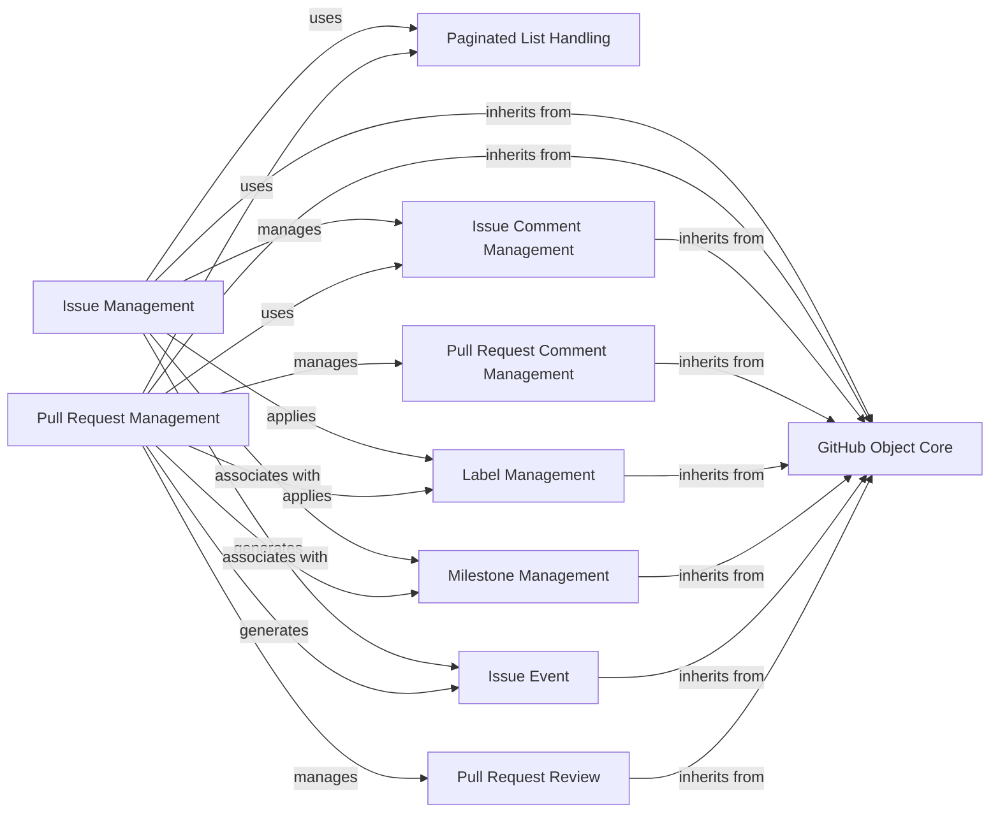

## Component Details

This component overview describes the architecture of the `Issue & Pull Request Management` subsystem within PyGithub. It details how GitHub issues and pull requests, along with their associated entities like comments, labels, milestones, and events, are structured and interact. The core functionality relies on a foundational `GitHub Object Core` for data representation and `Paginated List Handling` for efficient API interaction. Dedicated components manage the lifecycle and operations of issues and pull requests, leveraging shared functionalities for comments, labels, and milestones.

### GitHub Object Core
This foundational component provides the base classes and utilities for representing and managing various GitHub API objects. It includes mechanisms for attribute handling, lazy loading of data, and common object operations, serving as the building block for more specific GitHub object classes.

**Related Classes/Methods**:

- <a href="https://github.com/PyGithub/PyGithub/blob/master/github/GithubObject.py#L226-L457" target="_blank" rel="noopener noreferrer">`github.GithubObject.GithubObject` (226:457)</a>
- <a href="https://github.com/PyGithub/PyGithub/blob/master/github/GithubObject.py#L476-L594" target="_blank" rel="noopener noreferrer">`github.GithubObject.CompletableGithubObject` (476:594)</a>
- <a href="https://github.com/PyGithub/PyGithub/blob/master/github/GithubObject.py#L466-L473" target="_blank" rel="noopener noreferrer">`github.GithubObject.NonCompletableGithubObject` (466:473)</a>
- <a href="https://github.com/PyGithub/PyGithub/blob/master/github/GithubObject.py#L204-L210" target="_blank" rel="noopener noreferrer">`github.GithubObject._ValuedAttribute` (204:210)</a>
- <a href="https://github.com/PyGithub/PyGithub/blob/master/github/GithubObject.py#L114-L124" target="_blank" rel="noopener noreferrer">`github.GithubObject._NotSetType` (114:124)</a>

### Paginated List Handling
This component provides an iterable interface for handling paginated results from the GitHub API. It abstracts away the complexities of pagination, allowing seamless iteration over large datasets from both REST and GraphQL endpoints.

**Related Classes/Methods**:

- <a href="https://github.com/PyGithub/PyGithub/blob/master/github/PaginatedList.py#L128-L450" target="_blank" rel="noopener noreferrer">`github.PaginatedList.PaginatedList` (128:450)</a>
- <a href="https://github.com/PyGithub/PyGithub/blob/master/github/PaginatedList.py#L62-L125" target="_blank" rel="noopener noreferrer">`github.PaginatedList.PaginatedListBase` (62:125)</a>

### Issue Management
This component provides comprehensive functionalities for interacting with GitHub issues, including retrieving details, creating and managing comments, adding/removing assignees and labels, and handling issue events and reactions. It serves as the primary interface for issue-related operations.

**Related Classes/Methods**:

- <a href="https://github.com/PyGithub/PyGithub/blob/master/github/Issue.py#L107-L665" target="_blank" rel="noopener noreferrer">`github.Issue.Issue` (107:665)</a>
- <a href="https://github.com/PyGithub/PyGithub/blob/master/github/Issue.py#L668-L697" target="_blank" rel="noopener noreferrer">`github.Issue.IssueSearchResult` (668:697)</a>
- <a href="https://github.com/PyGithub/PyGithub/blob/master/github/IssuePullRequest.py#L47-L95" target="_blank" rel="noopener noreferrer">`github.IssuePullRequest.IssuePullRequest` (47:95)</a>
- <a href="https://github.com/PyGithub/PyGithub/blob/master/github/Reaction.py#L56-L113" target="_blank" rel="noopener noreferrer">`github.Reaction.Reaction` (56:113)</a>
- <a href="https://github.com/PyGithub/PyGithub/blob/master/github/TimelineEvent.py#L56-L154" target="_blank" rel="noopener noreferrer">`github.TimelineEvent.TimelineEvent` (56:154)</a>

### Pull Request Management
This component handles the management of GitHub Pull Requests. It provides functionalities to retrieve pull request details, create and manage comments and reviews, handle review requests, and perform merge operations. It also interacts with related entities like commits, files, and labels.

**Related Classes/Methods**:

- <a href="https://github.com/PyGithub/PyGithub/blob/master/github/PullRequest.py#L137-L1142" target="_blank" rel="noopener noreferrer">`github.PullRequest.PullRequest` (137:1142)</a>
- <a href="https://github.com/PyGithub/PyGithub/blob/master/github/PullRequestMergeStatus.py#L47-L82" target="_blank" rel="noopener noreferrer">`github.PullRequestMergeStatus.PullRequestMergeStatus` (47:82)</a>
- <a href="https://github.com/PyGithub/PyGithub/blob/master/github/PullRequestPart.py#L53-L107" target="_blank" rel="noopener noreferrer">`github.PullRequestPart.PullRequestPart` (53:107)</a>
- <a href="https://github.com/PyGithub/PyGithub/blob/master/github/Commit.py#L82-L361" target="_blank" rel="noopener noreferrer">`github.Commit.Commit` (82:361)</a>
- <a href="https://github.com/PyGithub/PyGithub/blob/master/github/File.py#L48-L139" target="_blank" rel="noopener noreferrer">`github.File.File` (48:139)</a>
- <a href="https://github.com/PyGithub/PyGithub/blob/master/github/GitRef.py#L54-L119" target="_blank" rel="noopener noreferrer">`github.GitRef.GitRef` (54:119)</a>
- <a href="https://github.com/PyGithub/PyGithub/blob/master/github/NamedUser.py#L86-L686" target="_blank" rel="noopener noreferrer">`github.NamedUser.NamedUser` (86:686)</a>
- <a href="https://github.com/PyGithub/PyGithub/blob/master/github/Team.py#L92-L538" target="_blank" rel="noopener noreferrer">`github.Team.Team` (92:538)</a>

### Issue Comment Management
This component specifically manages comments associated with GitHub Issues. It enables retrieval, editing, and reaction creation for issue comments, building upon the core GitHub object functionalities.

**Related Classes/Methods**:

- <a href="https://github.com/PyGithub/PyGithub/blob/master/github/IssueComment.py#L67-L290" target="_blank" rel="noopener noreferrer">`github.IssueComment.IssueComment` (67:290)</a>

### Pull Request Comment Management
This component focuses on managing comments made on GitHub Pull Requests. It supports retrieving, editing, and reacting to comments, including handling replies to specific review comments.

**Related Classes/Methods**:

- <a href="https://github.com/PyGithub/PyGithub/blob/master/github/PullRequestComment.py#L62-L379" target="_blank" rel="noopener noreferrer">`github.PullRequestComment.PullRequestComment` (62:379)</a>

### Label Management
This component is responsible for managing labels that can be applied to GitHub Issues and Pull Requests. It provides functionalities for retrieving and editing label details.

**Related Classes/Methods**:

- <a href="https://github.com/PyGithub/PyGithub/blob/master/github/Label.py#L53-L158" target="_blank" rel="noopener noreferrer">`github.Label.Label` (53:158)</a>

### Milestone Management
This component manages milestones within GitHub repositories. It allows for retrieving milestone details, editing existing milestones, and accessing associated labels.

**Related Classes/Methods**:

- <a href="https://github.com/PyGithub/PyGithub/blob/master/github/Milestone.py#L56-L243" target="_blank" rel="noopener noreferrer">`github.Milestone.Milestone` (56:243)</a>

### Issue Event
This component represents various events that can occur on a GitHub Issue, such as assignment, labeling, or milestone changes. It provides details about the event's actor, type, and any related entities.

**Related Classes/Methods**:

- <a href="https://github.com/PyGithub/PyGithub/blob/master/github/IssueEvent.py#L67-L267" target="_blank" rel="noopener noreferrer">`github.IssueEvent.IssueEvent` (67:267)</a>

### Pull Request Review
This component represents a review submitted on a GitHub Pull Request. It provides functionalities to dismiss or edit the review.

**Related Classes/Methods**:

- <a href="https://github.com/PyGithub/PyGithub/blob/master/github/PullRequestReview.py#L56-L160" target="_blank" rel="noopener noreferrer">`github.PullRequestReview.PullRequestReview` (56:160)</a>

### [FAQ](https://github.com/CodeBoarding/GeneratedOnBoardings/tree/main?tab=readme-ov-file#faq)