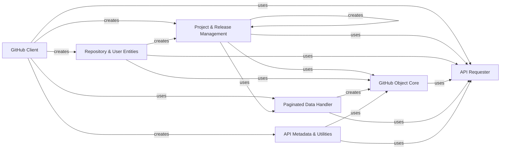

## Component Details

The Project & Release Management component in PyGithub is responsible for abstracting and managing GitHub's project boards and release functionalities. It provides a programmatic interface to interact with projects, their columns, and cards, as well as to create, update, and manage releases and their associated assets. This component relies on the API Requester for all communication with the GitHub API and leverages the GitHub Object Core for consistent object representation and attribute handling. It also utilizes the Paginated Data Handler for efficient retrieval of lists of projects, columns, cards, and release assets.

### Project & Release Management
This component handles the creation, retrieval, and management of GitHub projects (including columns and cards) and releases (including assets). It encapsulates the data and behaviors related to creating, editing, and retrieving project-specific information, as well as updating release information and uploading/managing release assets.

**Related Classes/Methods**:

- <a href="https://github.com/PyGithub/PyGithub/blob/master/github/Project.py#L62-L266" target="_blank" rel="noopener noreferrer">`PyGithub.github.Project.Project` (62:266)</a>
- <a href="https://github.com/PyGithub/PyGithub/blob/master/github/Project.py#L177-L209" target="_blank" rel="noopener noreferrer">`PyGithub.github.Project.Project:edit` (177:209)</a>
- <a href="https://github.com/PyGithub/PyGithub/blob/master/github/Project.py#L236-L266" target="_blank" rel="noopener noreferrer">`PyGithub.github.Project.Project._useAttributes` (236:266)</a>
- <a href="https://github.com/PyGithub/PyGithub/blob/master/github/Project.py#L211-L222" target="_blank" rel="noopener noreferrer">`PyGithub.github.Project.Project:get_columns` (211:222)</a>
- <a href="https://github.com/PyGithub/PyGithub/blob/master/github/Project.py#L224-L234" target="_blank" rel="noopener noreferrer">`PyGithub.github.Project.Project:create_column` (224:234)</a>
- <a href="https://github.com/PyGithub/PyGithub/blob/master/github/ProjectColumn.py#L64-L221" target="_blank" rel="noopener noreferrer">`PyGithub.github.ProjectColumn.ProjectColumn` (64:221)</a>
- <a href="https://github.com/PyGithub/PyGithub/blob/master/github/ProjectColumn.py#L121-L137" target="_blank" rel="noopener noreferrer">`PyGithub.github.ProjectColumn.ProjectColumn:get_cards` (121:137)</a>
- <a href="https://github.com/PyGithub/PyGithub/blob/master/github/ProjectColumn.py#L139-L162" target="_blank" rel="noopener noreferrer">`PyGithub.github.ProjectColumn.ProjectColumn:create_card` (139:162)</a>
- <a href="https://github.com/PyGithub/PyGithub/blob/master/github/ProjectColumn.py#L189-L203" target="_blank" rel="noopener noreferrer">`PyGithub.github.ProjectColumn.ProjectColumn:edit` (189:203)</a>
- <a href="https://github.com/PyGithub/PyGithub/blob/master/github/ProjectColumn.py#L205-L221" target="_blank" rel="noopener noreferrer">`PyGithub.github.ProjectColumn.ProjectColumn._useAttributes` (205:221)</a>
- <a href="https://github.com/PyGithub/PyGithub/blob/master/github/ProjectCard.py#L67-L244" target="_blank" rel="noopener noreferrer">`PyGithub.github.ProjectCard.ProjectCard` (67:244)</a>
- <a href="https://github.com/PyGithub/PyGithub/blob/master/github/ProjectCard.py#L203-L216" target="_blank" rel="noopener noreferrer">`PyGithub.github.ProjectCard.ProjectCard:edit` (203:216)</a>
- <a href="https://github.com/PyGithub/PyGithub/blob/master/github/ProjectCard.py#L218-L244" target="_blank" rel="noopener noreferrer">`PyGithub.github.ProjectCard.ProjectCard._useAttributes` (218:244)</a>
- <a href="https://github.com/PyGithub/PyGithub/blob/master/github/GitRelease.py#L73-L431" target="_blank" rel="noopener noreferrer">`PyGithub.github.GitRelease.GitRelease` (73:431)</a>
- <a href="https://github.com/PyGithub/PyGithub/blob/master/github/GitRelease.py#L375-L431" target="_blank" rel="noopener noreferrer">`PyGithub.github.GitRelease.GitRelease:_useAttributes` (375:431)</a>
- <a href="https://github.com/PyGithub/PyGithub/blob/master/github/GitRelease.py#L259-L300" target="_blank" rel="noopener noreferrer">`PyGithub.github.GitRelease.GitRelease:update_release` (259:300)</a>
- <a href="https://github.com/PyGithub/PyGithub/blob/master/github/GitRelease.py#L302-L327" target="_blank" rel="noopener noreferrer">`PyGithub.github.GitRelease.GitRelease:upload_asset` (302:327)</a>
- <a href="https://github.com/PyGithub/PyGithub/blob/master/github/GitRelease.py#L329-L362" target="_blank" rel="noopener noreferrer">`PyGithub.github.GitRelease.GitRelease:upload_asset_from_memory` (329:362)</a>
- <a href="https://github.com/PyGithub/PyGithub/blob/master/github/GitRelease.py#L364-L373" target="_blank" rel="noopener noreferrer">`PyGithub.github.GitRelease.GitRelease:get_assets` (364:373)</a>
- <a href="https://github.com/PyGithub/PyGithub/blob/master/github/GitReleaseAsset.py#L54-L203" target="_blank" rel="noopener noreferrer">`PyGithub.github.GitReleaseAsset.GitReleaseAsset` (54:203)</a>
- <a href="https://github.com/PyGithub/PyGithub/blob/master/github/GitReleaseAsset.py#L177-L203" target="_blank" rel="noopener noreferrer">`PyGithub.github.GitReleaseAsset.GitReleaseAsset:_useAttributes` (177:203)</a>
- <a href="https://github.com/PyGithub/PyGithub/blob/master/github/GitReleaseAsset.py#L167-L175" target="_blank" rel="noopener noreferrer">`PyGithub.github.GitReleaseAsset.GitReleaseAsset:update_asset` (167:175)</a>

### GitHub Client
The central component of the PyGithub library, responsible for initiating all interactions with the GitHub API. It acts as a facade, providing high-level methods to access various GitHub resources and orchestrating calls to the API Requester to fetch and manipulate data.

**Related Classes/Methods**:

- <a href="https://github.com/PyGithub/PyGithub/blob/master/github/MainClass.py#L157-L1060" target="_blank" rel="noopener noreferrer">`PyGithub.github.MainClass.Github` (157:1060)</a>
- <a href="https://github.com/PyGithub/PyGithub/blob/master/github/MainClass.py#L505-L514" target="_blank" rel="noopener noreferrer">`PyGithub.github.MainClass.Github:get_project` (505:514)</a>
- <a href="https://github.com/PyGithub/PyGithub/blob/master/github/MainClass.py#L516-L525" target="_blank" rel="noopener noreferrer">`PyGithub.github.MainClass.Github:get_project_column` (516:525)</a>
- <a href="https://github.com/PyGithub/PyGithub/blob/master/github/MainClass.py#L393-L408" target="_blank" rel="noopener noreferrer">`PyGithub.github.MainClass.Github:get_user` (393:408)</a>
- <a href="https://github.com/PyGithub/PyGithub/blob/master/github/MainClass.py#L420-L428" target="_blank" rel="noopener noreferrer">`PyGithub.github.MainClass.Github:get_users` (420:428)</a>
- <a href="https://github.com/PyGithub/PyGithub/blob/master/github/MainClass.py#L430-L437" target="_blank" rel="noopener noreferrer">`PyGithub.github.MainClass.Github:get_organization` (430:437)</a>
- <a href="https://github.com/PyGithub/PyGithub/blob/master/github/MainClass.py#L439-L452" target="_blank" rel="noopener noreferrer">`PyGithub.github.MainClass.Github:get_organizations` (439:452)</a>
- <a href="https://github.com/PyGithub/PyGithub/blob/master/github/MainClass.py#L464-L474" target="_blank" rel="noopener noreferrer">`PyGithub.github.MainClass.Github:get_repo` (464:474)</a>
- <a href="https://github.com/PyGithub/PyGithub/blob/master/github/MainClass.py#L476-L498" target="_blank" rel="noopener noreferrer">`PyGithub.github.MainClass.Github:get_repos` (476:498)</a>
- <a href="https://github.com/PyGithub/PyGithub/blob/master/github/MainClass.py#L527-L533" target="_blank" rel="noopener noreferrer">`PyGithub.github.MainClass.Github:get_gist` (527:533)</a>
- <a href="https://github.com/PyGithub/PyGithub/blob/master/github/MainClass.py#L535-L543" target="_blank" rel="noopener noreferrer">`PyGithub.github.MainClass.Github:get_gists` (535:543)</a>
- <a href="https://github.com/PyGithub/PyGithub/blob/master/github/MainClass.py#L545-L554" target="_blank" rel="noopener noreferrer">`PyGithub.github.MainClass.Github:get_global_advisory` (545:554)</a>
- <a href="https://github.com/PyGithub/PyGithub/blob/master/github/MainClass.py#L556-L657" target="_blank" rel="noopener noreferrer">`PyGithub.github.MainClass.Github:get_global_advisories` (556:657)</a>
- <a href="https://github.com/PyGithub/PyGithub/blob/master/github/MainClass.py#L659-L697" target="_blank" rel="noopener noreferrer">`PyGithub.github.MainClass.Github:search_repositories` (659:697)</a>
- <a href="https://github.com/PyGithub/PyGithub/blob/master/github/MainClass.py#L699-L738" target="_blank" rel="noopener noreferrer">`PyGithub.github.MainClass.Github:search_users` (699:738)</a>
- <a href="https://github.com/PyGithub/PyGithub/blob/master/github/MainClass.py#L740-L774" target="_blank" rel="noopener noreferrer">`PyGithub.github.MainClass.Github:search_issues` (740:774)</a>
- <a href="https://github.com/PyGithub/PyGithub/blob/master/github/MainClass.py#L776-L820" target="_blank" rel="noopener noreferrer">`PyGithub.github.MainClass.Github:search_code` (776:820)</a>
- <a href="https://github.com/PyGithub/PyGithub/blob/master/github/MainClass.py#L822-L862" target="_blank" rel="noopener noreferrer">`PyGithub.github.MainClass.Github:search_commits` (822:862)</a>
- <a href="https://github.com/PyGithub/PyGithub/blob/master/github/MainClass.py#L864-L890" target="_blank" rel="noopener noreferrer">`PyGithub.github.MainClass.Github:search_topics` (864:890)</a>
- <a href="https://github.com/PyGithub/PyGithub/blob/master/github/MainClass.py#L908-L915" target="_blank" rel="noopener noreferrer">`PyGithub.github.MainClass.Github:get_hook` (908:915)</a>
- <a href="https://github.com/PyGithub/PyGithub/blob/master/github/MainClass.py#L917-L923" target="_blank" rel="noopener noreferrer">`PyGithub.github.MainClass.Github:get_hooks` (917:923)</a>
- <a href="https://github.com/PyGithub/PyGithub/blob/master/github/MainClass.py#L925-L935" target="_blank" rel="noopener noreferrer">`PyGithub.github.MainClass.Github:get_hook_delivery` (925:935)</a>
- <a href="https://github.com/PyGithub/PyGithub/blob/master/github/MainClass.py#L937-L945" target="_blank" rel="noopener noreferrer">`PyGithub.github.MainClass.Github:get_hook_deliveries` (937:945)</a>
- <a href="https://github.com/PyGithub/PyGithub/blob/master/github/MainClass.py#L947-L952" target="_blank" rel="noopener noreferrer">`PyGithub.github.MainClass.Github:get_gitignore_templates` (947:952)</a>
- <a href="https://github.com/PyGithub/PyGithub/blob/master/github/MainClass.py#L954-L961" target="_blank" rel="noopener noreferrer">`PyGithub.github.MainClass.Github:get_gitignore_template` (954:961)</a>
- <a href="https://github.com/PyGithub/PyGithub/blob/master/github/MainClass.py#L963-L969" target="_blank" rel="noopener noreferrer">`PyGithub.github.MainClass.Github:get_emojis` (963:969)</a>
- <a href="https://github.com/PyGithub/PyGithub/blob/master/github/MainClass.py#L971-L989" target="_blank" rel="noopener noreferrer">`PyGithub.github.MainClass.Github:create_from_raw_data` (971:989)</a>
- <a href="https://github.com/PyGithub/PyGithub/blob/master/github/MainClass.py#L991-L1023" target="_blank" rel="noopener noreferrer">`PyGithub.github.MainClass.Github:dump` (991:1023)</a>
- <a href="https://github.com/PyGithub/PyGithub/blob/master/github/MainClass.py#L1025-L1033" target="_blank" rel="noopener noreferrer">`PyGithub.github.MainClass.Github:load` (1025:1033)</a>
- <a href="https://github.com/PyGithub/PyGithub/blob/master/github/MainClass.py#L1035-L1040" target="_blank" rel="noopener noreferrer">`PyGithub.github.MainClass.Github:get_oauth_application` (1035:1040)</a>
- <a href="https://github.com/PyGithub/PyGithub/blob/master/github/MainClass.py#L1042-L1060" target="_blank" rel="noopener noreferrer">`PyGithub.github.MainClass.Github:get_app` (1042:1060)</a>
- <a href="https://github.com/PyGithub/PyGithub/blob/master/github/MainClass.py#L350-L358" target="_blank" rel="noopener noreferrer">`PyGithub.github.MainClass.Github:get_rate_limit` (350:358)</a>
- <a href="https://github.com/PyGithub/PyGithub/blob/master/github/MainClass.py#L367-L375" target="_blank" rel="noopener noreferrer">`PyGithub.github.MainClass.Github:get_license` (367:375)</a>
- <a href="https://github.com/PyGithub/PyGithub/blob/master/github/MainClass.py#L377-L384" target="_blank" rel="noopener noreferrer">`PyGithub.github.MainClass.Github:get_licenses` (377:384)</a>
- <a href="https://github.com/PyGithub/PyGithub/blob/master/github/MainClass.py#L386-L391" target="_blank" rel="noopener noreferrer">`PyGithub.github.MainClass.Github:get_events` (386:391)</a>

### API Requester
This component is responsible for handling the underlying HTTP communication with the GitHub API. It manages authentication, constructs requests, sends them, and processes the raw JSON responses, including handling rate limiting and potential errors.

**Related Classes/Methods**:

- <a href="https://github.com/PyGithub/PyGithub/blob/master/github/Requester.py#L287-L1290" target="_blank" rel="noopener noreferrer">`github.Requester.Requester` (287:1290)</a>
- <a href="https://github.com/PyGithub/PyGithub/blob/master/github/Requester.py#L601-L629" target="_blank" rel="noopener noreferrer">`github.Requester.Requester.requestJsonAndCheck` (601:629)</a>

### GitHub Object Core
Provides the foundational structure and common functionalities for all GitHub API entities. It includes mechanisms for object representation, lazy loading of attributes, and methods for dynamically setting attributes based on API responses, ensuring data consistency and efficient resource usage.

**Related Classes/Methods**:

- <a href="https://github.com/PyGithub/PyGithub/blob/master/github/GithubObject.py#L226-L457" target="_blank" rel="noopener noreferrer">`github.GithubObject.GithubObject` (226:457)</a>
- <a href="https://github.com/PyGithub/PyGithub/blob/master/github/GithubObject.py#L476-L594" target="_blank" rel="noopener noreferrer">`github.GithubObject.CompletableGithubObject` (476:594)</a>
- <a href="https://github.com/PyGithub/PyGithub/blob/master/github/GithubObject.py#L434-L451" target="_blank" rel="noopener noreferrer">`github.GithubObject.GithubObject.get__repr__` (434:451)</a>
- <a href="https://github.com/PyGithub/PyGithub/blob/master/github/GithubObject.py#L557-L559" target="_blank" rel="noopener noreferrer">`github.GithubObject.CompletableGithubObject._completeIfNotSet` (557:559)</a>
- <a href="https://github.com/PyGithub/PyGithub/blob/master/github/GithubObject.py#L326-L327" target="_blank" rel="noopener noreferrer">`github.GithubObject.GithubObject._makeStringAttribute` (326:327)</a>
- <a href="https://github.com/PyGithub/PyGithub/blob/master/github/GithubObject.py#L358-L359" target="_blank" rel="noopener noreferrer">`github.GithubObject.GithubObject._makeDatetimeAttribute` (358:359)</a>
- <a href="https://github.com/PyGithub/PyGithub/blob/master/github/GithubObject.py#L330-L331" target="_blank" rel="noopener noreferrer">`github.GithubObject.GithubObject._makeIntAttribute` (330:331)</a>
- <a href="https://github.com/PyGithub/PyGithub/blob/master/github/GithubObject.py#L365-L370" target="_blank" rel="noopener noreferrer">`github.GithubObject.GithubObject._makeClassAttribute` (365:370)</a>
- <a href="https://github.com/PyGithub/PyGithub/blob/master/github/GithubObject.py#L342-L343" target="_blank" rel="noopener noreferrer">`github.GithubObject.GithubObject._makeBoolAttribute` (342:343)</a>
- <a href="https://github.com/PyGithub/PyGithub/blob/master/github/GithubObject.py#L390-L394" target="_blank" rel="noopener noreferrer">`github.GithubObject.GithubObject._makeListOfClassesAttribute` (390:394)</a>
- <a href="https://github.com/PyGithub/PyGithub/blob/master/github/GithubObject.py#L346-L347" target="_blank" rel="noopener noreferrer">`github.GithubObject.GithubObject._makeDictAttribute` (346:347)</a>
- <a href="https://github.com/PyGithub/PyGithub/blob/master/github/GithubObject.py#L140-L141" target="_blank" rel="noopener noreferrer">`github.GithubObject.is_optional` (140:141)</a>
- <a href="https://github.com/PyGithub/PyGithub/blob/master/github/GithubObject.py#L132-L133" target="_blank" rel="noopener noreferrer">`github.GithubObject.is_defined` (132:133)</a>
- <a href="https://github.com/PyGithub/PyGithub/blob/master/github/GithubObject.py#L136-L137" target="_blank" rel="noopener noreferrer">`github.GithubObject.is_undefined` (136:137)</a>
- <a href="https://github.com/PyGithub/PyGithub/blob/master/github/GithubObject.py#L123-L124" target="_blank" rel="noopener noreferrer">`github.GithubObject._NotSetType.remove_unset_items` (123:124)</a>

### Paginated Data Handler
This component specializes in managing and iterating over paginated lists of resources returned by the GitHub API. It abstracts away the complexities of fetching subsequent pages, allowing other components to seamlessly access large datasets.

**Related Classes/Methods**:

- <a href="https://github.com/PyGithub/PyGithub/blob/master/github/PaginatedList.py#L128-L450" target="_blank" rel="noopener noreferrer">`github.PaginatedList.PaginatedList` (128:450)</a>

### Repository & User Entities
These components represent core GitHub entities such as repositories, organizations, and different types of users (named and authenticated). They provide methods for accessing and managing these entities, including creating projects and releases associated with them.

**Related Classes/Methods**:

- <a href="https://github.com/PyGithub/PyGithub/blob/master/github/Repository.py#L328-L4656" target="_blank" rel="noopener noreferrer">`github.Repository.Repository` (328:4656)</a>
- <a href="https://github.com/PyGithub/PyGithub/blob/master/github/Repository.py#L1432-L1473" target="_blank" rel="noopener noreferrer">`PyGithub.github.Repository.Repository:create_git_tag_and_release` (1432:1473)</a>
- <a href="https://github.com/PyGithub/PyGithub/blob/master/github/Repository.py#L1475-L1528" target="_blank" rel="noopener noreferrer">`PyGithub.github.Repository.Repository:create_git_release` (1475:1528)</a>
- <a href="https://github.com/PyGithub/PyGithub/blob/master/github/Repository.py#L1728-L1746" target="_blank" rel="noopener noreferrer">`PyGithub.github.Repository.Repository:create_project` (1728:1746)</a>
- <a href="https://github.com/PyGithub/PyGithub/blob/master/github/Repository.py#L2635-L2652" target="_blank" rel="noopener noreferrer">`PyGithub.github.Repository.Repository:get_projects` (2635:2652)</a>
- <a href="https://github.com/PyGithub/PyGithub/blob/master/github/Repository.py#L3575-L3580" target="_blank" rel="noopener noreferrer">`PyGithub.github.Repository.Repository:get_releases` (3575:3580)</a>
- <a href="https://github.com/PyGithub/PyGithub/blob/master/github/Repository.py#L3582-L3595" target="_blank" rel="noopener noreferrer">`PyGithub.github.Repository.Repository:get_release` (3582:3595)</a>
- <a href="https://github.com/PyGithub/PyGithub/blob/master/github/Repository.py#L3597-L3603" target="_blank" rel="noopener noreferrer">`PyGithub.github.Repository.Repository:get_latest_release` (3597:3603)</a>
- <a href="https://github.com/PyGithub/PyGithub/blob/master/github/Repository.py#L4080-L4083" target="_blank" rel="noopener noreferrer">`PyGithub.github.Repository.Repository:get_release_asset` (4080:4083)</a>
- <a href="https://github.com/PyGithub/PyGithub/blob/master/github/Organization.py#L150-L2014" target="_blank" rel="noopener noreferrer">`github.Organization.Organization` (150:2014)</a>
- <a href="https://github.com/PyGithub/PyGithub/blob/master/github/Organization.py#L626-L640" target="_blank" rel="noopener noreferrer">`PyGithub.github.Organization.Organization:create_project` (626:640)</a>
- <a href="https://github.com/PyGithub/PyGithub/blob/master/github/Organization.py#L1131-L1144" target="_blank" rel="noopener noreferrer">`PyGithub.github.Organization.Organization:get_projects` (1131:1144)</a>
- <a href="https://github.com/PyGithub/PyGithub/blob/master/github/NamedUser.py#L86-L686" target="_blank" rel="noopener noreferrer">`github.NamedUser.NamedUser` (86:686)</a>
- <a href="https://github.com/PyGithub/PyGithub/blob/master/github/AuthenticatedUser.py#L146-L1178" target="_blank" rel="noopener noreferrer">`github.AuthenticatedUser.AuthenticatedUser` (146:1178)</a>
- <a href="https://github.com/PyGithub/PyGithub/blob/master/github/AuthenticatedUser.py#L553-L572" target="_blank" rel="noopener noreferrer">`PyGithub.github.AuthenticatedUser.AuthenticatedUser:create_project` (553:572)</a>

### API Metadata & Utilities
This component encompasses various utility classes and entities that provide access to GitHub API metadata and supporting functionalities. This includes information about API rate limits, webhooks, gitignore templates, and authentication mechanisms.

**Related Classes/Methods**:

- <a href="https://github.com/PyGithub/PyGithub/blob/master/github/RateLimitOverview.py#L35-L66" target="_blank" rel="noopener noreferrer">`github.RateLimitOverview.RateLimitOverview` (35:66)</a>
- <a href="https://github.com/PyGithub/PyGithub/blob/master/github/HookDescription.py#L46-L84" target="_blank" rel="noopener noreferrer">`github.HookDescription.HookDescription` (46:84)</a>
- <a href="https://github.com/PyGithub/PyGithub/blob/master/github/HookDelivery.py#L207-L237" target="_blank" rel="noopener noreferrer">`github.HookDelivery.HookDelivery` (207:237)</a>
- `github.HookDeliverySummary.HookDeliverySummary` (full file reference)
- <a href="https://github.com/PyGithub/PyGithub/blob/master/github/GitignoreTemplate.py#L46-L77" target="_blank" rel="noopener noreferrer">`github.GitignoreTemplate.GitignoreTemplate` (46:77)</a>
- <a href="https://github.com/PyGithub/PyGithub/blob/master/github/ApplicationOAuth.py#L48-L198" target="_blank" rel="noopener noreferrer">`github.ApplicationOAuth.ApplicationOAuth` (48:198)</a>
- <a href="https://github.com/PyGithub/PyGithub/blob/master/github/GithubApp.py#L56-L218" target="_blank" rel="noopener noreferrer">`github.GithubApp.GithubApp` (56:218)</a>
- <a href="https://github.com/PyGithub/PyGithub/blob/master/github/RepositoryDiscussion.py#L54-L213" target="_blank" rel="noopener noreferrer">`github.RepositoryDiscussion.RepositoryDiscussion` (54:213)</a>
- <a href="https://github.com/PyGithub/PyGithub/blob/master/github/License.py#L52-L167" target="_blank" rel="noopener noreferrer">`github.License.License` (52:167)</a>
- <a href="https://github.com/PyGithub/PyGithub/blob/master/github/Event.py#L53-L126" target="_blank" rel="noopener noreferrer">`github.Event.Event` (53:126)</a>
- <a href="https://github.com/PyGithub/PyGithub/blob/master/github/Gist.py#L67-L336" target="_blank" rel="noopener noreferrer">`github.Gist.Gist` (67:336)</a>
- <a href="https://github.com/PyGithub/PyGithub/blob/master/github/GlobalAdvisory.py#L44-L139" target="_blank" rel="noopener noreferrer">`github.GlobalAdvisory.GlobalAdvisory` (44:139)</a>
- <a href="https://github.com/PyGithub/PyGithub/blob/master/github/Auth.py#L57-L96" target="_blank" rel="noopener noreferrer">`github.Auth.Auth` (57:96)</a>

### [FAQ](https://github.com/CodeBoarding/GeneratedOnBoardings/tree/main?tab=readme-ov-file#faq)