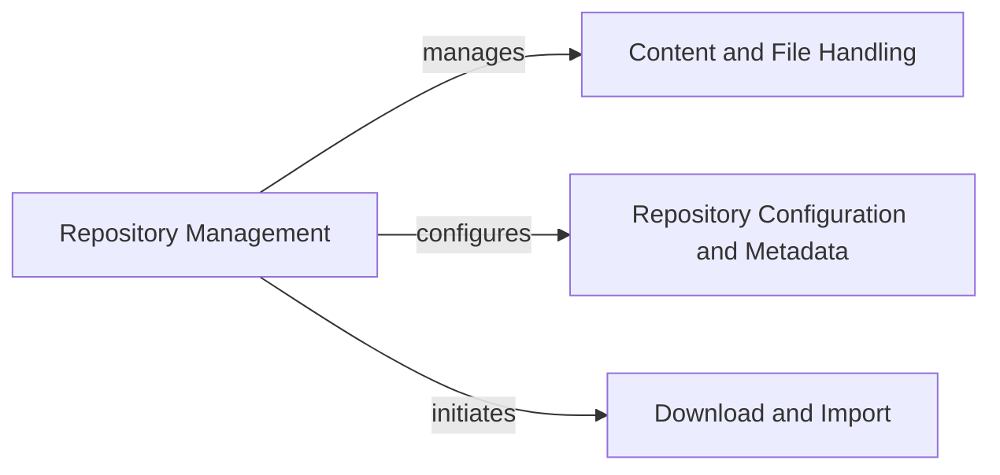

## Component Details

This component focuses on managing GitHub repositories, including their creation, modification, deletion, and access to their general content like files, licenses, and autolinks. It also handles source imports and repository-level keys.

### Repository Management
This component is responsible for all operations related to GitHub repositories. It provides methods for retrieving repository information, managing files, commits, branches, issues, pull requests, webhooks, secrets, and various repository settings. It acts as the primary interface for interacting with a specific GitHub repository.

**Related Classes/Methods**:

- <a href="https://github.com/PyGithub/PyGithub/blob/master/github/Repository.py#L328-L4656" target="_blank" rel="noopener noreferrer">`github.Repository.Repository` (328:4656)</a>
- <a href="https://github.com/PyGithub/PyGithub/blob/master/github/Repository.py#L4659-L4694" target="_blank" rel="noopener noreferrer">`github.Repository.RepositorySearchResult` (4659:4694)</a>
- <a href="https://github.com/PyGithub/PyGithub/blob/master/github/Repository.py#L454-L455" target="_blank" rel="noopener noreferrer">`github.Repository.Repository:__repr__` (454:455)</a>
- <a href="https://github.com/PyGithub/PyGithub/blob/master/github/Repository.py#L462-L467" target="_blank" rel="noopener noreferrer">`github.Repository.Repository:allow_auto_merge` (462:467)</a>
- <a href="https://github.com/PyGithub/PyGithub/blob/master/github/Repository.py#L470-L475" target="_blank" rel="noopener noreferrer">`github.Repository.Repository:allow_forking` (470:475)</a>
- <a href="https://github.com/PyGithub/PyGithub/blob/master/github/Repository.py#L478-L483" target="_blank" rel="noopener noreferrer">`github.Repository.Repository:allow_merge_commit` (478:483)</a>
- <a href="https://github.com/PyGithub/PyGithub/blob/master/github/Repository.py#L486-L491" target="_blank" rel="noopener noreferrer">`github.Repository.Repository:allow_rebase_merge` (486:491)</a>
- <a href="https://github.com/PyGithub/PyGithub/blob/master/github/Repository.py#L494-L499" target="_blank" rel="noopener noreferrer">`github.Repository.Repository:allow_squash_merge` (494:499)</a>
- <a href="https://github.com/PyGithub/PyGithub/blob/master/github/Repository.py#L502-L507" target="_blank" rel="noopener noreferrer">`github.Repository.Repository:allow_update_branch` (502:507)</a>
- <a href="https://github.com/PyGithub/PyGithub/blob/master/github/Repository.py#L510-L512" target="_blank" rel="noopener noreferrer">`github.Repository.Repository:anonymous_access_enabled` (510:512)</a>
- <a href="https://github.com/PyGithub/PyGithub/blob/master/github/Repository.py#L515-L520" target="_blank" rel="noopener noreferrer">`github.Repository.Repository:archive_url` (515:520)</a>
- <a href="https://github.com/PyGithub/PyGithub/blob/master/github/Repository.py#L523-L528" target="_blank" rel="noopener noreferrer">`github.Repository.Repository:archived` (523:528)</a>
- <a href="https://github.com/PyGithub/PyGithub/blob/master/github/Repository.py#L531-L536" target="_blank" rel="noopener noreferrer">`github.Repository.Repository:assignees_url` (531:536)</a>
- <a href="https://github.com/PyGithub/PyGithub/blob/master/github/Repository.py#L539-L544" target="_blank" rel="noopener noreferrer">`github.Repository.Repository:blobs_url` (539:544)</a>
- <a href="https://github.com/PyGithub/PyGithub/blob/master/github/Repository.py#L547-L552" target="_blank" rel="noopener noreferrer">`github.Repository.Repository:branches_url` (547:552)</a>
- <a href="https://github.com/PyGithub/PyGithub/blob/master/github/Repository.py#L555-L560" target="_blank" rel="noopener noreferrer">`github.Repository.Repository:clone_url` (555:560)</a>
- <a href="https://github.com/PyGithub/PyGithub/blob/master/github/Repository.py#L563-L565" target="_blank" rel="noopener noreferrer">`github.Repository.Repository:code_of_conduct` (563:565)</a>
- <a href="https://github.com/PyGithub/PyGithub/blob/master/github/Repository.py#L568-L573" target="_blank" rel="noopener noreferrer">`github.Repository.Repository:collaborators_url` (568:573)</a>
- <a href="https://github.com/PyGithub/PyGithub/blob/master/github/Repository.py#L576-L581" target="_blank" rel="noopener noreferrer">`github.Repository.Repository:comments_url` (576:581)</a>
- <a href="https://github.com/PyGithub/PyGithub/blob/master/github/Repository.py#L584-L589" target="_blank" rel="noopener noreferrer">`github.Repository.Repository:commits_url` (584:589)</a>
- <a href="https://github.com/PyGithub/PyGithub/blob/master/github/Repository.py#L592-L597" target="_blank" rel="noopener noreferrer">`github.Repository.Repository:compare_url` (592:597)</a>
- <a href="https://github.com/PyGithub/PyGithub/blob/master/github/Repository.py#L600-L605" target="_blank" rel="noopener noreferrer">`github.Repository.Repository:contents_url` (600:605)</a>
- <a href="https://github.com/PyGithub/PyGithub/blob/master/github/Repository.py#L608-L613" target="_blank" rel="noopener noreferrer">`github.Repository.Repository:contributors_url` (608:613)</a>
- <a href="https://github.com/PyGithub/PyGithub/blob/master/github/Repository.py#L616-L621" target="_blank" rel="noopener noreferrer">`github.Repository.Repository:created_at` (616:621)</a>
- <a href="https://github.com/PyGithub/PyGithub/blob/master/github/Repository.py#L624-L629" target="_blank" rel="noopener noreferrer">`github.Repository.Repository:custom_properties` (624:629)</a>
- <a href="https://github.com/PyGithub/PyGithub/blob/master/github/Repository.py#L632-L637" target="_blank" rel="noopener noreferrer">`github.Repository.Repository:default_branch` (632:637)</a>
- <a href="https://github.com/PyGithub/PyGithub/blob/master/github/Repository.py#L640-L645" target="_blank" rel="noopener noreferrer">`github.Repository.Repository:delete_branch_on_merge` (640:645)</a>
- <a href="https://github.com/PyGithub/PyGithub/blob/master/github/Repository.py#L648-L653" target="_blank" rel="noopener noreferrer">`github.Repository.Repository:deployments_url` (648:653)</a>
- <a href="https://github.com/PyGithub/PyGithub/blob/master/github/Repository.py#L656-L661" target="_blank" rel="noopener noreferrer">`github.Repository.Repository:description` (656:661)</a>
- <a href="https://github.com/PyGithub/PyGithub/blob/master/github/Repository.py#L664-L666" target="_blank" rel="noopener noreferrer">`github.Repository.Repository:disabled` (664:666)</a>
- <a href="https://github.com/PyGithub/PyGithub/blob/master/github/Repository.py#L669-L674" target="_blank" rel="noopener noreferrer">`github.Repository.Repository:downloads_url` (669:674)</a>
- <a href="https://github.com/PyGithub/PyGithub/blob/master/github/Repository.py#L677-L682" target="_blank" rel="noopener noreferrer">`github.Repository.Repository:events_url` (677:682)</a>
- <a href="https://github.com/PyGithub/PyGithub/blob/master/github/Repository.py#L685-L690" target="_blank" rel="noopener noreferrer">`github.Repository.Repository:fork` (685:690)</a>
- <a href="https://github.com/PyGithub/PyGithub/blob/master/github/Repository.py#L693-L698" target="_blank" rel="noopener noreferrer">`github.Repository.Repository:forks` (693:698)</a>
- <a href="https://github.com/PyGithub/PyGithub/blob/master/github/Repository.py#L701-L706" target="_blank" rel="noopener noreferrer">`github.Repository.Repository:forks_count` (701:706)</a>
- <a href="https://github.com/PyGithub/PyGithub/blob/master/github/Repository.py#L709-L714" target="_blank" rel="noopener noreferrer">`github.Repository.Repository:forks_url` (709:714)</a>
- <a href="https://github.com/PyGithub/PyGithub/blob/master/github/Repository.py#L717-L722" target="_blank" rel="noopener noreferrer">`github.Repository.Repository:full_name` (717:722)</a>
- <a href="https://github.com/PyGithub/PyGithub/blob/master/github/Repository.py#L725-L730" target="_blank" rel="noopener noreferrer">`github.Repository.Repository:git_commits_url` (725:730)</a>
- <a href="https://github.com/PyGithub/PyGithub/blob/master/github/Repository.py#L733-L738" target="_blank" rel="noopener noreferrer">`github.Repository.Repository:git_refs_url` (733:738)</a>
- <a href="https://github.com/PyGithub/PyGithub/blob/master/github/Repository.py#L741-L746" target="_blank" rel="noopener noreferrer">`github.Repository.Repository:git_tags_url` (741:746)</a>
- <a href="https://github.com/PyGithub/PyGithub/blob/master/github/Repository.py#L749-L754" target="_blank" rel="noopener noreferrer">`github.Repository.Repository:git_url` (749:754)</a>
- <a href="https://github.com/PyGithub/PyGithub/blob/master/github/Repository.py#L757-L762" target="_blank" rel="noopener noreferrer">`github.Repository.Repository:has_discussions` (757:762)</a>
- <a href="https://github.com/PyGithub/PyGithub/blob/master/github/Repository.py#L765-L770" target="_blank" rel="noopener noreferrer">`github.Repository.Repository:has_downloads` (765:770)</a>
- <a href="https://github.com/PyGithub/PyGithub/blob/master/github/Repository.py#L773-L778" target="_blank" rel="noopener noreferrer">`github.Repository.Repository:has_issues` (773:778)</a>
- <a href="https://github.com/PyGithub/PyGithub/blob/master/github/Repository.py#L781-L786" target="_blank" rel="noopener noreferrer">`github.Repository.Repository:has_pages` (781:786)</a>
- <a href="https://github.com/PyGithub/PyGithub/blob/master/github/Repository.py#L789-L794" target="_blank" rel="noopener noreferrer">`github.Repository.Repository:has_projects` (789:794)</a>
- <a href="https://github.com/PyGithub/PyGithub/blob/master/github/Repository.py#L797-L802" target="_blank" rel="noopener noreferrer">`github.Repository.Repository:has_wiki` (797:802)</a>
- <a href="https://github.com/PyGithub/PyGithub/blob/master/github/Repository.py#L805-L810" target="_blank" rel="noopener noreferrer">`github.Repository.Repository:homepage` (805:810)</a>
- <a href="https://github.com/PyGithub/PyGithub/blob/master/github/Repository.py#L813-L818" target="_blank" rel="noopener noreferrer">`github.Repository.Repository:hooks_url` (813:818)</a>
- <a href="https://github.com/PyGithub/PyGithub/blob/master/github/Repository.py#L821-L826" target="_blank" rel="noopener noreferrer">`github.Repository.Repository:html_url` (821:826)</a>
- <a href="https://github.com/PyGithub/PyGithub/blob/master/github/Repository.py#L829-L834" target="_blank" rel="noopener noreferrer">`github.Repository.Repository:id` (829:834)</a>
- <a href="https://github.com/PyGithub/PyGithub/blob/master/github/Repository.py#L837-L842" target="_blank" rel="noopener noreferrer">`github.Repository.Repository:is_template` (837:842)</a>
- <a href="https://github.com/PyGithub/PyGithub/blob/master/github/Repository.py#L845-L850" target="_blank" rel="noopener noreferrer">`github.Repository.Repository:issue_comment_url` (845:850)</a>
- <a href="https://github.com/PyGithub/PyGithub/blob/master/github/Repository.py#L853-L858" target="_blank" rel="noopener noreferrer">`github.Repository.Repository:issue_events_url` (853:858)</a>
- <a href="https://github.com/PyGithub/PyGithub/blob/master/github/Repository.py#L861-L866" target="_blank" rel="noopener noreferrer">`github.Repository.Repository:issues_url` (861:866)</a>
- <a href="https://github.com/PyGithub/PyGithub/blob/master/github/Repository.py#L869-L874" target="_blank" rel="noopener noreferrer">`github.Repository.Repository:keys_url` (869:874)</a>
- <a href="https://github.com/PyGithub/PyGithub/blob/master/github/Repository.py#L877-L882" target="_blank" rel="noopener noreferrer">`github.Repository.Repository:labels_url` (877:882)</a>
- <a href="https://github.com/PyGithub/PyGithub/blob/master/github/Repository.py#L885-L890" target="_blank" rel="noopener noreferrer">`github.Repository.Repository:language` (885:890)</a>
- <a href="https://github.com/PyGithub/PyGithub/blob/master/github/Repository.py#L893-L898" target="_blank" rel="noopener noreferrer">`github.Repository.Repository:languages_url` (893:898)</a>
- <a href="https://github.com/PyGithub/PyGithub/blob/master/github/Repository.py#L901-L903" target="_blank" rel="noopener noreferrer">`github.Repository.Repository:license` (901:903)</a>
- <a href="https://github.com/PyGithub/PyGithub/blob/master/github/Repository.py#L906-L908" target="_blank" rel="noopener noreferrer">`github.Repository.Repository:master_branch` (906:908)</a>
- <a href="https://github.com/PyGithub/PyGithub/blob/master/github/Repository.py#L911-L916" target="_blank" rel="noopener noreferrer">`github.Repository.Repository:merge_commit_message` (911:916)</a>
- <a href="https://github.com/PyGithub/PyGithub/blob/master/github/Repository.py#L919-L924" target="_blank" rel="noopener noreferrer">`github.Repository.Repository:merge_commit_title` (919:924)</a>
- <a href="https://github.com/PyGithub/PyGithub/blob/master/github/Repository.py#L927-L932" target="_blank" rel="noopener noreferrer">`github.Repository.Repository:merges_url` (927:932)</a>
- <a href="https://github.com/PyGithub/PyGithub/blob/master/github/Repository.py#L935-L940" target="_blank" rel="noopener noreferrer">`github.Repository.Repository:milestones_url` (935:940)</a>
- <a href="https://github.com/PyGithub/PyGithub/blob/master/github/Repository.py#L943-L948" target="_blank" rel="noopener noreferrer">`github.Repository.Repository:mirror_url` (943:948)</a>
- <a href="https://github.com/PyGithub/PyGithub/blob/master/github/Repository.py#L951-L956" target="_blank" rel="noopener noreferrer">`github.Repository.Repository:name` (951:956)</a>
- <a href="https://github.com/PyGithub/PyGithub/blob/master/github/Repository.py#L959-L964" target="_blank" rel="noopener noreferrer">`github.Repository.Repository:network_count` (959:964)</a>
- <a href="https://github.com/PyGithub/PyGithub/blob/master/github/Repository.py#L967-L969" target="_blank" rel="noopener noreferrer">`github.Repository.Repository:node_id` (967:969)</a>
- <a href="https://github.com/PyGithub/PyGithub/blob/master/github/Repository.py#L972-L977" target="_blank" rel="noopener noreferrer">`github.Repository.Repository:notifications_url` (972:977)</a>
- <a href="https://github.com/PyGithub/PyGithub/blob/master/github/Repository.py#L980-L985" target="_blank" rel="noopener noreferrer">`github.Repository.Repository:open_issues` (980:985)</a>
- <a href="https://github.com/PyGithub/PyGithub/blob/master/github/Repository.py#L988-L993" target="_blank" rel="noopener noreferrer">`github.Repository.Repository:open_issues_count` (988:993)</a>
- <a href="https://github.com/PyGithub/PyGithub/blob/master/github/Repository.py#L996-L1001" target="_blank" rel="noopener noreferrer">`github.Repository.Repository:organization` (996:1001)</a>
- <a href="https://github.com/PyGithub/PyGithub/blob/master/github/Repository.py#L1004-L1009" target="_blank" rel="noopener noreferrer">`github.Repository.Repository:owner` (1004:1009)</a>
- <a href="https://github.com/PyGithub/PyGithub/blob/master/github/Repository.py#L1012-L1017" target="_blank" rel="noopener noreferrer">`github.Repository.Repository:parent` (1012:1017)</a>
- <a href="https://github.com/PyGithub/PyGithub/blob/master/github/Repository.py#L1020-L1025" target="_blank" rel="noopener noreferrer">`github.Repository.Repository:permissions` (1020:1025)</a>
- <a href="https://github.com/PyGithub/PyGithub/blob/master/github/Repository.py#L1028-L1033" target="_blank" rel="noopener noreferrer">`github.Repository.Repository:private` (1028:1033)</a>
- <a href="https://github.com/PyGithub/PyGithub/blob/master/github/Repository.py#L1036-L1041" target="_blank" rel="noopener noreferrer">`github.Repository.Repository:pulls_url` (1036:1041)</a>
- <a href="https://github.com/PyGithub/PyGithub/blob/master/github/Repository.py#L1044-L1049" target="_blank" rel="noopener noreferrer">`github.Repository.Repository:pushed_at` (1044:1049)</a>
- <a href="https://github.com/PyGithub/PyGithub/blob/master/github/Repository.py#L1052-L1057" target="_blank" rel="noopener noreferrer">`github.Repository.Repository:releases_url` (1052:1057)</a>
- <a href="https://github.com/PyGithub/PyGithub/blob/master/github/Repository.py#L1060-L1062" target="_blank" rel="noopener noreferrer">`github.Repository.Repository:role_name` (1060:1062)</a>
- <a href="https://github.com/PyGithub/PyGithub/blob/master/github/Repository.py#L1065-L1070" target="_blank" rel="noopener noreferrer">`github.Repository.Repository:security_and_analysis` (1065:1070)</a>
- <a href="https://github.com/PyGithub/PyGithub/blob/master/github/Repository.py#L1073-L1078" target="_blank" rel="noopener noreferrer">`github.Repository.Repository:size` (1073:1078)</a>
- <a href="https://github.com/PyGithub/PyGithub/blob/master/github/Repository.py#L1081-L1086" target="_blank" rel="noopener noreferrer">`github.Repository.Repository:source` (1081:1086)</a>
- <a href="https://github.com/PyGithub/PyGithub/blob/master/github/Repository.py#L1089-L1094" target="_blank" rel="noopener noreferrer">`github.Repository.Repository:squash_merge_commit_message` (1089:1094)</a>
- <a href="https://github.com/PyGithub/PyGithub/blob/master/github/Repository.py#L1097-L1102" target="_blank" rel="noopener noreferrer">`github.Repository.Repository:squash_merge_commit_title` (1097:1102)</a>
- <a href="https://github.com/PyGithub/PyGithub/blob/master/github/Repository.py#L1105-L1110" target="_blank" rel="noopener noreferrer">`github.Repository.Repository:ssh_url` (1105:1110)</a>
- <a href="https://github.com/PyGithub/PyGithub/blob/master/github/Repository.py#L1113-L1118" target="_blank" rel="noopener noreferrer">`github.Repository.Repository:stargazers_count` (1113:1118)</a>
- <a href="https://github.com/PyGithub/PyGithub/blob/master/github/Repository.py#L1121-L1126" target="_blank" rel="noopener noreferrer">`github.Repository.Repository:stargazers_url` (1121:1126)</a>
- <a href="https://github.com/PyGithub/PyGithub/blob/master/github/Repository.py#L1129-L1131" target="_blank" rel="noopener noreferrer">`github.Repository.Repository:starred_at` (1129:1131)</a>
- <a href="https://github.com/PyGithub/PyGithub/blob/master/github/Repository.py#L1134-L1139" target="_blank" rel="noopener noreferrer">`github.Repository.Repository:statuses_url` (1134:1139)</a>
- <a href="https://github.com/PyGithub/PyGithub/blob/master/github/Repository.py#L1142-L1147" target="_blank" rel="noopener noreferrer">`github.Repository.Repository:subscribers_count` (1142:1147)</a>
- <a href="https://github.com/PyGithub/PyGithub/blob/master/github/Repository.py#L1150-L1155" target="_blank" rel="noopener noreferrer">`github.Repository.Repository:subscribers_url` (1150:1155)</a>
- <a href="https://github.com/PyGithub/PyGithub/blob/master/github/Repository.py#L1158-L1163" target="_blank" rel="noopener noreferrer">`github.Repository.Repository:subscription_url` (1158:1163)</a>
- <a href="https://github.com/PyGithub/PyGithub/blob/master/github/Repository.py#L1166-L1171" target="_blank" rel="noopener noreferrer">`github.Repository.Repository:svn_url` (1166:1171)</a>
- <a href="https://github.com/PyGithub/PyGithub/blob/master/github/Repository.py#L1174-L1179" target="_blank" rel="noopener noreferrer">`github.Repository.Repository:tags_url` (1174:1179)</a>
- <a href="https://github.com/PyGithub/PyGithub/blob/master/github/Repository.py#L1182-L1187" target="_blank" rel="noopener noreferrer">`github.Repository.Repository:teams_url` (1182:1187)</a>
- <a href="https://github.com/PyGithub/PyGithub/blob/master/github/Repository.py#L1190-L1192" target="_blank" rel="noopener noreferrer">`github.Repository.Repository:temp_clone_token` (1190:1192)</a>
- `github.Repository.Repository:template_` (full file reference)
- <a href="https://github.com/PyGithub/PyGithub/blob/master/github/Repository.py#L1200-L1205" target="_blank" rel="noopener noreferrer">`github.Repository.Repository:topics` (1200:1205)</a>
- <a href="https://github.com/PyGithub/PyGithub/blob/master/github/Repository.py#L1208-L1213" target="_blank" rel="noopener noreferrer">`github.Repository.Repository:trees_url` (1208:1213)</a>
- <a href="https://github.com/PyGithub/PyGithub/blob/master/github/Repository.py#L1216-L1221" target="_blank" rel="noopener noreferrer">`github.Repository.Repository:updated_at` (1216:1221)</a>
- <a href="https://github.com/PyGithub/PyGithub/blob/master/github/Repository.py#L1224-L1228" target="_blank" rel="noopener noreferrer">`github.Repository.Repository:url` (1224:1228)</a>
- <a href="https://github.com/PyGithub/PyGithub/blob/master/github/Repository.py#L1231-L1233" target="_blank" rel="noopener noreferrer">`github.Repository.Repository:use_squash_pr_title_as_default` (1231:1233)</a>
- <a href="https://github.com/PyGithub/PyGithub/blob/master/github/Repository.py#L1236-L1238" target="_blank" rel="noopener noreferrer">`github.Repository.Repository:visibility` (1236:1238)</a>
- <a href="https://github.com/PyGithub/PyGithub/blob/master/github/Repository.py#L1241-L1243" target="_blank" rel="noopener noreferrer">`github.Repository.Repository:watchers` (1241:1243)</a>
- <a href="https://github.com/PyGithub/PyGithub/blob/master/github/Repository.py#L1246-L1248" target="_blank" rel="noopener noreferrer">`github.Repository.Repository:watchers_count` (1246:1248)</a>
- <a href="https://github.com/PyGithub/PyGithub/blob/master/github/Repository.py#L1251-L1256" target="_blank" rel="noopener noreferrer">`github.Repository.Repository:web_commit_signoff_required` (1251:1256)</a>
- <a href="https://github.com/PyGithub/PyGithub/blob/master/github/Repository.py#L1258-L1285" target="_blank" rel="noopener noreferrer">`github.Repository.Repository:add_to_collaborators` (1258:1285)</a>
- <a href="https://github.com/PyGithub/PyGithub/blob/master/github/Repository.py#L1304-L1314" target="_blank" rel="noopener noreferrer">`github.Repository.Repository:get_pending_invitations` (1304:1314)</a>
- <a href="https://github.com/PyGithub/PyGithub/blob/master/github/Repository.py#L1325-L1341" target="_blank" rel="noopener noreferrer">`github.Repository.Repository:compare` (1325:1341)</a>
- <a href="https://github.com/PyGithub/PyGithub/blob/master/github/Repository.py#L1343-L1363" target="_blank" rel="noopener noreferrer">`github.Repository.Repository:create_autolink` (1343:1363)</a>
- <a href="https://github.com/PyGithub/PyGithub/blob/master/github/Repository.py#L1365-L1379" target="_blank" rel="noopener noreferrer">`github.Repository.Repository:create_git_blob` (1365:1379)</a>
- <a href="https://github.com/PyGithub/PyGithub/blob/master/github/Repository.py#L1381-L1413" target="_blank" rel="noopener noreferrer">`github.Repository.Repository:create_git_commit` (1381:1413)</a>
- <a href="https://github.com/PyGithub/PyGithub/blob/master/github/Repository.py#L1415-L1429" target="_blank" rel="noopener noreferrer">`github.Repository.Repository:create_git_ref` (1415:1429)</a>
- <a href="https://github.com/PyGithub/PyGithub/blob/master/github/Repository.py#L1432-L1473" target="_blank" rel="noopener noreferrer">`github.Repository.Repository:create_git_tag_and_release` (1432:1473)</a>
- <a href="https://github.com/PyGithub/PyGithub/blob/master/github/Repository.py#L1475-L1528" target="_blank" rel="noopener noreferrer">`github.Repository.Repository:create_git_release` (1475:1528)</a>
- <a href="https://github.com/PyGithub/PyGithub/blob/master/github/Repository.py#L1530-L1555" target="_blank" rel="noopener noreferrer">`github.Repository.Repository:create_git_tag` (1530:1555)</a>
- <a href="https://github.com/PyGithub/PyGithub/blob/master/github/Repository.py#L1557-L1572" target="_blank" rel="noopener noreferrer">`github.Repository.Repository:create_git_tree` (1557:1572)</a>
- <a href="https://github.com/PyGithub/PyGithub/blob/master/github/Repository.py#L1574-L1597" target="_blank" rel="noopener noreferrer">`github.Repository.Repository:create_hook` (1574:1597)</a>
- <a href="https://github.com/PyGithub/PyGithub/blob/master/github/Repository.py#L1599-L1648" target="_blank" rel="noopener noreferrer">`github.Repository.Repository:create_issue` (1599:1648)</a>
- <a href="https://github.com/PyGithub/PyGithub/blob/master/github/Repository.py#L1650-L1667" target="_blank" rel="noopener noreferrer">`github.Repository.Repository:create_key` (1650:1667)</a>
- <a href="https://github.com/PyGithub/PyGithub/blob/master/github/Repository.py#L1669-L1692" target="_blank" rel="noopener noreferrer">`github.Repository.Repository:create_label` (1669:1692)</a>
- <a href="https://github.com/PyGithub/PyGithub/blob/master/github/Repository.py#L1694-L1726" target="_blank" rel="noopener noreferrer">`github.Repository.Repository:create_milestone` (1694:1726)</a>
- <a href="https://github.com/PyGithub/PyGithub/blob/master/github/Repository.py#L1728-L1746" target="_blank" rel="noopener noreferrer">`github.Repository.Repository:create_project` (1728:1746)</a>
- <a href="https://github.com/PyGithub/PyGithub/blob/master/github/Repository.py#L1748-L1785" target="_blank" rel="noopener noreferrer">`github.Repository.Repository:create_pull` (1748:1785)</a>
- `github.Repository.Repository:create_` (full file reference)
- <a href="https://github.com/PyGithub/PyGithub/blob/master/github/Repository.py#L1819-L1849" target="_blank" rel="noopener noreferrer">`github.Repository.Repository:report_security_vulnerability` (1819:1849)</a>
- `github.Repository.Repository:__create_` (full file reference)
- <a href="https://github.com/PyGithub/PyGithub/blob/master/github/Repository.py#L1921-L1953" target="_blank" rel="noopener noreferrer">`github.Repository.Repository:create_secret` (1921:1953)</a>
- <a href="https://github.com/PyGithub/PyGithub/blob/master/github/Repository.py#L1955-L1973" target="_blank" rel="noopener noreferrer">`github.Repository.Repository:get_secrets` (1955:1973)</a>
- <a href="https://github.com/PyGithub/PyGithub/blob/master/github/Repository.py#L1975-L1989" target="_blank" rel="noopener noreferrer">`github.Repository.Repository:get_secret` (1975:1989)</a>
- <a href="https://github.com/PyGithub/PyGithub/blob/master/github/Repository.py#L1991-L2011" target="_blank" rel="noopener noreferrer">`github.Repository.Repository:create_variable` (1991:2011)</a>
- <a href="https://github.com/PyGithub/PyGithub/blob/master/github/Repository.py#L2013-L2024" target="_blank" rel="noopener noreferrer">`github.Repository.Repository:get_variables` (2013:2024)</a>
- <a href="https://github.com/PyGithub/PyGithub/blob/master/github/Repository.py#L2026-L2039" target="_blank" rel="noopener noreferrer">`github.Repository.Repository:get_variable` (2026:2039)</a>
- <a href="https://github.com/PyGithub/PyGithub/blob/master/github/Repository.py#L2065-L2098" target="_blank" rel="noopener noreferrer">`github.Repository.Repository:create_source_import` (2065:2098)</a>
- <a href="https://github.com/PyGithub/PyGithub/blob/master/github/Repository.py#L2107-L2202" target="_blank" rel="noopener noreferrer">`github.Repository.Repository:edit` (2107:2202)</a>
- <a href="https://github.com/PyGithub/PyGithub/blob/master/github/Repository.py#L2204-L2219" target="_blank" rel="noopener noreferrer">`github.Repository.Repository:get_archive_link` (2204:2219)</a>
- <a href="https://github.com/PyGithub/PyGithub/blob/master/github/Repository.py#L2221-L2226" target="_blank" rel="noopener noreferrer">`github.Repository.Repository:get_assignees` (2221:2226)</a>
- <a href="https://github.com/PyGithub/PyGithub/blob/master/github/Repository.py#L2228-L2237" target="_blank" rel="noopener noreferrer">`github.Repository.Repository:get_branch` (2228:2237)</a>
- <a href="https://github.com/PyGithub/PyGithub/blob/master/github/Repository.py#L2260-L2265" target="_blank" rel="noopener noreferrer">`github.Repository.Repository:get_branches` (2260:2265)</a>
- <a href="https://github.com/PyGithub/PyGithub/blob/master/github/Repository.py#L2267-L2295" target="_blank" rel="noopener noreferrer">`github.Repository.Repository:get_collaborators` (2267:2295)</a>
- <a href="https://github.com/PyGithub/PyGithub/blob/master/github/Repository.py#L2297-L2305" target="_blank" rel="noopener noreferrer">`github.Repository.Repository:get_comment` (2297:2305)</a>
- <a href="https://github.com/PyGithub/PyGithub/blob/master/github/Repository.py#L2307-L2317" target="_blank" rel="noopener noreferrer">`github.Repository.Repository:get_comments` (2307:2317)</a>
- <a href="https://github.com/PyGithub/PyGithub/blob/master/github/Repository.py#L2319-L2328" target="_blank" rel="noopener noreferrer">`github.Repository.Repository:get_commit` (2319:2328)</a>
- <a href="https://github.com/PyGithub/PyGithub/blob/master/github/Repository.py#L2330-L2372" target="_blank" rel="noopener noreferrer">`github.Repository.Repository:get_commits` (2330:2372)</a>
- <a href="https://github.com/PyGithub/PyGithub/blob/master/github/Repository.py#L2374-L2403" target="_blank" rel="noopener noreferrer">`github.Repository.Repository:get_contents` (2374:2403)</a>
- <a href="https://github.com/PyGithub/PyGithub/blob/master/github/Repository.py#L2405-L2439" target="_blank" rel="noopener noreferrer">`github.Repository.Repository:get_deployments` (2405:2439)</a>
- <a href="https://github.com/PyGithub/PyGithub/blob/master/github/Repository.py#L2441-L2453" target="_blank" rel="noopener noreferrer">`github.Repository.Repository:get_deployment` (2441:2453)</a>
- <a href="https://github.com/PyGithub/PyGithub/blob/master/github/Repository.py#L2455-L2515" target="_blank" rel="noopener noreferrer">`github.Repository.Repository:create_deployment` (2455:2515)</a>
- <a href="https://github.com/PyGithub/PyGithub/blob/master/github/Repository.py#L2545-L2588" target="_blank" rel="noopener noreferrer">`github.Repository.Repository:get_discussions` (2545:2588)</a>
- <a href="https://github.com/PyGithub/PyGithub/blob/master/github/Repository.py#L2590-L2596" target="_blank" rel="noopener noreferrer">`github.Repository.Repository:get_top_referrers` (2590:2596)</a>
- <a href="https://github.com/PyGithub/PyGithub/blob/master/github/Repository.py#L2598-L2605" target="_blank" rel="noopener noreferrer">`github.Repository.Repository:get_top_paths` (2598:2605)</a>
- <a href="https://github.com/PyGithub/PyGithub/blob/master/github/Repository.py#L2607-L2620" target="_blank" rel="noopener noreferrer">`github.Repository.Repository:get_views_traffic` (2607:2620)</a>
- <a href="https://github.com/PyGithub/PyGithub/blob/master/github/Repository.py#L2622-L2633" target="_blank" rel="noopener noreferrer">`github.Repository.Repository:get_clones_traffic` (2622:2633)</a>
- <a href="https://github.com/PyGithub/PyGithub/blob/master/github/Repository.py#L2635-L2652" target="_blank" rel="noopener noreferrer">`github.Repository.Repository:get_projects` (2635:2652)</a>
- <a href="https://github.com/PyGithub/PyGithub/blob/master/github/Repository.py#L2654-L2659" target="_blank" rel="noopener noreferrer">`github.Repository.Repository:get_autolinks` (2654:2659)</a>
- <a href="https://github.com/PyGithub/PyGithub/blob/master/github/Repository.py#L2661-L2716" target="_blank" rel="noopener noreferrer">`github.Repository.Repository:create_file` (2661:2716)</a>
- `github.Repository.Repository:get_` (full file reference)
- <a href="https://github.com/PyGithub/PyGithub/blob/master/github/Repository.py#L2743-L2801" target="_blank" rel="noopener noreferrer">`github.Repository.Repository:update_file` (2743:2801)</a>
- <a href="https://github.com/PyGithub/PyGithub/blob/master/github/Repository.py#L2803-L2852" target="_blank" rel="noopener noreferrer">`github.Repository.Repository:delete_file` (2803:2852)</a>
- <a href="https://github.com/PyGithub/PyGithub/blob/master/github/Repository.py#L2860-L2864" target="_blank" rel="noopener noreferrer">`github.Repository.Repository:get_dir_contents` (2860:2864)</a>
- <a href="https://github.com/PyGithub/PyGithub/blob/master/github/Repository.py#L2866-L2881" target="_blank" rel="noopener noreferrer">`github.Repository.Repository:get_contributors` (2866:2881)</a>
- <a href="https://github.com/PyGithub/PyGithub/blob/master/github/Repository.py#L2883-L2891" target="_blank" rel="noopener noreferrer">`github.Repository.Repository:get_download` (2883:2891)</a>
- <a href="https://github.com/PyGithub/PyGithub/blob/master/github/Repository.py#L2893-L2898" target="_blank" rel="noopener noreferrer">`github.Repository.Repository:get_downloads` (2893:2898)</a>
- <a href="https://github.com/PyGithub/PyGithub/blob/master/github/Repository.py#L2900-L2905" target="_blank" rel="noopener noreferrer">`github.Repository.Repository:get_events` (2900:2905)</a>
- <a href="https://github.com/PyGithub/PyGithub/blob/master/github/Repository.py#L2907-L2912" target="_blank" rel="noopener noreferrer">`github.Repository.Repository:get_forks` (2907:2912)</a>
- <a href="https://github.com/PyGithub/PyGithub/blob/master/github/Repository.py#L2914-L2945" target="_blank" rel="noopener noreferrer">`github.Repository.Repository:create_fork` (2914:2945)</a>
- <a href="https://github.com/PyGithub/PyGithub/blob/master/github/Repository.py#L2947-L2956" target="_blank" rel="noopener noreferrer">`github.Repository.Repository:get_git_blob` (2947:2956)</a>
- <a href="https://github.com/PyGithub/PyGithub/blob/master/github/Repository.py#L2958-L2967" target="_blank" rel="noopener noreferrer">`github.Repository.Repository:get_git_commit` (2958:2967)</a>
- <a href="https://github.com/PyGithub/PyGithub/blob/master/github/Repository.py#L2969-L2981" target="_blank" rel="noopener noreferrer">`github.Repository.Repository:get_git_ref` (2969:2981)</a>
- <a href="https://github.com/PyGithub/PyGithub/blob/master/github/Repository.py#L2983-L2988" target="_blank" rel="noopener noreferrer">`github.Repository.Repository:get_git_refs` (2983:2988)</a>
- <a href="https://github.com/PyGithub/PyGithub/blob/master/github/Repository.py#L2990-L3002" target="_blank" rel="noopener noreferrer">`github.Repository.Repository:get_git_matching_refs` (2990:3002)</a>
- <a href="https://github.com/PyGithub/PyGithub/blob/master/github/Repository.py#L3004-L3013" target="_blank" rel="noopener noreferrer">`github.Repository.Repository:get_git_tag` (3004:3013)</a>
- <a href="https://github.com/PyGithub/PyGithub/blob/master/github/Repository.py#L3015-L3032" target="_blank" rel="noopener noreferrer">`github.Repository.Repository:get_git_tree` (3015:3032)</a>
- <a href="https://github.com/PyGithub/PyGithub/blob/master/github/Repository.py#L3034-L3042" target="_blank" rel="noopener noreferrer">`github.Repository.Repository:get_hook` (3034:3042)</a>
- <a href="https://github.com/PyGithub/PyGithub/blob/master/github/Repository.py#L3044-L3049" target="_blank" rel="noopener noreferrer">`github.Repository.Repository:get_hooks` (3044:3049)</a>
- <a href="https://github.com/PyGithub/PyGithub/blob/master/github/Repository.py#L3051-L3063" target="_blank" rel="noopener noreferrer">`github.Repository.Repository:get_hook_delivery` (3051:3063)</a>
- <a href="https://github.com/PyGithub/PyGithub/blob/master/github/Repository.py#L3065-L3078" target="_blank" rel="noopener noreferrer">`github.Repository.Repository:get_hook_deliveries` (3065:3078)</a>
- <a href="https://github.com/PyGithub/PyGithub/blob/master/github/Repository.py#L3080-L3088" target="_blank" rel="noopener noreferrer">`github.Repository.Repository:get_issue` (3080:3088)</a>
- <a href="https://github.com/PyGithub/PyGithub/blob/master/github/Repository.py#L3090-L3154" target="_blank" rel="noopener noreferrer">`github.Repository.Repository:get_issues` (3090:3154)</a>
- <a href="https://github.com/PyGithub/PyGithub/blob/master/github/Repository.py#L3156-L3184" target="_blank" rel="noopener noreferrer">`github.Repository.Repository:get_issues_comments` (3156:3184)</a>
- <a href="https://github.com/PyGithub/PyGithub/blob/master/github/Repository.py#L3186-L3198" target="_blank" rel="noopener noreferrer">`github.Repository.Repository:get_issues_event` (3186:3198)</a>
- <a href="https://github.com/PyGithub/PyGithub/blob/master/github/Repository.py#L3200-L3211" target="_blank" rel="noopener noreferrer">`github.Repository.Repository:get_issues_events` (3200:3211)</a>
- <a href="https://github.com/PyGithub/PyGithub/blob/master/github/Repository.py#L3213-L3221" target="_blank" rel="noopener noreferrer">`github.Repository.Repository:get_key` (3213:3221)</a>
- <a href="https://github.com/PyGithub/PyGithub/blob/master/github/Repository.py#L3223-L3233" target="_blank" rel="noopener noreferrer">`github.Repository.Repository:get_keys` (3223:3233)</a>
- <a href="https://github.com/PyGithub/PyGithub/blob/master/github/Repository.py#L3235-L3243" target="_blank" rel="noopener noreferrer">`github.Repository.Repository:get_label` (3235:3243)</a>
- <a href="https://github.com/PyGithub/PyGithub/blob/master/github/Repository.py#L3245-L3250" target="_blank" rel="noopener noreferrer">`github.Repository.Repository:get_labels` (3245:3250)</a>
- <a href="https://github.com/PyGithub/PyGithub/blob/master/github/Repository.py#L3260-L3267" target="_blank" rel="noopener noreferrer">`github.Repository.Repository:get_license` (3260:3267)</a>
- <a href="https://github.com/PyGithub/PyGithub/blob/master/github/Repository.py#L3269-L3277" target="_blank" rel="noopener noreferrer">`github.Repository.Repository:get_milestone` (3269:3277)</a>
- <a href="https://github.com/PyGithub/PyGithub/blob/master/github/Repository.py#L3279-L3307" target="_blank" rel="noopener noreferrer">`github.Repository.Repository:get_milestones` (3279:3307)</a>
- <a href="https://github.com/PyGithub/PyGithub/blob/master/github/Repository.py#L3309-L3319" target="_blank" rel="noopener noreferrer">`github.Repository.Repository:get_network_events` (3309:3319)</a>
- <a href="https://github.com/PyGithub/PyGithub/blob/master/github/Repository.py#L3321-L3330" target="_blank" rel="noopener noreferrer">`github.Repository.Repository:get_public_key` (3321:3330)</a>
- <a href="https://github.com/PyGithub/PyGithub/blob/master/github/Repository.py#L3332-L3340" target="_blank" rel="noopener noreferrer">`github.Repository.Repository:get_pull` (3332:3340)</a>
- <a href="https://github.com/PyGithub/PyGithub/blob/master/github/Repository.py#L3342-L3380" target="_blank" rel="noopener noreferrer">`github.Repository.Repository:get_pulls` (3342:3380)</a>
- <a href="https://github.com/PyGithub/PyGithub/blob/master/github/Repository.py#L3382-L3395" target="_blank" rel="noopener noreferrer">`github.Repository.Repository:get_pulls_comments` (3382:3395)</a>
- <a href="https://github.com/PyGithub/PyGithub/blob/master/github/Repository.py#L3397-L3425" target="_blank" rel="noopener noreferrer">`github.Repository.Repository:get_pulls_review_comments` (3397:3425)</a>
- <a href="https://github.com/PyGithub/PyGithub/blob/master/github/Repository.py#L3427-L3438" target="_blank" rel="noopener noreferrer">`github.Repository.Repository:get_readme` (3427:3438)</a>
- <a href="https://github.com/PyGithub/PyGithub/blob/master/github/Repository.py#L3440-L3448" target="_blank" rel="noopener noreferrer">`github.Repository.Repository:get_self_hosted_runner` (3440:3448)</a>
- <a href="https://github.com/PyGithub/PyGithub/blob/master/github/Repository.py#L3450-L3461" target="_blank" rel="noopener noreferrer">`github.Repository.Repository:get_self_hosted_runners` (3450:3461)</a>
- <a href="https://github.com/PyGithub/PyGithub/blob/master/github/Repository.py#L3463-L3476" target="_blank" rel="noopener noreferrer">`github.Repository.Repository:get_source_import` (3463:3476)</a>
- <a href="https://github.com/PyGithub/PyGithub/blob/master/github/Repository.py#L3478-L3483" target="_blank" rel="noopener noreferrer">`github.Repository.Repository:get_stargazers` (3478:3483)</a>
- <a href="https://github.com/PyGithub/PyGithub/blob/master/github/Repository.py#L3485-L3496" target="_blank" rel="noopener noreferrer">`github.Repository.Repository:get_stargazers_with_dates` (3485:3496)</a>
- <a href="https://github.com/PyGithub/PyGithub/blob/master/github/Repository.py#L3498-L3509" target="_blank" rel="noopener noreferrer">`github.Repository.Repository:get_stats_contributors` (3498:3509)</a>
- <a href="https://github.com/PyGithub/PyGithub/blob/master/github/Repository.py#L3511-L3523" target="_blank" rel="noopener noreferrer">`github.Repository.Repository:get_stats_commit_activity` (3511:3523)</a>
- <a href="https://github.com/PyGithub/PyGithub/blob/master/github/Repository.py#L3525-L3537" target="_blank" rel="noopener noreferrer">`github.Repository.Repository:get_stats_code_frequency` (3525:3537)</a>
- <a href="https://github.com/PyGithub/PyGithub/blob/master/github/Repository.py#L3539-L3548" target="_blank" rel="noopener noreferrer">`github.Repository.Repository:get_stats_participation` (3539:3548)</a>
- <a href="https://github.com/PyGithub/PyGithub/blob/master/github/Repository.py#L3550-L3559" target="_blank" rel="noopener noreferrer">`github.Repository.Repository:get_stats_punch_card` (3550:3559)</a>
- <a href="https://github.com/PyGithub/PyGithub/blob/master/github/Repository.py#L3561-L3566" target="_blank" rel="noopener noreferrer">`github.Repository.Repository:get_subscribers` (3561:3566)</a>
- <a href="https://github.com/PyGithub/PyGithub/blob/master/github/Repository.py#L3568-L3573" target="_blank" rel="noopener noreferrer">`github.Repository.Repository:get_tags` (3568:3573)</a>
- <a href="https://github.com/PyGithub/PyGithub/blob/master/github/Repository.py#L3575-L3580" target="_blank" rel="noopener noreferrer">`github.Repository.Repository:get_releases` (3575:3580)</a>
- <a href="https://github.com/PyGithub/PyGithub/blob/master/github/Repository.py#L3582-L3595" target="_blank" rel="noopener noreferrer">`github.Repository.Repository:get_release` (3582:3595)</a>
- <a href="https://github.com/PyGithub/PyGithub/blob/master/github/Repository.py#L3597-L3603" target="_blank" rel="noopener noreferrer">`github.Repository.Repository:get_latest_release` (3597:3603)</a>
- <a href="https://github.com/PyGithub/PyGithub/blob/master/github/Repository.py#L3605-L3610" target="_blank" rel="noopener noreferrer">`github.Repository.Repository:get_teams` (3605:3610)</a>
- <a href="https://github.com/PyGithub/PyGithub/blob/master/github/Repository.py#L3624-L3629" target="_blank" rel="noopener noreferrer">`github.Repository.Repository:get_watchers` (3624:3629)</a>
- <a href="https://github.com/PyGithub/PyGithub/blob/master/github/Repository.py#L3631-L3642" target="_blank" rel="noopener noreferrer">`github.Repository.Repository:get_workflows` (3631:3642)</a>
- <a href="https://github.com/PyGithub/PyGithub/blob/master/github/Repository.py#L3644-L3653" target="_blank" rel="noopener noreferrer">`github.Repository.Repository:get_workflow` (3644:3653)</a>
- <a href="https://github.com/PyGithub/PyGithub/blob/master/github/Repository.py#L3655-L3718" target="_blank" rel="noopener noreferrer">`github.Repository.Repository:get_workflow_runs` (3655:3718)</a>
- <a href="https://github.com/PyGithub/PyGithub/blob/master/github/Repository.py#L3720-L3728" target="_blank" rel="noopener noreferrer">`github.Repository.Repository:get_workflow_run` (3720:3728)</a>
- <a href="https://github.com/PyGithub/PyGithub/blob/master/github/Repository.py#L3778-L3799" target="_blank" rel="noopener noreferrer">`github.Repository.Repository:legacy_search_issues` (3778:3799)</a>
- <a href="https://github.com/PyGithub/PyGithub/blob/master/github/Repository.py#L3801-L3833" target="_blank" rel="noopener noreferrer">`github.Repository.Repository:get_notifications` (3801:3833)</a>
- <a href="https://github.com/PyGithub/PyGithub/blob/master/github/Repository.py#L3845-L3866" target="_blank" rel="noopener noreferrer">`github.Repository.Repository:merge` (3845:3866)</a>
- <a href="https://github.com/PyGithub/PyGithub/blob/master/github/Repository.py#L3868-L3878" target="_blank" rel="noopener noreferrer">`github.Repository.Repository:merge_upstream` (3868:3878)</a>
- <a href="https://github.com/PyGithub/PyGithub/blob/master/github/Repository.py#L3999-L4007" target="_blank" rel="noopener noreferrer">`github.Repository.Repository:subscribe_to_hub` (3999:4007)</a>
- <a href="https://github.com/PyGithub/PyGithub/blob/master/github/Repository.py#L4009-L4017" target="_blank" rel="noopener noreferrer">`github.Repository.Repository:unsubscribe_from_hub` (4009:4017)</a>
- <a href="https://github.com/PyGithub/PyGithub/blob/master/github/Repository.py#L4019-L4031" target="_blank" rel="noopener noreferrer">`github.Repository.Repository:create_check_suite` (4019:4031)</a>
- <a href="https://github.com/PyGithub/PyGithub/blob/master/github/Repository.py#L4033-L4046" target="_blank" rel="noopener noreferrer">`github.Repository.Repository:get_check_suite` (4033:4046)</a>
- <a href="https://github.com/PyGithub/PyGithub/blob/master/github/Repository.py#L4048-L4062" target="_blank" rel="noopener noreferrer">`github.Repository.Repository:update_check_suites_preferences` (4048:4062)</a>
- <a href="https://github.com/PyGithub/PyGithub/blob/master/github/Repository.py#L4064-L4078" target="_blank" rel="noopener noreferrer">`github.Repository.Repository:_hub` (4064:4078)</a>
- <a href="https://github.com/PyGithub/PyGithub/blob/master/github/Repository.py#L4080-L4083" target="_blank" rel="noopener noreferrer">`github.Repository.Repository:get_release_asset` (4080:4083)</a>
- <a href="https://github.com/PyGithub/PyGithub/blob/master/github/Repository.py#L4085-L4146" target="_blank" rel="noopener noreferrer">`github.Repository.Repository:create_check_run` (4085:4146)</a>
- <a href="https://github.com/PyGithub/PyGithub/blob/master/github/Repository.py#L4148-L4156" target="_blank" rel="noopener noreferrer">`github.Repository.Repository:get_check_run` (4148:4156)</a>
- <a href="https://github.com/PyGithub/PyGithub/blob/master/github/Repository.py#L4158-L4175" target="_blank" rel="noopener noreferrer">`github.Repository.Repository:get_artifacts` (4158:4175)</a>
- <a href="https://github.com/PyGithub/PyGithub/blob/master/github/Repository.py#L4177-L4185" target="_blank" rel="noopener noreferrer">`github.Repository.Repository:get_artifact` (4177:4185)</a>
- <a href="https://github.com/PyGithub/PyGithub/blob/master/github/Repository.py#L4187-L4197" target="_blank" rel="noopener noreferrer">`github.Repository.Repository:get_codescan_alerts` (4187:4197)</a>
- <a href="https://github.com/PyGithub/PyGithub/blob/master/github/Repository.py#L4199-L4213" target="_blank" rel="noopener noreferrer">`github.Repository.Repository:get_environments` (4199:4213)</a>
- <a href="https://github.com/PyGithub/PyGithub/blob/master/github/Repository.py#L4215-L4224" target="_blank" rel="noopener noreferrer">`github.Repository.Repository:get_environment` (4215:4224)</a>
- <a href="https://github.com/PyGithub/PyGithub/blob/master/github/Repository.py#L4226-L4266" target="_blank" rel="noopener noreferrer">`github.Repository.Repository:create_environment` (4226:4266)</a>
- <a href="https://github.com/PyGithub/PyGithub/blob/master/github/Repository.py#L4279-L4331" target="_blank" rel="noopener noreferrer">`github.Repository.Repository:get_dependabot_alerts` (4279:4331)</a>
- <a href="https://github.com/PyGithub/PyGithub/blob/master/github/Repository.py#L4333-L4341" target="_blank" rel="noopener noreferrer">`github.Repository.Repository:get_dependabot_alert` (4333:4341)</a>
- <a href="https://github.com/PyGithub/PyGithub/blob/master/github/Repository.py#L4343-L4374" target="_blank" rel="noopener noreferrer">`github.Repository.Repository:update_dependabot_alert` (4343:4374)</a>
- <a href="https://github.com/PyGithub/PyGithub/blob/master/github/Repository.py#L4376-L4385" target="_blank" rel="noopener noreferrer">`github.Repository.Repository:get_custom_properties` (4376:4385)</a>
- <a href="https://github.com/PyGithub/PyGithub/blob/master/github/Repository.py#L4413-L4422" target="_blank" rel="noopener noreferrer">`github.Repository.Repository:get_security_config` (4413:4422)</a>
- <a href="https://github.com/PyGithub/PyGithub/blob/master/github/Repository.py#L4424-L4440" target="_blank" rel="noopener noreferrer">`github.Repository.Repository:transfer_ownership` (4424:4440)</a>
- <a href="https://github.com/PyGithub/PyGithub/blob/master/github/Repository.py#L4442-L4656" target="_blank" rel="noopener noreferrer">`github.Repository.Repository:_useAttributes` (4442:4656)</a>

### Content and File Handling
This component deals with the representation and manipulation of file content within a GitHub repository. It provides access to file attributes like content, encoding, size, and URLs, and supports searching for content files.

**Related Classes/Methods**:

- <a href="https://github.com/PyGithub/PyGithub/blob/master/github/ContentFile.py#L63-L271" target="_blank" rel="noopener noreferrer">`github.ContentFile.ContentFile` (63:271)</a>
- <a href="https://github.com/PyGithub/PyGithub/blob/master/github/ContentFile.py#L274-L301" target="_blank" rel="noopener noreferrer">`github.ContentFile.ContentFileSearchResult` (274:301)</a>
- <a href="https://github.com/PyGithub/PyGithub/blob/master/github/File.py#L48-L139" target="_blank" rel="noopener noreferrer">`github.File.File` (48:139)</a>
- <a href="https://github.com/PyGithub/PyGithub/blob/master/github/ContentFile.py#L104-L105" target="_blank" rel="noopener noreferrer">`github.ContentFile.ContentFile:__repr__` (104:105)</a>
- <a href="https://github.com/PyGithub/PyGithub/blob/master/github/ContentFile.py#L108-L110" target="_blank" rel="noopener noreferrer">`github.ContentFile.ContentFile:_links` (108:110)</a>
- <a href="https://github.com/PyGithub/PyGithub/blob/master/github/ContentFile.py#L113-L115" target="_blank" rel="noopener noreferrer">`github.ContentFile.ContentFile:commit` (113:115)</a>
- <a href="https://github.com/PyGithub/PyGithub/blob/master/github/ContentFile.py#L118-L120" target="_blank" rel="noopener noreferrer">`github.ContentFile.ContentFile:content` (118:120)</a>
- <a href="https://github.com/PyGithub/PyGithub/blob/master/github/ContentFile.py#L128-L130" target="_blank" rel="noopener noreferrer">`github.ContentFile.ContentFile:download_url` (128:130)</a>
- <a href="https://github.com/PyGithub/PyGithub/blob/master/github/ContentFile.py#L133-L135" target="_blank" rel="noopener noreferrer">`github.ContentFile.ContentFile:encoding` (133:135)</a>
- <a href="https://github.com/PyGithub/PyGithub/blob/master/github/ContentFile.py#L138-L140" target="_blank" rel="noopener noreferrer">`github.ContentFile.ContentFile:file_size` (138:140)</a>
- <a href="https://github.com/PyGithub/PyGithub/blob/master/github/ContentFile.py#L143-L145" target="_blank" rel="noopener noreferrer">`github.ContentFile.ContentFile:git_url` (143:145)</a>
- <a href="https://github.com/PyGithub/PyGithub/blob/master/github/ContentFile.py#L148-L150" target="_blank" rel="noopener noreferrer">`github.ContentFile.ContentFile:html_url` (148:150)</a>
- <a href="https://github.com/PyGithub/PyGithub/blob/master/github/ContentFile.py#L153-L155" target="_blank" rel="noopener noreferrer">`github.ContentFile.ContentFile:language` (153:155)</a>
- <a href="https://github.com/PyGithub/PyGithub/blob/master/github/ContentFile.py#L158-L160" target="_blank" rel="noopener noreferrer">`github.ContentFile.ContentFile:last_modified_at` (158:160)</a>
- <a href="https://github.com/PyGithub/PyGithub/blob/master/github/ContentFile.py#L163-L165" target="_blank" rel="noopener noreferrer">`github.ContentFile.ContentFile:license` (163:165)</a>
- <a href="https://github.com/PyGithub/PyGithub/blob/master/github/ContentFile.py#L168-L170" target="_blank" rel="noopener noreferrer">`github.ContentFile.ContentFile:line_numbers` (168:170)</a>
- <a href="https://github.com/PyGithub/PyGithub/blob/master/github/ContentFile.py#L173-L175" target="_blank" rel="noopener noreferrer">`github.ContentFile.ContentFile:name` (173:175)</a>
- <a href="https://github.com/PyGithub/PyGithub/blob/master/github/ContentFile.py#L178-L180" target="_blank" rel="noopener noreferrer">`github.ContentFile.ContentFile:path` (178:180)</a>
- <a href="https://github.com/PyGithub/PyGithub/blob/master/github/ContentFile.py#L193-L195" target="_blank" rel="noopener noreferrer">`github.ContentFile.ContentFile:sha` (193:195)</a>
- <a href="https://github.com/PyGithub/PyGithub/blob/master/github/ContentFile.py#L198-L200" target="_blank" rel="noopener noreferrer">`github.ContentFile.ContentFile:size` (198:200)</a>
- <a href="https://github.com/PyGithub/PyGithub/blob/master/github/ContentFile.py#L203-L205" target="_blank" rel="noopener noreferrer">`github.ContentFile.ContentFile:submodule_git_url` (203:205)</a>
- <a href="https://github.com/PyGithub/PyGithub/blob/master/github/ContentFile.py#L208-L210" target="_blank" rel="noopener noreferrer">`github.ContentFile.ContentFile:target` (208:210)</a>
- <a href="https://github.com/PyGithub/PyGithub/blob/master/github/ContentFile.py#L213-L215" target="_blank" rel="noopener noreferrer">`github.ContentFile.ContentFile:text_matches` (213:215)</a>
- <a href="https://github.com/PyGithub/PyGithub/blob/master/github/ContentFile.py#L218-L220" target="_blank" rel="noopener noreferrer">`github.ContentFile.ContentFile:type` (218:220)</a>
- <a href="https://github.com/PyGithub/PyGithub/blob/master/github/ContentFile.py#L223-L225" target="_blank" rel="noopener noreferrer">`github.ContentFile.ContentFile:url` (223:225)</a>
- <a href="https://github.com/PyGithub/PyGithub/blob/master/github/ContentFile.py#L227-L271" target="_blank" rel="noopener noreferrer">`github.ContentFile.ContentFile:_useAttributes` (227:271)</a>
- <a href="https://github.com/PyGithub/PyGithub/blob/master/github/ContentFile.py#L286-L288" target="_blank" rel="noopener noreferrer">`github.ContentFile.ContentFileSearchResult:_initAttributes` (286:288)</a>
- <a href="https://github.com/PyGithub/PyGithub/blob/master/github/ContentFile.py#L290-L291" target="_blank" rel="noopener noreferrer">`github.ContentFile.ContentFileSearchResult:__repr__` (290:291)</a>
- <a href="https://github.com/PyGithub/PyGithub/blob/master/github/ContentFile.py#L294-L296" target="_blank" rel="noopener noreferrer">`github.ContentFile.ContentFileSearchResult:score` (294:296)</a>
- <a href="https://github.com/PyGithub/PyGithub/blob/master/github/ContentFile.py#L298-L301" target="_blank" rel="noopener noreferrer">`github.ContentFile.ContentFileSearchResult:_useAttributes` (298:301)</a>
- <a href="https://github.com/PyGithub/PyGithub/blob/master/github/File.py#L70-L71" target="_blank" rel="noopener noreferrer">`github.File.File:__repr__` (70:71)</a>
- <a href="https://github.com/PyGithub/PyGithub/blob/master/github/File.py#L117-L139" target="_blank" rel="noopener noreferrer">`github.File.File:_useAttributes` (117:139)</a>

### Repository Configuration and Metadata
This component encapsulates various configuration settings and metadata associated with a GitHub repository, including preferences, keys, autolinks, licenses, and gitignore templates.

**Related Classes/Methods**:

- <a href="https://github.com/PyGithub/PyGithub/blob/master/github/RepositoryPreferences.py#L52-L80" target="_blank" rel="noopener noreferrer">`github.RepositoryPreferences.RepositoryPreferences` (52:80)</a>
- <a href="https://github.com/PyGithub/PyGithub/blob/master/github/RepositoryKey.py#L56-L152" target="_blank" rel="noopener noreferrer">`github.RepositoryKey.RepositoryKey` (56:152)</a>
- <a href="https://github.com/PyGithub/PyGithub/blob/master/github/Autolink.py#L48-L93" target="_blank" rel="noopener noreferrer">`github.Autolink.Autolink` (48:93)</a>
- <a href="https://github.com/PyGithub/PyGithub/blob/master/github/License.py#L52-L167" target="_blank" rel="noopener noreferrer">`github.License.License` (52:167)</a>
- <a href="https://github.com/PyGithub/PyGithub/blob/master/github/GitignoreTemplate.py#L46-L77" target="_blank" rel="noopener noreferrer">`github.GitignoreTemplate.GitignoreTemplate` (46:77)</a>
- <a href="https://github.com/PyGithub/PyGithub/blob/master/github/RepositoryPreferences.py#L76-L80" target="_blank" rel="noopener noreferrer">`github.RepositoryPreferences.RepositoryPreferences:_useAttributes` (76:80)</a>
- <a href="https://github.com/PyGithub/PyGithub/blob/master/github/RepositoryKey.py#L79-L80" target="_blank" rel="noopener noreferrer">`github.RepositoryKey.RepositoryKey:__repr__` (79:80)</a>
- <a href="https://github.com/PyGithub/PyGithub/blob/master/github/RepositoryKey.py#L83-L85" target="_blank" rel="noopener noreferrer">`github.RepositoryKey.RepositoryKey:added_by` (83:85)</a>
- <a href="https://github.com/PyGithub/PyGithub/blob/master/github/RepositoryKey.py#L88-L90" target="_blank" rel="noopener noreferrer">`github.RepositoryKey.RepositoryKey:created_at` (88:90)</a>
- <a href="https://github.com/PyGithub/PyGithub/blob/master/github/RepositoryKey.py#L93-L95" target="_blank" rel="noopener noreferrer">`github.RepositoryKey.RepositoryKey:id` (93:95)</a>
- <a href="https://github.com/PyGithub/PyGithub/blob/master/github/RepositoryKey.py#L98-L100" target="_blank" rel="noopener noreferrer">`github.RepositoryKey.RepositoryKey:key` (98:100)</a>
- <a href="https://github.com/PyGithub/PyGithub/blob/master/github/RepositoryKey.py#L103-L105" target="_blank" rel="noopener noreferrer">`github.RepositoryKey.RepositoryKey:last_used` (103:105)</a>
- <a href="https://github.com/PyGithub/PyGithub/blob/master/github/RepositoryKey.py#L108-L110" target="_blank" rel="noopener noreferrer">`github.RepositoryKey.RepositoryKey:read_only` (108:110)</a>
- <a href="https://github.com/PyGithub/PyGithub/blob/master/github/RepositoryKey.py#L113-L115" target="_blank" rel="noopener noreferrer">`github.RepositoryKey.RepositoryKey:title` (113:115)</a>
- <a href="https://github.com/PyGithub/PyGithub/blob/master/github/RepositoryKey.py#L118-L120" target="_blank" rel="noopener noreferrer">`github.RepositoryKey.RepositoryKey:url` (118:120)</a>
- <a href="https://github.com/PyGithub/PyGithub/blob/master/github/RepositoryKey.py#L123-L125" target="_blank" rel="noopener noreferrer">`github.RepositoryKey.RepositoryKey:verified` (123:125)</a>
- <a href="https://github.com/PyGithub/PyGithub/blob/master/github/RepositoryKey.py#L133-L152" target="_blank" rel="noopener noreferrer">`github.RepositoryKey.RepositoryKey:_useAttributes` (133:152)</a>
- <a href="https://github.com/PyGithub/PyGithub/blob/master/github/Autolink.py#L66-L67" target="_blank" rel="noopener noreferrer">`github.Autolink.Autolink:__repr__` (66:67)</a>
- <a href="https://github.com/PyGithub/PyGithub/blob/master/github/Autolink.py#L85-L93" target="_blank" rel="noopener noreferrer">`github.Autolink.Autolink:_useAttributes` (85:93)</a>
- <a href="https://github.com/PyGithub/PyGithub/blob/master/github/License.py#L80-L81" target="_blank" rel="noopener noreferrer">`github.License.License:__repr__` (80:81)</a>
- <a href="https://github.com/PyGithub/PyGithub/blob/master/github/License.py#L84-L86" target="_blank" rel="noopener noreferrer">`github.License.License:body` (84:86)</a>
- <a href="https://github.com/PyGithub/PyGithub/blob/master/github/License.py#L89-L91" target="_blank" rel="noopener noreferrer">`github.License.License:conditions` (89:91)</a>
- <a href="https://github.com/PyGithub/PyGithub/blob/master/github/License.py#L94-L96" target="_blank" rel="noopener noreferrer">`github.License.License:description` (94:96)</a>
- <a href="https://github.com/PyGithub/PyGithub/blob/master/github/License.py#L99-L101" target="_blank" rel="noopener noreferrer">`github.License.License:html_url` (99:101)</a>
- <a href="https://github.com/PyGithub/PyGithub/blob/master/github/License.py#L104-L106" target="_blank" rel="noopener noreferrer">`github.License.License:implementation` (104:106)</a>
- <a href="https://github.com/PyGithub/PyGithub/blob/master/github/License.py#L109-L111" target="_blank" rel="noopener noreferrer">`github.License.License:key` (109:111)</a>
- <a href="https://github.com/PyGithub/PyGithub/blob/master/github/License.py#L114-L116" target="_blank" rel="noopener noreferrer">`github.License.License:limitations` (114:116)</a>
- <a href="https://github.com/PyGithub/PyGithub/blob/master/github/License.py#L119-L121" target="_blank" rel="noopener noreferrer">`github.License.License:name` (119:121)</a>
- <a href="https://github.com/PyGithub/PyGithub/blob/master/github/License.py#L124-L126" target="_blank" rel="noopener noreferrer">`github.License.License:node_id` (124:126)</a>
- <a href="https://github.com/PyGithub/PyGithub/blob/master/github/License.py#L129-L131" target="_blank" rel="noopener noreferrer">`github.License.License:permissions` (129:131)</a>
- <a href="https://github.com/PyGithub/PyGithub/blob/master/github/License.py#L134-L136" target="_blank" rel="noopener noreferrer">`github.License.License:spdx_id` (134:136)</a>
- <a href="https://github.com/PyGithub/PyGithub/blob/master/github/License.py#L139-L141" target="_blank" rel="noopener noreferrer">`github.License.License:url` (139:141)</a>
- <a href="https://github.com/PyGithub/PyGithub/blob/master/github/License.py#L143-L167" target="_blank" rel="noopener noreferrer">`github.License.License:_useAttributes` (143:167)</a>
- <a href="https://github.com/PyGithub/PyGithub/blob/master/github/GitignoreTemplate.py#L62-L63" target="_blank" rel="noopener noreferrer">`github.GitignoreTemplate.GitignoreTemplate:__repr__` (62:63)</a>
- <a href="https://github.com/PyGithub/PyGithub/blob/master/github/GitignoreTemplate.py#L73-L77" target="_blank" rel="noopener noreferrer">`github.GitignoreTemplate.GitignoreTemplate:_useAttributes` (73:77)</a>

### Download and Import
This component handles the management of repository downloads and the process of importing source code into a repository.

**Related Classes/Methods**:

- <a href="https://github.com/PyGithub/PyGithub/blob/master/github/Download.py#L47-L249" target="_blank" rel="noopener noreferrer">`github.Download.Download` (47:249)</a>
- <a href="https://github.com/PyGithub/PyGithub/blob/master/github/SourceImport.py#L43-L255" target="_blank" rel="noopener noreferrer">`github.SourceImport.SourceImport` (43:255)</a>
- <a href="https://github.com/PyGithub/PyGithub/blob/master/github/Download.py#L78-L79" target="_blank" rel="noopener noreferrer">`github.Download.Download:__repr__` (78:79)</a>
- <a href="https://github.com/PyGithub/PyGithub/blob/master/github/Download.py#L82-L84" target="_blank" rel="noopener noreferrer">`github.Download.Download:accesskeyid` (82:84)</a>
- <a href="https://github.com/PyGithub/PyGithub/blob/master/github/Download.py#L87-L89" target="_blank" rel="noopener noreferrer">`github.Download.Download:acl` (87:89)</a>
- <a href="https://github.com/PyGithub/PyGithub/blob/master/github/Download.py#L92-L94" target="_blank" rel="noopener noreferrer">`github.Download.Download:bucket` (92:94)</a>
- <a href="https://github.com/PyGithub/PyGithub/blob/master/github/Download.py#L97-L99" target="_blank" rel="noopener noreferrer">`github.Download.Download:content_type` (97:99)</a>
- <a href="https://github.com/PyGithub/PyGithub/blob/master/github/Download.py#L102-L104" target="_blank" rel="noopener noreferrer">`github.Download.Download:created_at` (102:104)</a>
- <a href="https://github.com/PyGithub/PyGithub/blob/master/github/Download.py#L107-L109" target="_blank" rel="noopener noreferrer">`github.Download.Download:description` (107:109)</a>
- <a href="https://github.com/PyGithub/PyGithub/blob/master/github/Download.py#L112-L114" target="_blank" rel="noopener noreferrer">`github.Download.Download:download_count` (112:114)</a>
- <a href="https://github.com/PyGithub/PyGithub/blob/master/github/Download.py#L117-L119" target="_blank" rel="noopener noreferrer">`github.Download.Download:expirationdate` (117:119)</a>
- <a href="https://github.com/PyGithub/PyGithub/blob/master/github/Download.py#L122-L124" target="_blank" rel="noopener noreferrer">`github.Download.Download:html_url` (122:124)</a>
- <a href="https://github.com/PyGithub/PyGithub/blob/master/github/Download.py#L127-L129" target="_blank" rel="noopener noreferrer">`github.Download.Download:id` (127:129)</a>
- <a href="https://github.com/PyGithub/PyGithub/blob/master/github/Download.py#L132-L134" target="_blank" rel="noopener noreferrer">`github.Download.Download:mime_type` (132:134)</a>
- <a href="https://github.com/PyGithub/PyGithub/blob/master/github/Download.py#L137-L139" target="_blank" rel="noopener noreferrer">`github.Download.Download:name` (137:139)</a>
- <a href="https://github.com/PyGithub/PyGithub/blob/master/github/Download.py#L142-L144" target="_blank" rel="noopener noreferrer">`github.Download.Download:path` (142:144)</a>
- <a href="https://github.com/PyGithub/PyGithub/blob/master/github/Download.py#L147-L149" target="_blank" rel="noopener noreferrer">`github.Download.Download:policy` (147:149)</a>
- <a href="https://github.com/PyGithub/PyGithub/blob/master/github/Download.py#L152-L154" target="_blank" rel="noopener noreferrer">`github.Download.Download:prefix` (152:154)</a>
- <a href="https://github.com/PyGithub/PyGithub/blob/master/github/Download.py#L157-L159" target="_blank" rel="noopener noreferrer">`github.Download.Download:redirect` (157:159)</a>
- <a href="https://github.com/PyGithub/PyGithub/blob/master/github/Download.py#L162-L164" target="_blank" rel="noopener noreferrer">`github.Download.Download:s3_url` (162:164)</a>
- <a href="https://github.com/PyGithub/PyGithub/blob/master/github/Download.py#L167-L169" target="_blank" rel="noopener noreferrer">`github.Download.Download:signature` (167:169)</a>
- <a href="https://github.com/PyGithub/PyGithub/blob/master/github/Download.py#L172-L174" target="_blank" rel="noopener noreferrer">`github.Download.Download:size` (172:174)</a>
- <a href="https://github.com/PyGithub/PyGithub/blob/master/github/Download.py#L177-L179" target="_blank" rel="noopener noreferrer">`github.Download.Download:url` (177:179)</a>
- <a href="https://github.com/PyGithub/PyGithub/blob/master/github/Download.py#L187-L249" target="_blank" rel="noopener noreferrer">`github.Download.Download:_useAttributes` (187:249)</a>
- <a href="https://github.com/PyGithub/PyGithub/blob/master/github/SourceImport.py#L80-L88" target="_blank" rel="noopener noreferrer">`github.SourceImport.SourceImport:__repr__` (80:88)</a>
- <a href="https://github.com/PyGithub/PyGithub/blob/master/github/SourceImport.py#L91-L93" target="_blank" rel="noopener noreferrer">`github.SourceImport.SourceImport:authors_count` (91:93)</a>
- <a href="https://github.com/PyGithub/PyGithub/blob/master/github/SourceImport.py#L96-L98" target="_blank" rel="noopener noreferrer">`github.SourceImport.SourceImport:authors_url` (96:98)</a>
- <a href="https://github.com/PyGithub/PyGithub/blob/master/github/SourceImport.py#L101-L103" target="_blank" rel="noopener noreferrer">`github.SourceImport.SourceImport:commit_count` (101:103)</a>
- <a href="https://github.com/PyGithub/PyGithub/blob/master/github/SourceImport.py#L106-L108" target="_blank" rel="noopener noreferrer">`github.SourceImport.SourceImport:error_message` (106:108)</a>
- <a href="https://github.com/PyGithub/PyGithub/blob/master/github/SourceImport.py#L111-L113" target="_blank" rel="noopener noreferrer">`github.SourceImport.SourceImport:failed_step` (111:113)</a>
- <a href="https://github.com/PyGithub/PyGithub/blob/master/github/SourceImport.py#L116-L118" target="_blank" rel="noopener noreferrer">`github.SourceImport.SourceImport:has_large_files` (116:118)</a>
- <a href="https://github.com/PyGithub/PyGithub/blob/master/github/SourceImport.py#L121-L123" target="_blank" rel="noopener noreferrer">`github.SourceImport.SourceImport:html_url` (121:123)</a>
- <a href="https://github.com/PyGithub/PyGithub/blob/master/github/SourceImport.py#L126-L128" target="_blank" rel="noopener noreferrer">`github.SourceImport.SourceImport:import_percent` (126:128)</a>
- <a href="https://github.com/PyGithub/PyGithub/blob/master/github/SourceImport.py#L131-L133" target="_blank" rel="noopener noreferrer">`github.SourceImport.SourceImport:large_files_count` (131:133)</a>
- <a href="https://github.com/PyGithub/PyGithub/blob/master/github/SourceImport.py#L136-L138" target="_blank" rel="noopener noreferrer">`github.SourceImport.SourceImport:large_files_size` (136:138)</a>
- <a href="https://github.com/PyGithub/PyGithub/blob/master/github/SourceImport.py#L141-L143" target="_blank" rel="noopener noreferrer">`github.SourceImport.SourceImport:message` (141:143)</a>
- <a href="https://github.com/PyGithub/PyGithub/blob/master/github/SourceImport.py#L146-L148" target="_blank" rel="noopener noreferrer">`github.SourceImport.SourceImport:project_choices` (146:148)</a>
- <a href="https://github.com/PyGithub/PyGithub/blob/master/github/SourceImport.py#L151-L153" target="_blank" rel="noopener noreferrer">`github.SourceImport.SourceImport:push_percent` (151:153)</a>
- <a href="https://github.com/PyGithub/PyGithub/blob/master/github/SourceImport.py#L161-L163" target="_blank" rel="noopener noreferrer">`github.SourceImport.SourceImport:status` (161:163)</a>
- <a href="https://github.com/PyGithub/PyGithub/blob/master/github/SourceImport.py#L166-L168" target="_blank" rel="noopener noreferrer">`github.SourceImport.SourceImport:status_text` (166:168)</a>
- <a href="https://github.com/PyGithub/PyGithub/blob/master/github/SourceImport.py#L171-L173" target="_blank" rel="noopener noreferrer">`github.SourceImport.SourceImport:svc_root` (171:173)</a>
- <a href="https://github.com/PyGithub/PyGithub/blob/master/github/SourceImport.py#L176-L178" target="_blank" rel="noopener noreferrer">`github.SourceImport.SourceImport:svn_root` (176:178)</a>
- <a href="https://github.com/PyGithub/PyGithub/blob/master/github/SourceImport.py#L181-L183" target="_blank" rel="noopener noreferrer">`github.SourceImport.SourceImport:tfvc_project` (181:183)</a>
- <a href="https://github.com/PyGithub/PyGithub/blob/master/github/SourceImport.py#L186-L188" target="_blank" rel="noopener noreferrer">`github.SourceImport.SourceImport:url` (186:188)</a>
- <a href="https://github.com/PyGithub/PyGithub/blob/master/github/SourceImport.py#L191-L193" target="_blank" rel="noopener noreferrer">`github.SourceImport.SourceImport:use_lfs` (191:193)</a>
- <a href="https://github.com/PyGithub/PyGithub/blob/master/github/SourceImport.py#L196-L198" target="_blank" rel="noopener noreferrer">`github.SourceImport.SourceImport:vcs` (196:198)</a>
- <a href="https://github.com/PyGithub/PyGithub/blob/master/github/SourceImport.py#L201-L203" target="_blank" rel="noopener noreferrer">`github.SourceImport.SourceImport:vcs_url` (201:203)</a>
- <a href="https://github.com/PyGithub/PyGithub/blob/master/github/SourceImport.py#L205-L207" target="_blank" rel="noopener noreferrer">`github.SourceImport.SourceImport:update` (205:207)</a>
- <a href="https://github.com/PyGithub/PyGithub/blob/master/github/SourceImport.py#L209-L255" target="_blank" rel="noopener noreferrer">`github.SourceImport.SourceImport:_useAttributes` (209:255)</a>

### [FAQ](https://github.com/CodeBoarding/GeneratedOnBoardings/tree/main?tab=readme-ov-file#faq)