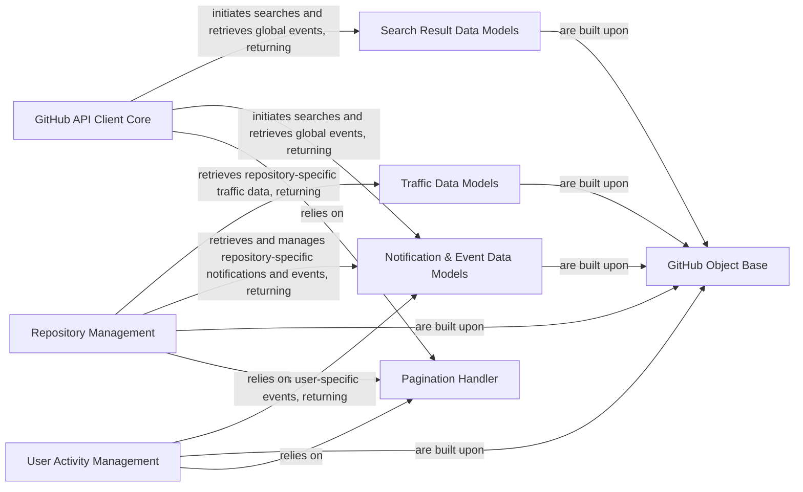

## Component Details

The `Search, Traffic & Notifications` subsystem in PyGithub provides functionalities for searching various GitHub entities, retrieving repository traffic data, and managing user notifications and general GitHub events. The core interaction flow involves the `GitHub API Client Core` initiating requests, which then leverage the `Pagination Handler` for efficient data retrieval. The results of these operations are encapsulated in dedicated data models such as `Search Result Data Models`, `Traffic Data Models`, and `Notification & Event Data Models`. Specific entity management components like `Repository Management` and `User Activity Management` extend these capabilities by offering methods to access and manipulate traffic, notifications, and events pertinent to repositories and users, respectively. All data models and management components are built upon the `GitHub Object Base`, which provides fundamental object-oriented structures and data parsing utilities.

### GitHub API Client Core
The primary interface for interacting with the GitHub API, responsible for orchestrating API requests, handling authentication, and initiating broad search queries and global event retrieval. It serves as the entry point for most PyGithub operations.

**Related Classes/Methods**:

- <a href="https://github.com/PyGithub/PyGithub/blob/master/github/MainClass.py#L157-L1060" target="_blank" rel="noopener noreferrer">`PyGithub.github.MainClass.Github` (157:1060)</a>

### GitHub Object Base
Provides the fundamental building blocks for all GitHub API objects within PyGithub. It defines common attributes, handles data parsing from API responses, and implements mechanisms for lazy loading and object representation.

**Related Classes/Methods**:

- <a href="https://github.com/PyGithub/PyGithub/blob/master/github/GithubObject.py#L226-L457" target="_blank" rel="noopener noreferrer">`PyGithub.github.GithubObject.GithubObject` (226:457)</a>
- <a href="https://github.com/PyGithub/PyGithub/blob/master/github/GithubObject.py#L476-L594" target="_blank" rel="noopener noreferrer">`PyGithub.github.GithubObject.CompletableGithubObject` (476:594)</a>
- <a href="https://github.com/PyGithub/PyGithub/blob/master/github/GithubObject.py#L114-L124" target="_blank" rel="noopener noreferrer">`PyGithub.github.GithubObject._NotSetType` (114:124)</a>
- <a href="https://github.com/PyGithub/PyGithub/blob/master/github/GithubObject.py#L132-L133" target="_blank" rel="noopener noreferrer">`PyGithub.github.GithubObject.is_defined` (132:133)</a>
- <a href="https://github.com/PyGithub/PyGithub/blob/master/github/GithubObject.py#L140-L141" target="_blank" rel="noopener noreferrer">`PyGithub.github.GithubObject.is_optional` (140:141)</a>
- <a href="https://github.com/PyGithub/PyGithub/blob/master/github/GithubObject.py#L434-L451" target="_blank" rel="noopener noreferrer">`PyGithub.github.GithubObject.get__repr__` (434:451)</a>
- <a href="https://github.com/PyGithub/PyGithub/blob/master/github/GithubObject.py#L326-L327" target="_blank" rel="noopener noreferrer">`PyGithub.github.GithubObject._makeStringAttribute` (326:327)</a>
- <a href="https://github.com/PyGithub/PyGithub/blob/master/github/GithubObject.py#L330-L331" target="_blank" rel="noopener noreferrer">`PyGithub.github.GithubObject._makeIntAttribute` (330:331)</a>
- <a href="https://github.com/PyGithub/PyGithub/blob/master/github/GithubObject.py#L338-L339" target="_blank" rel="noopener noreferrer">`PyGithub.github.GithubObject._makeFloatAttribute` (338:339)</a>
- <a href="https://github.com/PyGithub/PyGithub/blob/master/github/GithubObject.py#L342-L343" target="_blank" rel="noopener noreferrer">`PyGithub.github.GithubObject._makeBoolAttribute` (342:343)</a>
- <a href="https://github.com/PyGithub/PyGithub/blob/master/github/GithubObject.py#L346-L347" target="_blank" rel="noopener noreferrer">`PyGithub.github.GithubObject._makeDictAttribute` (346:347)</a>
- <a href="https://github.com/PyGithub/PyGithub/blob/master/github/GithubObject.py#L350-L355" target="_blank" rel="noopener noreferrer">`PyGithub.github.GithubObject._makeTimestampAttribute` (350:355)</a>
- <a href="https://github.com/PyGithub/PyGithub/blob/master/github/GithubObject.py#L358-L359" target="_blank" rel="noopener noreferrer">`PyGithub.github.GithubObject._makeDatetimeAttribute` (358:359)</a>
- <a href="https://github.com/PyGithub/PyGithub/blob/master/github/GithubObject.py#L362-L363" target="_blank" rel="noopener noreferrer">`PyGithub.github.GithubObject._makeHttpDatetimeAttribute` (362:363)</a>
- <a href="https://github.com/PyGithub/PyGithub/blob/master/github/GithubObject.py#L365-L370" target="_blank" rel="noopener noreferrer">`PyGithub.github.GithubObject._makeClassAttribute` (365:370)</a>
- <a href="https://github.com/PyGithub/PyGithub/blob/master/github/GithubObject.py#L373-L374" target="_blank" rel="noopener noreferrer">`PyGithub.github.GithubObject._makeListOfStringsAttribute` (373:374)</a>
- <a href="https://github.com/PyGithub/PyGithub/blob/master/github/GithubObject.py#L377-L378" target="_blank" rel="noopener noreferrer">`PyGithub.github.GithubObject._makeListOfIntsAttribute` (377:378)</a>
- <a href="https://github.com/PyGithub/PyGithub/blob/master/github/GithubObject.py#L381-L382" target="_blank" rel="noopener noreferrer">`PyGithub.github.GithubObject._makeListOfDictsAttribute` (381:382)</a>
- <a href="https://github.com/PyGithub/PyGithub/blob/master/github/GithubObject.py#L385-L388" target="_blank" rel="noopener noreferrer">`PyGithub.github.GithubObject._makeListOfListOfStringsAttribute` (385:388)</a>
- <a href="https://github.com/PyGithub/PyGithub/blob/master/github/GithubObject.py#L390-L394" target="_blank" rel="noopener noreferrer">`PyGithub.github.GithubObject._makeListOfClassesAttribute` (390:394)</a>
- <a href="https://github.com/PyGithub/PyGithub/blob/master/github/GithubObject.py#L396-L411" target="_blank" rel="noopener noreferrer">`PyGithub.github.GithubObject._makeDictOfStringsToClassesAttribute` (396:411)</a>
- <a href="https://github.com/PyGithub/PyGithub/blob/master/github/GithubObject.py#L296-L297" target="_blank" rel="noopener noreferrer">`PyGithub.github.GithubObject._parentUrl` (296:297)</a>
- <a href="https://github.com/PyGithub/PyGithub/blob/master/github/GithubObject.py#L152-L153" target="_blank" rel="noopener noreferrer">`PyGithub.github.GithubObject.as_rest_api_attributes` (152:153)</a>
- <a href="https://github.com/PyGithub/PyGithub/blob/master/github/GithubObject.py#L200-L201" target="_blank" rel="noopener noreferrer">`PyGithub.github.GithubObject.as_rest_api_attributes_list` (200:201)</a>
- <a href="https://github.com/PyGithub/PyGithub/blob/master/github/GithubObject.py#L83-L95" target="_blank" rel="noopener noreferrer">`PyGithub.github.GithubObject._datetime_from_http_date` (83:95)</a>
- <a href="https://github.com/PyGithub/PyGithub/blob/master/github/GithubObject.py#L98-L111" target="_blank" rel="noopener noreferrer">`PyGithub.github.GithubObject._datetime_from_github_isoformat` (98:111)</a>
- <a href="https://github.com/PyGithub/PyGithub/blob/master/github/GithubObject.py#L561-L563" target="_blank" rel="noopener noreferrer">`PyGithub.github.GithubObject.CompletableGithubObject._completeIfNeeded` (561:563)</a>

### Pagination Handler
A utility component responsible for abstracting the complexities of paginated API responses, allowing seamless iteration and access to large collections of GitHub objects.

**Related Classes/Methods**:

- <a href="https://github.com/PyGithub/PyGithub/blob/master/github/PaginatedList.py#L128-L450" target="_blank" rel="noopener noreferrer">`PyGithub.github.PaginatedList.PaginatedList` (128:450)</a>

### Search Result Data Models
Defines the data structures for various search results, including commits, issues, repositories, and users, encapsulating the specific attributes returned by search API endpoints.

**Related Classes/Methods**:

- <a href="https://github.com/PyGithub/PyGithub/blob/master/github/Commit.py#L364-L391" target="_blank" rel="noopener noreferrer">`PyGithub.github.Commit.CommitSearchResult` (364:391)</a>
- <a href="https://github.com/PyGithub/PyGithub/blob/master/github/Issue.py#L668-L697" target="_blank" rel="noopener noreferrer">`PyGithub.github.Issue.IssueSearchResult` (668:697)</a>
- <a href="https://github.com/PyGithub/PyGithub/blob/master/github/Repository.py#L4659-L4694" target="_blank" rel="noopener noreferrer">`PyGithub.github.Repository.RepositorySearchResult` (4659:4694)</a>
- <a href="https://github.com/PyGithub/PyGithub/blob/master/github/NamedUser.py#L689-L715" target="_blank" rel="noopener noreferrer">`PyGithub.github.NamedUser.NamedUserSearchResult` (689:715)</a>

### Traffic Data Models
Defines the data structures for repository traffic statistics, such as views, clones, referrers, and paths, providing a structured representation of usage data.

**Related Classes/Methods**:

- <a href="https://github.com/PyGithub/PyGithub/blob/master/github/Traffic.py#L49-L93" target="_blank" rel="noopener noreferrer">`PyGithub.github.Traffic.Traffic` (49:93)</a>
- <a href="https://github.com/PyGithub/PyGithub/blob/master/github/View.py#L52-L95" target="_blank" rel="noopener noreferrer">`PyGithub.github.View.View` (52:95)</a>
- <a href="https://github.com/PyGithub/PyGithub/blob/master/github/Clones.py#L52-L95" target="_blank" rel="noopener noreferrer">`PyGithub.github.Clones.Clones` (52:95)</a>
- <a href="https://github.com/PyGithub/PyGithub/blob/master/github/Referrer.py#L47-L91" target="_blank" rel="noopener noreferrer">`PyGithub.github.Referrer.Referrer` (47:91)</a>
- <a href="https://github.com/PyGithub/PyGithub/blob/master/github/Path.py#L47-L99" target="_blank" rel="noopener noreferrer">`PyGithub.github.Path.Path` (47:99)</a>

### Notification & Event Data Models
Defines the data structures for user notifications and various GitHub events, enabling the representation and processing of activity streams.

**Related Classes/Methods**:

- <a href="https://github.com/PyGithub/PyGithub/blob/master/github/Notification.py#L58-L175" target="_blank" rel="noopener noreferrer">`PyGithub.github.Notification.Notification` (58:175)</a>
- <a href="https://github.com/PyGithub/PyGithub/blob/master/github/NotificationSubject.py#L48-L93" target="_blank" rel="noopener noreferrer">`PyGithub.github.NotificationSubject.NotificationSubject` (48:93)</a>
- <a href="https://github.com/PyGithub/PyGithub/blob/master/github/Event.py#L53-L126" target="_blank" rel="noopener noreferrer">`PyGithub.github.Event.Event` (53:126)</a>
- <a href="https://github.com/PyGithub/PyGithub/blob/master/github/TimelineEvent.py#L56-L154" target="_blank" rel="noopener noreferrer">`PyGithub.github.TimelineEvent.TimelineEvent` (56:154)</a>
- <a href="https://github.com/PyGithub/PyGithub/blob/master/github/TimelineEventSource.py#L52-L80" target="_blank" rel="noopener noreferrer">`PyGithub.github.TimelineEventSource.TimelineEventSource` (52:80)</a>

### Repository Management
Manages operations related to GitHub repositories, including retrieving traffic data, notifications, and events specific to a repository.

**Related Classes/Methods**:

- <a href="https://github.com/PyGithub/PyGithub/blob/master/github/Repository.py#L328-L4656" target="_blank" rel="noopener noreferrer">`PyGithub.github.Repository.Repository` (328:4656)</a>
- <a href="https://github.com/PyGithub/PyGithub/blob/master/github/Repository.py#L2590-L2596" target="_blank" rel="noopener noreferrer">`PyGithub.github.Repository.Repository:get_top_referrers` (2590:2596)</a>
- <a href="https://github.com/PyGithub/PyGithub/blob/master/github/Repository.py#L2598-L2605" target="_blank" rel="noopener noreferrer">`PyGithub.github.Repository.Repository:get_top_paths` (2598:2605)</a>
- <a href="https://github.com/PyGithub/PyGithub/blob/master/github/Repository.py#L2607-L2620" target="_blank" rel="noopener noreferrer">`PyGithub.github.Repository.Repository:get_views_traffic` (2607:2620)</a>
- <a href="https://github.com/PyGithub/PyGithub/blob/master/github/Repository.py#L2622-L2633" target="_blank" rel="noopener noreferrer">`PyGithub.github.Repository.Repository:get_clones_traffic` (2622:2633)</a>
- <a href="https://github.com/PyGithub/PyGithub/blob/master/github/Repository.py#L3801-L3833" target="_blank" rel="noopener noreferrer">`PyGithub.github.Repository.Repository:get_notifications` (3801:3833)</a>
- <a href="https://github.com/PyGithub/PyGithub/blob/master/github/Repository.py#L3835-L3843" target="_blank" rel="noopener noreferrer">`PyGithub.github.Repository.Repository:mark_notifications_as_read` (3835:3843)</a>
- <a href="https://github.com/PyGithub/PyGithub/blob/master/github/Repository.py#L2900-L2905" target="_blank" rel="noopener noreferrer">`PyGithub.github.Repository.Repository:get_events` (2900:2905)</a>

### User Activity Management
Manages operations related to GitHub users, specifically retrieving events associated with a user.

**Related Classes/Methods**:

- <a href="https://github.com/PyGithub/PyGithub/blob/master/github/NamedUser.py#L86-L686" target="_blank" rel="noopener noreferrer">`PyGithub.github.NamedUser.NamedUser` (86:686)</a>
- <a href="https://github.com/PyGithub/PyGithub/blob/master/github/NamedUser.py#L419-L423" target="_blank" rel="noopener noreferrer">`PyGithub.github.NamedUser.NamedUser:get_events` (419:423)</a>
- <a href="https://github.com/PyGithub/PyGithub/blob/master/github/NamedUser.py#L485-L494" target="_blank" rel="noopener noreferrer">`PyGithub.github.NamedUser.NamedUser:get_public_received_events` (485:494)</a>
- <a href="https://github.com/PyGithub/PyGithub/blob/master/github/NamedUser.py#L496-L502" target="_blank" rel="noopener noreferrer">`PyGithub.github.NamedUser.NamedUser:get_received_events` (496:502)</a>

### [FAQ](https://github.com/CodeBoarding/GeneratedOnBoardings/tree/main?tab=readme-ov-file#faq)