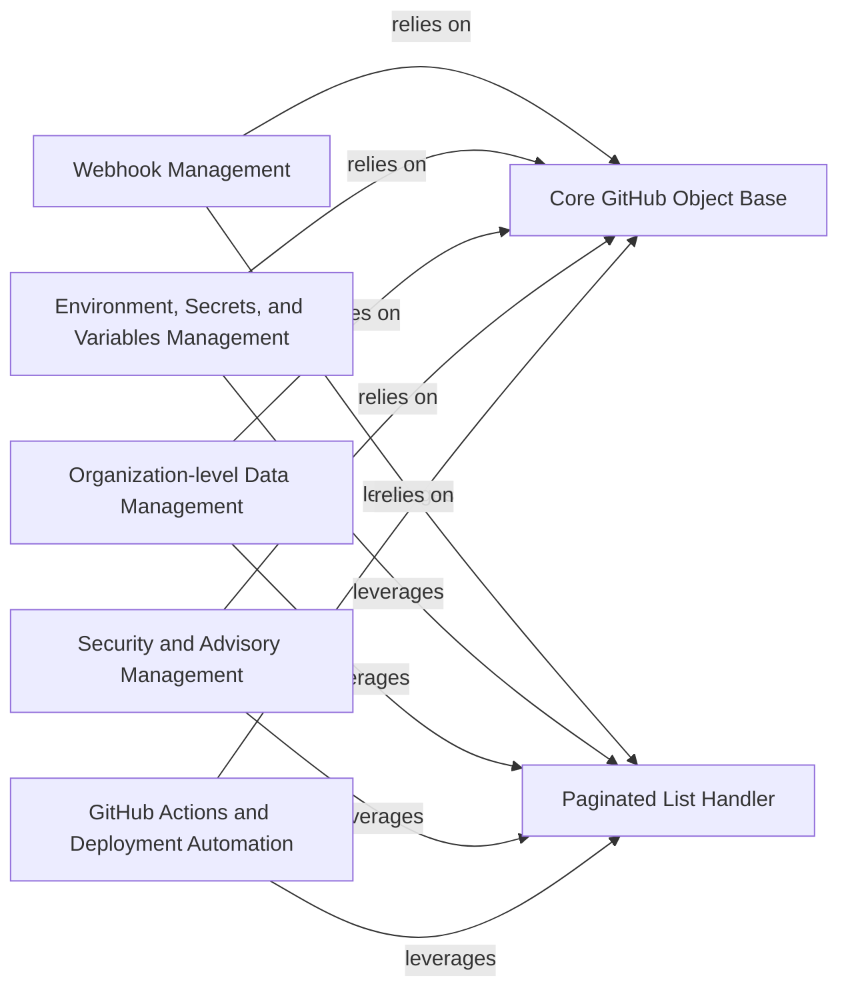

## Component Details

This component provides a comprehensive set of tools within PyGithub for managing various aspects of security, automation, and deployment on GitHub. It encompasses functionalities for handling webhooks, configuring deployment environments with associated secrets and variables, and implementing robust security measures like Dependabot and code scanning alerts, along with repository and global advisories. Furthermore, it facilitates the automation of development workflows through GitHub Actions, enabling the management of workflows, runs, jobs, and deployments. The component relies on core GitHub object representations and utilizes pagination for efficient data retrieval across all its sub-domains.

### Webhook Management
Manages GitHub webhooks, including their creation, configuration, delivery, and responses. It provides interfaces to interact with webhook events and their associated data.

**Related Classes/Methods**:

- <a href="https://github.com/PyGithub/PyGithub/blob/master/github/Hook.py#L53-L226" target="_blank" rel="noopener noreferrer">`PyGithub.github.Hook.Hook` (53:226)</a>
- <a href="https://github.com/PyGithub/PyGithub/blob/master/github/HookDelivery.py#L207-L237" target="_blank" rel="noopener noreferrer">`PyGithub.github.HookDelivery.HookDelivery` (207:237)</a>
- <a href="https://github.com/PyGithub/PyGithub/blob/master/github/HookDelivery.py#L37-L142" target="_blank" rel="noopener noreferrer">`PyGithub.github.HookDelivery.HookDeliverySummary` (37:142)</a>
- <a href="https://github.com/PyGithub/PyGithub/blob/master/github/HookDelivery.py#L145-L173" target="_blank" rel="noopener noreferrer">`PyGithub.github.HookDelivery.HookDeliveryRequest` (145:173)</a>
- <a href="https://github.com/PyGithub/PyGithub/blob/master/github/HookDelivery.py#L176-L204" target="_blank" rel="noopener noreferrer">`PyGithub.github.HookDelivery.HookDeliveryResponse` (176:204)</a>
- <a href="https://github.com/PyGithub/PyGithub/blob/master/github/HookDescription.py#L46-L84" target="_blank" rel="noopener noreferrer">`PyGithub.github.HookDescription.HookDescription` (46:84)</a>
- <a href="https://github.com/PyGithub/PyGithub/blob/master/github/HookResponse.py#L45-L80" target="_blank" rel="noopener noreferrer">`PyGithub.github.HookResponse.HookResponse` (45:80)</a>

### Environment, Secrets, and Variables Management
Handles the management of deployment environments, including environment-specific secrets, variables, and protection rules. It also covers public keys used for secret encryption.

**Related Classes/Methods**:

- <a href="https://github.com/PyGithub/PyGithub/blob/master/github/Environment.py#L61-L299" target="_blank" rel="noopener noreferrer">`PyGithub.github.Environment.Environment` (61:299)</a>
- <a href="https://github.com/PyGithub/PyGithub/blob/master/github/Secret.py#L48-L125" target="_blank" rel="noopener noreferrer">`PyGithub.github.Secret.Secret` (48:125)</a>
- <a href="https://github.com/PyGithub/PyGithub/blob/master/github/Variable.py#L36-L143" target="_blank" rel="noopener noreferrer">`PyGithub.github.Variable.Variable` (36:143)</a>
- <a href="https://github.com/PyGithub/PyGithub/blob/master/github/EnvironmentDeploymentBranchPolicy.py#L35-L63" target="_blank" rel="noopener noreferrer">`PyGithub.github.EnvironmentDeploymentBranchPolicy.EnvironmentDeploymentBranchPolicy` (35:63)</a>
- <a href="https://github.com/PyGithub/PyGithub/blob/master/github/EnvironmentProtectionRule.py#L54-L108" target="_blank" rel="noopener noreferrer">`PyGithub.github.EnvironmentProtectionRule.EnvironmentProtectionRule` (54:108)</a>
- <a href="https://github.com/PyGithub/PyGithub/blob/master/github/EnvironmentProtectionRuleReviewer.py#L51-L83" target="_blank" rel="noopener noreferrer">`PyGithub.github.EnvironmentProtectionRuleReviewer.EnvironmentProtectionRuleReviewer` (51:83)</a>
- <a href="https://github.com/PyGithub/PyGithub/blob/master/github/PublicKey.py#L63-L136" target="_blank" rel="noopener noreferrer">`PyGithub.github.PublicKey.PublicKey` (63:136)</a>

### Organization-level Data Management
Focuses on managing secrets and variables that are defined at the organization level, providing a centralized way to handle sensitive data and configuration across multiple repositories within an organization.

**Related Classes/Methods**:

- <a href="https://github.com/PyGithub/PyGithub/blob/master/github/OrganizationSecret.py#L38-L139" target="_blank" rel="noopener noreferrer">`PyGithub.github.OrganizationSecret.OrganizationSecret` (38:139)</a>
- <a href="https://github.com/PyGithub/PyGithub/blob/master/github/OrganizationVariable.py#L37-L135" target="_blank" rel="noopener noreferrer">`PyGithub.github.OrganizationVariable.OrganizationVariable` (37:135)</a>

### Security and Advisory Management
Provides comprehensive functionality for GitHub's security features, including managing Dependabot alerts, code scanning alerts, repository advisories, and global advisories. It also handles related entities like vulnerabilities, credits, and security configurations.

**Related Classes/Methods**:

- <a href="https://github.com/PyGithub/PyGithub/blob/master/github/CodeSecurityConfig.py#L32-L238" target="_blank" rel="noopener noreferrer">`PyGithub.github.CodeSecurityConfig.CodeSecurityConfig` (32:238)</a>
- <a href="https://github.com/PyGithub/PyGithub/blob/master/github/DependabotAlert.py#L46-L174" target="_blank" rel="noopener noreferrer">`PyGithub.github.DependabotAlert.DependabotAlert` (46:174)</a>
- <a href="https://github.com/PyGithub/PyGithub/blob/master/github/CodeScanAlert.py#L43-L174" target="_blank" rel="noopener noreferrer">`PyGithub.github.CodeScanAlert.CodeScanAlert` (43:174)</a>
- <a href="https://github.com/PyGithub/PyGithub/blob/master/github/RepositoryAdvisory.py#L54-L424" target="_blank" rel="noopener noreferrer">`PyGithub.github.RepositoryAdvisory.RepositoryAdvisory` (54:424)</a>
- <a href="https://github.com/PyGithub/PyGithub/blob/master/github/GlobalAdvisory.py#L44-L139" target="_blank" rel="noopener noreferrer">`PyGithub.github.GlobalAdvisory.GlobalAdvisory` (44:139)</a>
- <a href="https://github.com/PyGithub/PyGithub/blob/master/github/AdvisoryBase.py#L37-L157" target="_blank" rel="noopener noreferrer">`PyGithub.github.AdvisoryBase.AdvisoryBase` (37:157)</a>
- <a href="https://github.com/PyGithub/PyGithub/blob/master/github/AdvisoryCredit.py#L52-L126" target="_blank" rel="noopener noreferrer">`PyGithub.github.AdvisoryCredit.AdvisoryCredit` (52:126)</a>
- <a href="https://github.com/PyGithub/PyGithub/blob/master/github/AdvisoryCreditDetailed.py#L51-L104" target="_blank" rel="noopener noreferrer">`PyGithub.github.AdvisoryCreditDetailed.AdvisoryCreditDetailed` (51:104)</a>
- <a href="https://github.com/PyGithub/PyGithub/blob/master/github/AdvisoryVulnerability.py#L66-L190" target="_blank" rel="noopener noreferrer">`PyGithub.github.AdvisoryVulnerability.AdvisoryVulnerability` (66:190)</a>
- <a href="https://github.com/PyGithub/PyGithub/blob/master/github/AdvisoryVulnerabilityPackage.py#L52-L91" target="_blank" rel="noopener noreferrer">`PyGithub.github.AdvisoryVulnerabilityPackage.AdvisoryVulnerabilityPackage` (52:91)</a>
- <a href="https://github.com/PyGithub/PyGithub/blob/master/github/DependabotAlertAdvisory.py#L38-L73" target="_blank" rel="noopener noreferrer">`PyGithub.github.DependabotAlertAdvisory.DependabotAlertAdvisory` (38:73)</a>
- <a href="https://github.com/PyGithub/PyGithub/blob/master/github/DependabotAlertDependency.py#L34-L80" target="_blank" rel="noopener noreferrer">`PyGithub.github.DependabotAlertDependency.DependabotAlertDependency` (34:80)</a>
- <a href="https://github.com/PyGithub/PyGithub/blob/master/github/DependabotAlertVulnerability.py#L36-L83" target="_blank" rel="noopener noreferrer">`PyGithub.github.DependabotAlertVulnerability.DependabotAlertVulnerability` (36:83)</a>
- <a href="https://github.com/PyGithub/PyGithub/blob/master/github/CodeScanAlertInstance.py#L40-L115" target="_blank" rel="noopener noreferrer">`PyGithub.github.CodeScanAlertInstance.CodeScanAlertInstance` (40:115)</a>
- <a href="https://github.com/PyGithub/PyGithub/blob/master/github/CodeScanAlertInstanceLocation.py#L36-L96" target="_blank" rel="noopener noreferrer">`PyGithub.github.CodeScanAlertInstanceLocation.CodeScanAlertInstanceLocation` (36:96)</a>
- <a href="https://github.com/PyGithub/PyGithub/blob/master/github/CodeScanRule.py#L49-L98" target="_blank" rel="noopener noreferrer">`PyGithub.github.CodeScanRule.CodeScanRule` (49:98)</a>
- <a href="https://github.com/PyGithub/PyGithub/blob/master/github/CodeScanTool.py#L47-L88" target="_blank" rel="noopener noreferrer">`PyGithub.github.CodeScanTool.CodeScanTool` (47:88)</a>
- <a href="https://github.com/PyGithub/PyGithub/blob/master/github/RepoCodeSecurityConfig.py#L53-L90" target="_blank" rel="noopener noreferrer">`PyGithub.github.RepoCodeSecurityConfig.RepoCodeSecurityConfig` (53:90)</a>
- <a href="https://github.com/PyGithub/PyGithub/blob/master/github/SecurityAndAnalysis.py#L51-L141" target="_blank" rel="noopener noreferrer">`PyGithub.github.SecurityAndAnalysis.SecurityAndAnalysis` (51:141)</a>
- <a href="https://github.com/PyGithub/PyGithub/blob/master/github/SecurityAndAnalysisFeature.py#L46-L71" target="_blank" rel="noopener noreferrer">`PyGithub.github.SecurityAndAnalysisFeature.SecurityAndAnalysisFeature` (46:71)</a>
- <a href="https://github.com/PyGithub/PyGithub/blob/master/github/CWE.py#L47-L72" target="_blank" rel="noopener noreferrer">`PyGithub.github.CWE.CWE` (47:72)</a>
- <a href="https://github.com/PyGithub/PyGithub/blob/master/github/CVSS.py#L49-L81" target="_blank" rel="noopener noreferrer">`PyGithub.github.CVSS.CVSS` (49:81)</a>
- <a href="https://github.com/PyGithub/PyGithub/blob/master/github/DefaultCodeSecurityConfig.py#L50-L87" target="_blank" rel="noopener noreferrer">`PyGithub.github.DefaultCodeSecurityConfig.DefaultCodeSecurityConfig` (50:87)</a>

### GitHub Actions and Deployment Automation
Facilitates the automation of software development workflows and deployments using GitHub Actions. It includes managing workflows, runs, jobs, steps, artifacts, and self-hosted runners, as well as handling deployments and their statuses.

**Related Classes/Methods**:

- <a href="https://github.com/PyGithub/PyGithub/blob/master/github/Workflow.py#L61-L257" target="_blank" rel="noopener noreferrer">`PyGithub.github.Workflow.Workflow` (61:257)</a>
- <a href="https://github.com/PyGithub/PyGithub/blob/master/github/WorkflowRun.py#L75-L459" target="_blank" rel="noopener noreferrer">`PyGithub.github.WorkflowRun.WorkflowRun` (75:459)</a>
- <a href="https://github.com/PyGithub/PyGithub/blob/master/github/WorkflowJob.py#L41-L243" target="_blank" rel="noopener noreferrer">`PyGithub.github.WorkflowJob.WorkflowJob` (41:243)</a>
- <a href="https://github.com/PyGithub/PyGithub/blob/master/github/WorkflowStep.py#L48-L110" target="_blank" rel="noopener noreferrer">`PyGithub.github.WorkflowStep.WorkflowStep` (48:110)</a>
- <a href="https://github.com/PyGithub/PyGithub/blob/master/github/Artifact.py#L58-L172" target="_blank" rel="noopener noreferrer">`PyGithub.github.Artifact.Artifact` (58:172)</a>
- <a href="https://github.com/PyGithub/PyGithub/blob/master/github/SelfHostedActionsRunner.py#L47-L113" target="_blank" rel="noopener noreferrer">`PyGithub.github.SelfHostedActionsRunner.SelfHostedActionsRunner` (47:113)</a>
- <a href="https://github.com/PyGithub/PyGithub/blob/master/github/Deployment.py#L64-L299" target="_blank" rel="noopener noreferrer">`PyGithub.github.Deployment.Deployment` (64:299)</a>
- <a href="https://github.com/PyGithub/PyGithub/blob/master/github/DeploymentStatus.py#L60-L199" target="_blank" rel="noopener noreferrer">`PyGithub.github.DeploymentStatus.DeploymentStatus` (60:199)</a>

### Core GitHub Object Base
Provides the foundational classes for all GitHub objects within PyGithub, handling common attributes, their completion, and string representations. It includes mechanisms for dynamically setting attributes based on data received from the GitHub API.

**Related Classes/Methods**:

- <a href="https://github.com/PyGithub/PyGithub/blob/master/github/GithubObject.py#L226-L457" target="_blank" rel="noopener noreferrer">`PyGithub.github.GithubObject.GithubObject` (226:457)</a>
- <a href="https://github.com/PyGithub/PyGithub/blob/master/github/GithubObject.py#L476-L594" target="_blank" rel="noopener noreferrer">`PyGithub.github.GithubObject.CompletableGithubObject` (476:594)</a>
- <a href="https://github.com/PyGithub/PyGithub/blob/master/github/GithubObject.py#L114-L124" target="_blank" rel="noopener noreferrer">`PyGithub.github.GithubObject._NotSetType` (114:124)</a>

### Paginated List Handler
Responsible for managing and iterating over paginated lists of resources returned by the GitHub API, providing a convenient way to access large datasets.

**Related Classes/Methods**:

- <a href="https://github.com/PyGithub/PyGithub/blob/master/github/PaginatedList.py#L128-L450" target="_blank" rel="noopener noreferrer">`PyGithub.github.PaginatedList.PaginatedList` (128:450)</a>

### [FAQ](https://github.com/CodeBoarding/GeneratedOnBoardings/tree/main?tab=readme-ov-file#faq)