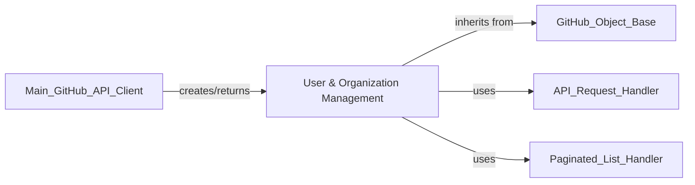

## Component Details

The User & Organization Management component in PyGithub is responsible for encapsulating and managing various GitHub entities related to users, organizations, and teams. This includes handling user profiles (named and authenticated), organization details, team structures, and associated administrative aspects like memberships, invitations, and enterprise-level user and license information. It provides methods to retrieve, update, and interact with these entities, leveraging the underlying API Request Handler for communication with the GitHub API and the Paginated List Handler for efficient data retrieval of lists of users, organizations, or other related resources.

### User & Organization Management
This component provides functionalities for managing GitHub users, organizations, teams, and their associated memberships, invitations, and enterprise-level user details. It encapsulates the representation and operations related to these entities.

**Related Classes/Methods**:

- <a href="https://github.com/PyGithub/PyGithub/blob/master/github/NamedUser.py#L86-L686" target="_blank" rel="noopener noreferrer">`PyGithub.github.NamedUser.NamedUser` (86:686)</a>
- <a href="https://github.com/PyGithub/PyGithub/blob/master/github/AuthenticatedUser.py#L146-L1178" target="_blank" rel="noopener noreferrer">`PyGithub.github.AuthenticatedUser.AuthenticatedUser` (146:1178)</a>
- <a href="https://github.com/PyGithub/PyGithub/blob/master/github/Organization.py#L150-L2014" target="_blank" rel="noopener noreferrer">`PyGithub.github.Organization.Organization` (150:2014)</a>
- <a href="https://github.com/PyGithub/PyGithub/blob/master/github/Team.py#L92-L538" target="_blank" rel="noopener noreferrer">`PyGithub.github.Team.Team` (92:538)</a>
- <a href="https://github.com/PyGithub/PyGithub/blob/master/github/Membership.py#L58-L131" target="_blank" rel="noopener noreferrer">`PyGithub.github.Membership.Membership` (58:131)</a>
- <a href="https://github.com/PyGithub/PyGithub/blob/master/github/Invitation.py#L58-L156" target="_blank" rel="noopener noreferrer">`PyGithub.github.Invitation.Invitation` (58:156)</a>
- <a href="https://github.com/PyGithub/PyGithub/blob/master/github/NamedEnterpriseUser.py#L33-L205" target="_blank" rel="noopener noreferrer">`PyGithub.github.NamedEnterpriseUser.NamedEnterpriseUser` (33:205)</a>
- `PyGithub.github.OrganizationInvitation.OrganizationInvitation` (full file reference)
- <a href="https://github.com/PyGithub/PyGithub/blob/master/github/UserKey.py#L50-L130" target="_blank" rel="noopener noreferrer">`PyGithub.github.UserKey.UserKey` (50:130)</a>
- <a href="https://github.com/PyGithub/PyGithub/blob/master/github/Permissions.py#L46-L109" target="_blank" rel="noopener noreferrer">`PyGithub.github.Permissions.Permissions` (46:109)</a>
- <a href="https://github.com/PyGithub/PyGithub/blob/master/github/Enterprise.py#L50-L97" target="_blank" rel="noopener noreferrer">`PyGithub.github.Enterprise.Enterprise` (50:97)</a>
- <a href="https://github.com/PyGithub/PyGithub/blob/master/github/EnterpriseConsumedLicenses.py#L49-L110" target="_blank" rel="noopener noreferrer">`PyGithub.github.EnterpriseConsumedLicenses.EnterpriseConsumedLicenses` (49:110)</a>
- <a href="https://github.com/PyGithub/PyGithub/blob/master/github/Copilot.py#L37-L96" target="_blank" rel="noopener noreferrer">`PyGithub.github.Copilot.Copilot` (37:96)</a>
- <a href="https://github.com/PyGithub/PyGithub/blob/master/github/CopilotSeat.py#L38-L118" target="_blank" rel="noopener noreferrer">`PyGithub.github.CopilotSeat.CopilotSeat` (38:118)</a>

### [FAQ](https://github.com/CodeBoarding/GeneratedOnBoardings/tree/main?tab=readme-ov-file#faq)