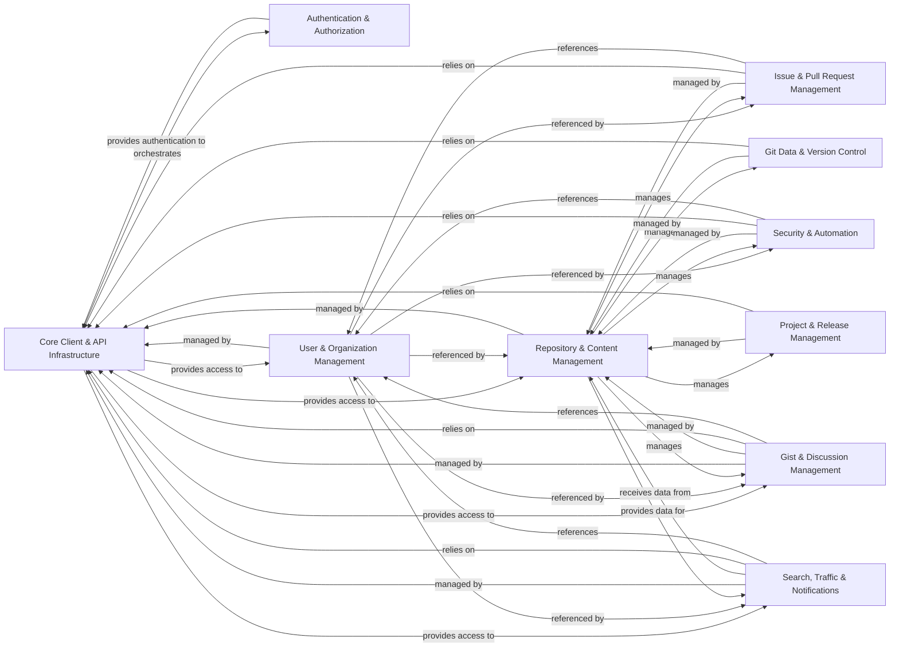

## Component Details

The PyGithub library provides a comprehensive interface for interacting with the GitHub API. Its core functionality revolves around the `Github` object, which orchestrates API requests through a dedicated communication layer, handling authentication, rate limiting, and error management. Various components manage specific GitHub entities like users, repositories, issues, and projects, with clear relationships defining how these entities interact and are managed within the system.

### Core Client & API Infrastructure
This component provides the foundational elements for interacting with the GitHub API. It includes the main `Github` object, responsible for orchestrating API calls, and the `Requester` which handles the low-level HTTP communication, rate limiting, and error handling. It also includes base classes for all GitHub objects and pagination utilities.

**Related Classes/Methods**:

- <a href="https://github.com/PyGithub/PyGithub/blob/master/github/MainClass.py#L157-L1060" target="_blank" rel="noopener noreferrer">`PyGithub.github.MainClass.Github` (157:1060)</a>
- <a href="https://github.com/PyGithub/PyGithub/blob/master/github/Requester.py#L287-L1290" target="_blank" rel="noopener noreferrer">`PyGithub.github.Requester.Requester` (287:1290)</a>
- <a href="https://github.com/PyGithub/PyGithub/blob/master/github/Requester.py#L150-L220" target="_blank" rel="noopener noreferrer">`PyGithub.github.Requester.HTTPSRequestsConnectionClass` (150:220)</a>
- <a href="https://github.com/PyGithub/PyGithub/blob/master/github/Requester.py#L223-L284" target="_blank" rel="noopener noreferrer">`PyGithub.github.Requester.HTTPRequestsConnectionClass` (223:284)</a>
- <a href="https://github.com/PyGithub/PyGithub/blob/master/github/GithubObject.py#L226-L457" target="_blank" rel="noopener noreferrer">`PyGithub.github.GithubObject.GithubObject` (226:457)</a>
- <a href="https://github.com/PyGithub/PyGithub/blob/master/github/GithubObject.py#L476-L594" target="_blank" rel="noopener noreferrer">`PyGithub.github.GithubObject.CompletableGithubObject` (476:594)</a>
- <a href="https://github.com/PyGithub/PyGithub/blob/master/github/GithubObject.py#L466-L473" target="_blank" rel="noopener noreferrer">`PyGithub.github.GithubObject.NonCompletableGithubObject` (466:473)</a>
- <a href="https://github.com/PyGithub/PyGithub/blob/master/github/GithubException.py#L45-L105" target="_blank" rel="noopener noreferrer">`PyGithub.github.GithubException.GithubException` (45:105)</a>
- <a href="https://github.com/PyGithub/PyGithub/blob/master/github/PaginatedList.py#L128-L450" target="_blank" rel="noopener noreferrer">`PyGithub.github.PaginatedList.PaginatedList` (128:450)</a>
- <a href="https://github.com/PyGithub/PyGithub/blob/master/github/Rate.py#L49-L100" target="_blank" rel="noopener noreferrer">`PyGithub.github.Rate.Rate` (49:100)</a>
- <a href="https://github.com/PyGithub/PyGithub/blob/master/github/RateLimit.py#L53-L166" target="_blank" rel="noopener noreferrer">`PyGithub.github.RateLimit.RateLimit` (53:166)</a>
- <a href="https://github.com/PyGithub/PyGithub/blob/master/github/RateLimitOverview.py#L35-L66" target="_blank" rel="noopener noreferrer">`PyGithub.github.RateLimitOverview.RateLimitOverview` (35:66)</a>

### Authentication & Authorization
This component is responsible for managing various authentication methods (e.g., username/password, tokens, GitHub Apps, JWT) to secure access to the GitHub API and obtain necessary authorization tokens. It provides classes for different authentication flows and handles the masking of sensitive information for logging.

**Related Classes/Methods**:

- <a href="https://github.com/PyGithub/PyGithub/blob/master/github/Auth.py#L127-L151" target="_blank" rel="noopener noreferrer">`PyGithub.github.Auth.Login` (127:151)</a>
- <a href="https://github.com/PyGithub/PyGithub/blob/master/github/Auth.py#L154-L174" target="_blank" rel="noopener noreferrer">`PyGithub.github.Auth.Token` (154:174)</a>
- <a href="https://github.com/PyGithub/PyGithub/blob/master/github/Auth.py#L293-L308" target="_blank" rel="noopener noreferrer">`PyGithub.github.Auth.AppAuthToken` (293:308)</a>
- <a href="https://github.com/PyGithub/PyGithub/blob/master/github/Auth.py#L203-L290" target="_blank" rel="noopener noreferrer">`PyGithub.github.Auth.AppAuth` (203:290)</a>
- <a href="https://github.com/PyGithub/PyGithub/blob/master/github/Auth.py#L311-L392" target="_blank" rel="noopener noreferrer">`PyGithub.github.Auth.AppInstallationAuth` (311:392)</a>
- <a href="https://github.com/PyGithub/PyGithub/blob/master/github/Auth.py#L395-L514" target="_blank" rel="noopener noreferrer">`PyGithub.github.Auth.AppUserAuth` (395:514)</a>
- <a href="https://github.com/PyGithub/PyGithub/blob/master/github/Auth.py#L517-L552" target="_blank" rel="noopener noreferrer">`PyGithub.github.Auth.NetrcAuth` (517:552)</a>
- <a href="https://github.com/PyGithub/PyGithub/blob/master/github/Auth.py#L190-L200" target="_blank" rel="noopener noreferrer">`PyGithub.github.Auth.JwtSigner` (190:200)</a>
- <a href="https://github.com/PyGithub/PyGithub/blob/master/github/Authorization.py#L53-L191" target="_blank" rel="noopener noreferrer">`PyGithub.github.Authorization.Authorization` (53:191)</a>
- <a href="https://github.com/PyGithub/PyGithub/blob/master/github/AuthorizationApplication.py#L44-L70" target="_blank" rel="noopener noreferrer">`PyGithub.github.AuthorizationApplication.AuthorizationApplication` (44:70)</a>
- <a href="https://github.com/PyGithub/PyGithub/blob/master/github/AccessToken.py#L49-L158" target="_blank" rel="noopener noreferrer">`PyGithub.github.AccessToken.AccessToken` (49:158)</a>
- <a href="https://github.com/PyGithub/PyGithub/blob/master/github/GithubApp.py#L56-L218" target="_blank" rel="noopener noreferrer">`PyGithub.github.GithubApp.GithubApp` (56:218)</a>
- <a href="https://github.com/PyGithub/PyGithub/blob/master/github/GithubIntegration.py#L54-L342" target="_blank" rel="noopener noreferrer">`PyGithub.github.GithubIntegration.GithubIntegration` (54:342)</a>
- <a href="https://github.com/PyGithub/PyGithub/blob/master/github/Installation.py#L76-L280" target="_blank" rel="noopener noreferrer">`PyGithub.github.Installation.Installation` (76:280)</a>
- <a href="https://github.com/PyGithub/PyGithub/blob/master/github/InstallationAuthorization.py#L57-L136" target="_blank" rel="noopener noreferrer">`PyGithub.github.InstallationAuthorization.InstallationAuthorization` (57:136)</a>
- <a href="https://github.com/PyGithub/PyGithub/blob/master/github/ApplicationOAuth.py#L48-L198" target="_blank" rel="noopener noreferrer">`PyGithub.github.ApplicationOAuth.ApplicationOAuth` (48:198)</a>

### User & Organization Management
This component provides functionalities for managing GitHub users, organizations, teams, and their associated memberships, invitations, and enterprise-level user details.

**Related Classes/Methods**:

- <a href="https://github.com/PyGithub/PyGithub/blob/master/github/NamedUser.py#L86-L686" target="_blank" rel="noopener noreferrer">`PyGithub.github.NamedUser.NamedUser` (86:686)</a>
- <a href="https://github.com/PyGithub/PyGithub/blob/master/github/AuthenticatedUser.py#L146-L1178" target="_blank" rel="noopener noreferrer">`PyGithub.github.AuthenticatedUser.AuthenticatedUser` (146:1178)</a>
- <a href="https://github.com/PyGithub/PyGithub/blob/master/github/Organization.py#L150-L2014" target="_blank" rel="noopener noreferrer">`PyGithub.github.Organization.Organization` (150:2014)</a>
- <a href="https://github.com/PyGithub/PyGithub/blob/master/github/Team.py#L92-L538" target="_blank" rel="noopener noreferrer">`PyGithub.github.Team.Team` (92:538)</a>
- <a href="https://github.com/PyGithub/PyGithub/blob/master/github/Membership.py#L58-L131" target="_blank" rel="noopener noreferrer">`PyGithub.github.Membership.Membership` (58:131)</a>
- <a href="https://github.com/PyGithub/PyGithub/blob/master/github/Invitation.py#L58-L156" target="_blank" rel="noopener noreferrer">`PyGithub.github.Invitation.Invitation` (58:156)</a>
- <a href="https://github.com/PyGithub/PyGithub/blob/master/github/NamedEnterpriseUser.py#L33-L205" target="_blank" rel="noopener noreferrer">`PyGithub.github.NamedEnterpriseUser.NamedEnterpriseUser` (33:205)</a>
- `PyGithub.github.OrganizationInvitation.OrganizationInvitation` (full file reference)
- <a href="https://github.com/PyGithub/PyGithub/blob/master/github/UserKey.py#L50-L130" target="_blank" rel="noopener noreferrer">`PyGithub.github.UserKey.UserKey` (50:130)</a>
- <a href="https://github.com/PyGithub/PyGithub/blob/master/github/Permissions.py#L46-L109" target="_blank" rel="noopener noreferrer">`PyGithub.github.Permissions.Permissions` (46:109)</a>
- <a href="https://github.com/PyGithub/PyGithub/blob/master/github/Enterprise.py#L50-L97" target="_blank" rel="noopener noreferrer">`PyGithub.github.Enterprise.Enterprise` (50:97)</a>
- <a href="https://github.com/PyGithub/PyGithub/blob/master/github/EnterpriseConsumedLicenses.py#L49-L110" target="_blank" rel="noopener noreferrer">`PyGithub.github.EnterpriseConsumedLicenses.EnterpriseConsumedLicenses` (49:110)</a>
- <a href="https://github.com/PyGithub/PyGithub/blob/master/github/Copilot.py#L37-L96" target="_blank" rel="noopener noreferrer">`PyGithub.github.Copilot.Copilot` (37:96)</a>
- <a href="https://github.com/PyGithub/PyGithub/blob/master/github/CopilotSeat.py#L38-L118" target="_blank" rel="noopener noreferrer">`PyGithub.github.CopilotSeat.CopilotSeat` (38:118)</a>

### Repository & Content Management
This component focuses on managing GitHub repositories, including their creation, modification, deletion, and access to their general content like files, licenses, and autolinks. It also handles source imports and repository-level keys.

**Related Classes/Methods**:

- <a href="https://github.com/PyGithub/PyGithub/blob/master/github/Repository.py#L328-L4656" target="_blank" rel="noopener noreferrer">`PyGithub.github.Repository.Repository` (328:4656)</a>
- <a href="https://github.com/PyGithub/PyGithub/blob/master/github/ContentFile.py#L63-L271" target="_blank" rel="noopener noreferrer">`PyGithub.github.ContentFile.ContentFile` (63:271)</a>
- <a href="https://github.com/PyGithub/PyGithub/blob/master/github/File.py#L48-L139" target="_blank" rel="noopener noreferrer">`PyGithub.github.File.File` (48:139)</a>
- <a href="https://github.com/PyGithub/PyGithub/blob/master/github/RepositoryKey.py#L56-L152" target="_blank" rel="noopener noreferrer">`PyGithub.github.RepositoryKey.RepositoryKey` (56:152)</a>
- <a href="https://github.com/PyGithub/PyGithub/blob/master/github/RepositoryPreferences.py#L52-L80" target="_blank" rel="noopener noreferrer">`PyGithub.github.RepositoryPreferences.RepositoryPreferences` (52:80)</a>
- <a href="https://github.com/PyGithub/PyGithub/blob/master/github/SourceImport.py#L43-L255" target="_blank" rel="noopener noreferrer">`PyGithub.github.SourceImport.SourceImport` (43:255)</a>
- <a href="https://github.com/PyGithub/PyGithub/blob/master/github/Autolink.py#L48-L93" target="_blank" rel="noopener noreferrer">`PyGithub.github.Autolink.Autolink` (48:93)</a>
- <a href="https://github.com/PyGithub/PyGithub/blob/master/github/License.py#L52-L167" target="_blank" rel="noopener noreferrer">`PyGithub.github.License.License` (52:167)</a>
- <a href="https://github.com/PyGithub/PyGithub/blob/master/github/GitignoreTemplate.py#L46-L77" target="_blank" rel="noopener noreferrer">`PyGithub.github.GitignoreTemplate.GitignoreTemplate` (46:77)</a>
- <a href="https://github.com/PyGithub/PyGithub/blob/master/github/Download.py#L47-L249" target="_blank" rel="noopener noreferrer">`PyGithub.github.Download.Download` (47:249)</a>

### Git Data & Version Control
This component manages Git-specific objects within a repository, such as commits, branches, tags, trees, and blobs, along with their associated statistics and statuses. It also includes functionalities for branch protection rules.

**Related Classes/Methods**:

- <a href="https://github.com/PyGithub/PyGithub/blob/master/github/Commit.py#L82-L361" target="_blank" rel="noopener noreferrer">`PyGithub.github.Commit.Commit` (82:361)</a>
- <a href="https://github.com/PyGithub/PyGithub/blob/master/github/GitCommit.py#L58-L206" target="_blank" rel="noopener noreferrer">`PyGithub.github.GitCommit.GitCommit` (58:206)</a>
- <a href="https://github.com/PyGithub/PyGithub/blob/master/github/GitBlob.py#L47-L104" target="_blank" rel="noopener noreferrer">`PyGithub.github.GitBlob.GitBlob` (47:104)</a>
- <a href="https://github.com/PyGithub/PyGithub/blob/master/github/GitTree.py#L52-L109" target="_blank" rel="noopener noreferrer">`PyGithub.github.GitTree.GitTree` (52:109)</a>
- <a href="https://github.com/PyGithub/PyGithub/blob/master/github/GitRef.py#L54-L119" target="_blank" rel="noopener noreferrer">`PyGithub.github.GitRef.GitRef` (54:119)</a>
- <a href="https://github.com/PyGithub/PyGithub/blob/master/github/Branch.py#L83-L659" target="_blank" rel="noopener noreferrer">`PyGithub.github.Branch.Branch` (83:659)</a>
- <a href="https://github.com/PyGithub/PyGithub/blob/master/github/Tag.py#L54-L106" target="_blank" rel="noopener noreferrer">`PyGithub.github.Tag.Tag` (54:106)</a>
- <a href="https://github.com/PyGithub/PyGithub/blob/master/github/GitAuthor.py#L46-L91" target="_blank" rel="noopener noreferrer">`PyGithub.github.GitAuthor.GitAuthor` (46:91)</a>
- <a href="https://github.com/PyGithub/PyGithub/blob/master/github/GitCommitVerification.py#L50-L101" target="_blank" rel="noopener noreferrer">`PyGithub.github.GitCommitVerification.GitCommitVerification` (50:101)</a>
- <a href="https://github.com/PyGithub/PyGithub/blob/master/github/GitTreeElement.py#L45-L101" target="_blank" rel="noopener noreferrer">`PyGithub.github.GitTreeElement.GitTreeElement` (45:101)</a>
- <a href="https://github.com/PyGithub/PyGithub/blob/master/github/InputGitTreeElement.py#L43-L78" target="_blank" rel="noopener noreferrer">`PyGithub.github.InputGitTreeElement.InputGitTreeElement` (43:78)</a>
- <a href="https://github.com/PyGithub/PyGithub/blob/master/github/InputGitAuthor.py#L45-L70" target="_blank" rel="noopener noreferrer">`PyGithub.github.InputGitAuthor.InputGitAuthor` (45:70)</a>
- <a href="https://github.com/PyGithub/PyGithub/blob/master/github/CommitStats.py#L42-L75" target="_blank" rel="noopener noreferrer">`PyGithub.github.CommitStats.CommitStats` (42:75)</a>
- <a href="https://github.com/PyGithub/PyGithub/blob/master/github/CommitCombinedStatus.py#L51-L114" target="_blank" rel="noopener noreferrer">`PyGithub.github.CommitCombinedStatus.CommitCombinedStatus` (51:114)</a>
- <a href="https://github.com/PyGithub/PyGithub/blob/master/github/CommitStatus.py#L52-L149" target="_blank" rel="noopener noreferrer">`PyGithub.github.CommitStatus.CommitStatus` (52:149)</a>
- <a href="https://github.com/PyGithub/PyGithub/blob/master/github/MergedUpstream.py#L33-L68" target="_blank" rel="noopener noreferrer">`PyGithub.github.MergedUpstream.MergedUpstream` (33:68)</a>
- <a href="https://github.com/PyGithub/PyGithub/blob/master/github/BranchProtection.py#L53-L219" target="_blank" rel="noopener noreferrer">`PyGithub.github.BranchProtection.BranchProtection` (53:219)</a>
- <a href="https://github.com/PyGithub/PyGithub/blob/master/github/RequiredStatusChecks.py#L84-L150" target="_blank" rel="noopener noreferrer">`PyGithub.github.RequiredStatusChecks.RequiredStatusChecks` (84:150)</a>
- <a href="https://github.com/PyGithub/PyGithub/blob/master/github/RequiredStatusChecks.py#L49-L81" target="_blank" rel="noopener noreferrer">`PyGithub.github.RequiredStatusChecks.Check` (49:81)</a>
- <a href="https://github.com/PyGithub/PyGithub/blob/master/github/RequiredPullRequestReviews.py#L167-L264" target="_blank" rel="noopener noreferrer">`PyGithub.github.RequiredPullRequestReviews.RequiredPullRequestReviews` (167:264)</a>
- <a href="https://github.com/PyGithub/PyGithub/blob/master/github/RequiredPullRequestReviews.py#L62-L101" target="_blank" rel="noopener noreferrer">`PyGithub.github.RequiredPullRequestReviews.BypassPullRequestAllowances` (62:101)</a>
- <a href="https://github.com/PyGithub/PyGithub/blob/master/github/RequiredPullRequestReviews.py#L104-L164" target="_blank" rel="noopener noreferrer">`PyGithub.github.RequiredPullRequestReviews.DismissalRestrictions` (104:164)</a>

### Issue & Pull Request Management
This component provides comprehensive functionalities for interacting with GitHub issues and pull requests, including creating, editing, commenting, and managing their lifecycle, labels, milestones, and associated events.

**Related Classes/Methods**:

- <a href="https://github.com/PyGithub/PyGithub/blob/master/github/Issue.py#L107-L665" target="_blank" rel="noopener noreferrer">`PyGithub.github.Issue.Issue` (107:665)</a>
- <a href="https://github.com/PyGithub/PyGithub/blob/master/github/IssueComment.py#L67-L290" target="_blank" rel="noopener noreferrer">`PyGithub.github.IssueComment.IssueComment` (67:290)</a>
- <a href="https://github.com/PyGithub/PyGithub/blob/master/github/IssueEvent.py#L67-L267" target="_blank" rel="noopener noreferrer">`PyGithub.github.IssueEvent.IssueEvent` (67:267)</a>
- <a href="https://github.com/PyGithub/PyGithub/blob/master/github/PullRequest.py#L137-L1142" target="_blank" rel="noopener noreferrer">`PyGithub.github.PullRequest.PullRequest` (137:1142)</a>
- <a href="https://github.com/PyGithub/PyGithub/blob/master/github/PullRequestComment.py#L62-L379" target="_blank" rel="noopener noreferrer">`PyGithub.github.PullRequestComment.PullRequestComment` (62:379)</a>
- <a href="https://github.com/PyGithub/PyGithub/blob/master/github/PullRequestReview.py#L56-L160" target="_blank" rel="noopener noreferrer">`PyGithub.github.PullRequestReview.PullRequestReview` (56:160)</a>
- <a href="https://github.com/PyGithub/PyGithub/blob/master/github/PullRequestMergeStatus.py#L47-L82" target="_blank" rel="noopener noreferrer">`PyGithub.github.PullRequestMergeStatus.PullRequestMergeStatus` (47:82)</a>
- <a href="https://github.com/PyGithub/PyGithub/blob/master/github/PullRequestPart.py#L53-L107" target="_blank" rel="noopener noreferrer">`PyGithub.github.PullRequestPart.PullRequestPart` (53:107)</a>
- <a href="https://github.com/PyGithub/PyGithub/blob/master/github/IssuePullRequest.py#L47-L95" target="_blank" rel="noopener noreferrer">`PyGithub.github.IssuePullRequest.IssuePullRequest` (47:95)</a>
- <a href="https://github.com/PyGithub/PyGithub/blob/master/github/Label.py#L53-L158" target="_blank" rel="noopener noreferrer">`PyGithub.github.Label.Label` (53:158)</a>
- <a href="https://github.com/PyGithub/PyGithub/blob/master/github/Milestone.py#L56-L243" target="_blank" rel="noopener noreferrer">`PyGithub.github.Milestone.Milestone` (56:243)</a>

### Project & Release Management
This component handles the creation, retrieval, and management of GitHub projects (including columns and cards) and releases (including assets).

**Related Classes/Methods**:

- <a href="https://github.com/PyGithub/PyGithub/blob/master/github/Project.py#L62-L266" target="_blank" rel="noopener noreferrer">`PyGithub.github.Project.Project` (62:266)</a>
- <a href="https://github.com/PyGithub/PyGithub/blob/master/github/ProjectColumn.py#L64-L221" target="_blank" rel="noopener noreferrer">`PyGithub.github.ProjectColumn.ProjectColumn` (64:221)</a>
- <a href="https://github.com/PyGithub/PyGithub/blob/master/github/ProjectCard.py#L67-L244" target="_blank" rel="noopener noreferrer">`PyGithub.github.ProjectCard.ProjectCard` (67:244)</a>
- <a href="https://github.com/PyGithub/PyGithub/blob/master/github/GitRelease.py#L73-L431" target="_blank" rel="noopener noreferrer">`PyGithub.github.GitRelease.GitRelease` (73:431)</a>
- <a href="https://github.com/PyGithub/PyGithub/blob/master/github/GitReleaseAsset.py#L54-L203" target="_blank" rel="noopener noreferrer">`PyGithub.github.GitReleaseAsset.GitReleaseAsset` (54:203)</a>

### Security & Automation
This component provides tools for managing webhooks, deployment environments, secrets, variables, and various security features like Dependabot alerts and code scanning. It also covers GitHub Actions workflows and deployments.

**Related Classes/Methods**:

- <a href="https://github.com/PyGithub/PyGithub/blob/master/github/Hook.py#L53-L226" target="_blank" rel="noopener noreferrer">`PyGithub.github.Hook.Hook` (53:226)</a>
- <a href="https://github.com/PyGithub/PyGithub/blob/master/github/HookDelivery.py#L207-L237" target="_blank" rel="noopener noreferrer">`PyGithub.github.HookDelivery.HookDelivery` (207:237)</a>
- <a href="https://github.com/PyGithub/PyGithub/blob/master/github/HookDelivery.py#L37-L142" target="_blank" rel="noopener noreferrer">`PyGithub.github.HookDelivery.HookDeliverySummary` (37:142)</a>
- <a href="https://github.com/PyGithub/PyGithub/blob/master/github/HookDelivery.py#L145-L173" target="_blank" rel="noopener noreferrer">`PyGithub.github.HookDelivery.HookDeliveryRequest` (145:173)</a>
- <a href="https://github.com/PyGithub/PyGithub/blob/master/github/HookDelivery.py#L176-L204" target="_blank" rel="noopener noreferrer">`PyGithub.github.HookDelivery.HookDeliveryResponse` (176:204)</a>
- <a href="https://github.com/PyGithub/PyGithub/blob/master/github/HookDescription.py#L46-L84" target="_blank" rel="noopener noreferrer">`PyGithub.github.HookDescription.HookDescription` (46:84)</a>
- <a href="https://github.com/PyGithub/PyGithub/blob/master/github/HookResponse.py#L45-L80" target="_blank" rel="noopener noreferrer">`PyGithub.github.HookResponse.HookResponse` (45:80)</a>
- <a href="https://github.com/PyGithub/PyGithub/blob/master/github/Environment.py#L61-L299" target="_blank" rel="noopener noreferrer">`PyGithub.github.Environment.Environment` (61:299)</a>
- <a href="https://github.com/PyGithub/PyGithub/blob/master/github/Secret.py#L48-L125" target="_blank" rel="noopener noreferrer">`PyGithub.github.Secret.Secret` (48:125)</a>
- <a href="https://github.com/PyGithub/PyGithub/blob/master/github/Variable.py#L36-L143" target="_blank" rel="noopener noreferrer">`PyGithub.github.Variable.Variable` (36:143)</a>
- <a href="https://github.com/PyGithub/PyGithub/blob/master/github/EnvironmentDeploymentBranchPolicy.py#L35-L63" target="_blank" rel="noopener noreferrer">`PyGithub.github.EnvironmentDeploymentBranchPolicy.EnvironmentDeploymentBranchPolicy` (35:63)</a>
- <a href="https://github.com/PyGithub/PyGithub/blob/master/github/EnvironmentProtectionRule.py#L54-L108" target="_blank" rel="noopener noreferrer">`PyGithub.github.EnvironmentProtectionRule.EnvironmentProtectionRule` (54:108)</a>
- <a href="https://github.com/PyGithub/PyGithub/blob/master/github/EnvironmentProtectionRuleReviewer.py#L51-L83" target="_blank" rel="noopener noreferrer">`PyGithub.github.EnvironmentProtectionRuleReviewer.EnvironmentProtectionRuleReviewer` (51:83)</a>
- <a href="https://github.com/PyGithub/PyGithub/blob/master/github/OrganizationSecret.py#L38-L139" target="_blank" rel="noopener noreferrer">`PyGithub.github.OrganizationSecret.OrganizationSecret` (38:139)</a>
- <a href="https://github.com/PyGithub/PyGithub/blob/master/github/OrganizationVariable.py#L37-L135" target="_blank" rel="noopener noreferrer">`PyGithub.github.OrganizationVariable.OrganizationVariable` (37:135)</a>
- <a href="https://github.com/PyGithub/PyGithub/blob/master/github/PublicKey.py#L63-L136" target="_blank" rel="noopener noreferrer">`PyGithub.github.PublicKey.PublicKey` (63:136)</a>
- <a href="https://github.com/PyGithub/PyGithub/blob/master/github/CodeSecurityConfig.py#L32-L238" target="_blank" rel="noopener noreferrer">`PyGithub.github.CodeSecurityConfig.CodeSecurityConfig` (32:238)</a>
- <a href="https://github.com/PyGithub/PyGithub/blob/master/github/DependabotAlert.py#L46-L174" target="_blank" rel="noopener noreferrer">`PyGithub.github.DependabotAlert.DependabotAlert` (46:174)</a>
- <a href="https://github.com/PyGithub/PyGithub/blob/master/github/CodeScanAlert.py#L43-L174" target="_blank" rel="noopener noreferrer">`PyGithub.github.CodeScanAlert.CodeScanAlert` (43:174)</a>
- <a href="https://github.com/PyGithub/PyGithub/blob/master/github/RepositoryAdvisory.py#L54-L424" target="_blank" rel="noopener noreferrer">`PyGithub.github.RepositoryAdvisory.RepositoryAdvisory` (54:424)</a>
- <a href="https://github.com/PyGithub/PyGithub/blob/master/github/GlobalAdvisory.py#L44-L139" target="_blank" rel="noopener noreferrer">`PyGithub.github.GlobalAdvisory.GlobalAdvisory` (44:139)</a>
- <a href="https://github.com/PyGithub/PyGithub/blob/master/github/AdvisoryBase.py#L37-L157" target="_blank" rel="noopener noreferrer">`PyGithub.github.AdvisoryBase.AdvisoryBase` (37:157)</a>
- <a href="https://github.com/PyGithub/PyGithub/blob/master/github/AdvisoryCredit.py#L52-L126" target="_blank" rel="noopener noreferrer">`PyGithub.github.AdvisoryCredit.AdvisoryCredit` (52:126)</a>
- <a href="https://github.com/PyGithub/PyGithub/blob/master/github/AdvisoryCreditDetailed.py#L51-L104" target="_blank" rel="noopener noreferrer">`PyGithub.github.AdvisoryCreditDetailed.AdvisoryCreditDetailed` (51:104)</a>
- <a href="https://github.com/PyGithub/PyGithub/blob/master/github/AdvisoryVulnerability.py#L66-L190" target="_blank" rel="noopener noreferrer">`PyGithub.github.AdvisoryVulnerability.AdvisoryVulnerability` (66:190)</a>
- <a href="https://github.com/PyGithub/PyGithub/blob/master/github/AdvisoryVulnerabilityPackage.py#L52-L91" target="_blank" rel="noopener noreferrer">`PyGithub.github.AdvisoryVulnerabilityPackage.AdvisoryVulnerabilityPackage` (52:91)</a>
- <a href="https://github.com/PyGithub/PyGithub/blob/master/github/DependabotAlertAdvisory.py#L38-L73" target="_blank" rel="noopener noreferrer">`PyGithub.github.DependabotAlertAdvisory.DependabotAlertAdvisory` (38:73)</a>
- <a href="https://github.com/PyGithub/PyGithub/blob/master/github/DependabotAlertDependency.py#L34-L80" target="_blank" rel="noopener noreferrer">`PyGithub.github.DependabotAlertDependency.DependabotAlertDependency` (34:80)</a>
- <a href="https://github.com/PyGithub/PyGithub/blob/master/github/DependabotAlertVulnerability.py#L36-L83" target="_blank" rel="noopener noreferrer">`PyGithub.github.DependabotAlertVulnerability.DependabotAlertVulnerability` (36:83)</a>
- <a href="https://github.com/PyGithub/PyGithub/blob/master/github/CodeScanAlertInstance.py#L40-L115" target="_blank" rel="noopener noreferrer">`PyGithub.github.CodeScanAlertInstance.CodeScanAlertInstance` (40:115)</a>
- <a href="https://github.com/PyGithub/PyGithub/blob/master/github/CodeScanAlertInstanceLocation.py#L36-L96" target="_blank" rel="noopener noreferrer">`PyGithub.github.CodeScanAlertInstanceLocation.CodeScanAlertInstanceLocation` (36:96)</a>
- <a href="https://github.com/PyGithub/PyGithub/blob/master/github/CodeScanRule.py#L49-L98" target="_blank" rel="noopener noreferrer">`PyGithub.github.CodeScanRule.CodeScanRule` (49:98)</a>
- <a href="https://github.com/PyGithub/PyGithub/blob/master/github/CodeScanTool.py#L47-L88" target="_blank" rel="noopener noreferrer">`PyGithub.github.CodeScanTool.CodeScanTool` (47:88)</a>
- <a href="https://github.com/PyGithub/PyGithub/blob/master/github/RepoCodeSecurityConfig.py#L53-L90" target="_blank" rel="noopener noreferrer">`PyGithub.github.RepoCodeSecurityConfig.RepoCodeSecurityConfig` (53:90)</a>
- <a href="https://github.com/PyGithub/PyGithub/blob/master/github/SecurityAndAnalysis.py#L51-L141" target="_blank" rel="noopener noreferrer">`PyGithub.github.SecurityAndAnalysis.SecurityAndAnalysis` (51:141)</a>
- <a href="https://github.com/PyGithub/PyGithub/blob/master/github/SecurityAndAnalysisFeature.py#L46-L71" target="_blank" rel="noopener noreferrer">`PyGithub.github.SecurityAndAnalysisFeature.SecurityAndAnalysisFeature` (46:71)</a>
- <a href="https://github.com/PyGithub/PyGithub/blob/master/github/CWE.py#L47-L72" target="_blank" rel="noopener noreferrer">`PyGithub.github.CWE.CWE` (47:72)</a>
- <a href="https://github.com/PyGithub/PyGithub/blob/master/github/CVSS.py#L49-L81" target="_blank" rel="noopener noreferrer">`PyGithub.github.CVSS.CVSS` (49:81)</a>
- <a href="https://github.com/PyGithub/PyGithub/blob/master/github/DefaultCodeSecurityConfig.py#L50-L87" target="_blank" rel="noopener noreferrer">`PyGithub.github.DefaultCodeSecurityConfig.DefaultCodeSecurityConfig` (50:87)</a>
- <a href="https://github.com/PyGithub/PyGithub/blob/master/github/Workflow.py#L61-L257" target="_blank" rel="noopener noreferrer">`PyGithub.github.Workflow.Workflow` (61:257)</a>
- <a href="https://github.com/PyGithub/PyGithub/blob/master/github/WorkflowRun.py#L75-L459" target="_blank" rel="noopener noreferrer">`PyGithub.github.WorkflowRun.WorkflowRun` (75:459)</a>
- <a href="https://github.com/PyGithub/PyGithub/blob/master/github/WorkflowJob.py#L41-L243" target="_blank" rel="noopener noreferrer">`PyGithub.github.WorkflowJob.WorkflowJob` (41:243)</a>
- <a href="https://github.com/PyGithub/PyGithub/blob/master/github/WorkflowStep.py#L48-L110" target="_blank" rel="noopener noreferrer">`PyGithub.github.WorkflowStep.WorkflowStep` (48:110)</a>
- <a href="https://github.com/PyGithub/PyGithub/blob/master/github/Artifact.py#L58-L172" target="_blank" rel="noopener noreferrer">`PyGithub.github.Artifact.Artifact` (58:172)</a>
- <a href="https://github.com/PyGithub/PyGithub/blob/master/github/SelfHostedActionsRunner.py#L47-L113" target="_blank" rel="noopener noreferrer">`PyGithub.github.SelfHostedActionsRunner.SelfHostedActionsRunner` (47:113)</a>
- <a href="https://github.com/PyGithub/PyGithub/blob/master/github/Deployment.py#L64-L299" target="_blank" rel="noopener noreferrer">`PyGithub.github.Deployment.Deployment` (64:299)</a>
- <a href="https://github.com/PyGithub/PyGithub/blob/master/github/DeploymentStatus.py#L60-L199" target="_blank" rel="noopener noreferrer">`PyGithub.github.DeploymentStatus.DeploymentStatus` (60:199)</a>

### Gist & Discussion Management
This component provides functionalities for creating, retrieving, and managing GitHub Gists and their comments and historical states, as well as discussions within repositories and teams, including their categories and comments.

**Related Classes/Methods**:

- <a href="https://github.com/PyGithub/PyGithub/blob/master/github/Gist.py#L67-L336" target="_blank" rel="noopener noreferrer">`PyGithub.github.Gist.Gist` (67:336)</a>
- <a href="https://github.com/PyGithub/PyGithub/blob/master/github/GistComment.py#L53-L151" target="_blank" rel="noopener noreferrer">`PyGithub.github.GistComment.GistComment` (53:151)</a>
- <a href="https://github.com/PyGithub/PyGithub/blob/master/github/GistFile.py#L45-L103" target="_blank" rel="noopener noreferrer">`PyGithub.github.GistFile.GistFile` (45:103)</a>
- <a href="https://github.com/PyGithub/PyGithub/blob/master/github/GistHistoryState.py#L53-L232" target="_blank" rel="noopener noreferrer">`PyGithub.github.GistHistoryState.GistHistoryState` (53:232)</a>
- <a href="https://github.com/PyGithub/PyGithub/blob/master/github/InputFileContent.py#L44-L62" target="_blank" rel="noopener noreferrer">`PyGithub.github.InputFileContent.InputFileContent` (44:62)</a>
- <a href="https://github.com/PyGithub/PyGithub/blob/master/github/RepositoryDiscussion.py#L54-L213" target="_blank" rel="noopener noreferrer">`PyGithub.github.RepositoryDiscussion.RepositoryDiscussion` (54:213)</a>
- <a href="https://github.com/PyGithub/PyGithub/blob/master/github/RepositoryDiscussionCategory.py#L54-L142" target="_blank" rel="noopener noreferrer">`PyGithub.github.RepositoryDiscussionCategory.RepositoryDiscussionCategory` (54:142)</a>
- <a href="https://github.com/PyGithub/PyGithub/blob/master/github/RepositoryDiscussionComment.py#L46-L149" target="_blank" rel="noopener noreferrer">`PyGithub.github.RepositoryDiscussionComment.RepositoryDiscussionComment` (46:149)</a>
- <a href="https://github.com/PyGithub/PyGithub/blob/master/github/TeamDiscussion.py#L53-L130" target="_blank" rel="noopener noreferrer">`PyGithub.github.TeamDiscussion.TeamDiscussion` (53:130)</a>
- <a href="https://github.com/PyGithub/PyGithub/blob/master/github/DiscussionBase.py#L51-L135" target="_blank" rel="noopener noreferrer">`PyGithub.github.DiscussionBase.DiscussionBase` (51:135)</a>
- <a href="https://github.com/PyGithub/PyGithub/blob/master/github/DiscussionCommentBase.py#L51-L135" target="_blank" rel="noopener noreferrer">`PyGithub.github.DiscussionCommentBase.DiscussionCommentBase` (51:135)</a>

### Search, Traffic & Notifications
This component provides functionalities for searching various GitHub entities (repositories, users, issues, code, commits, topics), retrieving repository traffic data (views, clones, referrers, paths), and managing user notifications and general GitHub events.

**Related Classes/Methods**:

- <a href="https://github.com/PyGithub/PyGithub/blob/master/github/Commit.py#L364-L391" target="_blank" rel="noopener noreferrer">`PyGithub.github.Commit.CommitSearchResult` (364:391)</a>
- <a href="https://github.com/PyGithub/PyGithub/blob/master/github/Issue.py#L668-L697" target="_blank" rel="noopener noreferrer">`PyGithub.github.Issue.IssueSearchResult` (668:697)</a>
- <a href="https://github.com/PyGithub/PyGithub/blob/master/github/ContentFile.py#L274-L301" target="_blank" rel="noopener noreferrer">`PyGithub.github.ContentFile.ContentFileSearchResult` (274:301)</a>
- <a href="https://github.com/PyGithub/PyGithub/blob/master/github/Repository.py#L4659-L4694" target="_blank" rel="noopener noreferrer">`PyGithub.github.Repository.RepositorySearchResult` (4659:4694)</a>
- <a href="https://github.com/PyGithub/PyGithub/blob/master/github/NamedUser.py#L689-L715" target="_blank" rel="noopener noreferrer">`PyGithub.github.NamedUser.NamedUserSearchResult` (689:715)</a>
- <a href="https://github.com/PyGithub/PyGithub/blob/master/github/Traffic.py#L49-L93" target="_blank" rel="noopener noreferrer">`PyGithub.github.Traffic.Traffic` (49:93)</a>
- <a href="https://github.com/PyGithub/PyGithub/blob/master/github/View.py#L52-L95" target="_blank" rel="noopener noreferrer">`PyGithub.github.View.View` (52:95)</a>
- <a href="https://github.com/PyGithub/PyGithub/blob/master/github/Clones.py#L52-L95" target="_blank" rel="noopener noreferrer">`PyGithub.github.Clones.Clones` (52:95)</a>
- <a href="https://github.com/PyGithub/PyGithub/blob/master/github/Referrer.py#L47-L91" target="_blank" rel="noopener noreferrer">`PyGithub.github.Referrer.Referrer` (47:91)</a>
- <a href="https://github.com/PyGithub/PyGithub/blob/master/github/Path.py#L47-L99" target="_blank" rel="noopener noreferrer">`PyGithub.github.Path.Path` (47:99)</a>
- <a href="https://github.com/PyGithub/PyGithub/blob/master/github/StatsCodeFrequency.py#L47-L79" target="_blank" rel="noopener noreferrer">`PyGithub.github.StatsCodeFrequency.StatsCodeFrequency` (47:79)</a>
- <a href="https://github.com/PyGithub/PyGithub/blob/master/github/StatsCommitActivity.py#L48-L83" target="_blank" rel="noopener noreferrer">`PyGithub.github.StatsCommitActivity.StatsCommitActivity` (48:83)</a>
- <a href="https://github.com/PyGithub/PyGithub/blob/master/github/StatsContributor.py#L49-L125" target="_blank" rel="noopener noreferrer">`PyGithub.github.StatsContributor.StatsContributor` (49:125)</a>
- <a href="https://github.com/PyGithub/PyGithub/blob/master/github/StatsParticipation.py#L48-L76" target="_blank" rel="noopener noreferrer">`PyGithub.github.StatsParticipation.StatsParticipation` (48:76)</a>
- <a href="https://github.com/PyGithub/PyGithub/blob/master/github/StatsPunchCard.py#L48-L73" target="_blank" rel="noopener noreferrer">`PyGithub.github.StatsPunchCard.StatsPunchCard` (48:73)</a>
- <a href="https://github.com/PyGithub/PyGithub/blob/master/github/Notification.py#L58-L175" target="_blank" rel="noopener noreferrer">`PyGithub.github.Notification.Notification` (58:175)</a>
- <a href="https://github.com/PyGithub/PyGithub/blob/master/github/NotificationSubject.py#L48-L93" target="_blank" rel="noopener noreferrer">`PyGithub.github.NotificationSubject.NotificationSubject` (48:93)</a>
- <a href="https://github.com/PyGithub/PyGithub/blob/master/github/Event.py#L53-L126" target="_blank" rel="noopener noreferrer">`PyGithub.github.Event.Event` (53:126)</a>
- <a href="https://github.com/PyGithub/PyGithub/blob/master/github/TimelineEvent.py#L56-L154" target="_blank" rel="noopener noreferrer">`PyGithub.github.TimelineEvent.TimelineEvent` (56:154)</a>
- <a href="https://github.com/PyGithub/PyGithub/blob/master/github/TimelineEventSource.py#L52-L80" target="_blank" rel="noopener noreferrer">`PyGithub.github.TimelineEventSource.TimelineEventSource` (52:80)</a>

### [FAQ](https://github.com/CodeBoarding/GeneratedOnBoardings/tree/main?tab=readme-ov-file#faq)