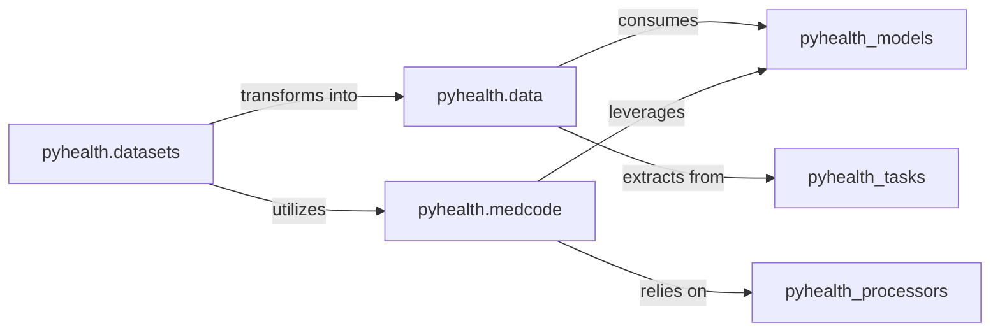

## Component Details

This foundational component is responsible for defining the core data structures for Electronic Health Records (EHR) (e.g., Patient, Visit, Event), handling the loading, parsing, and standardization of diverse raw medical datasets (e.g., MIMIC-III, eICU), and managing medical code systems. It provides functionalities for code lookup, hierarchy traversal, and cross-system mapping, ensuring that raw healthcare data is transformed into a usable and consistent format for downstream tasks.

### pyhealth.data
This package is the cornerstone for defining the core data structures within PyHealth. It provides the foundational classes for representing Electronic Health Records (EHR), including `Patient` and `Event` objects. Its primary purpose is to establish a consistent and standardized data model that all other components in the library can rely upon.

**Related Classes/Methods**:

- <a href="https://github.com/sunlabuiuc/PyHealth/blob/master/pyhealth/data/data.py#L1-L1" target="_blank" rel="noopener noreferrer">`pyhealth.data.data` (1:1)</a>

### pyhealth.datasets
This package serves as the primary interface for loading, preprocessing, and managing various raw healthcare datasets. It contains specific implementations for popular datasets (e.g., MIMIC-III, eICU) and a `BaseDataset` class for extensibility. It handles the intricate process of extracting relevant information from raw files and converting it into the structured format defined by `pyhealth.data`.

**Related Classes/Methods**:

- <a href="https://github.com/sunlabuiuc/PyHealth/blob/master/pyhealth/datasets/base_dataset.py#L1-L1" target="_blank" rel="noopener noreferrer">`pyhealth.datasets.base_dataset` (1:1)</a>
- <a href="https://github.com/sunlabuiuc/PyHealth/blob/master/pyhealth/datasets/mimic3.py#L1-L1" target="_blank" rel="noopener noreferrer">`pyhealth.datasets.mimic3` (1:1)</a>
- <a href="https://github.com/sunlabuiuc/PyHealth/blob/master/pyhealth/datasets/eicu.py#L1-L1" target="_blank" rel="noopener noreferrer">`pyhealth.datasets.eicu` (1:1)</a>
- <a href="https://github.com/sunlabuiuc/PyHealth/blob/master/pyhealth/datasets/configs/config.py#L1-L1" target="_blank" rel="noopener noreferrer">`pyhealth.datasets.configs.config` (1:1)</a>
- <a href="https://github.com/sunlabuiuc/PyHealth/blob/master/pyhealth/datasets/utils.py#L1-L1" target="_blank" rel="noopener noreferrer">`pyhealth.datasets.utils` (1:1)</a>

### pyhealth.medcode
This package is dedicated to the management of medical code systems, such as ICD (International Classification of Diseases), ATC (Anatomical Therapeutic Chemical Classification System), and RxNorm. It provides functionalities for code lookup, hierarchy traversal (e.g., finding parent/child codes), and cross-system mapping (e.g., mapping ICD-9 to ICD-10).

**Related Classes/Methods**:

- <a href="https://github.com/sunlabuiuc/PyHealth/blob/master/pyhealth/medcode/inner_map.py#L1-L1" target="_blank" rel="noopener noreferrer">`pyhealth.medcode.inner_map` (1:1)</a>
- <a href="https://github.com/sunlabuiuc/PyHealth/blob/master/pyhealth/medcode/cross_map.py#L1-L1" target="_blank" rel="noopener noreferrer">`pyhealth.medcode.cross_map` (1:1)</a>
- `pyhealth.medcode.codes` (1:1)
- <a href="https://github.com/sunlabuiuc/PyHealth/blob/master/pyhealth/medcode/utils.py#L1-L1" target="_blank" rel="noopener noreferrer">`pyhealth.medcode.utils` (1:1)</a>

### [FAQ](https://github.com/CodeBoarding/GeneratedOnBoardings/tree/main?tab=readme-ov-file#faq)