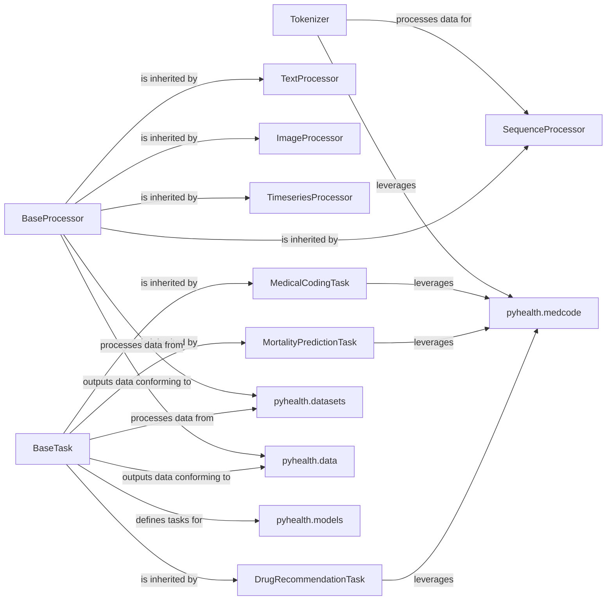

## Component Details

This component serves as the crucial intermediary between raw or standardized Electronic Health Record (EHR) data and the deep learning models within `pyhealth`. Its primary purpose is to transform diverse healthcare data modalities into a uniform, model-ready format and to precisely define the input, output, and processing logic for various healthcare prediction tasks. This ensures that models receive appropriately structured data and are trained and evaluated against clear, task-specific objectives.

### Tokenizer
This class is responsible for converting medical codes and other categorical tokens into numerical indices, and vice versa. It manages a vocabulary of tokens, including special tokens like `<pad>` and `<unk>`, and provides methods for batch encoding and decoding of 2D and 3D token sequences, handling padding and truncation as needed.

**Related Classes/Methods**:

- <a href="https://github.com/sunlabuiuc/PyHealth/blob/master/pyhealth/tokenizer.py#L65-L318" target="_blank" rel="noopener noreferrer">`pyhealth.tokenizer.Tokenizer` (65:318)</a>

### BaseProcessor
This is an abstract base class that defines the interface for all data processors within `pyhealth`. It ensures that all concrete processor implementations adhere to a standard `process` method, which takes a raw data value and transforms it into a model-ready format. It also includes a `size` method for determining the output dimension of the processed data.

**Related Classes/Methods**:

- <a href="https://github.com/sunlabuiuc/PyHealth/blob/master/pyhealth/processors/base_processor.py#L1-L1" target="_blank" rel="noopener noreferrer">`pyhealth.processors.base_processor.BaseProcessor` (1:1)</a>

### SequenceProcessor
A concrete implementation of `BaseProcessor` specifically designed for encoding categorical sequences (e.g., lists of medical codes from a patient visit) into numerical indices. It builds a vocabulary on the fly if not provided and handles unknown and padding tokens.

**Related Classes/Methods**:

- <a href="https://github.com/sunlabuiuc/PyHealth/blob/master/pyhealth/processors/sequence_processor.py#L9-L49" target="_blank" rel="noopener noreferrer">`pyhealth.processors.sequence_processor.SequenceProcessor` (9:49)</a>

### TextProcessor
Another concrete implementation of `BaseProcessor` tailored for handling textual data. Currently, its `process` method simply returns the input value, indicating that it might serve as a placeholder or a base for more complex text processing (e.g., tokenization, embedding) in the future.

**Related Classes/Methods**:

- <a href="https://github.com/sunlabuiuc/PyHealth/blob/master/pyhealth/processors/text_processor.py#L7-L19" target="_blank" rel="noopener noreferrer">`pyhealth.processors.text_processor.TextProcessor` (7:19)</a>

### ImageProcessor
A processor for image data, likely handling transformations such as resizing, normalization, and conversion to tensor format.

**Related Classes/Methods**:

- <a href="https://github.com/sunlabuiuc/PyHealth/blob/master/pyhealth/processors/image_processor.py#L11-L92" target="_blank" rel="noopener noreferrer">`pyhealth.processors.image_processor.ImageProcessor` (11:92)</a>

### TimeseriesProcessor
This processor is designed to handle time-series data, which is common in EHRs (e.g., vital signs, lab results over time). It likely performs operations like interpolation, normalization, and structuring the data for time-series models.

**Related Classes/Methods**:

- <a href="https://github.com/sunlabuiuc/PyHealth/blob/master/pyhealth/processors/timeseries_processor.py#L11-L83" target="_blank" rel="noopener noreferrer">`pyhealth.processors.timeseries_processor.TimeseriesProcessor` (11:83)</a>

### BaseTask
An abstract base class that defines the common structure and interface for all prediction tasks within `pyhealth`. It specifies abstract methods like `__call__` (for processing patient data into task-specific samples) and defines `task_name`, `input_schema`, and `output_schema` to standardize task definitions.

**Related Classes/Methods**:

- <a href="https://github.com/sunlabuiuc/PyHealth/blob/master/pyhealth/tasks/base_task.py#L6-L16" target="_blank" rel="noopener noreferrer">`pyhealth.tasks.base_task.BaseTask` (6:16)</a>

### MedicalCodingTask
A concrete implementation of `BaseTask` specifically for medical coding prediction. It defines the input (e.g., patient visits, diagnoses) and output (e.g., predicted medical codes) formats and the logic for generating samples for this task.

**Related Classes/Methods**:

- <a href="https://github.com/sunlabuiuc/PyHealth/blob/master/pyhealth/tasks/medical_coding.py#L1-L1" target="_blank" rel="noopener noreferrer">`pyhealth.tasks.medical_coding.MedicalCodingTask` (1:1)</a>

### MortalityPredictionTask
A concrete implementation of `BaseTask` for predicting patient mortality. It outlines the necessary input features and the binary (or multi-class, depending on the definition) output for this critical prediction task.

**Related Classes/Methods**:

- <a href="https://github.com/sunlabuiuc/PyHealth/blob/master/pyhealth/tasks/mortality_prediction.py#L1-L1" target="_blank" rel="noopener noreferrer">`pyhealth.tasks.mortality_prediction.MortalityPredictionTask` (1:1)</a>

### DrugRecommendationTask
A concrete implementation of `BaseTask` focused on recommending drugs. It defines the input (e.g., patient history, conditions) and the output (e.g., recommended drug codes) for this task.

**Related Classes/Methods**:

- <a href="https://github.com/sunlabuiuc/PyHealth/blob/master/pyhealth/tasks/drug_recommendation.py#L1-L1" target="_blank" rel="noopener noreferrer">`pyhealth.tasks.drug_recommendation.DrugRecommendationTask` (1:1)</a>

### pyhealth.datasets
Module responsible for handling and providing access to various healthcare datasets.

**Related Classes/Methods**:

- `pyhealth.datasets` (1:1)

### pyhealth.data
Module defining data models and structures for processed healthcare data.

**Related Classes/Methods**:

- `pyhealth.data` (1:1)

### pyhealth.models
Module containing deep learning models for various healthcare prediction tasks.

**Related Classes/Methods**:

- `pyhealth.models` (1:1)

### pyhealth.medcode
Module for understanding and mapping medical codes.

**Related Classes/Methods**:

- `pyhealth.medcode` (1:1)

### [FAQ](https://github.com/CodeBoarding/GeneratedOnBoardings/tree/main?tab=readme-ov-file#faq)