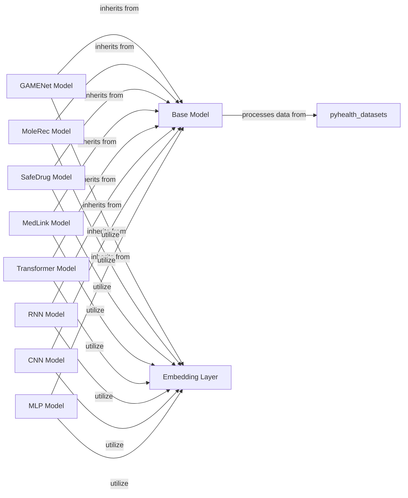

## Component Details

This section provides an overview of the core components within the `pyhealth.models` subsystem, which houses the deep learning models for various healthcare prediction tasks. These components are fundamental as they encapsulate the intelligence and learning capabilities of the `pyhealth` library.

### Base Model
This is the abstract base class (`BaseModel`) for all deep learning models in `pyhealth`. It defines the common interface, fundamental properties (e.g., `device`, `feature_keys`, `label_keys`), and core functionalities such as methods for determining output size, selecting loss functions, and preparing predicted probabilities. It is fundamental because it ensures consistency, extensibility, and a standardized interaction pattern across all specialized models.

**Related Classes/Methods**:

- <a href="https://github.com/sunlabuiuc/PyHealth/blob/master/pyhealth/models/base_model.py#L10-L123" target="_blank" rel="noopener noreferrer">`BaseModel` (10:123)</a>

### GAMENet Model
Implements the Graph Augmented Memory Network (GAMENet) model, a specialized deep learning architecture designed for healthcare prediction tasks, particularly those involving medical codes and their relationships. It extends the `BaseModel` and provides its specific `forward` pass logic. This component is fundamental as it offers a sophisticated approach to leveraging graph structures in medical data.

**Related Classes/Methods**:

- `GAMENet` (1:1)

### MoleRec Model
Implements the MoleRec model, a deep learning architecture likely focused on drug recommendation or related tasks by leveraging molecular information. It extends the `BaseModel` and provides its specific `forward` pass logic. It is fundamental for tasks requiring insights from drug properties.

**Related Classes/Methods**:

- `MoleRec` (1:1)

### SafeDrug Model
Implements the SafeDrug model, a deep learning architecture primarily focused on drug safety, adverse drug event prediction, or drug-drug interaction analysis. It extends the `BaseModel` and provides its specific `forward` pass logic. This component is fundamental for ensuring patient safety in drug prescriptions.

**Related Classes/Methods**:

- `SafeDrug` (1:1)

### MedLink Model
Implements the MedLink model, a more complex deep learning architecture that potentially integrates transformer-based components and tokenization mechanisms for advanced healthcare prediction tasks. It extends the `BaseModel` and provides its specific `forward` pass logic. It is fundamental for handling complex, potentially textual, medical data.

**Related Classes/Methods**:

- `MedLink` (1:1)

### Transformer Model
Implements a general-purpose Transformer-based deep learning model. This architecture is highly effective for processing sequential data, making it suitable for various EHR-related tasks like patient trajectory prediction or medical note analysis. It extends the `BaseModel`. It is fundamental due to its strong performance in sequence modeling.

**Related Classes/Methods**:

- <a href="https://github.com/sunlabuiuc/PyHealth/blob/master/pyhealth/models/transformer.py#L199-L455" target="_blank" rel="noopener noreferrer">`Transformer` (199:455)</a>

### RNN Model
Implements various Recurrent Neural Network (RNN) architectures (e.g., LSTM, GRU). These models are well-suited for processing sequential electronic health record (EHR) data, capturing temporal dependencies in patient histories. It extends the `BaseModel`. It is fundamental for its ability to model time-series data.

**Related Classes/Methods**:

- `RNN` (1:1)

### CNN Model
Implements Convolutional Neural Network (CNN) models. While often associated with image processing, CNNs can be adapted for various healthcare data types, including time-series data or structured EHR data by treating them as 1D or 2D "signals." It extends the `BaseModel`. It is fundamental for its ability to extract local features from data.

**Related Classes/Methods**:

- `CNN` (1:1)

### MLP Model
Implements Multi-Layer Perceptron (MLP) models, a foundational neural network architecture. MLPs are versatile and can be used for various prediction tasks, often serving as a baseline or a component within more complex models. It extends the `BaseModel`. It is fundamental as a basic building block for neural networks.

**Related Classes/Methods**:

- `MLP` (1:1)

### Embedding Layer
Provides various embedding techniques crucial for converting raw healthcare data (e.g., medical codes, text) into dense vector representations suitable for deep learning models. This component is often utilized by the specialized models to process their inputs. It is fundamental because deep learning models require numerical inputs, and embeddings capture semantic meaning.

**Related Classes/Methods**:

- <a href="https://github.com/sunlabuiuc/PyHealth/blob/master/pyhealth/models/embedding.py#L1-L1" target="_blank" rel="noopener noreferrer">`Embedding` (1:1)</a>

### [FAQ](https://github.com/CodeBoarding/GeneratedOnBoardings/tree/main?tab=readme-ov-file#faq)