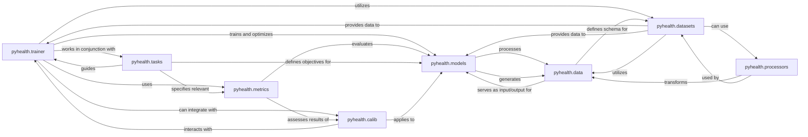

## Component Details

The `Training & Evaluation Framework` in `pyhealth` is a robust system designed to manage the entire lifecycle of model development, from data handling and model training to comprehensive performance evaluation. It is built around several interconnected components, each with distinct responsibilities, ensuring a streamlined and effective workflow for healthcare AI model development.

### pyhealth.trainer
This is the central orchestration component of the framework. It manages the entire model development lifecycle, including data loading, model optimization, logging, and checkpointing. It coordinates the training and evaluation processes, ensuring models are effectively trained and validated.

**Related Classes/Methods**:

- <a href="https://github.com/sunlabuiuc/PyHealth/blob/master/pyhealth/trainer.py#L0-L0" target="_blank" rel="noopener noreferrer">`pyhealth.trainer` (0:0)</a>

### pyhealth.metrics
A comprehensive suite of evaluation metrics designed to assess model performance across various healthcare task types (e.g., binary, multiclass, multilabel, regression, ranking, calibration, prediction set). It quantifies the utility and effectiveness of trained models.

**Related Classes/Methods**:

- <a href="https://github.com/sunlabuiuc/PyHealth/blob/master/pyhealth/metrics/binary.py#L0-L0" target="_blank" rel="noopener noreferrer">`pyhealth.metrics.binary` (0:0)</a>
- <a href="https://github.com/sunlabuiuc/PyHealth/blob/master/pyhealth/metrics/multiclass.py#L0-L0" target="_blank" rel="noopener noreferrer">`pyhealth.metrics.multiclass` (0:0)</a>
- <a href="https://github.com/sunlabuiuc/PyHealth/blob/master/pyhealth/metrics/multilabel.py#L0-L0" target="_blank" rel="noopener noreferrer">`pyhealth.metrics.multilabel` (0:0)</a>
- <a href="https://github.com/sunlabuiuc/PyHealth/blob/master/pyhealth/metrics/calibration.py#L0-L0" target="_blank" rel="noopener noreferrer">`pyhealth.metrics.calibration` (0:0)</a>
- <a href="https://github.com/sunlabuiuc/PyHealth/blob/master/pyhealth/metrics/prediction_set.py#L0-L0" target="_blank" rel="noopener noreferrer">`pyhealth.metrics.prediction_set` (0:0)</a>
- <a href="https://github.com/sunlabuiuc/PyHealth/blob/master/pyhealth/metrics/drug_recommendation.py#L0-L0" target="_blank" rel="noopener noreferrer">`pyhealth.metrics.drug_recommendation` (0:0)</a>
- <a href="https://github.com/sunlabuiuc/PyHealth/blob/master/pyhealth/metrics/fairness.py#L0-L0" target="_blank" rel="noopener noreferrer">`pyhealth.metrics.fairness` (0:0)</a>
- <a href="https://github.com/sunlabuiuc/PyHealth/blob/master/pyhealth/metrics/ranking.py#L0-L0" target="_blank" rel="noopener noreferrer">`pyhealth.metrics.ranking` (0:0)</a>
- <a href="https://github.com/sunlabuiuc/PyHealth/blob/master/pyhealth/metrics/regression.py#L0-L0" target="_blank" rel="noopener noreferrer">`pyhealth.metrics.regression` (0:0)</a>

### pyhealth.models
Contains various machine learning and deep learning model implementations tailored for healthcare prediction tasks. These models are the core AI algorithms that are trained and evaluated within the framework.

**Related Classes/Methods**:

- <a href="https://github.com/sunlabuiuc/PyHealth/blob/master/pyhealth/models/base_model.py#L0-L0" target="_blank" rel="noopener noreferrer">`pyhealth.models.base_model` (0:0)</a>
- <a href="https://github.com/sunlabuiuc/PyHealth/blob/master/pyhealth/models/cnn.py#L0-L0" target="_blank" rel="noopener noreferrer">`pyhealth.models.cnn` (0:0)</a>
- <a href="https://github.com/sunlabuiuc/PyHealth/blob/master/pyhealth/models/rnn.py#L0-L0" target="_blank" rel="noopener noreferrer">`pyhealth.models.rnn` (0:0)</a>
- <a href="https://github.com/sunlabuiuc/PyHealth/blob/master/pyhealth/models/transformer.py#L0-L0" target="_blank" rel="noopener noreferrer">`pyhealth.models.transformer` (0:0)</a>

### pyhealth.datasets
Responsible for loading, managing, and preprocessing various healthcare datasets. It provides structured data objects to the `trainer` and `models` components, acting as the primary data source for the framework.

**Related Classes/Methods**:

- <a href="https://github.com/sunlabuiuc/PyHealth/blob/master/pyhealth/datasets/base_dataset.py#L0-L0" target="_blank" rel="noopener noreferrer">`pyhealth.datasets.base_dataset` (0:0)</a>
- <a href="https://github.com/sunlabuiuc/PyHealth/blob/master/pyhealth/datasets/mimic3.py#L0-L0" target="_blank" rel="noopener noreferrer">`pyhealth.datasets.mimic3` (0:0)</a>
- <a href="https://github.com/sunlabuiuc/PyHealth/blob/master/pyhealth/datasets/eicu.py#L0-L0" target="_blank" rel="noopener noreferrer">`pyhealth.datasets.eicu` (0:0)</a>

### pyhealth.tasks
Defines and manages different healthcare prediction tasks (e.g., diagnosis prediction, mortality prediction, drug recommendation). It provides the framework for setting up specific objectives for model training and evaluation.

**Related Classes/Methods**:

- <a href="https://github.com/sunlabuiuc/PyHealth/blob/master/pyhealth/tasks/base_task.py#L0-L0" target="_blank" rel="noopener noreferrer">`pyhealth.tasks.base_task` (0:0)</a>
- <a href="https://github.com/sunlabuiuc/PyHealth/blob/master/pyhealth/tasks/mortality_prediction.py#L0-L0" target="_blank" rel="noopener noreferrer">`pyhealth.tasks.mortality_prediction` (0:0)</a>
- <a href="https://github.com/sunlabuiuc/PyHealth/blob/master/pyhealth/tasks/drug_recommendation.py#L0-L0" target="_blank" rel="noopener noreferrer">`pyhealth.tasks.drug_recommendation` (0:0)</a>

### pyhealth.data
Provides foundational classes and structures for representing healthcare data, including patient records, visits, and medical codes. It ensures data consistency and facilitates data flow between different components.

**Related Classes/Methods**:

- <a href="https://github.com/sunlabuiuc/PyHealth/blob/master/pyhealth/data/data.py#L0-L0" target="_blank" rel="noopener noreferrer">`pyhealth.data.data` (0:0)</a>

### pyhealth.calib
Focuses on model calibration techniques, ensuring that model predictions are well-calibrated and reflect true probabilities. This is crucial for reliable decision-making in healthcare and enhances the trustworthiness of model outputs.

**Related Classes/Methods**:

- <a href="https://github.com/sunlabuiuc/PyHealth/blob/master/pyhealth/calib/base_classes.py#L0-L0" target="_blank" rel="noopener noreferrer">`pyhealth.calib.base_classes` (0:0)</a>
- <a href="https://github.com/sunlabuiuc/PyHealth/blob/master/pyhealth/calib/calibration/temperature_scale.py#L0-L0" target="_blank" rel="noopener noreferrer">`pyhealth.calib.calibration.temperature_scale` (0:0)</a>
- <a href="https://github.com/sunlabuiuc/PyHealth/blob/master/pyhealth/calib/predictionset/label.py#L0-L0" target="_blank" rel="noopener noreferrer">`pyhealth.calib.predictionset.label` (0:0)</a>

### pyhealth.processors
Handles data transformation and preprocessing steps, preparing raw data from datasets into a format suitable for model input. This includes tasks like tokenization, normalization, and feature engineering.

**Related Classes/Methods**:

- <a href="https://github.com/sunlabuiuc/PyHealth/blob/master/pyhealth/processors/base_processor.py#L0-L0" target="_blank" rel="noopener noreferrer">`pyhealth.processors.base_processor` (0:0)</a>
- <a href="https://github.com/sunlabuiuc/PyHealth/blob/master/pyhealth/processors/text_processor.py#L0-L0" target="_blank" rel="noopener noreferrer">`pyhealth.processors.text_processor` (0:0)</a>
- <a href="https://github.com/sunlabuiuc/PyHealth/blob/master/pyhealth/processors/sequence_processor.py#L0-L0" target="_blank" rel="noopener noreferrer">`pyhealth.processors.sequence_processor` (0:0)</a>

### [FAQ](https://github.com/CodeBoarding/GeneratedOnBoardings/tree/main?tab=readme-ov-file#faq)