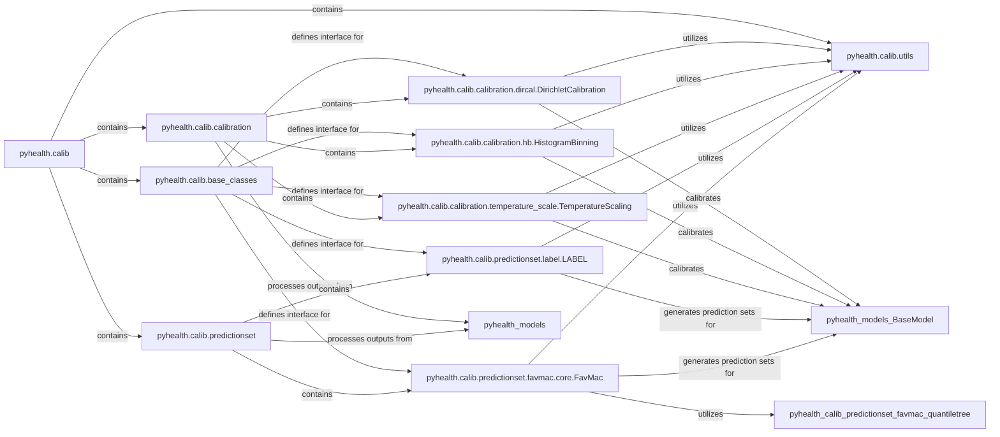

## Component Details

This component, `pyhealth.calib`, is central to enhancing the reliability and trustworthiness of model predictions within the `pyhealth` framework, especially critical in healthcare applications. It achieves this by offering two main functionalities: post-hoc calibration and conformal prediction. Post-hoc calibration techniques adjust predicted probabilities to ensure they accurately reflect true probabilities, while conformal prediction methods generate prediction sets with statistical guarantees of coverage, thereby quantifying the uncertainty of model outputs.

### pyhealth.calib
The root package for all uncertainty quantification and post-processing functionalities. It serves as the entry point for users to access various calibration and prediction set methods.

**Related Classes/Methods**:

- `pyhealth.calib` (1:1)

### pyhealth.calib.base_classes
Defines abstract base classes (`PostHocCalibrator` and `SetPredictor`) that establish a common interface for all post-hoc calibration and prediction set methods, respectively. This promotes code reusability and a consistent API.

**Related Classes/Methods**:

- <a href="https://github.com/sunlabuiuc/PyHealth/blob/master/pyhealth/calib/base_classes.py#L6-L21" target="_blank" rel="noopener noreferrer">`pyhealth.calib.base_classes.PostHocCalibrator` (6:21)</a>
- <a href="https://github.com/sunlabuiuc/PyHealth/blob/master/pyhealth/calib/base_classes.py#L24-L38" target="_blank" rel="noopener noreferrer">`pyhealth.calib.base_classes.SetPredictor` (24:38)</a>

### pyhealth.calib.utils
Contains essential utility functions used across various calibration and prediction set methods. Key functionalities include `prepare_numpy_dataset` for efficient data preparation from `pyhealth.models.BaseModel` outputs and `LogLoss` for calculating specific loss functions.

**Related Classes/Methods**:

- <a href="https://github.com/sunlabuiuc/PyHealth/blob/master/pyhealth/calib/utils.py#L46-L69" target="_blank" rel="noopener noreferrer">`pyhealth.calib.utils.prepare_numpy_dataset` (46:69)</a>
- <a href="https://github.com/sunlabuiuc/PyHealth/blob/master/pyhealth/calib/utils.py#L24-L43" target="_blank" rel="noopener noreferrer">`pyhealth.calib.utils.LogLoss` (24:43)</a>

### pyhealth.calib.calibration
This sub-package groups various post-hoc calibration techniques. Its primary role is to adjust the predicted probabilities from a base model to be more reliable and aligned with the true probabilities.

**Related Classes/Methods**:

- `pyhealth.calib.calibration` (1:1)

### pyhealth.calib.calibration.dircal.DirichletCalibration
Implements Dirichlet Calibration, a post-hoc calibration method for multiclass classification that learns a linear transformation of the logits.

**Related Classes/Methods**:

- <a href="https://github.com/sunlabuiuc/PyHealth/blob/master/pyhealth/calib/calibration/dircal.py#L1-L1" target="_blank" rel="noopener noreferrer">`pyhealth.calib.calibration.dircal.DirichletCalibration` (1:1)</a>

### pyhealth.calib.calibration.hb.HistogramBinning
Implements Histogram Binning, a non-parametric post-hoc calibration technique that divides predictions into bins and adjusts probabilities based on the observed accuracy within each bin.

**Related Classes/Methods**:

- <a href="https://github.com/sunlabuiuc/PyHealth/blob/master/pyhealth/calib/calibration/hb.py#L1-L1" target="_blank" rel="noopener noreferrer">`pyhealth.calib.calibration.hb.HistogramBinning` (1:1)</a>

### pyhealth.calib.calibration.temperature_scale.TemperatureScaling
Implements Temperature Scaling (and Platt Scaling for binary classification), a simple yet effective post-hoc calibration method that scales the logits by a single learned parameter.

**Related Classes/Methods**:

- <a href="https://github.com/sunlabuiuc/PyHealth/blob/master/pyhealth/calib/calibration/temperature_scale.py#L1-L1" target="_blank" rel="noopener noreferrer">`pyhealth.calib.calibration.temperature_scale.TemperatureScaling` (1:1)</a>

### pyhealth.calib.predictionset
This sub-package contains methods for constructing prediction sets, which provide a measure of uncertainty by outputting a set of plausible labels rather than a single prediction.

**Related Classes/Methods**:

- `pyhealth.calib.predictionset` (1:1)

### pyhealth.calib.predictionset.label.LABEL
Implements the LABEL (Least Ambiguous Set-Valued Classifiers with Bounded Error Levels) method, a conformal prediction technique for multiclass classification that controls mis-coverage rates.

**Related Classes/Methods**:

- <a href="https://github.com/sunlabuiuc/PyHealth/blob/master/pyhealth/calib/predictionset/label.py#L1-L1" target="_blank" rel="noopener noreferrer">`pyhealth.calib.predictionset.label.LABEL` (1:1)</a>

### pyhealth.calib.predictionset.favmac.core.FavMac
A base class for the FAVMAC (Least Ambiguous Set-Valued Classifiers with Bounded Error Levels) family of prediction set constructors. It defines the core logic for generating prediction sets based on cost and utility functions.

**Related Classes/Methods**:

- <a href="https://github.com/sunlabuiuc/PyHealth/blob/master/pyhealth/calib/predictionset/favmac/core.py#L12-L108" target="_blank" rel="noopener noreferrer">`pyhealth.calib.predictionset.favmac.core.FavMac` (12:108)</a>

### [FAQ](https://github.com/CodeBoarding/GeneratedOnBoardings/tree/main?tab=readme-ov-file#faq)