```mermaid
graph LR
    Data_Management_Representation["Data Management & Representation"]
    Data_Preprocessing_Task_Definition["Data Preprocessing & Task Definition"]
    Deep_Learning_Models["Deep Learning Models"]
    Training_Evaluation_Framework["Training & Evaluation Framework"]
    Uncertainty_Quantification_Post_processing["Uncertainty Quantification & Post-processing"]
    Data_Management_Representation -- "provides data to" --> Data_Preprocessing_Task_Definition
    Data_Management_Representation -- "utilized by" --> Training_Evaluation_Framework
    Data_Preprocessing_Task_Definition -- "processes data from" --> Data_Management_Representation
    Data_Preprocessing_Task_Definition -- "prepares input for" --> Deep_Learning_Models
    Deep_Learning_Models -- "receives processed input from" --> Data_Preprocessing_Task_Definition
    Deep_Learning_Models -- "outputs predictions to" --> Training_Evaluation_Framework
    Deep_Learning_Models -- "outputs predictions to" --> Uncertainty_Quantification_Post_processing
    Training_Evaluation_Framework -- "trains and evaluates" --> Deep_Learning_Models
    Training_Evaluation_Framework -- "utilizes data from" --> Data_Management_Representation
    Uncertainty_Quantification_Post_processing -- "processes outputs from" --> Deep_Learning_Models
    Uncertainty_Quantification_Post_processing -- "provides refined predictions to" --> Training_Evaluation_Framework
    click Data_Management_Representation href "https://github.com/CodeBoarding/GeneratedOnBoardings/blob/main//PyHealth/Data_Management_Representation.md" "Details"
    click Data_Preprocessing_Task_Definition href "https://github.com/CodeBoarding/GeneratedOnBoardings/blob/main//PyHealth/Data_Preprocessing_Task_Definition.md" "Details"
    click Deep_Learning_Models href "https://github.com/CodeBoarding/GeneratedOnBoardings/blob/main//PyHealth/Deep_Learning_Models.md" "Details"
    click Training_Evaluation_Framework href "https://github.com/CodeBoarding/GeneratedOnBoardings/blob/main//PyHealth/Training_Evaluation_Framework.md" "Details"
    click Uncertainty_Quantification_Post_processing href "https://github.com/CodeBoarding/GeneratedOnBoardings/blob/main//PyHealth/Uncertainty_Quantification_Post_processing.md" "Details"
```

## Component Details

These five components are fundamental to PyHealth's architecture because they represent the logical and sequential stages of any robust machine learning pipeline, specifically adapted for the complexities of healthcare data:

1.  **Data Management & Representation**: This is the absolute prerequisite. Healthcare data is complex, heterogeneous, and often messy. This component ensures that raw, disparate EHR data is ingested, standardized, and made accessible in a consistent format, including the critical handling of medical codes. Without this foundation, no meaningful analysis or modeling can occur.

2.  **Data Preprocessing & Task Definition**: Even standardized data needs further preparation for deep learning models. This component transforms the data into numerical, task-specific inputs, bridging the gap between raw information and model consumption. It also explicitly defines the problem being solved, which is crucial for guiding model development and evaluation.

3.  **Deep Learning Models**: This is the core "brain" of the system, where the actual learning algorithms reside. It's where patterns are identified, and predictions are generated from the processed healthcare data. Its modularity allows for the integration of various state-of-the-art models tailored to different clinical problems.

4.  **Training & Evaluation Framework**: A model, no matter how sophisticated, is only as good as its training and evaluation. This component provides the necessary infrastructure to train models efficiently, optimize their performance, and rigorously assess their effectiveness using appropriate metrics. This ensures the models are robust and reliable for real-world application.

5.  **Uncertainty Quantification & Post-processing**: In healthcare, model predictions have significant implications. This component addresses the critical need for trustworthiness and interpretability. By calibrating probabilities and providing prediction sets with statistical guarantees, it enhances the reliability of model outputs, which is vital for clinical decision-making and building trust in AI systems.

The `Utilities` component, while pervasive and essential, serves as a supporting layer for all these core components rather than being a distinct functional block in the primary data flow. The `Leaderboard` components, identified in the CFG, are considered a specific application or feature built *on top* of these core functionalities, rather than being a fundamental part of the general ML pipeline architecture itself. This consolidated view provides a clear, high-level understanding of how data flows through PyHealth, from raw input to refined, trustworthy predictions, covering all essential stages of a healthcare AI system.

### Data Management & Representation
This foundational component is responsible for defining the core data structures for Electronic Health Records (EHR) (e.g., Patient, Visit, Event), handling the loading, parsing, and standardization of diverse raw medical datasets (e.g., MIMIC-III, eICU), and managing medical code systems. It provides functionalities for code lookup, hierarchy traversal, and cross-system mapping, ensuring that raw healthcare data is transformed into a usable and consistent format.

**Related Classes/Methods**:

- <a href="https://github.com/sunlabuiuc/PyHealth/blob/master/pyhealth/data/data.py#L0-L0" target="_blank" rel="noopener noreferrer">`pyhealth.data.data.py` (0:0)</a>
- <a href="https://github.com/sunlabuiuc/PyHealth/blob/master/pyhealth/datasets/base_dataset.py#L0-L0" target="_blank" rel="noopener noreferrer">`pyhealth.datasets.base_dataset.py` (0:0)</a>
- <a href="https://github.com/sunlabuiuc/PyHealth/blob/master/pyhealth/datasets/mimic3.py#L0-L0" target="_blank" rel="noopener noreferrer">`pyhealth.datasets.mimic3.py` (0:0)</a>
- <a href="https://github.com/sunlabuiuc/PyHealth/blob/master/pyhealth/datasets/eicu.py#L0-L0" target="_blank" rel="noopener noreferrer">`pyhealth.datasets.eicu.py` (0:0)</a>
- <a href="https://github.com/sunlabuiuc/PyHealth/blob/master/pyhealth/medcode/inner_map.py#L0-L0" target="_blank" rel="noopener noreferrer">`pyhealth.medcode.inner_map.py` (0:0)</a>
- <a href="https://github.com/sunlabuiuc/PyHealth/blob/master/pyhealth/medcode/cross_map.py#L0-L0" target="_blank" rel="noopener noreferrer">`pyhealth.medcode.cross_map.py` (0:0)</a>
- `pyhealth.medcode.codes` (0:0)

### Data Preprocessing & Task Definition
This component acts as the bridge between the standardized EHR data and the deep learning models. It focuses on transforming the data into a model-ready format through tokenization of medical codes and textual data, and applying various data processors for different modalities (e.g., image, sequence, text). Crucially, it also defines the specific input/output formats and processing logic for various healthcare prediction tasks (e.g., medical coding, mortality prediction, drug recommendation).

**Related Classes/Methods**:

- <a href="https://github.com/sunlabuiuc/PyHealth/blob/master/pyhealth/tokenizer.py#L0-L0" target="_blank" rel="noopener noreferrer">`pyhealth.tokenizer.py` (0:0)</a>
- <a href="https://github.com/sunlabuiuc/PyHealth/blob/master/pyhealth/processors/image_processor.py#L0-L0" target="_blank" rel="noopener noreferrer">`pyhealth.processors.image_processor.py` (0:0)</a>
- <a href="https://github.com/sunlabuiuc/PyHealth/blob/master/pyhealth/processors/sequence_processor.py#L0-L0" target="_blank" rel="noopener noreferrer">`pyhealth.processors.sequence_processor.py` (0:0)</a>
- <a href="https://github.com/sunlabuiuc/PyHealth/blob/master/pyhealth/processors/text_processor.py#L0-L0" target="_blank" rel="noopener noreferrer">`pyhealth.processors.text_processor.py` (0:0)</a>
- <a href="https://github.com/sunlabuiuc/PyHealth/blob/master/pyhealth/tasks/base_task.py#L0-L0" target="_blank" rel="noopener noreferrer">`pyhealth.tasks.base_task.py` (0:0)</a>
- <a href="https://github.com/sunlabuiuc/PyHealth/blob/master/pyhealth/tasks/medical_coding.py#L0-L0" target="_blank" rel="noopener noreferrer">`pyhealth.tasks.medical_coding.py` (0:0)</a>
- <a href="https://github.com/sunlabuiuc/PyHealth/blob/master/pyhealth/tasks/mortality_prediction.py#L0-L0" target="_blank" rel="noopener noreferrer">`pyhealth.tasks.mortality_prediction.py` (0:0)</a>
- <a href="https://github.com/sunlabuiuc/PyHealth/blob/master/pyhealth/tasks/drug_recommendation.py#L0-L0" target="_blank" rel="noopener noreferrer">`pyhealth.tasks.drug_recommendation.py` (0:0)</a>

### Deep Learning Models
This is the core intelligence component, housing the abstract base class for all deep learning models and implementing a diverse range of specialized architectures tailored for various healthcare prediction tasks. These models (e.g., GAMENet, MoleRec, Transformer) are designed to process both structured and unstructured EHR data, performing the actual learning and prediction.

**Related Classes/Methods**:

- <a href="https://github.com/sunlabuiuc/PyHealth/blob/master/pyhealth/models/base_model.py#L0-L0" target="_blank" rel="noopener noreferrer">`pyhealth.models.base_model.py` (0:0)</a>
- <a href="https://github.com/sunlabuiuc/PyHealth/blob/master/pyhealth/models/gamenet.py#L0-L0" target="_blank" rel="noopener noreferrer">`pyhealth.models.gamenet.py` (0:0)</a>
- <a href="https://github.com/sunlabuiuc/PyHealth/blob/master/pyhealth/models/molerec.py#L0-L0" target="_blank" rel="noopener noreferrer">`pyhealth.models.molerec.py` (0:0)</a>
- <a href="https://github.com/sunlabuiuc/PyHealth/blob/master/pyhealth/models/safedrug.py#L0-L0" target="_blank" rel="noopener noreferrer">`pyhealth.models.safedrug.py` (0:0)</a>
- <a href="https://github.com/sunlabuiuc/PyHealth/blob/master/pyhealth/models/medlink/model.py#L0-L0" target="_blank" rel="noopener noreferrer">`pyhealth.models.medlink.model.py` (0:0)</a>
- <a href="https://github.com/sunlabuiuc/PyHealth/blob/master/pyhealth/models/transformer.py#L0-L0" target="_blank" rel="noopener noreferrer">`pyhealth.models.transformer.py` (0:0)</a>

### Training & Evaluation Framework
This component orchestrates the entire lifecycle of model development, from training and optimization to rigorous evaluation. It handles data loading, model optimization, logging, and checkpointing. Additionally, it provides a comprehensive suite of metrics to assess model performance across different task types (e.g., binary, multiclass, multilabel, regression, ranking), ensuring models are developed effectively and their utility can be quantified.

**Related Classes/Methods**:

- <a href="https://github.com/sunlabuiuc/PyHealth/blob/master/pyhealth/trainer.py#L0-L0" target="_blank" rel="noopener noreferrer">`pyhealth.trainer.py` (0:0)</a>
- <a href="https://github.com/sunlabuiuc/PyHealth/blob/master/pyhealth/metrics/binary.py#L0-L0" target="_blank" rel="noopener noreferrer">`pyhealth.metrics.binary.py` (0:0)</a>
- <a href="https://github.com/sunlabuiuc/PyHealth/blob/master/pyhealth/metrics/multiclass.py#L0-L0" target="_blank" rel="noopener noreferrer">`pyhealth.metrics.multiclass.py` (0:0)</a>
- <a href="https://github.com/sunlabuiuc/PyHealth/blob/master/pyhealth/metrics/multilabel.py#L0-L0" target="_blank" rel="noopener noreferrer">`pyhealth.metrics.multilabel.py` (0:0)</a>
- <a href="https://github.com/sunlabuiuc/PyHealth/blob/master/pyhealth/metrics/calibration.py#L0-L0" target="_blank" rel="noopener noreferrer">`pyhealth.metrics.calibration.py` (0:0)</a>
- <a href="https://github.com/sunlabuiuc/PyHealth/blob/master/pyhealth/metrics/prediction_set.py#L0-L0" target="_blank" rel="noopener noreferrer">`pyhealth.metrics.prediction_set.py` (0:0)</a>

### Uncertainty Quantification & Post-processing
This crucial component focuses on enhancing the reliability and trustworthiness of model predictions, which is paramount in healthcare. It implements various post-hoc calibration techniques (e.g., Dirichlet Calibration, Temperature Scaling) to ensure predicted probabilities accurately reflect true probabilities. Furthermore, it provides conformal prediction methods (e.g., LABEL, SCRIB) to generate prediction sets that come with statistical guarantees of coverage, offering a measure of uncertainty for model outputs.

**Related Classes/Methods**:

- <a href="https://github.com/sunlabuiuc/PyHealth/blob/master/pyhealth/calib/calibration/dircal.py#L0-L0" target="_blank" rel="noopener noreferrer">`pyhealth.calib.calibration.dircal.py` (0:0)</a>
- <a href="https://github.com/sunlabuiuc/PyHealth/blob/master/pyhealth/calib/calibration/hb.py#L0-L0" target="_blank" rel="noopener noreferrer">`pyhealth.calib.calibration.hb.py` (0:0)</a>
- <a href="https://github.com/sunlabuiuc/PyHealth/blob/master/pyhealth/calib/calibration/kcal/__init__.py#L0-L0" target="_blank" rel="noopener noreferrer">`pyhealth.calib.calibration.kcal.__init__.py` (0:0)</a>
- <a href="https://github.com/sunlabuiuc/PyHealth/blob/master/pyhealth/calib/calibration/temperature_scale.py#L0-L0" target="_blank" rel="noopener noreferrer">`pyhealth.calib.calibration.temperature_scale.py` (0:0)</a>
- <a href="https://github.com/sunlabuiuc/PyHealth/blob/master/pyhealth/calib/predictionset/label.py#L0-L0" target="_blank" rel="noopener noreferrer">`pyhealth.calib.predictionset.label.py` (0:0)</a>
- <a href="https://github.com/sunlabuiuc/PyHealth/blob/master/pyhealth/calib/predictionset/favmac/__init__.py#L0-L0" target="_blank" rel="noopener noreferrer">`pyhealth.calib.predictionset.favmac.__init__.py` (0:0)</a>
- <a href="https://github.com/sunlabuiuc/PyHealth/blob/master/pyhealth/calib/predictionset/scrib/__init__.py#L0-L0" target="_blank" rel="noopener noreferrer">`pyhealth.calib.predictionset.scrib.__init__.py` (0:0)</a>

### [FAQ](https://github.com/CodeBoarding/GeneratedOnBoardings/tree/main?tab=readme-ov-file#faq)