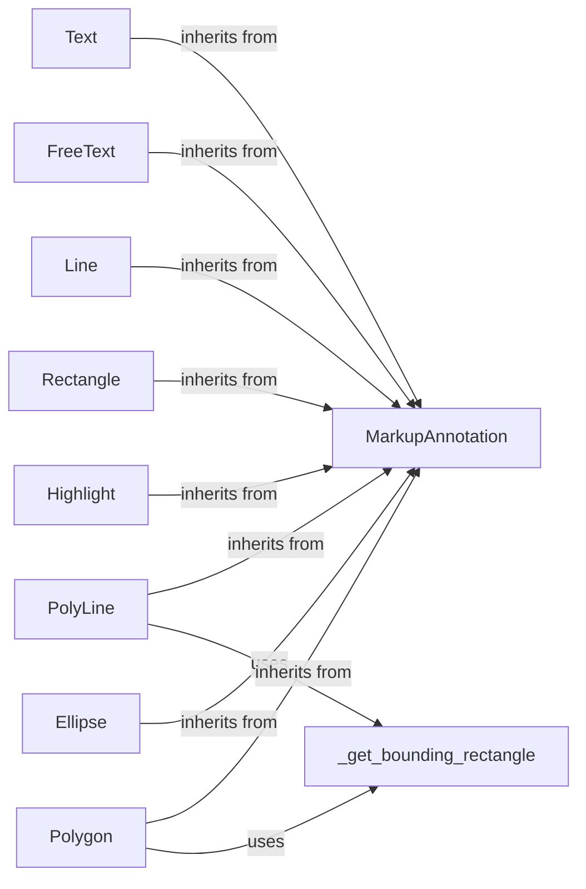

## Component Details

The AnnotationHandling component in PyPDF defines a set of classes for representing and manipulating PDF annotations. The core functionality revolves around the `MarkupAnnotation` class, which serves as a base for various annotation types like Text, FreeText, Line, PolyLine, Rectangle, Highlight, Ellipse, and Polygon. These classes provide a structured way to create, modify, and interact with annotations within a PDF document. The `_get_bounding_rectangle` function is a utility used by some annotation types (PolyLine, Polygon) to calculate the bounding box based on their points.

### MarkupAnnotation
The base class for all markup annotations. It provides common attributes and methods for handling annotations that mark up or add comments to a PDF document. It initializes common properties like `Rect`. All other annotations inherit from this class.

**Related Classes/Methods**:

- <a href="https://github.com/py-pdf/PyPDF2/blob/master/pypdf/annotations/_markup_annotations.py#L41-L53" target="_blank" rel="noopener noreferrer">`pypdf.annotations._markup_annotations.MarkupAnnotation` (41:53)</a>
- <a href="https://github.com/py-pdf/PyPDF2/blob/master/pypdf/annotations/_markup_annotations.py#L51-L53" target="_blank" rel="noopener noreferrer">`pypdf.annotations._markup_annotations.MarkupAnnotation.__init__` (51:53)</a>

### Text
The Text annotation represents a "sticky note" type annotation. It inherits from MarkupAnnotation and initializes its parent class.

**Related Classes/Methods**:

- <a href="https://github.com/py-pdf/PyPDF2/blob/master/pypdf/annotations/_markup_annotations.py#L56-L83" target="_blank" rel="noopener noreferrer">`pypdf.annotations._markup_annotations.Text` (56:83)</a>
- <a href="https://github.com/py-pdf/PyPDF2/blob/master/pypdf/annotations/_markup_annotations.py#L69-L83" target="_blank" rel="noopener noreferrer">`pypdf.annotations._markup_annotations.Text.__init__` (69:83)</a>

### FreeText
The FreeText annotation represents a free-form text annotation. It inherits from MarkupAnnotation and initializes its parent class.

**Related Classes/Methods**:

- <a href="https://github.com/py-pdf/PyPDF2/blob/master/pypdf/annotations/_markup_annotations.py#L86-L147" target="_blank" rel="noopener noreferrer">`pypdf.annotations._markup_annotations.FreeText` (86:147)</a>
- <a href="https://github.com/py-pdf/PyPDF2/blob/master/pypdf/annotations/_markup_annotations.py#L89-L147" target="_blank" rel="noopener noreferrer">`pypdf.annotations._markup_annotations.FreeText.__init__` (89:147)</a>

### Line
The Line annotation represents a line annotation. It inherits from MarkupAnnotation and initializes its parent class.

**Related Classes/Methods**:

- <a href="https://github.com/py-pdf/PyPDF2/blob/master/pypdf/annotations/_markup_annotations.py#L150-L187" target="_blank" rel="noopener noreferrer">`pypdf.annotations._markup_annotations.Line` (150:187)</a>
- <a href="https://github.com/py-pdf/PyPDF2/blob/master/pypdf/annotations/_markup_annotations.py#L151-L187" target="_blank" rel="noopener noreferrer">`pypdf.annotations._markup_annotations.Line.__init__` (151:187)</a>

### PolyLine
The PolyLine annotation represents a polyline annotation. It inherits from MarkupAnnotation and initializes its parent class. It also uses `_get_bounding_rectangle` to calculate the bounding rectangle.

**Related Classes/Methods**:

- <a href="https://github.com/py-pdf/PyPDF2/blob/master/pypdf/annotations/_markup_annotations.py#L190-L209" target="_blank" rel="noopener noreferrer">`pypdf.annotations._markup_annotations.PolyLine` (190:209)</a>
- <a href="https://github.com/py-pdf/PyPDF2/blob/master/pypdf/annotations/_markup_annotations.py#L191-L209" target="_blank" rel="noopener noreferrer">`pypdf.annotations._markup_annotations.PolyLine.__init__` (191:209)</a>
- <a href="https://github.com/py-pdf/PyPDF2/blob/master/pypdf/annotations/_markup_annotations.py#L30-L38" target="_blank" rel="noopener noreferrer">`pypdf.annotations._markup_annotations._get_bounding_rectangle` (30:38)</a>

### Rectangle
The Rectangle annotation represents a rectangle annotation. It inherits from MarkupAnnotation and initializes its parent class.

**Related Classes/Methods**:

- <a href="https://github.com/py-pdf/PyPDF2/blob/master/pypdf/annotations/_markup_annotations.py#L212-L236" target="_blank" rel="noopener noreferrer">`pypdf.annotations._markup_annotations.Rectangle` (212:236)</a>
- <a href="https://github.com/py-pdf/PyPDF2/blob/master/pypdf/annotations/_markup_annotations.py#L213-L236" target="_blank" rel="noopener noreferrer">`pypdf.annotations._markup_annotations.Rectangle.__init__` (213:236)</a>

### Highlight
The Highlight annotation represents a highlight annotation. It inherits from MarkupAnnotation and initializes its parent class.

**Related Classes/Methods**:

- <a href="https://github.com/py-pdf/PyPDF2/blob/master/pypdf/annotations/_markup_annotations.py#L239-L261" target="_blank" rel="noopener noreferrer">`pypdf.annotations._markup_annotations.Highlight` (239:261)</a>
- <a href="https://github.com/py-pdf/PyPDF2/blob/master/pypdf/annotations/_markup_annotations.py#L240-L261" target="_blank" rel="noopener noreferrer">`pypdf.annotations._markup_annotations.Highlight.__init__` (240:261)</a>

### Ellipse
The Ellipse annotation represents an ellipse annotation. It inherits from MarkupAnnotation and initializes its parent class.

**Related Classes/Methods**:

- <a href="https://github.com/py-pdf/PyPDF2/blob/master/pypdf/annotations/_markup_annotations.py#L264-L289" target="_blank" rel="noopener noreferrer">`pypdf.annotations._markup_annotations.Ellipse` (264:289)</a>
- <a href="https://github.com/py-pdf/PyPDF2/blob/master/pypdf/annotations/_markup_annotations.py#L265-L289" target="_blank" rel="noopener noreferrer">`pypdf.annotations._markup_annotations.Ellipse.__init__` (265:289)</a>

### Polygon
The Polygon annotation represents a polygon annotation. It inherits from MarkupAnnotation and initializes its parent class. It also uses `_get_bounding_rectangle` to calculate the bounding rectangle.

**Related Classes/Methods**:

- <a href="https://github.com/py-pdf/PyPDF2/blob/master/pypdf/annotations/_markup_annotations.py#L292-L314" target="_blank" rel="noopener noreferrer">`pypdf.annotations._markup_annotations.Polygon` (292:314)</a>
- <a href="https://github.com/py-pdf/PyPDF2/blob/master/pypdf/annotations/_markup_annotations.py#L293-L314" target="_blank" rel="noopener noreferrer">`pypdf.annotations._markup_annotations.Polygon.__init__` (293:314)</a>
- <a href="https://github.com/py-pdf/PyPDF2/blob/master/pypdf/annotations/_markup_annotations.py#L30-L38" target="_blank" rel="noopener noreferrer">`pypdf.annotations._markup_annotations._get_bounding_rectangle` (30:38)</a>

### _get_bounding_rectangle
Calculates the bounding rectangle for a given set of points. It is used by `PolyLine` and `Polygon` to determine their rectangular boundaries.

**Related Classes/Methods**:

- <a href="https://github.com/py-pdf/PyPDF2/blob/master/pypdf/annotations/_markup_annotations.py#L30-L38" target="_blank" rel="noopener noreferrer">`pypdf.annotations._markup_annotations._get_bounding_rectangle` (30:38)</a>