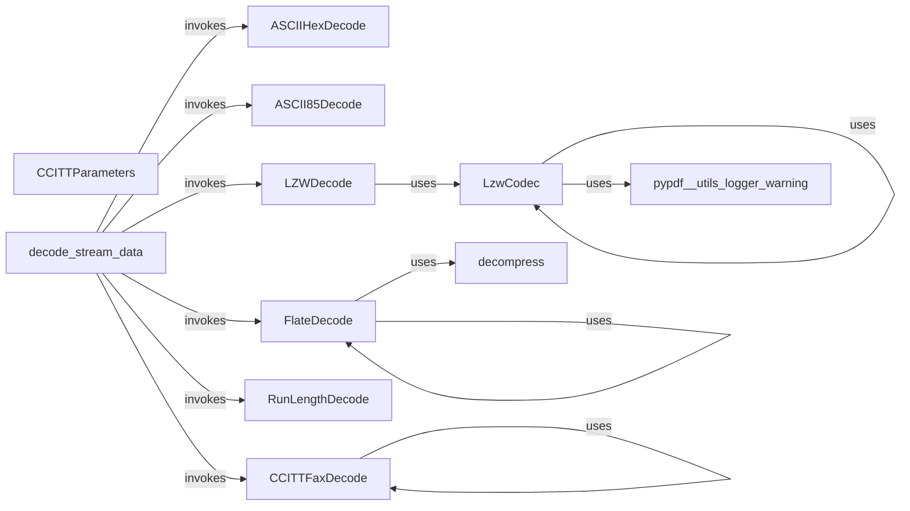

## Component Details

The DataStreamHandling component in pypdf is responsible for decoding various data streams within PDF documents. It encompasses a suite of filters and codecs that handle different compression and encoding schemes commonly used in PDFs. The main flow involves the `decode_stream_data` function, which identifies the filters applied to a stream and then invokes the appropriate decoding methods. This component ensures that compressed or encoded data within a PDF can be properly decompressed and decoded for further processing.

### FlateDecode
The FlateDecode component handles the decompression of data streams compressed using the Flate (zlib) compression algorithm. It provides static methods for decoding, including handling PNG prediction for improved compression. It relies on the `decompress` function for the core zlib decompression and includes specific logic for PNG prediction.

**Related Classes/Methods**:

- <a href="https://github.com/py-pdf/PyPDF2/blob/master/pypdf/filters.py#L111-L184" target="_blank" rel="noopener noreferrer">`pypdf.filters.FlateDecode:decode` (111:184)</a>
- <a href="https://github.com/py-pdf/PyPDF2/blob/master/pypdf/filters.py#L187-L248" target="_blank" rel="noopener noreferrer">`pypdf.filters.FlateDecode._decode_png_prediction` (187:248)</a>
- <a href="https://github.com/py-pdf/PyPDF2/blob/master/pypdf/filters.py#L76-L106" target="_blank" rel="noopener noreferrer">`pypdf.filters.decompress` (76:106)</a>

### LZWDecode
The LZWDecode component is responsible for decompressing data streams compressed using the Lempel-Ziv-Welch (LZW) algorithm. It uses an internal `Decoder` class to manage the decoding process, handling the complexities of the LZW algorithm. It interacts with the `LzwCodec` to perform the actual LZW decoding.

**Related Classes/Methods**:

- <a href="https://github.com/py-pdf/PyPDF2/blob/master/pypdf/filters.py#L417-L435" target="_blank" rel="noopener noreferrer">`pypdf.filters.LZWDecode:decode` (417:435)</a>
- <a href="https://github.com/py-pdf/PyPDF2/blob/master/pypdf/filters.py#L397-L414" target="_blank" rel="noopener noreferrer">`pypdf.filters.LZWDecode:_decodeb` (397:414)</a>
- `pypdf.filters.LZWDecode.Decoder.decode` (200:234)
- <a href="https://github.com/py-pdf/PyPDF2/blob/master/pypdf/filters.py#L386-L394" target="_blank" rel="noopener noreferrer">`pypdf.filters.LZWDecode.Decoder` (386:394)</a>

### LzwCodec
The LzwCodec component implements the core LZW compression and decompression algorithms. It maintains encoding and decoding tables and handles the packing and unpacking of codes into a byte stream. It provides methods for both encoding and decoding data, as well as internal utilities for managing the encoding and decoding tables.

**Related Classes/Methods**:

- <a href="https://github.com/py-pdf/PyPDF2/blob/master/pypdf/_codecs/_codecs.py#L70-L110" target="_blank" rel="noopener noreferrer">`pypdf._codecs._codecs.LzwCodec:encode` (70:110)</a>
- <a href="https://github.com/py-pdf/PyPDF2/blob/master/pypdf/_codecs/_codecs.py#L204-L251" target="_blank" rel="noopener noreferrer">`pypdf._codecs._codecs.LzwCodec:decode` (204:251)</a>
- <a href="https://github.com/py-pdf/PyPDF2/blob/master/pypdf/_codecs/_codecs.py#L112-L144" target="_blank" rel="noopener noreferrer">`pypdf._codecs._codecs.LzwCodec:_pack_codes_into_bytes` (112:144)</a>
- <a href="https://github.com/py-pdf/PyPDF2/blob/master/pypdf/_codecs/_codecs.py#L253-L267" target="_blank" rel="noopener noreferrer">`pypdf._codecs._codecs.LzwCodec:_add_entry_decode` (253:267)</a>
- <a href="https://github.com/py-pdf/PyPDF2/blob/master/pypdf/_codecs/_codecs.py#L53-L58" target="_blank" rel="noopener noreferrer">`pypdf._codecs._codecs.LzwCodec._initialize_encoding_table` (53:58)</a>
- <a href="https://github.com/py-pdf/PyPDF2/blob/master/pypdf/_codecs/_codecs.py#L60-L68" target="_blank" rel="noopener noreferrer">`pypdf._codecs._codecs.LzwCodec._increase_next_code` (60:68)</a>
- <a href="https://github.com/py-pdf/PyPDF2/blob/master/pypdf/_codecs/_codecs.py#L146-L152" target="_blank" rel="noopener noreferrer">`pypdf._codecs._codecs.LzwCodec._initialize_decoding_table` (146:152)</a>
- <a href="https://github.com/py-pdf/PyPDF2/blob/master/pypdf/_codecs/_codecs.py#L154-L171" target="_blank" rel="noopener noreferrer">`pypdf._codecs._codecs.LzwCodec._next_code_decode` (154:171)</a>

### CCITTFaxDecode
The CCITTFaxDecode component handles the decompression of data streams compressed using the CCITT facsimile (fax) encoding. It supports Group 3 and Group 4 CCITT encoding and uses the CCITTParameters dataclass to store optional parameters that configure the decoding process.

**Related Classes/Methods**:

- <a href="https://github.com/py-pdf/PyPDF2/blob/master/pypdf/filters.py#L590-L648" target="_blank" rel="noopener noreferrer">`pypdf.filters.CCITTFaxDecode:decode` (590:648)</a>
- <a href="https://github.com/py-pdf/PyPDF2/blob/master/pypdf/filters.py#L564-L587" target="_blank" rel="noopener noreferrer">`pypdf.filters.CCITTFaxDecode:_get_parameters` (564:587)</a>

### CCITTParameters
The CCITTParameters component is a dataclass that stores the optional parameters for the CCITTFaxDecode filter. These parameters include settings such as K, columns, rows, EndOfBlock, EndOfLine, EncodedByteAlign, and DamagedRowsBeforeError, which control the behavior of the CCITTFaxDecode algorithm.

**Related Classes/Methods**:

- <a href="https://github.com/py-pdf/PyPDF2/blob/master/pypdf/filters.py#L517-L537" target="_blank" rel="noopener noreferrer">`pypdf.filters.CCITTParameters` (517:537)</a>

### decode_stream_data
The decode_stream_data component is the central function for decoding stream data. It takes a stream object as input, identifies the filters applied to the stream, and then invokes the appropriate decoding method for each filter type. It acts as a dispatcher, routing the data to the correct decoding component based on the filter name.

**Related Classes/Methods**:

- <a href="https://github.com/py-pdf/PyPDF2/blob/master/pypdf/filters.py#L712-L771" target="_blank" rel="noopener noreferrer">`pypdf.filters:decode_stream_data` (712:771)</a>

### ASCIIHexDecode
The ASCIIHexDecode component provides static methods for decoding data encoded in ASCII hexadecimal form. It converts the ASCII hexadecimal representation back into its original binary form.

**Related Classes/Methods**:

- <a href="https://github.com/py-pdf/PyPDF2/blob/master/pypdf/filters.py#L273-L323" target="_blank" rel="noopener noreferrer">`pypdf.filters.ASCIIHexDecode.decode` (273:323)</a>

### ASCII85Decode
The ASCII85Decode component provides static methods for decoding data encoded in ASCII85 format. It converts the ASCII85 representation back into its original binary form.

**Related Classes/Methods**:

- <a href="https://github.com/py-pdf/PyPDF2/blob/master/pypdf/filters.py#L442-L467" target="_blank" rel="noopener noreferrer">`pypdf.filters.ASCII85Decode.decode` (442:467)</a>

### RunLengthDecode
The RunLengthDecode component provides static methods for decoding data encoded using run-length encoding. It expands the run-length encoded data back into its original form.

**Related Classes/Methods**:

- <a href="https://github.com/py-pdf/PyPDF2/blob/master/pypdf/filters.py#L341-L382" target="_blank" rel="noopener noreferrer">`pypdf.filters.RunLengthDecode.decode` (341:382)</a>