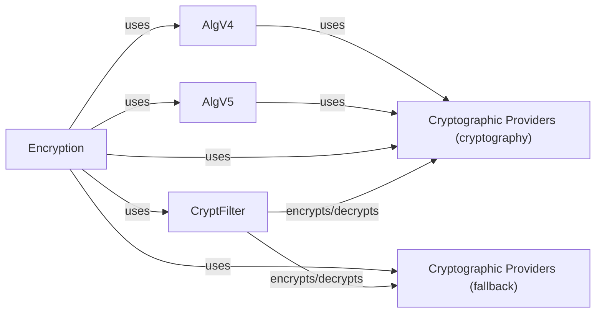

## Component Details

The EncryptionServices component is responsible for handling PDF encryption and decryption. It supports various encryption algorithms and key management techniques. The main flow involves the Encryption class, which orchestrates the encryption/decryption process using different algorithms (AlgV4, AlgV5) and cryptographic providers (CryptRC4, CryptAES). The CryptFilter applies the actual encryption/decryption using the configured cipher. The AlgV4 and AlgV5 classes implement the specific encryption algorithms, handling password verification and key computation. Cryptographic providers offer the underlying cryptographic functions.

### Encryption
The Encryption class is responsible for handling the encryption and decryption of PDF objects. It orchestrates the encryption process by using different algorithms (AlgV4, AlgV5) and cryptographic providers (CryptRC4, CryptAES). It also manages the encryption values and verifies passwords.

**Related Classes/Methods**:

- <a href="https://github.com/py-pdf/PyPDF2/blob/master/pypdf/_encryption.py#L787-L1178" target="_blank" rel="noopener noreferrer">`pypdf._encryption.Encryption` (787:1178)</a>
- <a href="https://github.com/py-pdf/PyPDF2/blob/master/pypdf/_encryption.py#L812-L840" target="_blank" rel="noopener noreferrer">`pypdf._encryption.Encryption:__init__` (812:840)</a>
- <a href="https://github.com/py-pdf/PyPDF2/blob/master/pypdf/_encryption.py#L845-L851" target="_blank" rel="noopener noreferrer">`pypdf._encryption.Encryption:encrypt_object` (845:851)</a>
- <a href="https://github.com/py-pdf/PyPDF2/blob/master/pypdf/_encryption.py#L853-L859" target="_blank" rel="noopener noreferrer">`pypdf._encryption.Encryption:decrypt_object` (853:859)</a>
- <a href="https://github.com/py-pdf/PyPDF2/blob/master/pypdf/_encryption.py#L874-L935" target="_blank" rel="noopener noreferrer">`pypdf._encryption.Encryption:_make_crypt_filter` (874:935)</a>
- <a href="https://github.com/py-pdf/PyPDF2/blob/master/pypdf/_encryption.py#L938-L948" target="_blank" rel="noopener noreferrer">`pypdf._encryption.Encryption:_get_crypt` (938:948)</a>
- <a href="https://github.com/py-pdf/PyPDF2/blob/master/pypdf/_encryption.py#L961-L967" target="_blank" rel="noopener noreferrer">`pypdf._encryption.Encryption:verify` (961:967)</a>
- <a href="https://github.com/py-pdf/PyPDF2/blob/master/pypdf/_encryption.py#L969-L995" target="_blank" rel="noopener noreferrer">`pypdf._encryption.Encryption:verify_v4` (969:995)</a>
- <a href="https://github.com/py-pdf/PyPDF2/blob/master/pypdf/_encryption.py#L997-L1015" target="_blank" rel="noopener noreferrer">`pypdf._encryption.Encryption:verify_v5` (997:1015)</a>
- <a href="https://github.com/py-pdf/PyPDF2/blob/master/pypdf/_encryption.py#L1017-L1067" target="_blank" rel="noopener noreferrer">`pypdf._encryption.Encryption:write_entry` (1017:1067)</a>
- <a href="https://github.com/py-pdf/PyPDF2/blob/master/pypdf/_encryption.py#L1069-L1086" target="_blank" rel="noopener noreferrer">`pypdf._encryption.Encryption:compute_values_v4` (1069:1086)</a>
- <a href="https://github.com/py-pdf/PyPDF2/blob/master/pypdf/_encryption.py#L1089-L1151" target="_blank" rel="noopener noreferrer">`pypdf._encryption.Encryption:read` (1089:1151)</a>
- <a href="https://github.com/py-pdf/PyPDF2/blob/master/pypdf/_encryption.py#L1154-L1178" target="_blank" rel="noopener noreferrer">`pypdf._encryption.Encryption:make` (1154:1178)</a>

### CryptFilter
The CryptFilter class is responsible for applying the actual encryption and decryption to PDF objects using a specific cryptographic algorithm. It receives the object to be processed and uses the configured cipher to encrypt or decrypt it.

**Related Classes/Methods**:

- <a href="https://github.com/py-pdf/PyPDF2/blob/master/pypdf/_encryption.py#L71-L92" target="_blank" rel="noopener noreferrer">`pypdf._encryption.CryptFilter:encrypt_object` (71:92)</a>
- <a href="https://github.com/py-pdf/PyPDF2/blob/master/pypdf/_encryption.py#L94-L108" target="_blank" rel="noopener noreferrer">`pypdf._encryption.CryptFilter:decrypt_object` (94:108)</a>

### AlgV4
The AlgV4 class implements the encryption algorithm version 4, handling password verification and key computation based on RC4 encryption. It computes the O (owner), U (user), and key values used in the encryption process.

**Related Classes/Methods**:

- <a href="https://github.com/py-pdf/PyPDF2/blob/master/pypdf/_encryption.py#L123-L205" target="_blank" rel="noopener noreferrer">`pypdf._encryption.AlgV4:compute_key` (123:205)</a>
- <a href="https://github.com/py-pdf/PyPDF2/blob/master/pypdf/_encryption.py#L208-L256" target="_blank" rel="noopener noreferrer">`pypdf._encryption.AlgV4:compute_O_value_key` (208:256)</a>
- <a href="https://github.com/py-pdf/PyPDF2/blob/master/pypdf/_encryption.py#L259-L278" target="_blank" rel="noopener noreferrer">`pypdf._encryption.AlgV4:compute_O_value` (259:278)</a>
- <a href="https://github.com/py-pdf/PyPDF2/blob/master/pypdf/_encryption.py#L281-L338" target="_blank" rel="noopener noreferrer">`pypdf._encryption.AlgV4:compute_U_value` (281:338)</a>
- <a href="https://github.com/py-pdf/PyPDF2/blob/master/pypdf/_encryption.py#L341-L397" target="_blank" rel="noopener noreferrer">`pypdf._encryption.AlgV4:verify_user_password` (341:397)</a>
- <a href="https://github.com/py-pdf/PyPDF2/blob/master/pypdf/_encryption.py#L400-L469" target="_blank" rel="noopener noreferrer">`pypdf._encryption.AlgV4:verify_owner_password` (400:469)</a>

### AlgV5
The AlgV5 class implements the encryption algorithm version 5, using AES encryption. It handles password verification, permission checks, and value generation for the encryption process. It computes hashes and encrypts/decrypts data using AES in CBC and ECB modes.

**Related Classes/Methods**:

- <a href="https://github.com/py-pdf/PyPDF2/blob/master/pypdf/_encryption.py#L474-L543" target="_blank" rel="noopener noreferrer">`pypdf._encryption.AlgV5:verify_owner_password` (474:543)</a>
- <a href="https://github.com/py-pdf/PyPDF2/blob/master/pypdf/_encryption.py#L546-L570" target="_blank" rel="noopener noreferrer">`pypdf._encryption.AlgV5:verify_user_password` (546:570)</a>
- <a href="https://github.com/py-pdf/PyPDF2/blob/master/pypdf/_encryption.py#L573-L591" target="_blank" rel="noopener noreferrer">`pypdf._encryption.AlgV5:calculate_hash` (573:591)</a>
- <a href="https://github.com/py-pdf/PyPDF2/blob/master/pypdf/_encryption.py#L594-L618" target="_blank" rel="noopener noreferrer">`pypdf._encryption.AlgV5:verify_perms` (594:618)</a>
- <a href="https://github.com/py-pdf/PyPDF2/blob/master/pypdf/_encryption.py#L621-L640" target="_blank" rel="noopener noreferrer">`pypdf._encryption.AlgV5:generate_values` (621:640)</a>
- <a href="https://github.com/py-pdf/PyPDF2/blob/master/pypdf/_encryption.py#L643-L677" target="_blank" rel="noopener noreferrer">`pypdf._encryption.AlgV5:compute_U_value` (643:677)</a>
- <a href="https://github.com/py-pdf/PyPDF2/blob/master/pypdf/_encryption.py#L680-L723" target="_blank" rel="noopener noreferrer">`pypdf._encryption.AlgV5:compute_O_value` (680:723)</a>
- <a href="https://github.com/py-pdf/PyPDF2/blob/master/pypdf/_encryption.py#L726-L761" target="_blank" rel="noopener noreferrer">`pypdf._encryption.AlgV5:compute_Perms_value` (726:761)</a>

### Cryptographic Providers (cryptography)
The cryptographic providers (_cryptography) module provides the underlying cryptographic functions, such as RC4 and AES encryption/decryption. These functions are used by the encryption algorithms to secure the PDF data.

**Related Classes/Methods**:

- <a href="https://github.com/py-pdf/PyPDF2/blob/master/pypdf/_crypt_providers/_cryptography.py#L91-L93" target="_blank" rel="noopener noreferrer">`pypdf._crypt_providers._cryptography.rc4_encrypt` (91:93)</a>
- <a href="https://github.com/py-pdf/PyPDF2/blob/master/pypdf/_crypt_providers/_cryptography.py#L96-L98" target="_blank" rel="noopener noreferrer">`pypdf._crypt_providers._cryptography.rc4_decrypt` (96:98)</a>
- <a href="https://github.com/py-pdf/PyPDF2/blob/master/pypdf/_crypt_providers/_cryptography.py#L111-L113" target="_blank" rel="noopener noreferrer">`pypdf._crypt_providers._cryptography.aes_cbc_encrypt` (111:113)</a>
- <a href="https://github.com/py-pdf/PyPDF2/blob/master/pypdf/_crypt_providers/_cryptography.py#L116-L118" target="_blank" rel="noopener noreferrer">`pypdf._crypt_providers._cryptography.aes_cbc_decrypt` (116:118)</a>
- <a href="https://github.com/py-pdf/PyPDF2/blob/master/pypdf/_crypt_providers/_cryptography.py#L101-L103" target="_blank" rel="noopener noreferrer">`pypdf._crypt_providers._cryptography.aes_ecb_encrypt` (101:103)</a>
- <a href="https://github.com/py-pdf/PyPDF2/blob/master/pypdf/_crypt_providers/_cryptography.py#L106-L108" target="_blank" rel="noopener noreferrer">`pypdf._crypt_providers._cryptography.aes_ecb_decrypt` (106:108)</a>
- <a href="https://github.com/py-pdf/PyPDF2/blob/master/pypdf/_crypt_providers/_cryptography.py#L60-L88" target="_blank" rel="noopener noreferrer">`pypdf._crypt_providers._cryptography.CryptAES` (60:88)</a>

### Cryptographic Providers (fallback)
The cryptographic providers (_fallback) module provides fallback implementations of cryptographic functions, such as RC4 and AES encryption/decryption. These functions are used by the encryption algorithms to secure the PDF data when the cryptography package is not available.

**Related Classes/Methods**:

- <a href="https://github.com/py-pdf/PyPDF2/blob/master/pypdf/_crypt_providers/_fallback.py#L57-L58" target="_blank" rel="noopener noreferrer">`pypdf._crypt_providers._fallback.CryptRC4:decrypt` (57:58)</a>
- <a href="https://github.com/py-pdf/PyPDF2/blob/master/pypdf/_crypt_providers/_fallback.py#L65-L66" target="_blank" rel="noopener noreferrer">`pypdf._crypt_providers._fallback.CryptAES:encrypt` (65:66)</a>
- <a href="https://github.com/py-pdf/PyPDF2/blob/master/pypdf/_crypt_providers/_fallback.py#L68-L69" target="_blank" rel="noopener noreferrer">`pypdf._crypt_providers._fallback.CryptAES:decrypt` (68:69)</a>
- <a href="https://github.com/py-pdf/PyPDF2/blob/master/pypdf/_crypt_providers/_fallback.py#L72-L73" target="_blank" rel="noopener noreferrer">`pypdf._crypt_providers._fallback:rc4_encrypt` (72:73)</a>
- <a href="https://github.com/py-pdf/PyPDF2/blob/master/pypdf/_crypt_providers/_fallback.py#L76-L77" target="_blank" rel="noopener noreferrer">`pypdf._crypt_providers._fallback:rc4_decrypt` (76:77)</a>
- <a href="https://github.com/py-pdf/PyPDF2/blob/master/pypdf/_crypt_providers/_fallback.py#L80-L81" target="_blank" rel="noopener noreferrer">`pypdf._crypt_providers._fallback:aes_ecb_encrypt` (80:81)</a>
- <a href="https://github.com/py-pdf/PyPDF2/blob/master/pypdf/_crypt_providers/_fallback.py#L84-L85" target="_blank" rel="noopener noreferrer">`pypdf._crypt_providers._fallback:aes_ecb_decrypt` (84:85)</a>
- <a href="https://github.com/py-pdf/PyPDF2/blob/master/pypdf/_crypt_providers/_fallback.py#L88-L89" target="_blank" rel="noopener noreferrer">`pypdf._crypt_providers._fallback:aes_cbc_encrypt` (88:89)</a>
- <a href="https://github.com/py-pdf/PyPDF2/blob/master/pypdf/_crypt_providers/_fallback.py#L92-L93" target="_blank" rel="noopener noreferrer">`pypdf._crypt_providers._fallback:aes_cbc_decrypt` (92:93)</a>
- <a href="https://github.com/py-pdf/PyPDF2/blob/master/pypdf/_crypt_providers/_fallback.py#L14-L249" target="_blank" rel="noopener noreferrer">`pypdf._crypt_providers._fallback` (14:249)</a>