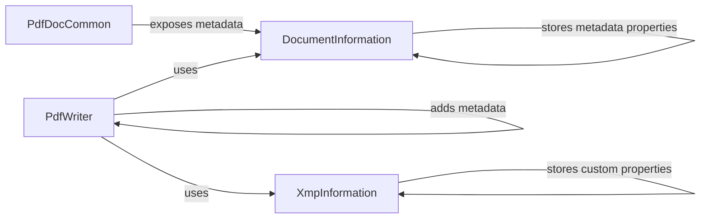

## Component Details

The MetadataManagement component in PyPDF is responsible for handling metadata associated with PDF documents. It encompasses the reading, writing, and manipulation of document-level metadata (title, author, etc.) and XMP metadata (custom properties). The core components involved are DocumentInformation (for basic metadata), XmpInformation (for extended metadata), PdfDocCommon (for accessing metadata), and PdfWriter (for adding metadata during PDF creation).

### DocumentInformation
The DocumentInformation class stores document-level metadata such as title, author, subject, creator, producer, creation date, modification date, and keywords. It provides a convenient way to access and manage these properties.

**Related Classes/Methods**:

- <a href="https://github.com/py-pdf/PyPDF2/blob/master/pypdf/_doc_common.py#L104-L261" target="_blank" rel="noopener noreferrer">`pypdf._doc_common.DocumentInformation` (104:261)</a>
- <a href="https://github.com/py-pdf/PyPDF2/blob/master/pypdf/_doc_common.py#L131-L142" target="_blank" rel="noopener noreferrer">`pypdf._doc_common.DocumentInformation:title` (131:142)</a>
- <a href="https://github.com/py-pdf/PyPDF2/blob/master/pypdf/_doc_common.py#L150-L157" target="_blank" rel="noopener noreferrer">`pypdf._doc_common.DocumentInformation:author` (150:157)</a>
- <a href="https://github.com/py-pdf/PyPDF2/blob/master/pypdf/_doc_common.py#L165-L172" target="_blank" rel="noopener noreferrer">`pypdf._doc_common.DocumentInformation:subject` (165:172)</a>
- <a href="https://github.com/py-pdf/PyPDF2/blob/master/pypdf/_doc_common.py#L180-L189" target="_blank" rel="noopener noreferrer">`pypdf._doc_common.DocumentInformation:creator` (180:189)</a>
- <a href="https://github.com/py-pdf/PyPDF2/blob/master/pypdf/_doc_common.py#L197-L206" target="_blank" rel="noopener noreferrer">`pypdf._doc_common.DocumentInformation:producer` (197:206)</a>
- <a href="https://github.com/py-pdf/PyPDF2/blob/master/pypdf/_doc_common.py#L214-L216" target="_blank" rel="noopener noreferrer">`pypdf._doc_common.DocumentInformation:creation_date` (214:216)</a>
- <a href="https://github.com/py-pdf/PyPDF2/blob/master/pypdf/_doc_common.py#L229-L235" target="_blank" rel="noopener noreferrer">`pypdf._doc_common.DocumentInformation:modification_date` (229:235)</a>
- <a href="https://github.com/py-pdf/PyPDF2/blob/master/pypdf/_doc_common.py#L249-L256" target="_blank" rel="noopener noreferrer">`pypdf._doc_common.DocumentInformation:keywords` (249:256)</a>
- <a href="https://github.com/py-pdf/PyPDF2/blob/master/pypdf/_doc_common.py#L122-L128" target="_blank" rel="noopener noreferrer">`pypdf._doc_common.DocumentInformation._get_text` (122:128)</a>

### XmpInformation
The XmpInformation class is responsible for handling custom properties within the XMP metadata of a PDF document. It allows access to nodes in a specific namespace and retrieves text values from those nodes.

**Related Classes/Methods**:

- <a href="https://github.com/py-pdf/PyPDF2/blob/master/pypdf/xmp.py#L204-L395" target="_blank" rel="noopener noreferrer">`pypdf.xmp.XmpInformation` (204:395)</a>
- <a href="https://github.com/py-pdf/PyPDF2/blob/master/pypdf/xmp.py#L367-L395" target="_blank" rel="noopener noreferrer">`pypdf.xmp.XmpInformation:custom_properties` (367:395)</a>
- <a href="https://github.com/py-pdf/PyPDF2/blob/master/pypdf/xmp.py#L243-L252" target="_blank" rel="noopener noreferrer">`pypdf.xmp.XmpInformation.get_nodes_in_namespace` (243:252)</a>
- <a href="https://github.com/py-pdf/PyPDF2/blob/master/pypdf/xmp.py#L254-L259" target="_blank" rel="noopener noreferrer">`pypdf.xmp.XmpInformation._get_text` (254:259)</a>

### PdfDocCommon
The PdfDocCommon class likely serves as a base class or utility class for handling common document-related operations. In this context, it exposes the document's metadata, which is represented by a DocumentInformation object.

**Related Classes/Methods**:

- <a href="https://github.com/py-pdf/PyPDF2/blob/master/pypdf/_doc_common.py#L264-L1426" target="_blank" rel="noopener noreferrer">`pypdf._doc_common.PdfDocCommon` (264:1426)</a>
- <a href="https://github.com/py-pdf/PyPDF2/blob/master/pypdf/_doc_common.py#L305-L317" target="_blank" rel="noopener noreferrer">`pypdf._doc_common.PdfDocCommon:metadata` (305:317)</a>
- <a href="https://github.com/py-pdf/PyPDF2/blob/master/pypdf/_doc_common.py#L104-L261" target="_blank" rel="noopener noreferrer">`pypdf._doc_common.DocumentInformation` (104:261)</a>

### PdfWriter
The PdfWriter class is responsible for writing PDF files. It provides functionality to add metadata to the PDF document being written, using the `add_metadata` method.

**Related Classes/Methods**:

- <a href="https://github.com/py-pdf/PyPDF2/blob/master/pypdf/_writer.py#L149-L3369" target="_blank" rel="noopener noreferrer">`pypdf._writer.PdfWriter` (149:3369)</a>
- <a href="https://github.com/py-pdf/PyPDF2/blob/master/pypdf/_writer.py#L1565-L1577" target="_blank" rel="noopener noreferrer">`pypdf._writer.PdfWriter:metadata` (1565:1577)</a>
- <a href="https://github.com/py-pdf/PyPDF2/blob/master/pypdf/_writer.py#L1592-L1610" target="_blank" rel="noopener noreferrer">`pypdf._writer.PdfWriter.add_metadata` (1592:1610)</a>