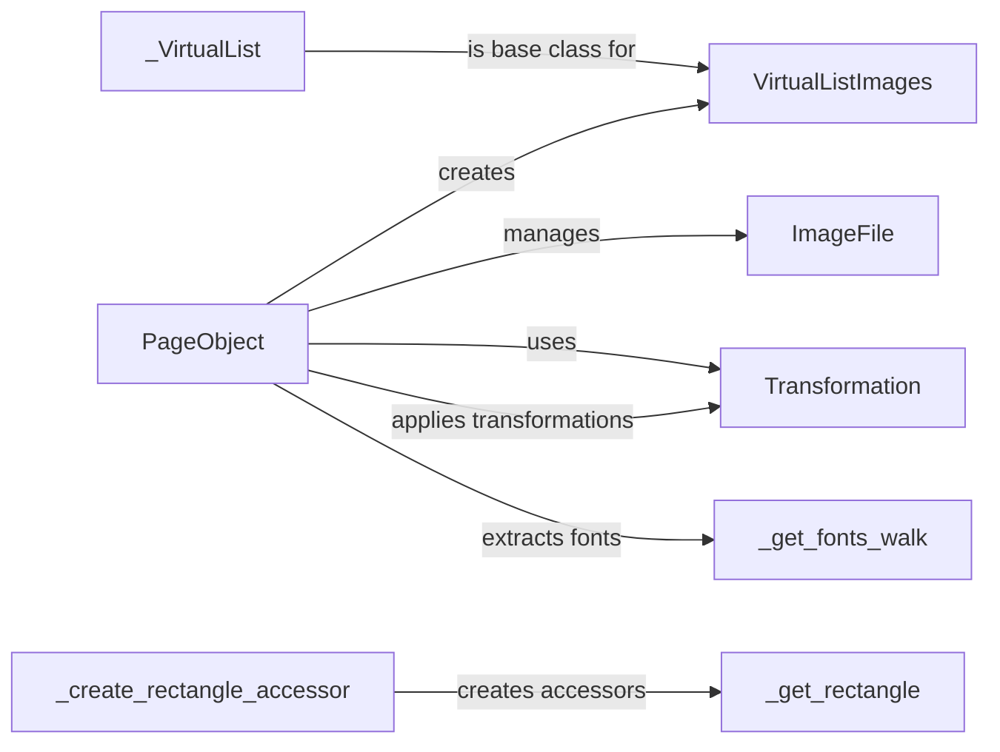

## Component Details

The PageManagement component in PyPDF is centered around the `PageObject` class, which represents a single page in a PDF document. It provides functionalities for creating, manipulating, and merging pages. The component also enables extracting text and images from pages, and managing page resources like fonts and images. Transformations can be applied to the page content to modify its position, size, and orientation. The component uses virtual lists to efficiently manage images and fonts, avoiding loading all resources into memory at once. Rectangle accessors simplify the process of reading and modifying page dimensions.

### PageObject
The PageObject class represents a single page in a PDF document. It provides methods for manipulating page content, such as merging pages, adding transformations, extracting text, and managing images. It acts as a central hub for page-related operations.

**Related Classes/Methods**:

- <a href="https://github.com/py-pdf/PyPDF2/blob/master/pypdf/_page.py#L483-L2462" target="_blank" rel="noopener noreferrer">`pypdf._page.PageObject` (483:2462)</a>
- <a href="https://github.com/py-pdf/PyPDF2/blob/master/pypdf/_page.py#L548-L591" target="_blank" rel="noopener noreferrer">`pypdf._page.PageObject:create_blank_page` (548:591)</a>
- <a href="https://github.com/py-pdf/PyPDF2/blob/master/pypdf/_page.py#L593-L627" target="_blank" rel="noopener noreferrer">`pypdf._page.PageObject:_get_ids_image` (593:627)</a>
- <a href="https://github.com/py-pdf/PyPDF2/blob/master/pypdf/_page.py#L629-L665" target="_blank" rel="noopener noreferrer">`pypdf._page.PageObject:_get_image` (629:665)</a>
- <a href="https://github.com/py-pdf/PyPDF2/blob/master/pypdf/_page.py#L668-L705" target="_blank" rel="noopener noreferrer">`pypdf._page.PageObject:images` (668:705)</a>
- <a href="https://github.com/py-pdf/PyPDF2/blob/master/pypdf/_page.py#L747-L812" target="_blank" rel="noopener noreferrer">`pypdf._page.PageObject:_get_inline_images` (747:812)</a>
- <a href="https://github.com/py-pdf/PyPDF2/blob/master/pypdf/_page.py#L829-L862" target="_blank" rel="noopener noreferrer">`pypdf._page.PageObject:transfer_rotation_to_content` (829:862)</a>
- <a href="https://github.com/py-pdf/PyPDF2/blob/master/pypdf/_page.py#L880-L959" target="_blank" rel="noopener noreferrer">`pypdf._page.PageObject:_merge_resources` (880:959)</a>
- <a href="https://github.com/py-pdf/PyPDF2/blob/master/pypdf/_page.py#L1095-L1115" target="_blank" rel="noopener noreferrer">`pypdf._page.PageObject:merge_page` (1095:1115)</a>
- <a href="https://github.com/py-pdf/PyPDF2/blob/master/pypdf/_page.py#L1117-L1227" target="_blank" rel="noopener noreferrer">`pypdf._page.PageObject:_merge_page` (1117:1227)</a>
- <a href="https://github.com/py-pdf/PyPDF2/blob/master/pypdf/_page.py#L1229-L1363" target="_blank" rel="noopener noreferrer">`pypdf._page.PageObject:_merge_page_writer` (1229:1363)</a>
- <a href="https://github.com/py-pdf/PyPDF2/blob/master/pypdf/_page.py#L1408-L1438" target="_blank" rel="noopener noreferrer">`pypdf._page.PageObject:merge_transformed_page` (1408:1438)</a>
- <a href="https://github.com/py-pdf/PyPDF2/blob/master/pypdf/_page.py#L1440-L1456" target="_blank" rel="noopener noreferrer">`pypdf._page.PageObject:merge_scaled_page` (1440:1456)</a>
- <a href="https://github.com/py-pdf/PyPDF2/blob/master/pypdf/_page.py#L1458-L1478" target="_blank" rel="noopener noreferrer">`pypdf._page.PageObject:merge_rotated_page` (1458:1478)</a>
- <a href="https://github.com/py-pdf/PyPDF2/blob/master/pypdf/_page.py#L1480-L1502" target="_blank" rel="noopener noreferrer">`pypdf._page.PageObject:merge_translated_page` (1480:1502)</a>
- <a href="https://github.com/py-pdf/PyPDF2/blob/master/pypdf/_page.py#L1504-L1552" target="_blank" rel="noopener noreferrer">`pypdf._page.PageObject:add_transformation` (1504:1552)</a>
- <a href="https://github.com/py-pdf/PyPDF2/blob/master/pypdf/_page.py#L1554-L1606" target="_blank" rel="noopener noreferrer">`pypdf._page.PageObject:scale` (1554:1606)</a>
- <a href="https://github.com/py-pdf/PyPDF2/blob/master/pypdf/_page.py#L1608-L1617" target="_blank" rel="noopener noreferrer">`pypdf._page.PageObject:scale_by` (1608:1617)</a>
- <a href="https://github.com/py-pdf/PyPDF2/blob/master/pypdf/_page.py#L1619-L1631" target="_blank" rel="noopener noreferrer">`pypdf._page.PageObject:scale_to` (1619:1631)</a>
- <a href="https://github.com/py-pdf/PyPDF2/blob/master/pypdf/_page.py#L1633-L1654" target="_blank" rel="noopener noreferrer">`pypdf._page.PageObject:compress_content_streams` (1633:1654)</a>
- <a href="https://github.com/py-pdf/PyPDF2/blob/master/pypdf/_page.py#L1747-L1781" target="_blank" rel="noopener noreferrer">`pypdf._page.PageObject:_handle_tj` (1747:1781)</a>
- <a href="https://github.com/py-pdf/PyPDF2/blob/master/pypdf/_page.py#L1783-L2126" target="_blank" rel="noopener noreferrer">`pypdf._page.PageObject:_extract_text` (1783:2126)</a>
- <a href="https://github.com/py-pdf/PyPDF2/blob/master/pypdf/_page.py#L2164-L2223" target="_blank" rel="noopener noreferrer">`pypdf._page.PageObject:_layout_mode_text` (2164:2223)</a>
- <a href="https://github.com/py-pdf/PyPDF2/blob/master/pypdf/_page.py#L2225-L2359" target="_blank" rel="noopener noreferrer">`pypdf._page.PageObject:extract_text` (2225:2359)</a>
- <a href="https://github.com/py-pdf/PyPDF2/blob/master/pypdf/_page.py#L2361-L2394" target="_blank" rel="noopener noreferrer">`pypdf._page.PageObject:extract_xform_text` (2361:2394)</a>
- <a href="https://github.com/py-pdf/PyPDF2/blob/master/pypdf/_page.py#L2396-L2410" target="_blank" rel="noopener noreferrer">`pypdf._page.PageObject:_get_fonts` (2396:2410)</a>

### Transformation
The Transformation class handles geometric transformations (translation, scaling, rotation) that can be applied to page content. It provides methods to create and apply these transformations, and to compress them into a transformation matrix. It's used to modify the position, size, and orientation of content on a page.

**Related Classes/Methods**:

- <a href="https://github.com/py-pdf/PyPDF2/blob/master/pypdf/_page.py#L142-L325" target="_blank" rel="noopener noreferrer">`pypdf._page.Transformation` (142:325)</a>
- <a href="https://github.com/py-pdf/PyPDF2/blob/master/pypdf/_page.py#L207-L225" target="_blank" rel="noopener noreferrer">`pypdf._page.Transformation:transform` (207:225)</a>
- <a href="https://github.com/py-pdf/PyPDF2/blob/master/pypdf/_page.py#L227-L240" target="_blank" rel="noopener noreferrer">`pypdf._page.Transformation:translate` (227:240)</a>
- <a href="https://github.com/py-pdf/PyPDF2/blob/master/pypdf/_page.py#L242-L269" target="_blank" rel="noopener noreferrer">`pypdf._page.Transformation:scale` (242:269)</a>
- <a href="https://github.com/py-pdf/PyPDF2/blob/master/pypdf/_page.py#L271-L289" target="_blank" rel="noopener noreferrer">`pypdf._page.Transformation:rotate` (271:289)</a>

### VirtualListImages
The VirtualListImages class provides a virtual list-like interface for accessing images within a page. It allows iterating over and retrieving images without loading all of them into memory at once. It acts as an intermediary between the PageObject and the actual image data.

**Related Classes/Methods**:

- <a href="https://github.com/py-pdf/PyPDF2/blob/master/pypdf/_page.py#L420-L480" target="_blank" rel="noopener noreferrer">`pypdf._page.VirtualListImages` (420:480)</a>
- <a href="https://github.com/py-pdf/PyPDF2/blob/master/pypdf/_page.py#L446-L447" target="_blank" rel="noopener noreferrer">`pypdf._page.VirtualListImages:__getitem__` (446:447)</a>

### ImageFile
The ImageFile class represents an image embedded within a PDF page. It provides access to the image data and metadata. It's used by PageObject to manage and extract images from the page content.

**Related Classes/Methods**:

- <a href="https://github.com/py-pdf/PyPDF2/blob/master/pypdf/_page.py#L329-L417" target="_blank" rel="noopener noreferrer">`pypdf._page.ImageFile` (329:417)</a>
- <a href="https://github.com/py-pdf/PyPDF2/blob/master/pypdf/_page.py#L416-L417" target="_blank" rel="noopener noreferrer">`pypdf._page.ImageFile:__repr__` (416:417)</a>

### _get_fonts_walk
The _get_fonts_walk function recursively traverses the PDF page's content stream to identify and extract font information. It's a helper function used by PageObject to determine the fonts used on the page, which is necessary for text extraction and layout analysis.

**Related Classes/Methods**:

- <a href="https://github.com/py-pdf/PyPDF2/blob/master/pypdf/_page.py#L2559-L2657" target="_blank" rel="noopener noreferrer">`pypdf._page._get_fonts_walk` (2559:2657)</a>

### _VirtualList
The _VirtualList class provides a base class for creating virtual lists. It allows accessing elements of a list without storing the entire list in memory. It's used as a base class for VirtualListImages.

**Related Classes/Methods**:

- <a href="https://github.com/py-pdf/PyPDF2/blob/master/pypdf/_page.py#L2465-L2556" target="_blank" rel="noopener noreferrer">`pypdf._page._VirtualList` (2465:2556)</a>
- <a href="https://github.com/py-pdf/PyPDF2/blob/master/pypdf/_page.py#L2479-L2480" target="_blank" rel="noopener noreferrer">`pypdf._page._VirtualList:__getitem__` (2479:2480)</a>

### _create_rectangle_accessor
The _create_rectangle_accessor function creates getter, setter, and deleter functions for accessing rectangle properties of a page. It's used to simplify the process of reading and modifying page dimensions like MediaBox, CropBox, etc.

**Related Classes/Methods**:

- <a href="https://github.com/py-pdf/PyPDF2/blob/master/pypdf/_page.py#L134-L139" target="_blank" rel="noopener noreferrer">`pypdf._page._create_rectangle_accessor` (134:139)</a>

### _get_rectangle
The _get_rectangle function retrieves the rectangle properties of a page.

**Related Classes/Methods**:

- <a href="https://github.com/py-pdf/PyPDF2/blob/master/pypdf/_page.py#L109-L122" target="_blank" rel="noopener noreferrer">`pypdf._page._get_rectangle` (109:122)</a>