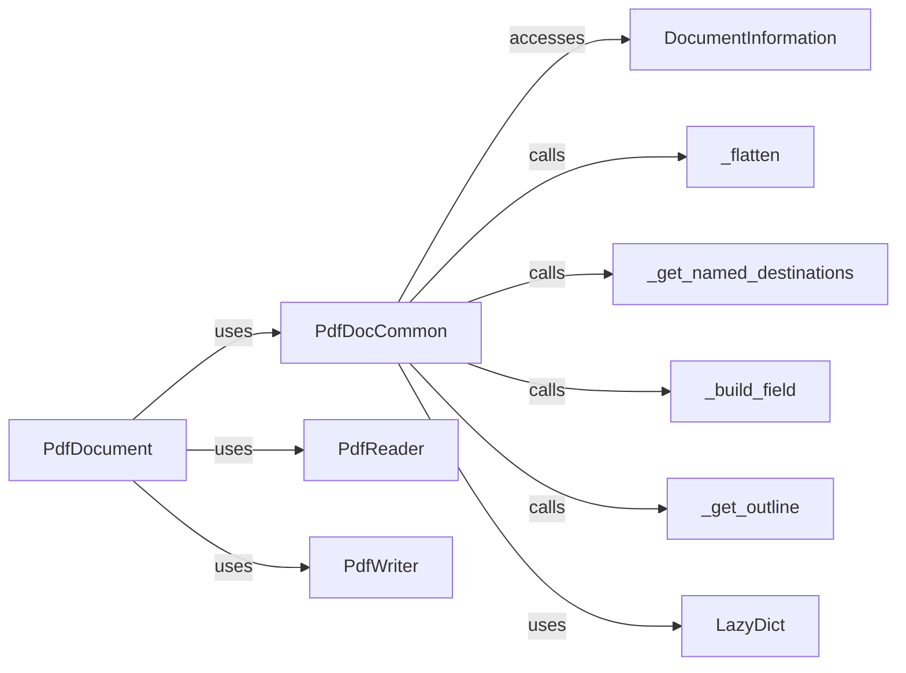

## Component Details

The PdfDocument component provides a unified interface for interacting with PDF documents, encompassing reading, writing, and manipulation functionalities. It relies on several sub-components to handle specific tasks such as accessing metadata, managing pages, and dealing with form fields and outlines. The core flow involves creating or loading a PDF document, accessing its elements through PdfDocCommon, and then using PdfReader or PdfWriter to read or modify the document's content and structure.

### PdfDocument
The PdfDocument component serves as the central access point for interacting with PDF documents. It encapsulates both reading and writing functionalities, providing methods to access pages, metadata, and other document elements. It also manages encryption and decryption, and facilitates the creation of new PDF documents or modification of existing ones.

**Related Classes/Methods**:

- <a href="https://github.com/py-pdf/PyPDF2/blob/master/pypdf/_reader.py#L92-L1275" target="_blank" rel="noopener noreferrer">`pypdf._reader.PdfReader` (92:1275)</a>
- <a href="https://github.com/py-pdf/PyPDF2/blob/master/pypdf/_writer.py#L149-L3369" target="_blank" rel="noopener noreferrer">`pypdf._writer.PdfWriter` (149:3369)</a>
- <a href="https://github.com/py-pdf/PyPDF2/blob/master/pypdf/_doc_common.py#L264-L1426" target="_blank" rel="noopener noreferrer">`pypdf._doc_common.PdfDocCommon` (264:1426)</a>

### PdfDocCommon
Central component for handling PDF document operations. It provides methods for accessing document metadata, pages, outlines, form fields, and attachments. It acts as a bridge between the PdfReader/PdfWriter and the document's internal structure.

**Related Classes/Methods**:

- <a href="https://github.com/py-pdf/PyPDF2/blob/master/pypdf/_doc_common.py#L264-L1426" target="_blank" rel="noopener noreferrer">`pypdf._doc_common.PdfDocCommon` (264:1426)</a>
- <a href="https://github.com/py-pdf/PyPDF2/blob/master/pypdf/_doc_common.py#L305-L317" target="_blank" rel="noopener noreferrer">`pypdf._doc_common.PdfDocCommon:metadata` (305:317)</a>
- <a href="https://github.com/py-pdf/PyPDF2/blob/master/pypdf/_doc_common.py#L324-L336" target="_blank" rel="noopener noreferrer">`pypdf._doc_common.PdfDocCommon:viewer_preferences` (324:336)</a>
- <a href="https://github.com/py-pdf/PyPDF2/blob/master/pypdf/_doc_common.py#L338-L357" target="_blank" rel="noopener noreferrer">`pypdf._doc_common.PdfDocCommon:get_num_pages` (338:357)</a>
- <a href="https://github.com/py-pdf/PyPDF2/blob/master/pypdf/_doc_common.py#L359-L375" target="_blank" rel="noopener noreferrer">`pypdf._doc_common.PdfDocCommon:get_page` (359:375)</a>
- <a href="https://github.com/py-pdf/PyPDF2/blob/master/pypdf/_doc_common.py#L377-L412" target="_blank" rel="noopener noreferrer">`pypdf._doc_common.PdfDocCommon:_get_page_in_node` (377:412)</a>
- <a href="https://github.com/py-pdf/PyPDF2/blob/master/pypdf/_doc_common.py#L415-L417" target="_blank" rel="noopener noreferrer">`pypdf._doc_common.PdfDocCommon:named_destinations` (415:417)</a>
- <a href="https://github.com/py-pdf/PyPDF2/blob/master/pypdf/_doc_common.py#L453-L522" target="_blank" rel="noopener noreferrer">`pypdf._doc_common.PdfDocCommon:_get_named_destinations` (453:522)</a>
- <a href="https://github.com/py-pdf/PyPDF2/blob/master/pypdf/_doc_common.py#L527-L575" target="_blank" rel="noopener noreferrer">`pypdf._doc_common.PdfDocCommon:get_fields` (527:575)</a>
- <a href="https://github.com/py-pdf/PyPDF2/blob/master/pypdf/_doc_common.py#L577-L588" target="_blank" rel="noopener noreferrer">`pypdf._doc_common.PdfDocCommon:_get_qualified_field_name` (577:588)</a>
- <a href="https://github.com/py-pdf/PyPDF2/blob/master/pypdf/_doc_common.py#L590-L630" target="_blank" rel="noopener noreferrer">`pypdf._doc_common.PdfDocCommon:_build_field` (590:630)</a>
- <a href="https://github.com/py-pdf/PyPDF2/blob/master/pypdf/_doc_common.py#L632-L649" target="_blank" rel="noopener noreferrer">`pypdf._doc_common.PdfDocCommon:_check_kids` (632:649)</a>
- <a href="https://github.com/py-pdf/PyPDF2/blob/master/pypdf/_doc_common.py#L688-L724" target="_blank" rel="noopener noreferrer">`pypdf._doc_common.PdfDocCommon:get_form_text_fields` (688:724)</a>
- <a href="https://github.com/py-pdf/PyPDF2/blob/master/pypdf/_doc_common.py#L726-L794" target="_blank" rel="noopener noreferrer">`pypdf._doc_common.PdfDocCommon:get_pages_showing_field` (726:794)</a>
- <a href="https://github.com/py-pdf/PyPDF2/blob/master/pypdf/_doc_common.py#L831-L837" target="_blank" rel="noopener noreferrer">`pypdf._doc_common.PdfDocCommon:outline` (831:837)</a>
- <a href="https://github.com/py-pdf/PyPDF2/blob/master/pypdf/_doc_common.py#L839-L878" target="_blank" rel="noopener noreferrer">`pypdf._doc_common.PdfDocCommon:_get_outline` (839:878)</a>
- <a href="https://github.com/py-pdf/PyPDF2/blob/master/pypdf/_doc_common.py#L907-L919" target="_blank" rel="noopener noreferrer">`pypdf._doc_common.PdfDocCommon:get_page_number` (907:919)</a>
- <a href="https://github.com/py-pdf/PyPDF2/blob/master/pypdf/_doc_common.py#L921-L932" target="_blank" rel="noopener noreferrer">`pypdf._doc_common.PdfDocCommon:get_destination_page_number` (921:932)</a>
- <a href="https://github.com/py-pdf/PyPDF2/blob/master/pypdf/_doc_common.py#L964-L1039" target="_blank" rel="noopener noreferrer">`pypdf._doc_common.PdfDocCommon:_build_outline_item` (964:1039)</a>
- <a href="https://github.com/py-pdf/PyPDF2/blob/master/pypdf/_doc_common.py#L1122-L1201" target="_blank" rel="noopener noreferrer">`pypdf._doc_common.PdfDocCommon:_flatten` (1122:1201)</a>
- <a href="https://github.com/py-pdf/PyPDF2/blob/master/pypdf/_doc_common.py#L1203-L1245" target="_blank" rel="noopener noreferrer">`pypdf._doc_common.PdfDocCommon:remove_page` (1203:1245)</a>
- <a href="https://github.com/py-pdf/PyPDF2/blob/master/pypdf/_doc_common.py#L1333-L1340" target="_blank" rel="noopener noreferrer">`pypdf._doc_common.PdfDocCommon:attachments` (1333:1340)</a>
- <a href="https://github.com/py-pdf/PyPDF2/blob/master/pypdf/_doc_common.py#L1362-L1366" target="_blank" rel="noopener noreferrer">`pypdf._doc_common.PdfDocCommon:_get_attachment_list` (1362:1366)</a>

### PdfReader
The PdfReader component is responsible for reading and parsing PDF documents. It extracts content, metadata, and structure from the PDF file, making it accessible to other components.

**Related Classes/Methods**:

- <a href="https://github.com/py-pdf/PyPDF2/blob/master/pypdf/_reader.py#L92-L1275" target="_blank" rel="noopener noreferrer">`pypdf._reader.PdfReader` (92:1275)</a>

### PdfWriter
The PdfWriter component handles the creation and modification of PDF documents. It allows adding pages, setting metadata, and saving the changes to a new or existing PDF file.

**Related Classes/Methods**:

- <a href="https://github.com/py-pdf/PyPDF2/blob/master/pypdf/_writer.py#L149-L3369" target="_blank" rel="noopener noreferrer">`pypdf._writer.PdfWriter` (149:3369)</a>

### DocumentInformation
Represents the document's metadata, such as title, author, and creation date. It is accessed via the `metadata` property of `PdfDocCommon`.

**Related Classes/Methods**:

- <a href="https://github.com/py-pdf/PyPDF2/blob/master/pypdf/_doc_common.py#L104-L261" target="_blank" rel="noopener noreferrer">`pypdf._doc_common.DocumentInformation` (104:261)</a>

### _flatten
Used to flatten internal data structures, likely related to page trees or other hierarchical elements within the PDF document. It's a utility function used by PdfDocCommon.

**Related Classes/Methods**:

- <a href="https://github.com/py-pdf/PyPDF2/blob/master/pypdf/_doc_common.py#L1122-L1201" target="_blank" rel="noopener noreferrer">`pypdf._doc_common.PdfDocCommon._flatten` (1122:1201)</a>

### _get_named_destinations
Retrieves named destinations within the PDF, which are symbolic names for specific locations in the document. It's a utility function used by PdfDocCommon.

**Related Classes/Methods**:

- <a href="https://github.com/py-pdf/PyPDF2/blob/master/pypdf/_doc_common.py#L453-L522" target="_blank" rel="noopener noreferrer">`pypdf._doc_common.PdfDocCommon._get_named_destinations` (453:522)</a>

### _build_field
Constructs field objects, representing interactive form fields in the PDF. It's a utility function used by PdfDocCommon.

**Related Classes/Methods**:

- <a href="https://github.com/py-pdf/PyPDF2/blob/master/pypdf/_doc_common.py#L590-L630" target="_blank" rel="noopener noreferrer">`pypdf._doc_common.PdfDocCommon._build_field` (590:630)</a>

### _get_outline
Retrieves the document's outline (table of contents). It's a utility function used by PdfDocCommon.

**Related Classes/Methods**:

- <a href="https://github.com/py-pdf/PyPDF2/blob/master/pypdf/_doc_common.py#L839-L878" target="_blank" rel="noopener noreferrer">`pypdf._doc_common.PdfDocCommon._get_outline` (839:878)</a>

### LazyDict
A dictionary-like object that lazily loads its contents, likely used for attachments. It's used by PdfDocCommon to handle attachments.

**Related Classes/Methods**:

- <a href="https://github.com/py-pdf/PyPDF2/blob/master/pypdf/_doc_common.py#L1429-L1444" target="_blank" rel="noopener noreferrer">`pypdf._doc_common.LazyDict` (1429:1444)</a>