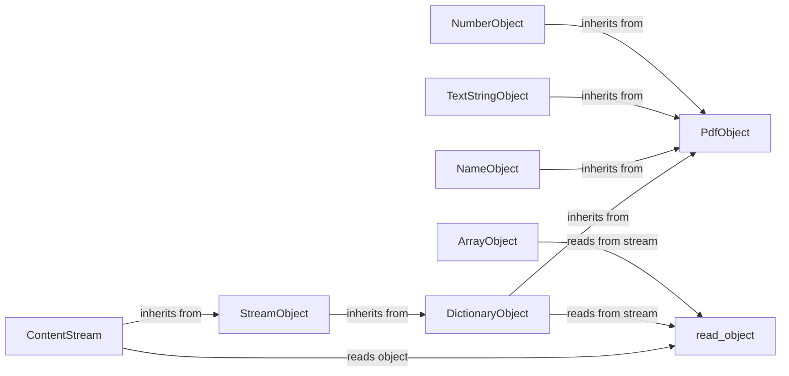

## Component Details

The PdfObjectRepresentation component is responsible for defining and managing the various PDF object types, such as numbers, strings, arrays, dictionaries, and streams. It provides a structured way to represent these objects within the pypdf library, enabling the reading, writing, and manipulation of PDF documents. The core of this component lies in the base classes and data structures that define the properties and behaviors of each PDF object type, ensuring consistency and facilitating the parsing and generation of PDF files.

### PdfObject
Base class for all PDF objects, providing common functionalities like cloning and hashing. It serves as the foundation for other specific PDF object types.

**Related Classes/Methods**:

- <a href="https://github.com/py-pdf/PyPDF2/blob/master/pypdf/generic/_base.py#L59-L198" target="_blank" rel="noopener noreferrer">`pypdf.generic._base.PdfObject` (59:198)</a>
- <a href="https://github.com/py-pdf/PyPDF2/blob/master/pypdf/generic/_base.py#L79-L83" target="_blank" rel="noopener noreferrer">`pypdf.generic._base.PdfObject:hash_value` (79:83)</a>
- <a href="https://github.com/py-pdf/PyPDF2/blob/master/pypdf/generic/_base.py#L85-L100" target="_blank" rel="noopener noreferrer">`pypdf.generic._base.PdfObject:replicate` (85:100)</a>
- <a href="https://github.com/py-pdf/PyPDF2/blob/master/pypdf/generic/_base.py#L133-L189" target="_blank" rel="noopener noreferrer">`pypdf.generic._base.PdfObject:_reference_clone` (133:189)</a>

### NumberObject
Base class for number objects (integer and float) in PDF. It inherits from PdfObject.

**Related Classes/Methods**:

- <a href="https://github.com/py-pdf/PyPDF2/blob/master/pypdf/generic/_base.py#L529-L578" target="_blank" rel="noopener noreferrer">`pypdf.generic._base.NumberObject` (529:578)</a>
- <a href="https://github.com/py-pdf/PyPDF2/blob/master/pypdf/generic/_base.py#L539-L549" target="_blank" rel="noopener noreferrer">`pypdf.generic._base.NumberObject:clone` (539:549)</a>
- <a href="https://github.com/py-pdf/PyPDF2/blob/master/pypdf/generic/_base.py#L551-L559" target="_blank" rel="noopener noreferrer">`pypdf.generic._base.NumberObject:hash_bin` (551:559)</a>
- <a href="https://github.com/py-pdf/PyPDF2/blob/master/pypdf/generic/_base.py#L574-L578" target="_blank" rel="noopener noreferrer">`pypdf.generic._base.NumberObject:read_from_stream` (574:578)</a>

### TextStringObject
Represents a text string in PDF, handling encoding and decoding. It inherits from PdfObject.

**Related Classes/Methods**:

- <a href="https://github.com/py-pdf/PyPDF2/blob/master/pypdf/generic/_base.py#L640-L778" target="_blank" rel="noopener noreferrer">`pypdf.generic._base.TextStringObject` (640:778)</a>
- <a href="https://github.com/py-pdf/PyPDF2/blob/master/pypdf/generic/_base.py#L654-L684" target="_blank" rel="noopener noreferrer">`pypdf.generic._base.TextStringObject:__new__` (654:684)</a>
- <a href="https://github.com/py-pdf/PyPDF2/blob/master/pypdf/generic/_base.py#L686-L700" target="_blank" rel="noopener noreferrer">`pypdf.generic._base.TextStringObject:clone` (686:700)</a>
- <a href="https://github.com/py-pdf/PyPDF2/blob/master/pypdf/generic/_base.py#L713-L722" target="_blank" rel="noopener noreferrer">`pypdf.generic._base.TextStringObject:original_bytes` (713:722)</a>
- <a href="https://github.com/py-pdf/PyPDF2/blob/master/pypdf/generic/_base.py#L724-L738" target="_blank" rel="noopener noreferrer">`pypdf.generic._base.TextStringObject:get_original_bytes` (724:738)</a>
- <a href="https://github.com/py-pdf/PyPDF2/blob/master/pypdf/generic/_base.py#L740-L757" target="_blank" rel="noopener noreferrer">`pypdf.generic._base.TextStringObject:get_encoded_bytes` (740:757)</a>
- <a href="https://github.com/py-pdf/PyPDF2/blob/master/pypdf/generic/_base.py#L759-L778" target="_blank" rel="noopener noreferrer">`pypdf.generic._base.TextStringObject:write_to_stream` (759:778)</a>

### NameObject
Represents a name object in PDF, which is a symbolic name. It inherits from PdfObject.

**Related Classes/Methods**:

- <a href="https://github.com/py-pdf/PyPDF2/blob/master/pypdf/generic/_base.py#L781-L886" target="_blank" rel="noopener noreferrer">`pypdf.generic._base.NameObject` (781:886)</a>
- <a href="https://github.com/py-pdf/PyPDF2/blob/master/pypdf/generic/_base.py#L789-L799" target="_blank" rel="noopener noreferrer">`pypdf.generic._base.NameObject:clone` (789:799)</a>
- <a href="https://github.com/py-pdf/PyPDF2/blob/master/pypdf/generic/_base.py#L811-L818" target="_blank" rel="noopener noreferrer">`pypdf.generic._base.NameObject:write_to_stream` (811:818)</a>
- <a href="https://github.com/py-pdf/PyPDF2/blob/master/pypdf/generic/_base.py#L859-L886" target="_blank" rel="noopener noreferrer">`pypdf.generic._base.NameObject:read_from_stream` (859:886)</a>

### ArrayObject
Represents an array object in PDF, which is an ordered collection of other PDF objects. It inherits from PdfObject.

**Related Classes/Methods**:

- <a href="https://github.com/py-pdf/PyPDF2/blob/master/pypdf/generic/_data_structures.py#L104-L267" target="_blank" rel="noopener noreferrer">`pypdf.generic._data_structures.ArrayObject` (104:267)</a>
- <a href="https://github.com/py-pdf/PyPDF2/blob/master/pypdf/generic/_data_structures.py#L105-L118" target="_blank" rel="noopener noreferrer">`pypdf.generic._data_structures.ArrayObject:replicate` (105:118)</a>
- <a href="https://github.com/py-pdf/PyPDF2/blob/master/pypdf/generic/_data_structures.py#L120-L148" target="_blank" rel="noopener noreferrer">`pypdf.generic._data_structures.ArrayObject:clone` (120:148)</a>
- <a href="https://github.com/py-pdf/PyPDF2/blob/master/pypdf/generic/_data_structures.py#L181-L198" target="_blank" rel="noopener noreferrer">`pypdf.generic._data_structures.ArrayObject:__add__` (181:198)</a>
- <a href="https://github.com/py-pdf/PyPDF2/blob/master/pypdf/generic/_data_structures.py#L200-L213" target="_blank" rel="noopener noreferrer">`pypdf.generic._data_structures.ArrayObject:__iadd__` (200:213)</a>
- <a href="https://github.com/py-pdf/PyPDF2/blob/master/pypdf/generic/_data_structures.py#L215-L223" target="_blank" rel="noopener noreferrer">`pypdf.generic._data_structures.ArrayObject:__isub__` (215:223)</a>
- <a href="https://github.com/py-pdf/PyPDF2/blob/master/pypdf/generic/_data_structures.py#L239-L267" target="_blank" rel="noopener noreferrer">`pypdf.generic._data_structures.ArrayObject:read_from_stream` (239:267)</a>

### DictionaryObject
Represents a dictionary object in PDF, which is a collection of key-value pairs where keys are Name objects and values are any other PDF object. It inherits from PdfObject.

**Related Classes/Methods**:

- <a href="https://github.com/py-pdf/PyPDF2/blob/master/pypdf/generic/_data_structures.py#L270-L683" target="_blank" rel="noopener noreferrer">`pypdf.generic._data_structures.DictionaryObject` (270:683)</a>
- <a href="https://github.com/py-pdf/PyPDF2/blob/master/pypdf/generic/_data_structures.py#L271-L283" target="_blank" rel="noopener noreferrer">`pypdf.generic._data_structures.DictionaryObject:replicate` (271:283)</a>
- <a href="https://github.com/py-pdf/PyPDF2/blob/master/pypdf/generic/_data_structures.py#L285-L307" target="_blank" rel="noopener noreferrer">`pypdf.generic._data_structures.DictionaryObject:clone` (285:307)</a>
- <a href="https://github.com/py-pdf/PyPDF2/blob/master/pypdf/generic/_data_structures.py#L524-L683" target="_blank" rel="noopener noreferrer">`pypdf.generic._data_structures.DictionaryObject:read_from_stream` (524:683)</a>

### StreamObject
Represents a stream object in PDF, which is a sequence of bytes. It can be encoded or unencoded. It inherits from DictionaryObject.

**Related Classes/Methods**:

- <a href="https://github.com/py-pdf/PyPDF2/blob/master/pypdf/generic/_data_structures.py#L912-L1088" target="_blank" rel="noopener noreferrer">`pypdf.generic._data_structures.StreamObject` (912:1088)</a>
- <a href="https://github.com/py-pdf/PyPDF2/blob/master/pypdf/generic/_data_structures.py#L917-L940" target="_blank" rel="noopener noreferrer">`pypdf.generic._data_structures.StreamObject:replicate` (917:940)</a>
- <a href="https://github.com/py-pdf/PyPDF2/blob/master/pypdf/generic/_data_structures.py#L942-L972" target="_blank" rel="noopener noreferrer">`pypdf.generic._data_structures.StreamObject:_clone` (942:972)</a>
- <a href="https://github.com/py-pdf/PyPDF2/blob/master/pypdf/generic/_data_structures.py#L974-L983" target="_blank" rel="noopener noreferrer">`pypdf.generic._data_structures.StreamObject:hash_bin` (974:983)</a>
- <a href="https://github.com/py-pdf/PyPDF2/blob/master/pypdf/generic/_data_structures.py#L991-L994" target="_blank" rel="noopener noreferrer">`pypdf.generic._data_structures.StreamObject:hash_value_data` (991:994)</a>
- <a href="https://github.com/py-pdf/PyPDF2/blob/master/pypdf/generic/_data_structures.py#L996-L1008" target="_blank" rel="noopener noreferrer">`pypdf.generic._data_structures.StreamObject:write_to_stream` (996:1008)</a>
- <a href="https://github.com/py-pdf/PyPDF2/blob/master/pypdf/generic/_data_structures.py#L1017-L1030" target="_blank" rel="noopener noreferrer">`pypdf.generic._data_structures.StreamObject:initialize_from_dictionary` (1017:1030)</a>
- <a href="https://github.com/py-pdf/PyPDF2/blob/master/pypdf/generic/_data_structures.py#L1032-L1062" target="_blank" rel="noopener noreferrer">`pypdf.generic._data_structures.StreamObject:flate_encode` (1032:1062)</a>

### ContentStream
Represents a content stream in PDF, which contains drawing instructions. It inherits from StreamObject and provides methods for parsing and manipulating the content stream.

**Related Classes/Methods**:

- <a href="https://github.com/py-pdf/PyPDF2/blob/master/pypdf/generic/_data_structures.py#L1134-L1444" target="_blank" rel="noopener noreferrer">`pypdf.generic._data_structures.ContentStream` (1134:1444)</a>
- <a href="https://github.com/py-pdf/PyPDF2/blob/master/pypdf/generic/_data_structures.py#L1155-L1192" target="_blank" rel="noopener noreferrer">`pypdf.generic._data_structures.ContentStream:__init__` (1155:1192)</a>
- <a href="https://github.com/py-pdf/PyPDF2/blob/master/pypdf/generic/_data_structures.py#L1194-L1222" target="_blank" rel="noopener noreferrer">`pypdf.generic._data_structures.ContentStream:replicate` (1194:1222)</a>
- <a href="https://github.com/py-pdf/PyPDF2/blob/master/pypdf/generic/_data_structures.py#L1224-L1258" target="_blank" rel="noopener noreferrer">`pypdf.generic._data_structures.ContentStream:clone` (1224:1258)</a>
- <a href="https://github.com/py-pdf/PyPDF2/blob/master/pypdf/generic/_data_structures.py#L1260-L1282" target="_blank" rel="noopener noreferrer">`pypdf.generic._data_structures.ContentStream:_clone` (1260:1282)</a>
- <a href="https://github.com/py-pdf/PyPDF2/blob/master/pypdf/generic/_data_structures.py#L1286-L1315" target="_blank" rel="noopener noreferrer">`pypdf.generic._data_structures.ContentStream:_parse_content_stream` (1286:1315)</a>
- <a href="https://github.com/py-pdf/PyPDF2/blob/master/pypdf/generic/_data_structures.py#L1317-L1390" target="_blank" rel="noopener noreferrer">`pypdf.generic._data_structures.ContentStream:_read_inline_image` (1317:1390)</a>
- <a href="https://github.com/py-pdf/PyPDF2/blob/master/pypdf/generic/_data_structures.py#L1415-L1417" target="_blank" rel="noopener noreferrer">`pypdf.generic._data_structures.ContentStream:set_data` (1415:1417)</a>
- <a href="https://github.com/py-pdf/PyPDF2/blob/master/pypdf/generic/_data_structures.py#L1420-L1424" target="_blank" rel="noopener noreferrer">`pypdf.generic._data_structures.ContentStream:operations` (1420:1424)</a>
- <a href="https://github.com/py-pdf/PyPDF2/blob/master/pypdf/generic/_data_structures.py#L1439-L1444" target="_blank" rel="noopener noreferrer">`pypdf.generic._data_structures.ContentStream:write_to_stream` (1439:1444)</a>

### read_object
Function responsible for reading a PDF object from a stream. It determines the object type and calls the appropriate constructor.

**Related Classes/Methods**:

- <a href="https://github.com/py-pdf/PyPDF2/blob/master/pypdf/generic/_data_structures.py#L1447-L1494" target="_blank" rel="noopener noreferrer">`pypdf.generic._data_structures.read_object` (1447:1494)</a>