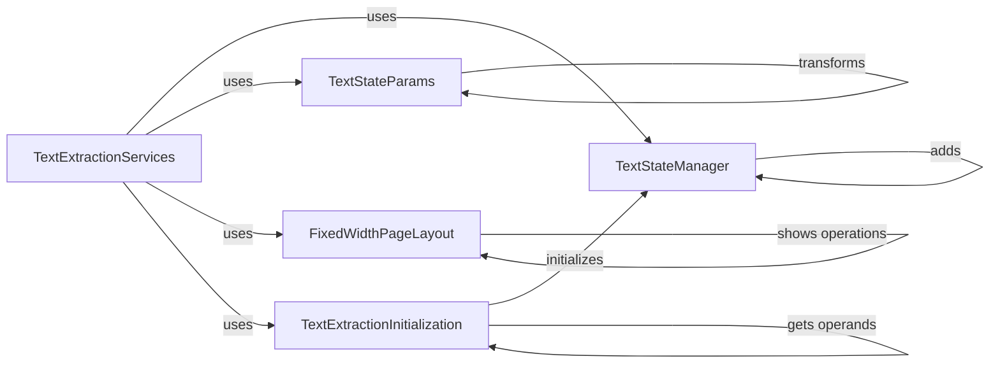

## Component Details

The TextExtractionServices component focuses on extracting text from PDF documents, managing text state, handling different layout modes, and initializing text extraction processes. It involves managing text transformations, encapsulating text state parameters, and processing text elements within specific layout structures. The component ensures accurate text positioning and rendering by handling text encoding, spacing, and transformations.

### TextStateManager
The TextStateManager class is responsible for managing the text state during text extraction. It handles transformations, matrix operations, and resetting the transformation matrix to maintain accurate text positioning and rendering. It maintains a stack of graphics states to handle nested transformations.

**Related Classes/Methods**:

- <a href="https://github.com/py-pdf/PyPDF2/blob/master/pypdf/_text_extraction/_layout_mode/_text_state_manager.py#L35-L48" target="_blank" rel="noopener noreferrer">`pypdf._text_extraction._layout_mode._text_state_manager.TextStateManager.__init__` (35:48)</a>
- <a href="https://github.com/py-pdf/PyPDF2/blob/master/pypdf/_text_extraction/_layout_mode/_text_state_manager.py#L139-L152" target="_blank" rel="noopener noreferrer">`pypdf._text_extraction._layout_mode._text_state_manager.TextStateManager.new_transform` (139:152)</a>
- <a href="https://github.com/py-pdf/PyPDF2/blob/master/pypdf/_text_extraction/_layout_mode/_text_state_manager.py#L169-L176" target="_blank" rel="noopener noreferrer">`pypdf._text_extraction._layout_mode._text_state_manager.TextStateManager.remove_q` (169:176)</a>
- <a href="https://github.com/py-pdf/PyPDF2/blob/master/pypdf/_text_extraction/_layout_mode/_text_state_manager.py#L183-L188" target="_blank" rel="noopener noreferrer">`pypdf._text_extraction._layout_mode._text_state_manager.TextStateManager.add_cm` (183:188)</a>
- <a href="https://github.com/py-pdf/PyPDF2/blob/master/pypdf/_text_extraction/_layout_mode/_text_state_manager.py#L196-L203" target="_blank" rel="noopener noreferrer">`pypdf._text_extraction._layout_mode._text_state_manager.TextStateManager.add_tm` (196:203)</a>
- <a href="https://github.com/py-pdf/PyPDF2/blob/master/pypdf/_text_extraction/_layout_mode/_text_state_manager.py#L205-L212" target="_blank" rel="noopener noreferrer">`pypdf._text_extraction._layout_mode._text_state_manager.TextStateManager.add_trm` (205:212)</a>

### TextStateParams
The TextStateParams class encapsulates parameters related to the text state, such as font size, displacement, and rendering transformations. It computes derived matrices and transformations based on these parameters to accurately position and render text elements. It provides methods to calculate displaced and render transforms based on the current state.

**Related Classes/Methods**:

- <a href="https://github.com/py-pdf/PyPDF2/blob/master/pypdf/_text_extraction/_layout_mode/_text_state_params.py#L56-L82" target="_blank" rel="noopener noreferrer">`pypdf._text_extraction._layout_mode._text_state_params.TextStateParams.__post_init__` (56:82)</a>
- <a href="https://github.com/py-pdf/PyPDF2/blob/master/pypdf/_text_extraction/_layout_mode/_text_state_params.py#L95-L97" target="_blank" rel="noopener noreferrer">`pypdf._text_extraction._layout_mode._text_state_params.TextStateParams.displaced_transform` (95:97)</a>
- <a href="https://github.com/py-pdf/PyPDF2/blob/master/pypdf/_text_extraction/_layout_mode/_text_state_params.py#L99-L101" target="_blank" rel="noopener noreferrer">`pypdf._text_extraction._layout_mode._text_state_params.TextStateParams.render_transform` (99:101)</a>
- <a href="https://github.com/py-pdf/PyPDF2/blob/master/pypdf/_text_extraction/_layout_mode/_text_state_params.py#L103-L116" target="_blank" rel="noopener noreferrer">`pypdf._text_extraction._layout_mode._text_state_params.TextStateParams.displacement_matrix` (103:116)</a>

### FixedWidthPageLayout
The fixed width page layout module focuses on extracting text from PDF pages with a fixed width layout. It identifies text show operations and recursively processes content to extract text elements. It handles grouping of text elements within begin-text and end-text markers.

**Related Classes/Methods**:

- <a href="https://github.com/py-pdf/PyPDF2/blob/master/pypdf/_text_extraction/_layout_mode/_fixed_width_page.py#L40-L59" target="_blank" rel="noopener noreferrer">`pypdf._text_extraction._layout_mode._fixed_width_page.bt_group` (40:59)</a>
- <a href="https://github.com/py-pdf/PyPDF2/blob/master/pypdf/_text_extraction/_layout_mode/_fixed_width_page.py#L62-L204" target="_blank" rel="noopener noreferrer">`pypdf._text_extraction._layout_mode._fixed_width_page.recurs_to_target_op` (62:204)</a>
- <a href="https://github.com/py-pdf/PyPDF2/blob/master/pypdf/_text_extraction/_layout_mode/_fixed_width_page.py#L255-L324" target="_blank" rel="noopener noreferrer">`pypdf._text_extraction._layout_mode._fixed_width_page.text_show_operations` (255:324)</a>

### TextExtractionInitialization
The text extraction initialization module provides utility functions for text extraction, such as checking for CRLF space and extracting text operands. These functions are used to preprocess and prepare text data for further processing. It ensures proper handling of text encoding and spacing.

**Related Classes/Methods**:

- <a href="https://github.com/py-pdf/PyPDF2/blob/master/pypdf/_text_extraction/__init__.py#L89-L153" target="_blank" rel="noopener noreferrer">`pypdf._text_extraction.__init__:crlf_space_check` (89:153)</a>
- <a href="https://github.com/py-pdf/PyPDF2/blob/master/pypdf/_text_extraction/__init__.py#L156-L195" target="_blank" rel="noopener noreferrer">`pypdf._text_extraction.__init__:get_text_operands` (156:195)</a>

### TextExtractionServices
The TextExtractionServices component provides functionality for extracting text from PDF pages. It includes classes and functions for handling text layout, font management, and text rendering. It supports various text extraction modes and algorithms.

**Related Classes/Methods**:

- `pypdf._text_extraction` (full file reference)