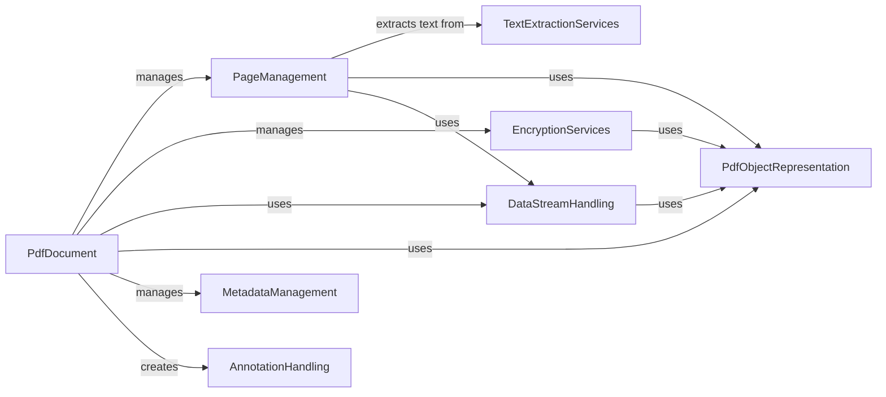

## Component Details

PyPDF2 is a library for manipulating PDF files. It allows users to read, write, split, merge, and transform PDF documents. The core functionality revolves around parsing PDF files, representing their structure in Python objects, and then providing tools to modify and create new PDF documents. Key features include support for encryption, metadata management, and text extraction.

### PdfDocument
The PdfDocument component serves as the central access point for interacting with PDF documents. It encapsulates both reading and writing functionalities, providing methods to access pages, metadata, and other document elements. It also manages encryption and decryption, and facilitates the creation of new PDF documents or modification of existing ones.

**Related Classes/Methods**:

- <a href="https://github.com/py-pdf/PyPDF2/blob/master/pypdf/_reader.py#L92-L1275" target="_blank" rel="noopener noreferrer">`pypdf._reader.PdfReader` (92:1275)</a>
- <a href="https://github.com/py-pdf/PyPDF2/blob/master/pypdf/_writer.py#L149-L3369" target="_blank" rel="noopener noreferrer">`pypdf._writer.PdfWriter` (149:3369)</a>
- <a href="https://github.com/py-pdf/PyPDF2/blob/master/pypdf/_doc_common.py#L264-L1426" target="_blank" rel="noopener noreferrer">`pypdf._doc_common.PdfDocCommon` (264:1426)</a>

### PageManagement
The PageManagement component is responsible for handling individual pages within a PDF document. It provides methods for creating, manipulating, and merging pages. It also allows extracting text and images from pages, and managing page resources like fonts and images.

**Related Classes/Methods**:

- <a href="https://github.com/py-pdf/PyPDF2/blob/master/pypdf/_page.py#L483-L2462" target="_blank" rel="noopener noreferrer">`pypdf._page.PageObject` (483:2462)</a>

### EncryptionServices
The EncryptionServices component handles PDF encryption and decryption. It supports various encryption algorithms and key management techniques. It provides methods for encrypting and decrypting PDF objects and verifying user and owner passwords.

**Related Classes/Methods**:

- <a href="https://github.com/py-pdf/PyPDF2/blob/master/pypdf/_encryption.py#L787-L1178" target="_blank" rel="noopener noreferrer">`pypdf._encryption.Encryption` (787:1178)</a>
- <a href="https://github.com/py-pdf/PyPDF2/blob/master/pypdf/_crypt_providers/_fallback.py#L14-L249" target="_blank" rel="noopener noreferrer">`pypdf._crypt_providers._fallback` (14:249)</a>

### PdfObjectRepresentation
The PdfObjectRepresentation component defines the base classes and data structures for representing PDF objects, such as numbers, strings, names, arrays, dictionaries, and streams. These classes provide methods for reading, writing, and manipulating PDF objects.

**Related Classes/Methods**:

- <a href="https://github.com/py-pdf/PyPDF2/blob/master/pypdf/generic/_base.py#L14-L809" target="_blank" rel="noopener noreferrer">`pypdf.generic._base` (14:809)</a>
- <a href="https://github.com/py-pdf/PyPDF2/blob/master/pypdf/generic/_data_structures.py#L14-L1007" target="_blank" rel="noopener noreferrer">`pypdf.generic._data_structures` (14:1007)</a>

### DataStreamHandling
The DataStreamHandling component provides implementations for various PDF filters, such as FlateDecode, LZWDecode, and ASCIIHexDecode. These filters are used to compress and decompress data streams within a PDF document. It also includes codecs for encoding and decoding data.

**Related Classes/Methods**:

- <a href="https://github.com/py-pdf/PyPDF2/blob/master/pypdf/filters.py#L15-L408" target="_blank" rel="noopener noreferrer">`pypdf.filters` (15:408)</a>
- <a href="https://github.com/py-pdf/PyPDF2/blob/master/pypdf/_codecs/_codecs.py#L14-L249" target="_blank" rel="noopener noreferrer">`pypdf._codecs._codecs` (14:249)</a>

### MetadataManagement
The MetadataManagement component is responsible for handling metadata associated with a PDF document, such as title, author, subject, and keywords. It provides methods for accessing and modifying document metadata, including XMP metadata.

**Related Classes/Methods**:

- <a href="https://github.com/py-pdf/PyPDF2/blob/master/pypdf/_doc_common.py#L104-L261" target="_blank" rel="noopener noreferrer">`pypdf._doc_common.DocumentInformation` (104:261)</a>
- <a href="https://github.com/py-pdf/PyPDF2/blob/master/pypdf/xmp.py#L204-L395" target="_blank" rel="noopener noreferrer">`pypdf.xmp.XmpInformation` (204:395)</a>

### TextExtractionServices
The TextExtractionServices component provides functionality for extracting text from PDF pages. It includes classes and functions for handling text layout, font management, and text rendering. It supports various text extraction modes and algorithms.

**Related Classes/Methods**:

- <a href="https://github.com/py-pdf/PyPDF2/blob/master/pypdf/_text_extraction/__init__.py#L1-L1" target="_blank" rel="noopener noreferrer">`pypdf._text_extraction` (1:1)</a>

### AnnotationHandling
The AnnotationHandling component defines classes for representing PDF annotations, such as text, free text, lines, rectangles, highlights, and polygons. These classes provide methods for creating and manipulating annotations within a PDF document.

**Related Classes/Methods**:

- <a href="https://github.com/py-pdf/PyPDF2/blob/master/pypdf/annotations/_markup_annotations.py#L1-L1" target="_blank" rel="noopener noreferrer">`pypdf.annotations._markup_annotations` (1:1)</a>