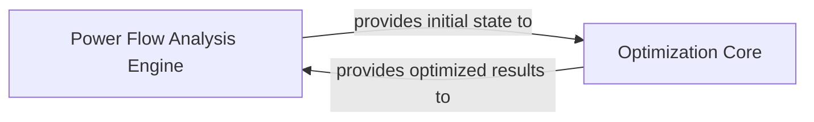

## Details

The core of the system revolves around two primary components: the `Power Flow Analysis Engine` and the `Optimization Core`. The `Power Flow Analysis Engine` is responsible for simulating the steady-state conditions of the power system, providing the foundational data and initial state for subsequent analysis. This initial state is then consumed by the `Optimization Core`, which formulates and solves various power system optimization problems, such as optimal power flow. Upon completion, the `Optimization Core` returns the optimized results back to the `Power Flow Analysis Engine` for further processing or validation. This interaction forms a critical feedback loop, enabling iterative analysis and optimization within the power system modeling framework.

### Power Flow Analysis Engine
This component calculates the steady-state operating conditions of the power system. It includes algorithms for both non-linear (AC) and linear (DC) power flow, as well as methods for contingency analysis and the calculation of sensitivity factors like Power Transfer Distribution Factors (PTDF) and Branch Outage Distribution Factors (BODF). It manages the internal calculations of network matrices (e.g., admittance matrix Y, B-H matrix) and the allocation of power flow results. This component embodies the "Simulation Modules" aspect of the project.

**Related Classes/Methods**:

- <a href="https://github.com/PyPSA/PyPSA/blob/master/pypsa/network/power_flow.py#L1287-L1701" target="_blank" rel="noopener noreferrer">`pypsa.network.power_flow.pf`:1287-1701</a>
- <a href="https://github.com/PyPSA/PyPSA/blob/master/pypsa/network/power_flow.py#L1703-L1814" target="_blank" rel="noopener noreferrer">`pypsa.network.power_flow.lpf`:1703-1814</a>
- <a href="https://github.com/PyPSA/PyPSA/blob/master/pypsa/network/power_flow.py#L1100-L1194" target="_blank" rel="noopener noreferrer">`pypsa.network.power_flow.calculate_Y`:1100-1194</a>
- <a href="https://github.com/PyPSA/PyPSA/blob/master/pypsa/network/power_flow.py#L1010-L1044" target="_blank" rel="noopener noreferrer">`pypsa.network.power_flow.calculate_PTDF`:1010-1044</a>

### Optimization Core
This component is dedicated to formulating and solving various optimization problems relevant to power systems, such as optimal power flow, capacity expansion, and unit commitment. It provides functionalities for defining objective functions, establishing various constraints (e.g., ramp limits, total supply, global constraints), and includes specialized algorithms for multi-goal analysis (MGA). It acts as an interface for problem definition before handing off to external solvers (e.g., HiGHS, GLPK, Gurobi). This component represents the "Optimization Core" as per the project's expected components.

**Related Classes/Methods**:

- <a href="https://github.com/PyPSA/PyPSA/blob/master/pypsa/optimization/optimize.py#L411-L545" target="_blank" rel="noopener noreferrer">`pypsa.optimization.optimize.create_model`:411-545</a>
- <a href="https://github.com/PyPSA/PyPSA/blob/master/pypsa/optimization/optimize.py#L74-L298" target="_blank" rel="noopener noreferrer">`pypsa.optimization.optimize.define_objective`:74-298</a>
- <a href="https://github.com/PyPSA/PyPSA/blob/master/pypsa/optimization/constraints.py#L535-L806" target="_blank" rel="noopener noreferrer">`pypsa.optimization.constraints.define_ramp_limit_constraints`:535-806</a>
- <a href="https://github.com/PyPSA/PyPSA/blob/master/pypsa/optimization/global_constraints.py" target="_blank" rel="noopener noreferrer">`pypsa.optimization.global_constraints`</a>
- <a href="https://github.com/PyPSA/PyPSA/blob/master/pypsa/optimization/expressions.py#L456-L491" target="_blank" rel="noopener noreferrer">`pypsa.optimization.expressions.supply`:456-491</a>
- <a href="https://github.com/PyPSA/PyPSA/blob/master/pypsa/optimization/expressions.py#L493-L528" target="_blank" rel="noopener noreferrer">`pypsa.optimization.expressions.withdrawal`:493-528</a>
- <a href="https://github.com/PyPSA/PyPSA/blob/master/pypsa/optimization/expressions.py#L378-L454" target="_blank" rel="noopener noreferrer">`pypsa.optimization.expressions.energy_balance`:378-454</a>
- <a href="https://github.com/PyPSA/PyPSA/blob/master/pypsa/optimization/mga.py#L274-L378" target="_blank" rel="noopener noreferrer">`pypsa.optimization.mga.optimize_mga`:274-378</a>

### [FAQ](https://github.com/CodeBoarding/GeneratedOnBoardings/tree/main?tab=readme-ov-file#faq)