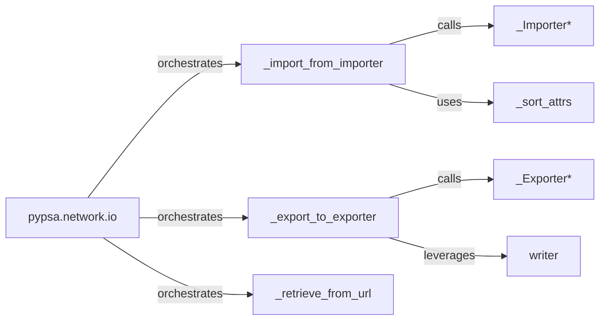

## Details

The `Data I/O & Persistence` subsystem in PyPSA is primarily encapsulated within the `pypsa.network.io` module. This subsystem is crucial for managing the flow of network data into and out of the PyPSA environment, supporting various file formats and external data sources.

### pypsa.network.io
Acts as the public facade for all data import and export operations. It provides a unified interface for users to load and save PyPSA network models, abstracting away the complexities of different file formats. This aligns with the "Abstraction Layer" pattern, simplifying user interaction.

**Related Classes/Methods**:

- <a href="https://github.com/PyPSA/PyPSA/blob/master/pypsa/network/io.py" target="_blank" rel="noopener noreferrer">`pypsa.network.io`</a>

### _import_from_importer
Manages the overall data import workflow. It dynamically selects and invokes the appropriate format-specific importer (`_Importer*`) based on the input file type, ensuring correct parsing and integration of external data into the PyPSA network structure. This embodies the "Pipeline/Workflow" pattern for data ingestion.

**Related Classes/Methods**:

- <a href="https://github.com/PyPSA/PyPSA/blob/master/pypsa/network/io.py#L1237-L1375" target="_blank" rel="noopener noreferrer">`_import_from_importer`:1237-1375</a>

### _export_to_exporter
Coordinates the data export workflow. It selects and delegates to the correct format-specific exporter (`_Exporter*`) to write the PyPSA network data to the desired output format. This also follows the "Pipeline/Workflow" pattern for data egress.

**Related Classes/Methods**:

- <a href="https://github.com/PyPSA/PyPSA/blob/master/pypsa/network/io.py#L1064-L1235" target="_blank" rel="noopener noreferrer">`_export_to_exporter`:1064-1235</a>

### _Importer*
Each `_Importer*` class is responsible for the low-level details of parsing and reading network data from a specific file format (e.g., CSV, HDF5, NetCDF). This modularity allows for easy extension to new formats without altering the core I/O logic, adhering to the "Modular Design" and "Extensibility" principles.

**Related Classes/Methods**:

- <a href="https://github.com/PyPSA/PyPSA/blob/master/pypsa/network/io.py" target="_blank" rel="noopener noreferrer">`_Importer*`</a>

### _Exporter*
Similar to importers, each `_Exporter*` class handles the specific logic for writing PyPSA network data to a particular file format. This separation of concerns enhances maintainability and extensibility.

**Related Classes/Methods**:

- <a href="https://github.com/PyPSA/PyPSA/blob/master/pypsa/network/io.py" target="_blank" rel="noopener noreferrer">`_Exporter*`</a>

### writer
Provides common utility functions for writing different categories of network data (e.g., components, attributes) to the chosen export format. It centralizes repetitive writing tasks, promoting code reuse.

**Related Classes/Methods**:

- <a href="https://github.com/PyPSA/PyPSA/blob/master/pypsa/network/io.py#L556-L569" target="_blank" rel="noopener noreferrer">`writer`:556-569</a>

### _retrieve_from_url
Handles the fetching of network data from external URLs, acting as a preliminary step before the data is passed to the import orchestrator. This supports flexible data sourcing.

**Related Classes/Methods**:

- <a href="https://github.com/PyPSA/PyPSA/blob/master/pypsa/network/io.py#L56-L74" target="_blank" rel="noopener noreferrer">`_retrieve_from_url`:56-74</a>

### _sort_attrs
Ensures that attributes are consistently ordered or processed during the import phase, which is crucial for maintaining data integrity and predictability in a scientific computing context.

**Related Classes/Methods**:

- <a href="https://github.com/PyPSA/PyPSA/blob/master/pypsa/network/io.py#L1027-L1054" target="_blank" rel="noopener noreferrer">`_sort_attrs`:1027-1054</a>

### [FAQ](https://github.com/CodeBoarding/GeneratedOnBoardings/tree/main?tab=readme-ov-file#faq)