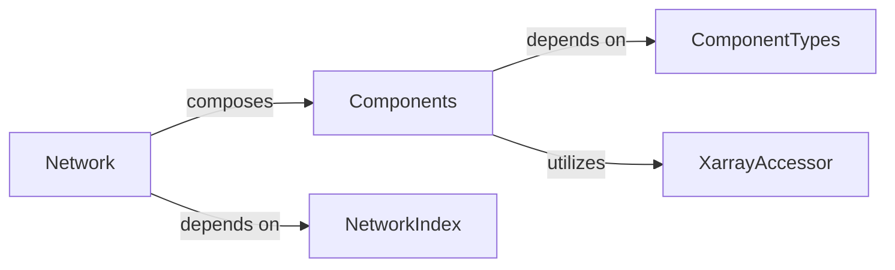

## Details

The Network Model Core subsystem is the foundational data structure representing the entire power system network. It serves as the central repository for all network-related information, including components, their attributes, and associated time-series or scenario data.

### Network
The primary and central data structure representing the entire power system. It acts as the main container, aggregating all network components, their static and dynamic attributes, and managing overall network properties like snapshots and investment periods.

**Related Classes/Methods**:

- <a href="https://github.com/PyPSA/PyPSA/blob/master/pypsa/networks.py#L74-L1250" target="_blank" rel="noopener noreferrer">`pypsa.networks.Network`:74-1250</a>

### Components
Manages collections of specific component types (e.g., Buses, Lines, Generators). It holds the static and dynamic (time-series) data for these individual components, providing an interface for their access and manipulation within the Network.

**Related Classes/Methods**:

- <a href="https://github.com/PyPSA/PyPSA/blob/master/pypsa/components/components.py#L88-L762" target="_blank" rel="noopener noreferrer">`pypsa.components.components.Components`:88-762</a>

### ComponentTypes
Defines the schema, default attributes, and data types for each power system component. It acts as a registry for component definitions, ensuring consistency and extensibility across the network model.

**Related Classes/Methods**:

- <a href="https://github.com/PyPSA/PyPSA/blob/master/pypsa/components/types.py" target="_blank" rel="noopener noreferrer">`pypsa.components.types.ComponentTypes`</a>

### XarrayAccessor
An internal accessor that handles the integration and manipulation of time-series data for components using xarray. It enables efficient multi-dimensional array operations crucial for dynamic simulations and time-series analysis.

**Related Classes/Methods**:

- <a href="https://github.com/PyPSA/PyPSA/blob/master/pypsa/components/array.py" target="_blank" rel="noopener noreferrer">`pypsa.components.array.XarrayAccessor`</a>

### NetworkIndex
Manages temporal indices (snapshots), investment period indices, and scenarios. It provides essential dimensions for time-series and multi-scenario data within the Network object, enabling structured access to time-varying information.

**Related Classes/Methods**:

- <a href="https://github.com/PyPSA/PyPSA/blob/master/pypsa/network/index.py#L23-L759" target="_blank" rel="noopener noreferrer">`pypsa.network.index.NetworkIndex`:23-759</a>

### [FAQ](https://github.com/CodeBoarding/GeneratedOnBoardings/tree/main?tab=readme-ov-file#faq)